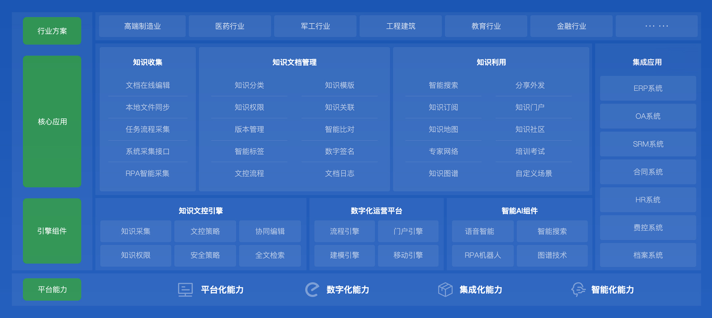

# 一文分清OA、CRM、ERP、MES、HRM、SCM、WMS、KMS等

### **一、办公协作类**
#### **OA（办公自动化系统）**
+ **定义**：Office Automation System
+ **核心功能**：  
✓ 流程审批（请假/报销/采购）  
✓ 文档协同（在线编辑/版本管理）  
✓ 通知公告/日程会议管理
+ **典型模块**：钉钉、飞书、企业微信的协同功能
+ **场景案例**：10分钟完成跨部门合同审批

#### OA系统是什么？
办公自动化（Office Automation，OA）系统是利用计算机技术、网络技术和通信技术，将传统的办公流程和业务活动进行数字化、自动化改造，实现信息共享、协同工作和流程审批的高效办公平台。它旨在提高企业内部办公效率、降低办公成本、优化资源配置，并加强企业内部的沟通与协作。

#### OA系统的核心功能
1. **公文管理**：对企业的各类公文（如通知、通告、报告、请示等）进行电子化管理和流转，包括公文的起草、审核、签发、分发、阅办、归档等环节，确保公文处理的规范性、及时性和可追溯性。
2. **流程审批**：实现企业内部各种业务流程（如费用报销、采购申请、请假申请、合同审批等）的自动化审批，通过预设的流程模板和审批规则，自动将待审批任务推送给相关审批人，提高审批效率，减少纸质文件传递和人工干预。
3. **日程管理**：为员工提供个人日程安排功能，支持创建、编辑、查询日程事件，设置提醒功能，方便员工合理规划工作时间。同时，支持共享日程，方便团队成员之间了解彼此的工作安排，协调会议时间和工作进度。
4. **知识管理**：构建企业内部的知识共享平台，用于存储、管理和分享企业的各类文档资料、规章制度、技术手册、案例经验等知识资产，促进企业知识的积累和传承，提升团队整体知识水平和工作效率。
5. **即时通讯与协作**：集成即时通讯工具，实现企业内部员工之间的实时在线沟通、文件传输、语音视频通话等功能。此外，支持在线会议、协同编辑文档等协作功能，打破时间和空间限制，提高团队协作效率，尤其适用于远程办公和分布式团队。

#### OA系统设计原则
1. **简洁直观的操作界面**：OA系统面向企业内部全体员工使用，因此界面设计应尽量简洁明了、操作方便，减少用户的学习成本和使用难度，使员工能够快速上手并熟练运用系统进行日常办公。
2. **流程驱动的设计理念**：以企业实际业务流程为核心，通过可视化流程设计器，方便管理员和业务人员根据企业需求灵活定制和调整各类审批流程，确保系统能够紧密贴合企业业务实际，提高流程执行效率和管理水平。
3. **高度的集成性与兼容性**：OA系统需要与其他企业信息系统（如ERP、CRM、HRM等）进行数据交互和集成，实现信息共享和业务协同。因此，在设计时要考虑系统的开放性和兼容性，提供标准化的数据接口和集成方案，方便与其他系统进行对接和整合。
4. **安全可靠的运行保障**：由于OA系统涉及企业内部大量敏感信息和核心业务数据，必须高度重视系统的安全性。采取身份认证、权限控制、数据加密、备份恢复等安全措施，防止数据泄露、篡改和丢失，确保系统稳定可靠运行。

#### 优秀OA界面案例
##### 主页仪表盘界面
+ **布局设计**：采用模块化布局，将常用功能入口（如待办事项、日程安排、公告通知等）、快捷操作按钮（如新建公文、发起流程、搜索文档等）以及关键业务数据统计图表（如本月审批通过率、知识文档访问量等）合理分布在页面上，突出重点信息，方便用户快速获取关键内容和进行常用操作。
+ **个性化设置**：支持用户根据个人工作习惯和需求对主页布局进行个性化定制，如调整模块位置、增减显示内容等，提高用户体验的舒适度和工作效率。

##### 流程审批界面
+ **布局设计**：以清晰的流程图形式展示审批流程走向，每个审批节点明确标注审批人信息、审批状态和审批意见。对于当前待审批任务，提供详细的业务表单信息展示区域和便捷的审批操作按钮（如同意、拒绝、退回等），确保审批人能够全面了解业务详情并快速做出审批决策。
+ **交互设计**：支持在审批过程中添加批注和上传附件功能，方便审批人补充说明审批意见或提供相关参考资料。同时，系统自动记录审批历史和流转轨迹，可随时查看和追溯，增强流程的透明度和可管理性。

##### 知识管理界面
+ **布局设计**：采用树状目录结构或标签分类方式对知识文档进行分类展示，方便用户快速定位所需知识内容。文档列表采用摘要形式展示标题、作者、发布时间、浏览次数等关键信息，并支持关键词搜索和模糊查询功能，提高知识检索效率。对于单个文档详情页面，提供文档内容预览、下载、评论、点赞等功能，促进知识的交流和共享。
+ **协作功能**：支持多人在线协同编辑文档，实时保存修改内容，确保团队成员能够同步更新知识信息。此外，提供文档版本管理功能，记录文档的历史修改版本，方便用户查看和恢复之前的版本内容，保证知识的准确性和完整性。

---

### **二、客户管理类**
#### **CRM（客户关系管理系统）**
+ **定义**：Customer Relationship Management
+ **核心功能**：  
✓ 客户信息库（联系人/商机/历史交互）  
✓ 销售漏斗管理（线索→商机→成交）  
✓ 客户分析（RFM模型/生命周期预测）
+ **典型模块**：Salesforce、纷享销客
+ **场景案例**：自动识别高价值客户并触发专属服务策略

#### CRM是什么？
客户关系管理（Customer Relationship Management，CRM）系统是一种旨在帮助企业更好地管理与客户之间关系的软件解决方案。它通过整合客户信息、销售流程、市场营销活动以及客户服务等多方面的数据和业务流程，为企业提供全面的客户视图，从而提升客户满意度、促进销售增长、提高客户忠诚度，并最终增强企业的竞争力和盈利能力。

#### CRM系统的核心模块
1. **客户信息管理**：集中存储和管理客户的基本信息、联系详情、偏好、购买历史等，以便企业全面了解客户，为精准营销和个性化服务提供数据支持。
2. **销售流程自动化**：涵盖从潜在客户开发、销售机会跟进、报价生成、订单处理到回款管理等销售环节的自动化支持，提升销售效率，缩短销售周期，增加销售成功率。
3. **市场营销管理**：协助企业规划和执行市场营销活动，包括活动策划、目标客户筛选、营销渠道管理、活动效果评估等，实现营销资源的优化配置和营销效果的最大化。
4. **客户服务管理**：提供多种客户服务渠道（如电话、邮件、在线聊天等）的整合平台，实现客户问题的快速响应、跟踪处理和满意度反馈，提升客户服务质量和服务效率。
5. **数据分析与报表**：借助数据分析工具和报表生成功能，对客户数据、销售数据、市场数据等进行深入挖掘和分析，为企业决策提供数据依据，助力企业制定更加科学合理的战略规划和业务决策。

#### CRM系统设计原则
1. **以客户为中心**：所有功能设计和流程优化都应围绕客户需求展开，确保系统能够真正帮助企业深入了解客户、满足客户期望，从而提升客户体验和忠诚度。
2. **简洁易用的界面**：采用直观、简洁的用户界面设计，减少用户操作复杂度，使销售人员、市场人员和客服人员等不同角色能够快速上手并高效使用系统，提高工作效率。
3. **灵活性与可扩展性**：考虑到企业业务的不断发展和变化，CRM系统应具备足够的灵活性和可扩展性，能够方便地进行功能模块的增减、业务流程的调整以及与其他系统（如ERP、OA等）的集成，以适应企业不同阶段的需求。
4. **数据安全与隐私保护**：客户数据是企业的核心资产之一，CRM系统必须高度重视数据安全，采取严格的访问控制、数据加密、备份恢复等措施，确保客户信息安全，同时符合相关法律法规对隐私保护的要求。

#### CRM界面案例
##### 客户信息管理界面
+ **布局设计**：通常采用表格形式展示客户列表，包含客户名称、联系方式、所属行业、客户等级等关键信息，支持多条件筛选和排序功能，方便用户快速定位目标客户。对于单个客户详情页面，采用标签页形式对客户基本信息、联系人信息、业务往来记录、跟进情况等进行分类展示，确保信息呈现清晰、有条理。
+ **配色方案**：整体色调以专业、稳重的蓝白灰为主，搭配适量的强调色（如橙色、绿色）用于突出重要信息（如客户等级为 VIP 的记录），提升界面的可读性和视觉吸引力。

##### 销售流程跟进界面
+ **布局设计**：以销售阶段为线索，将潜在客户开发、意向客户跟进、报价提交、合同签订、回款管理等环节按照流程顺序进行可视化布局展示。每个环节设置相应的操作按钮和信息录入区域，方便销售人员实时记录和更新销售进展。同时，提供销售漏斗、销售趋势图等数据分析图表，直观呈现销售团队的整体业绩和业务发展趋势。
+ **交互设计**：支持拖拽操作，销售人员可以将客户在不同销售阶段之间进行拖动，实现销售流程的灵活推进和调整。此外，系统自动根据销售流程设置提醒功能，如跟进任务到期提醒、回款预期预警等，确保销售人员及时处理关键业务节点。

##### 市场营销活动管理界面
+ **布局设计**：分为活动策划、执行监控和效果评估三个主要区域。在活动策划阶段，提供丰富的活动模板和拖拽式编辑器，方便市场人员快速创建和设计个性化营销活动，包括活动主题、目标受众、营销渠道、活动内容等信息的设置。执行监控区域实时展示活动的发送状态、送达率、点击率等关键指标，以图表形式直观呈现活动进展。效果评估部分则通过对比活动前后的销售数据、客户转化率等指标，全面分析营销活动的投资回报率和对业务的实际影响。
+ **数据可视化**：运用柱状图、折线图、饼图等多种图表形式对市场营销数据进行可视化处理，使市场人员能够轻松理解复杂数据关系，快速洞察市场趋势和活动效果，为后续营销策略调整提供有力支持。

---

### **三、资源管理类**
#### **ERP（企业资源计划系统）**
+ **定义**：Enterprise Resource Planning
+ **核心功能**：  
✓ 业财一体化（销售-生产-采购-财务联动）  
✓ 库存管理（安全库存预警/MRP运算）  
✓ 成本核算（标准成本/实际成本对比）
+ **典型模块**：SAP、金蝶、用友
+ **场景案例**：自动生成采购计划避免停工待料

#### ERP系统是什么？
企业资源计划（Enterprise Resource Planning，ERP）系统是一种集成化的企业管理软件，它通过整合企业内部的各类资源（如人力、物力、财力、信息等），对企业的主要业务流程（如财务、采购、销售、库存、生产、人力资源等）进行系统化、自动化管理，实现企业资源的优化配置和高效利用，提升企业的运营效率、管理水平和市场竞争力。

#### ERP系统的核心模块
##### 1. 财务管理模块
+ **总账管理**：记录和管理企业所有的财务交易，包括收入、支出、转账等，自动生成财务报表（如资产负债表、利润表、现金流量表等），为财务分析和决策提供数据支持。
+ **应收应付管理**：跟踪和管理企业与客户及供应商之间的往来账款，实现发票开具、收款付款、账龄分析等功能，优化资金流动和信用管理。
+ **固定资产管理**：对企业的固定资产（如设备、厂房、车辆等）进行全生命周期管理，包括资产购置、折旧计提、资产转移、资产处置等操作，确保固定资产的准确计价和有效利用。

##### 2. 供应链管理模块
+ **采购管理**：从采购需求预测、供应商选择与评估、采购订单生成与跟踪，到货物验收与入库等环节进行全面管理，优化采购流程，降低采购成本，确保原材料和商品的及时供应。
+ **销售管理**：涵盖销售订单处理、报价管理、发货配送、销售退货等业务流程，提供客户关系管理、销售预测与分析功能，提升销售效率和客户满意度。
+ **库存管理**：实时监控库存水平，支持库存的出入库操作、库存盘点、库存预警等功能，实现库存的精准控制和优化，减少库存积压和缺货风险。

##### 3. 生产制造模块
+ **生产计划与调度**：根据市场需求预测和销售订单，制定生产计划和排产调度，合理安排生产资源（如设备、人员、物料等），确保生产任务的按时完成和生产效率的最大化。
+ **物料需求计划（MRP）**：依据生产计划和产品结构，自动生成物料需求清单，精确计算物料需求量和采购时机，避免物料短缺或过剩，支持生产的顺利进行。
+ **生产过程监控**：对生产现场的实时数据进行采集和分析，包括设备状态、生产进度、质量检测等信息，实现生产过程的可视化管理和实时控制，提高生产质量和灵活性。

##### 4. 人力资源管理模块
+ **员工信息管理**：集中存储和管理企业员工的基本信息、工作经历、教育背景、技能特长等，为人力资源决策提供全面的数据支持。
+ **招聘与入职管理**：优化招聘流程，从职位发布、简历筛选、面试安排到录用通知等环节进行系统化管理，提高招聘效率和质量，同时实现新员工的快速入职和培训安排。
+ **绩效与薪酬管理**：建立科学的绩效考核体系，对员工的工作表现进行定期评估和反馈，根据绩效结果制定合理的薪酬调整和激励措施，激发员工的工作积极性和创造力。

#### ERP系统设计原则
##### 1. 集成性
ERP系统的核心在于实现企业内部各个业务模块的数据集成和流程整合。通过统一的数据模型和接口标准，将财务管理、供应链管理、生产制造、人力资源管理等不同模块紧密连接起来，确保数据的一致性和实时性，打破信息孤岛，使各部门能够共享和协同处理业务数据，形成一个有机的整体，支持企业的全面运营管理。

##### 2. 可配置性
不同的企业具有独特的业务流程、组织架构和管理需求，因此ERP系统需要具备高度的可配置性。允许企业根据自身实际情况，灵活定制系统的功能模块、业务流程、数据字段、报表格式等，以适应企业的个性化要求。同时，系统应支持参数化设置和权限管理，方便企业根据不同的用户角色和业务场景进行个性化配置和调整，确保系统能够紧密贴合企业的运营管理需求。

##### 3. 易用性
ERP系统面向企业内部的各类用户，包括财务人员、采购人员、销售人员、生产工人、管理人员等，他们具有不同的专业背景和计算机操作技能。因此，系统的用户界面设计应遵循简洁、直观、友好的原则，提供统一的操作风格和导航方式，减少用户的学习成本和操作难度。同时，系统应具备良好的响应速度和稳定性，确保用户在日常操作中能够高效、顺畅地完成工作任务，提高工作效率和满意度。

##### 4. 安全性
由于ERP系统涉及企业核心的业务数据和敏感信息，如财务数据、客户资料、生产计划等，因此系统的安全性至关重要。需要采用多层次的安全防护措施，包括网络防火墙、用户身份认证、权限控制、数据加密、备份恢复等，防止数据泄露、篡改和丢失，确保系统的安全可靠运行。同时，系统应具备完善的审计和监控功能，能够记录用户的操作行为和系统运行状态，便于及时发现和处理潜在的安全问题。

#### 优秀ERP界面案例
##### 财务管理界面
+ **布局设计**：采用仪表盘式布局，将关键财务指标（如资产负债率、净利润率、现金流量等）以直观的图表形式（如柱状图、折线图、饼图等）展示在页面上方，便于财务管理人员快速了解企业的财务状况和趋势。下方设置详细的财务报表列表和操作功能区，如总账查询、应收应付账款明细、固定资产卡片等，支持用户进行深入的数据分析和业务处理。
+ **交互设计**：提供一键式报表生成功能，用户可以通过简单的点击操作，按照预设的模板和参数生成所需的财务报表，并可导出为多种格式（如Excel、PDF等）以便于分享和进一步分析。在处理财务交易时，系统提供智能提示和自动补全功能，减少用户输入错误和操作步骤，提高数据录入的准确性和效率。

##### 供应链管理界面
+ **布局设计**：以流程为导向进行布局，将采购管理、销售管理、库存管理等供应链核心流程分别设置为独立的标签页或模块区域。在每个模块内，采用卡片式布局展示关键业务数据和操作入口，如采购订单状态跟踪、销售订单履行进度、库存预警信息等，使用户能够一目了然地了解供应链各环节的运行情况。同时，在页面侧边或顶部设置全局搜索框和快捷导航菜单，方便用户快速定位和访问所需的功能和数据。
+ **交互设计**：支持可视化流程操作，例如在处理采购订单时，用户可以通过拖拽方式将采购申请直接转换为采购订单，并在流程图中实时查看订单的审批进度和状态变化。对于库存管理，系统提供实时库存监控大屏，以图形化方式展示库存分布、库存周转率、安全库存预警等信息，并支持用户通过点击不同区域进行深入钻取和查询，实现对库存的精细化管理和优化。

##### 生产制造界面
+ **布局设计**：围绕生产计划与执行展开布局，将生产计划进度表、生产任务分配看板、设备运行状态监控等关键信息以直观的可视化组件呈现于主界面。生产计划进度表采用甘特图形式展示各生产订单的计划开始时间、结束时间和实际进度，便于生产管理人员进行全局调度和进度控制。生产任务分配看板清晰列出各生产线、各班组的生产任务和负责人信息，支持任务的动态调整和重新分配。设备运行状态监控区域通过与生产现场设备的实时数据连接，以图标或仪表盘形式展示设备的运行参数、故障报警等信息，及时发现和解决生产过程中的设备问题。
+ **交互设计**：引入移动设备支持和扫码操作功能，生产工人可以通过手机或平板电脑等移动终端接收生产任务、上报生产数据、反馈生产问题等，提高生产现场的操作灵活性和数据及时性。在处理生产数据时，系统支持批量导入导出功能，并提供数据验证和错误提示机制，确保数据的完整性和准确性。同时，系统具备生产过程追溯功能，通过记录和关联生产订单、物料批次、设备参数、操作人员等多维度数据，实现产品质量问题的快速定位和根源分析。

##### 人力资源管理界面
+ **布局设计**：采用个人工作台与集中管理相结合的布局方式。对于普通员工，登录系统后进入个人工作台，展示个人基本信息、考勤记录、绩效结果、培训计划等与自身相关的功能和信息，界面简洁明了，突出个人关注重点。对于人力资源管理人员，则提供全面的员工信息管理视图，包括员工列表、组织架构图、招聘进度跟踪、绩效评估统计等模块，各模块之间通过合理的布局和关联设计，方便管理人员进行数据查询、分析和业务操作。同时，在界面设计中注重信息的层次性和可读性，采用折叠面板、标签页等方式对复杂信息进行分层展示，避免界面杂乱无章。
+ **交互设计**：在招聘管理中，系统集成智能简历筛选功能，能够根据预设的招聘要求和关键词对大量简历进行自动筛选和分类，提高招聘效率。对于绩效管理，提供在线绩效评估表单和反馈机制，员工和上级领导可以在系统中进行绩效目标设定、绩效评价、反馈沟通等操作，实现绩效管理的全程电子化和透明化。此外，系统支持自定义报表生成和数据分析功能，人力资源管理人员可以根据不同的业务需求灵活创建报表，如人员流动分析报表、培训效果评估报表等，为人力资源决策提供有力的数据支持。

---

### **四、生产制造类**
#### **MES（制造执行系统）**
+ **定义**：Manufacturing Execution System
+ **核心功能**：  
✓ 生产调度（工单排程/设备联机）  
✓ 过程监控（良品率/OEE设备效率）  
✓ 质量追溯（批次追踪/SPC统计分析）
+ **典型模块**：西门子MES、蓝卓supOS
+ **场景案例**：实时预警生产线异常并自动触发维修工单

#### MES系统是什么？
制造执行系统（Manufacturing Execution System，MES）是一种用于管理和监控制造过程的软件系统。它主要面向车间生产，位于企业计划层（如ERP）和底层工业控制系统（如SCADA）之间，起到桥梁和纽带的作用。MES通过实时收集、处理和分析生产现场的数据，优化生产活动，提高生产效率、产品质量和资源利用率，同时减少无附加值的生产活动。

#### MES系统的核心模块
##### 1. 生产过程管理
+ **功能**：对产品从原材料到成品的整个生产过程进行精细化管理，包括生产任务的分配、执行、监控和报工等操作。通过条码、RFID等技术实现产品的全程追溯，确保生产过程的透明度和可控性。
+ **作用**：提高生产效率，减少生产错误，实现生产过程的标准化和规范化。

##### 2. 生产排程管理
+ **功能**：根据生产订单、设备状态、人员配置等多方面因素，进行智能的生产任务排程和调度。支持拖拽式调整工单计划，实现快速灵活的排产。
+ **作用**：优化生产计划，提高设备和人员的利用率，确保生产任务按时完成。

##### 3. 质量管控
+ **功能**：在生产过程中设置多级品质预警机制，实时监控产品质量数据。自动进行质量数据分析，生成多维度的质量分析报告，如SPC统计分析报告等。
+ **作用**：及时发现和处理质量异常，防止批量性质量问题的发生，提升产品质量稳定性。

##### 4. 设备管理
+ **功能**：基于精益生产TPM的思想，对生产设备进行全面管理。包括设备的运行状态监控、预防性维护计划制定、故障报警与处理等。
+ **作用**：减少设备故障停机时间，提高设备综合效率（OEE），降低设备维护成本。

##### 5. 物料管理
+ **功能**：对生产物料进行全生命周期管理，涵盖物料的采购、入库、领用、退库等环节。通过物料条码化或RFID管理，实现物料的精准追溯。
+ **作用**：优化物料库存水平，减少物料积压和浪费，确保生产物料的及时供应。

##### 6. 数据采集与分析
+ **功能**：实时采集生产现场的各种数据，如设备运行参数、生产产量、质量数据等。通过统一的BI数据中心平台，对采集到的数据进行高效分析，生成多层次多维度的管理报表。
+ **作用**：为生产决策提供数据支持，帮助企业及时发现生产瓶颈和问题点，实现持续改进。

#### MES系统的应用场景
##### 1. 生产调度与排程优化
MES系统能够接收来自ERP系统的生产计划，并根据车间实际生产能力进行智能调度和排程。实时分析生产数据，自动调整生产计划，确保生产任务按时完成。

##### 2. 生产过程控制与监控
实时监控生产设备的运行状态、生产参数以及产品质量等关键信息。一旦发现异常情况，立即发出警报并指导操作人员采取纠正措施。

##### 3. 质量追溯
为每个生产批次或订单构建全面的生产档案库，存储从原材料到成品的所有关键数据。在质量问题发生时，能够迅速定位问题源头，采取有效措施进行整改与预防。

##### 4. 设备维护管理
通过实时监控设备状态，提前预测设备故障，安排预防性维护。减少因设备故障导致的生产中断，提高设备的可靠性和使用寿命。

##### 5. 物料追溯与管理
实现对物料从采购到使用的全程追溯，确保物料的质量和合规性。优化物料库存管理，降低库存成本。

#### 优秀MES界面案例
##### 生产监控大屏
+ **布局设计**：以可视化图表和仪表盘的形式展示关键生产指标，如设备运行状态、生产进度、产量数据等。采用大屏幕布局，信息直观明了，便于车间管理人员实时掌握生产动态。
+ **交互设计**：支持触摸操作和鼠标悬停查看详情，方便管理人员在生产现场快速获取所需信息。同时，系统提供实时数据更新功能，确保显示信息的时效性和准确性。

##### 质量管控界面
+ **布局设计**：将质量检测标准、实时检测数据、质量分析报告等内容分区域展示。采用表格、图表相结合的方式，使质量数据呈现更加清晰、直观。
+ **交互设计**：提供质量异常预警功能，当检测数据超出设定范围时，系统自动发出警报并弹出处理建议窗口。支持质量数据的手动录入和自动采集两种方式，满足不同场景下的使用需求。

##### 设备管理界面
+ **布局设计**：以设备的树状结构或平面布局图展示车间所有设备的分布情况。每个设备图标旁边显示设备名称、运行状态、关键性能指标等信息，方便维护人员快速定位设备位置和了解设备状况。
+ **交互设计**：点击设备图标可进入设备详情页面，查看设备的详细信息、维护记录、故障历史等。支持设备维护任务的在线派发和处理结果反馈，实现设备维护管理的闭环操作。

##### 物料管理界面
+ **布局设计**：采用物料分类导航栏和物料列表展示相结合的方式。物料列表中包含物料编号、名称、规格、库存数量、出入库记录等关键信息，支持多条件筛选和排序功能，方便用户快速查询和管理物料。
+ **交互设计**：提供物料库存预警功能，当物料库存低于安全库存或超过最大库存时，系统自动发出预警提示。支持物料的扫码出入库操作，提高物料管理的效率和准确性。

---

### **五、人力管理类**
#### **HRM（人力资源管理系统）**
+ **定义**：Human Resource Management
+ **核心功能**：  
✓ 组织架构管理（岗位/职级/编制）  
✓ 全周期员工管理（招聘→入职→离职）  
✓ 薪酬绩效（个税计算/KPI自动关联）
+ **典型模块**：北森、SAP SuccessFactors
+ **场景案例**：自动生成人力成本分析报告

#### HRM系统是什么？
HRM（Human Resource Management）即人力资源管理系统，是一种集成化的数字工具，旨在通过协调招聘、员工信息管理、考勤与排班、薪资结算、绩效与分析、员工自助服务等核心环节，提升企业人力资源管理的整体协同性与效率。它能帮助企业把人力资源的各个环节连接起来，实现数据共享、优化资源配置，让整个HR流程更高效、更精准。

#### HRM系统的核心模块
##### 1. 招聘管理
+ **功能**：招聘实现全流程线上管理，涵盖职位发布、简历筛选、面试安排、候选人状态跟踪、录用通知等多方面内容。
+ **作用**：通过线上管理系统，企业可以迅速将职位信息发布到多个招聘平台或公司官网，确保招聘信息能够覆盖更广泛的求职者群体。同时，系统还支持自定义职位详情、任职要求、薪资范围等，让求职者能够更清晰地了解职位情况，提高职位与求职者的匹配度。

##### 2. 员工信息管理
+ **功能**：集中存储、更新并维护员工的全面信息，包括个人资料、工作经历、教育背景、合同信息等。
+ **作用**：作为HRM系统的核心功能之一，员工信息管理模块为企业的日常运营和决策提供准确、及时的员工数据支持，确保信息的准确性和实时性。

##### 3. 考勤与排班
+ **功能**：HRM系统无缝集成了员工的考勤管理和智能排班功能，结合打卡技术、GPS定位等工具，轻松实时掌握员工的出勤状况，也让员工的排班更加便捷、合理。
+ **作用**：通过多种打卡方式（如手机、指纹、网页等）和校验方式（如拍照、wifi等），实时获取打卡地理位置，有效杜绝伪“出差”。同时，系统支持个性化定制考勤、班次、假期时段，自动生成考勤报表，跟踪员工实施考勤状态。

##### 4. 薪资结算
+ **功能**：通过系统将绩效、考勤等数据无缝对接到薪资计算模块，大幅减少人为误差，实现高效、精准的工资计算与发放功能。
+ **作用**：系统支持多种薪资方案的设计，包括基本工资、奖金、津贴、提成等，自动计算员工薪资，包括个人所得税、社保公积金等扣减项，生成薪资明细表，并支持薪资的电子发放，员工可以通过系统查询薪资历史记录。

##### 5. 绩效与分析
+ **功能**：HRM能够为企业提供多维度的绩效管理模块，支持定制化的KPI制定与绩效反馈，同时借助数据分析，帮助企业洞察员工的潜力和发展空间。
+ **作用**：系统支持定量和定性指标的设定，可以根据不同岗位、部门设置个性化的绩效指标，提供自评、上级评估、同事评估等多维度评估方式，确保评估结果的公正性，并记录绩效评估结果，企业可以根据结果进行奖惩、晋升、培训等决策。

##### 6. 员工自助服务
+ **功能**：通过HRM，员工可以直接在系统中完成请假申请、报销提交、查看工资单等操作。
+ **作用**：这不仅提升了员工的体验感，也进一步降低了HR部门的工作量，提高了工作效率。

#### HRM系统的设计原则
##### 1. 易用性
HRM系统的用户界面设计应简洁明了，操作方便，减少用户的学习成本和操作难度。提供直观的导航和搜索功能，使用户能够快速找到所需功能和信息。

##### 2. 协作性
支持多用户同时操作，提供任务分配和进度跟踪功能，促进团队协作。系统应具备实时协作功能，确保团队成员能够协同工作。

##### 3. 安全性
HRM系统应具备完善的安全机制，包括用户认证、权限控制、数据加密等，确保人力资源数据的安全性和保密性。通过设置不同的用户角色和权限，限制对敏感数据的访问，防止数据泄露。

##### 4. 智能化
引入人工智能和机器学习技术，实现招聘的智能匹配和筛选（Java面试的小伙伴知道你的简历为啥未读了吧？80%的小伙伴可能是被机器干掉了！）、绩效的智能评估、员工发展的智能规划等功能。通过分析历史数据和行为模式，系统能够自动推荐合适的候选人、评估员工绩效、规划员工职业发展路径，提高人力资源管理的科学性和精准性。

#### HRM系统的应用场景
##### 1. 大型企业
大型企业需要管理大量的员工和复杂的人力资源流程，HRM可以帮助其实现集中化、标准化的管理，提高管理效率和决策质量。

##### 2. 中小型企业
中小型企业需要高效、灵活的人力资源管理工具，HRM可以提供全面的功能支持，帮助企业优化人力资源配置，提升竞争力。

##### 3. 人力资源服务机构
人力资源服务机构需要为多个客户提供专业的人力资源服务，HRM支持多客户、多项目的人力资源管理需求，可根据企业实际情况进行灵活配置。

#### 优秀HRM界面案例
##### 招聘管理界面
+ **布局设计**：以流程为导向进行布局，将职位发布、简历筛选、面试安排、候选人状态跟踪等环节分别设置为独立的标签页或模块区域。在每个模块内，采用卡片式布局展示关键业务数据和操作入口，如职位发布状态、简历筛选结果、面试进度等，使用户能够一目了然地了解招聘各环节的运行情况。
+ **交互设计**：支持可视化流程操作，例如在处理简历筛选时，用户可以通过拖拽方式将符合条件的简历直接移动到面试安排模块，并在流程图中实时查看候选人的状态变化。对于面试安排，系统提供在线编辑功能，用户可以方便地调整面试时间、地点和面试官信息，并自动发送面试通知给候选人。

##### 员工信息管理界面
+ **布局设计**：采用表格形式展示员工列表，包含员工编号、姓名、部门、职位、入职日期等关键信息，支持多条件筛选和排序功能，方便用户快速定位目标员工。对于单个员工详情页面，采用标签页形式对员工基本信息、工作经历、教育背景、合同信息等进行分类展示，确保信息呈现清晰、有条理。
+ **交互设计**：提供一键式信息编辑和更新功能，用户可以通过简单的点击操作，快速进入员工信息编辑页面，对员工的相关信息进行修改和补充，并可上传相关证明文件和附件。同时，系统自动记录员工信息的变更历史，可随时查看和追溯，增强信息管理的透明度和可管理性。

##### 薪资管理界面
+ **布局设计**：采用模块化布局，将薪资方案管理、薪资核算管理、薪资发放管理、薪酬报表分析等主要功能模块分区展示。在薪资核算管理区域，以表格形式展示员工薪资明细，包括基本工资、奖金、津贴、扣除项等，支持按员工、部门、薪资项目等多维度进行数据筛选和汇总。
+ **交互设计**：提供智能薪资核算功能，系统根据预设的薪资规则和计算公式，自动从员工信息、考勤数据、绩效评估等模块获取相关数据，进行薪资的精准计算和生成。用户可以通过简单的参数设置和调整，快速完成不同情况下的薪资核算任务，提高薪资管理的效率和准确性。同时，系统支持薪资数据的导出和打印功能，方便用户进行外部报表制作和薪资发放通知的生成。

---

### **六、供应链类**
#### **SCM（供应链管理系统）**
+ **定义**：Supply Chain Management
+ **核心功能**：  
✓ 供应商管理（准入/评估/分级）  
✓ 需求预测（机器学习预测销量）  
✓ 物流协同（运输路线优化/在途跟踪）
+ **典型模块**：SAP SCM、京东物流系统
+ **场景案例**：疫情期动态调整全球采购策略

#### SCM系统是什么？
SCM（Supply Chain Management）即供应链管理系统，是一种集成化的数字工具，旨在通过协调商流、物流、信息流和资金流等核心环节，提升供应链的整体协同性与效率。它能帮助企业把供应链的各个环节（采购、生产、库存、物流、销售等）连接起来，实现数据共享、优化资源配置，让整个供应链更高效、更精准。

#### SCM系统的核心模块
##### 1. 需求预测与计划
+ **功能**：基于历史数据和市场趋势，精准预估产品需求量，制定合理的生产与采购计划。
+ **作用**：避免库存积压和资源浪费，帮助企业灵活应对市场变化。

##### 2. 采购管理
+ **功能**：优化采购流程，确保原材料及时到位的同时控制成本。
+ **作用**：通过与供应商建立良好的合作关系，确保原材料的质量和供应的稳定性。

##### 3. 库存管理
+ **功能**：实时监控库存水平，防止过多或过少。
+ **作用**：通过智能库存管理，随时掌握库存情况，防止缺货或积压。

##### 4. 物流与配送管理
+ **功能**：协调运输和仓储，确保产品能够按时交付给客户。
+ **作用**：通过优化运输路径、仓储布局和配送计划，缩短交付时间，降低物流成本。

##### 5. 供应商关系管理（SRM）
+ **功能**：维护良好的供应商关系，保证供应链稳定。
+ **作用**：通过与供应商的紧密合作，实现信息共享、风险共担和利益共享，提高供应链的响应速度和灵活性。

##### 6. 生产与运营管理
+ **功能**：优化生产计划，确保产品质量和生产效率，同时降低生产成本。
+ **作用**：通过高效的生产流程管理，将原材料转化为成品，满足市场需求。

#### SCM系统的设计原则
##### 1. 易用性
SCM系统的用户界面设计应简洁明了，操作方便，减少用户的学习成本和操作难度。提供直观的导航和搜索功能，使用户能够快速找到所需功能和信息。

##### 2. 协作性
支持多用户同时操作，提供任务分配和进度跟踪功能，促进团队协作。系统应具备实时协作功能，确保团队成员能够协同工作。

##### 3. 安全性
SCM系统应具备完善的安全机制，包括用户认证、权限控制、数据加密等，确保供应链数据的安全性和保密性。通过设置不同的用户角色和权限，限制对敏感数据的访问，防止数据泄露。

##### 4. 智能化
引入人工智能和机器学习技术，实现库存的智能预测、自动分类和优化布局等功能。通过分析历史销售数据、天气、市场趋势等外部变量，AI可提前预判库存需求，自动调整货位分布，减少无效搬运。

#### SCM系统的应用场景
##### 1. 制造业
制造业企业需要优化供应链管理，SCM可以提供准确的订单信息和库存报告，帮助企业进行供应链的优化和高效管理。

##### 2. 零售业
零售业需要快速响应市场需求，SCM可以帮助企业实现库存的精准管理和订单的快速履行，提高客户满意度。

##### 3. 物流业
物流企业需要高效地管理运输和仓储，SCM可以优化物流配送路径，提高运输效率，降低物流成本。

#### 优秀SCM界面案例
##### 需求预测界面
+ **布局设计**：采用实时数据仪表盘，以直观的图表形式展示需求预测数据、历史销售趋势、市场分析报告等关键指标。下方设置详细的预测列表和操作功能区，支持用户进行深入的数据分析和预测调整。
+ **交互设计**：提供智能预测功能，系统根据历史数据和市场趋势自动生成预测报告，并可手动调整预测参数，以适应不同场景下的需求变化。同时，支持数据钻取功能，用户可以点击图表中的数据点，深入查看详细的数据信息，实现需求预测的多维度分析。

##### 供应商管理界面
+ **布局设计**：以供应商的树状结构或平面布局图展示所有供应商的分布情况。每个供应商图标旁边显示供应商名称、合作状态、关键绩效指标等信息，方便采购人员快速定位供应商位置和了解合作状况。
+ **交互设计**：点击供应商图标可进入供应商详情页面，查看供应商的详细信息、合作历史、评估报告等。支持在线签订合同、下单采购、跟踪物流等功能，实现供应商管理的全流程电子化和透明化。

##### 物流优化界面
+ **布局设计**：采用地图可视化的方式展示物流网络，包括仓库位置、运输路线、配送区域等信息。在地图上以不同颜色和图标标识不同的物流状态，如运输中、已送达、异常等，使物流管理人员能够直观了解物流动态。
+ **交互设计**：支持实时跟踪货物运输状态，系统自动更新物流信息，并提供异常报警功能，当出现运输延误、货物丢失等问题时，及时通知相关人员进行处理。同时，具备智能路径规划功能，根据实时交通状况和货物交付要求，自动优化运输路线，提高配送效率。

---

### **七、仓储物流类**
#### **WMS（仓储管理系统）**
+ **定义**：Warehouse Management System
+ **核心功能**：  
✓ 库位管理（三维建模/智能推荐储位）  
✓ 作业优化（波次拣货/AGV调度）  
✓ 库存可视化（实时库龄/效期预警）
+ **典型模块**：富勒FLUX、通天晓
+ **场景案例**：双十一期间库内作业效率提升200%

#### WMS系统是什么？
WMS（Warehouse Management System）即仓库管理系统，是一种用于管理和优化仓库运作的软件系统。它通过集成和自动化各个仓库管理流程，提供实时的仓库数据和分析，帮助企业提高仓库的效率、准确性和可视化管理。

#### WMS系统的核心模块
##### 1. 库存管理
+ **功能**：实时跟踪库存水平和位置，帮助企业保持准确的记录并减少丢失或放错物品的机会。
+ **作用**：避免库存积压和过期，减少库存损失，确保库存实时同步，避免客户下单后发现无货可发。

##### 2. 接收和存放
+ **功能**：当货物到达仓库时，WMS可检查数量和质量，指导将这些物品存放在何处，以最佳地利用空间。
+ **作用**：简化收货流程，优化仓库空间利用率。

##### 3. 订单管理
+ **功能**：WMS从头到尾简化了订单履行流程，包括订单接收与处理、领料清单生成、包装说明、运输标签创建、订单状态追踪。
+ **作用**：减少错误、加快订单处理时间并提高履行中心的整体效率。

##### 4. 拣选和包装
+ **功能**：WMS通过智能拣选路线、波次拣选或批量拣选策略、按灯拣选或语音拣选系统、包装站管理、质量控制检查来优化拣选和包装流程。
+ **作用**：最大限度地减少拣货员的出行时间、减少错误并确保订单正确、高效地包装。

##### 5. 数据和分析
+ **功能**：WMS提供详细的报告并分析数据以识别趋势、瓶颈和改进机会。
+ **作用**：帮助企业做出明智的决策以改善仓库运营。

#### WMS系统的设计原则
##### 1. 易用性
WMS系统的用户界面设计应简洁明了，操作方便，减少用户的学习成本和操作难度。提供直观的导航和搜索功能，使用户能够快速找到所需功能和信息。

##### 2. 协作性
支持多用户同时操作，提供任务分配和进度跟踪功能，促进团队协作。系统应具备实时协作功能，如在线编辑、版本控制等，确保团队成员能够协同工作。

##### 3. 安全性
WMS系统应具备完善的安全机制，包括用户认证、权限控制、数据加密等，确保仓库数据的安全性和保密性。通过设置不同的用户角色和权限，限制对敏感数据的访问，防止数据泄露。

##### 4. 智能化
引入人工智能和机器学习技术，实现库存的智能预测、自动分类和优化布局等功能。通过分析历史销售数据、天气、市场趋势等外部变量，AI可提前预判库存需求，自动调整货位分布，减少无效搬运。

#### WMS系统的应用场景
##### 1. 电商行业
电商企业需要快速处理大量订单，WMS可以帮助其实时监控库存，及时处理订单信息，准确配送商品，提高客户满意度。

##### 2. 制造业
制造业企业需要优化供应链管理，WMS可以提供准确的订单信息和库存报告，帮助企业进行供应链的优化和高效管理。

##### 3. 第三方物流
第三方物流公司需要高效地管理多个客户的仓库，WMS支持多仓库、多货主的管理需求，可根据企业实际情况进行灵活配置。

#### 优秀WMS界面案例
##### 库存管理界面
+ **布局设计**：采用实时数据仪表盘，以直观的图表形式展示库存水平、库存周转率、安全库存预警等关键指标。下方设置详细的库存列表和操作功能区，支持用户进行深入的数据分析和库存调整。
+ **交互设计**：提供一键式库存盘点和调整功能，用户可以通过简单的点击操作，快速完成库存盘点和调整任务，并可导出为多种格式以便于分享和进一步分析。

##### 拣货管理界面
+ **布局设计**：以流程为导向进行布局，将拣货任务分配、拣货路径优化、拣货进度跟踪等环节分别设置为独立的标签页或模块区域。在每个模块内，采用卡片式布局展示关键业务数据和操作入口，如拣货任务状态、最优拣货路径、已完成拣货量等，使用户能够一目了然地了解拣货各环节的运行情况。
+ **交互设计**：支持可视化流程操作，例如在处理拣货任务时，用户可以通过拖拽方式将拣货任务直接分配给相应的拣货员，并在流程图中实时查看拣货进度和状态变化。对于拣货路径优化，系统提供多种拣货策略供用户选择，并可根据仓库布局和实时拣货数据自动调整拣货路径，提高拣货效率。

##### 数据分析与报表界面
+ **布局设计**：采用仪表盘式布局，将关键仓库运营指标（如入库效率、出库效率、库存准确率等）以直观的图表形式（如柱状图、折线图、饼图等）展示在页面上方，便于管理者快速了解仓库运营的总体情况。下方设置详细的报表列表和分析功能区，支持用户进行深入的数据分析和报表生成。
+ **交互设计**：提供自定义报表生成功能，用户可以根据不同的业务需求灵活创建报表，如库存周转率分析报表、订单处理时效报表等，为仓库运营的决策提供有力的数据支持。同时，系统支持数据钻取功能，用户可以点击图表中的数据点，深入查看详细的数据信息，实现仓库数据的多维度分析。

---

### **八、知识管理类**
#### **KMS（知识管理系统）**
+ **定义**：Knowledge Management System
+ **核心功能**：  
✓ 知识库建设（文档/视频/FAQ管理）  
✓ 智能检索（语义搜索/关联推荐）  
✓ 知识图谱（构建业务关系网络）
+ **典型模块**：Confluence、语雀
+ **场景案例**：新人通过知识图谱快速掌握项目全貌

#### KMS系统是什么？
KMS（Knowledge Management System）即知识管理系统，是一种用于收集、整理、存储、分享和应用组织内外部知识资源的信息系统。它通过信息技术手段将企业中分散在不同部门、不同员工之间的知识集中起来，形成统一的知识库，方便员工快速查找和获取所需知识，从而提高组织效率、促进知识共享和创新，提升企业的核心竞争力。

#### KMS系统的核心模块
##### 1. 知识库管理
+ **功能**：用于创建、组织和管理知识库，可对知识库进行分类、标签、目录等方式的组织和管理。
+ **作用**：使知识存储有序，便于知识的检索和维护，支持企业不同业务领域的知识分类管理。

##### 2. 知识内容管理
+ **功能**：用于创建、编辑和维护知识内容，支持多种格式（如文档、图片、视频等），并提供版本控制、权限管理等功能。
+ **作用**：确保知识内容的准确性和时效性，支持知识的持续更新和优化，满足不同用户对知识内容的编辑和管理需求。

##### 3. 搜索与检索
+ **功能**：提供关键字搜索、标签搜索、分类搜索等功能，帮助用户快速找到所需知识。
+ **作用**：提高知识获取效率，使用户能够在海量知识中迅速定位到与自己工作相关的知识，节省时间和精力。

##### 4. 知识共享与协作
+ **功能**：支持多用户同时编辑和共享知识内容，可进行评论、讨论和反馈，促进知识交流和共享。
+ **作用**：打破知识孤岛，增强团队协作，激发员工的创新思维，实现知识的价值最大化。

##### 5. 知识分析与挖掘
+ **功能**：对知识内容进行分析和挖掘，提取有价值信息和洞察，发现知识关联和模式。
+ **作用**：为企业的战略决策提供数据支持，帮助企业发现潜在的知识需求和创新点，推动业务发展。

##### 6. 统计与报表
+ **功能**：提供知识库使用情况、知识内容更新情况等统计数据和报表，帮助组织评估知识管理效果。
+ **作用**：为知识管理的持续改进提供依据，使管理者能够了解知识系统的运行状况，及时调整管理策略。

##### 7. 安全与权限管理
+ **功能**：设置用户权限和角色，确保只有授权用户可访问和编辑知识内容，保护知识安全性和机密性。
+ **作用**：防止知识泄露和滥用，保障企业的核心竞争力，符合企业信息安全的要求。

#### KMS系统的设计原则
##### 1. 易用性
KMS系统的用户界面设计应简洁明了，操作方便，减少用户的学习成本和操作难度。提供直观的导航和搜索功能，使用户能够快速找到所需知识。同时，系统应具备良好的响应速度和稳定性，确保用户在日常操作中能够高效、顺畅地完成工作任务。

##### 2. 协作性
支持多用户同时编辑和共享知识内容，提供评论、讨论和反馈功能，促进知识交流和共享。系统应具备实时协作功能，如在线编辑、版本控制等，确保团队成员能够协同工作，共同完善知识内容。

##### 3. 安全性
KMS系统应具备完善的安全机制，包括用户认证、权限控制、数据加密等，确保知识内容的安全性和保密性。通过设置不同的用户角色和权限，限制对敏感知识的访问，防止知识泄露。

##### 4. 智能化
引入人工智能和机器学习技术，实现知识的智能推荐、自动分类和知识图谱构建等功能。通过分析用户的行为和偏好，为用户提供个性化的知识推荐，提高知识获取的精准度和效率。

#### KMS系统的应用场景
##### 1. 企业内部知识管理
帮助大型企业整合内部知识资源，促进团队协作和创新，提高员工工作效率和决策质量。例如，企业可以将技术文档、市场分析报告、客户案例等知识存储在KMS中，方便员工随时查阅和分享。

##### 2. 科研机构成果管理
如上海科技大学KMS，用于保存、传播和利用科研成果，支持学校科研与知识产出流程。科研人员可以将研究成果、学术论文、实验数据等存储在KMS中，方便团队成员共享和交流，推动科研工作的进展。

##### 3. 智能知识管理
结合大语言模型和知识图谱技术，实现更加智能化、人性化的知识管理，如达观智能知识管理系统。通过自然语言处理技术，系统可以自动理解用户的问题，提供精准的知识答案，提高知识服务的质量和效率。

#### 优秀KMS界面案例
##### 知识库管理界面
+ **布局设计**：采用树状目录结构或标签分类方式对知识库进行分类展示，方便用户快速定位所需知识内容。知识库列表采用摘要形式展示标题、创建时间、更新时间、浏览次数等关键信息，并支持关键词搜索和模糊查询功能，提高知识检索效率。
+ **交互设计**：支持拖拽操作，用户可以将知识库在不同分类之间进行拖动，实现知识库的灵活调整和管理。同时，系统自动记录知识库的访问和编辑历史，可随时查看和追溯，增强知识管理的透明度和可管理性。

##### 知识共享社区界面
+ **布局设计**：以社交化的方式展示知识共享社区，包括热门话题、最新讨论、知识专家等模块。用户可以方便地发起讨论、分享知识、点赞评论，促进知识的交流和传播。
+ **交互设计**：支持实时消息通知，当有新的讨论或回复时，用户能够及时收到提醒，保持知识交流的活跃度。同时，系统根据用户的兴趣和行为，智能推荐相关的知识内容和讨论话题，提高知识获取的精准度和效率。

##### 知识分析与报表界面
+ **布局设计**：采用仪表盘式布局，将关键知识指标（如知识访问量、知识贡献者、热门知识类别等）以直观的图表形式（如柱状图、折线图、饼图等）展示在页面上方，便于管理者快速了解知识管理的总体情况。下方设置详细的报表列表和分析功能区，支持用户进行深入的数据分析和报表生成。
+ **交互设计**：提供自定义报表生成功能，用户可以根据不同的业务需求灵活创建报表，如知识使用趋势分析报表、知识贡献统计报表等，为知识管理的决策提供有力的数据支持。同时，系统支持数据钻取功能，用户可以点击图表中的数据点，深入查看详细的数据信息，实现知识数据的多维度分析。

---

### **快速对比表**
| **系统类型** | **核心对象** | **数据特征** | **价值焦点** |
| :---: | :---: | :---: | :---: |
| OA | 企业员工 | 流程/协作数据 | 效率提升 |
| CRM | 客户 | 商机/交互数据 | 收入增长 |
| ERP | 企业资源 | 业财一体化数据 | 成本控制 |
| MES | 生产现场 | 过程质量数据 | 良率提升 |
| SCM | 供应链节点 | 物流/库存数据 | 供需平衡 |
| WMS | 仓库 | 库位/作业数据 | 周转率优化 |
| KMS | 知识资产 | 文档/经验数据 | 组织能力沉淀 |

---

### **系统间协作示例**
1. **销售场景**：  
CRM捕获订单 → ERP生成生产计划 → MES调度车间 → WMS安排发货
2. **成本分析**：  
MES采集工时 → ERP核算成本 → SCM优化采购 → HRM计算人力投入

---

**选择建议**：

+ 初创企业：优先OA+CRM
+ 制造业：ERP+MES+WMS黄金三角
+ 零售业：CRM+SCM+WMS组合
+ 知识密集企业：OA+KMS双驱动

### 行业解决方案 及 核心应用架构图：

> 更新: 2025-03-10 17:11:34  
> 原文: <https://www.yuque.com/tulingzhouyu/db22bv/csngc0dv7p5vi2fg>