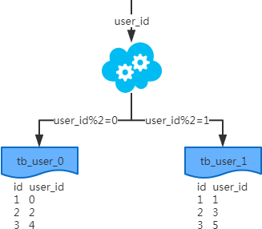
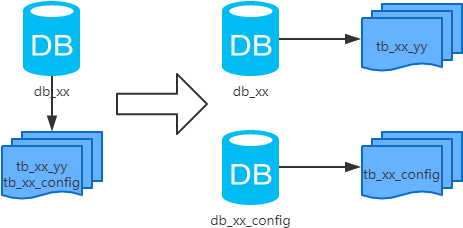
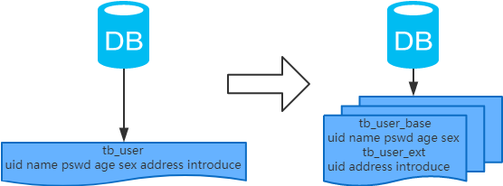
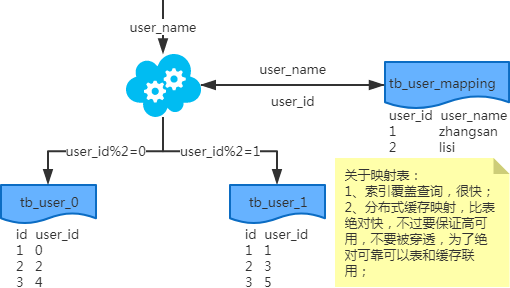
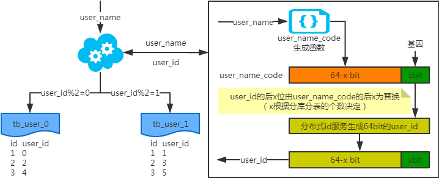
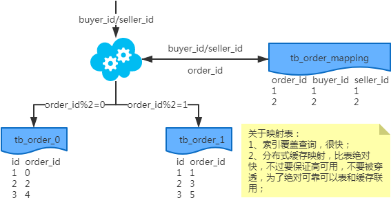

# 一次搞定MySQL分库分表

**本次分享内容**

1. 数据库瓶颈
2. 水平和垂直拆分库表
3. 分库分表工具
4. 分库分表步骤
5. 分库分表问题

### 一、数据库瓶颈
不管是 IO 瓶颈，还是 CPU 瓶颈，最终都会导致数据库的活跃连接数增加，进而逼近甚至达到数据库可承载活跃连接数的阈值。在业务 Service 来看就是，可用数据库连接少甚至无连接可用。接下来就可以想象了吧（并发量、吞吐量、崩溃）。

#### 1、IO 瓶颈
第一种：磁盘读 IO 瓶颈，热点数据太多，数据库缓存放不下，每次查询时会产生大量的 IO，降低查询速度 -> 分库和垂直分表。

第二种：网络 IO 瓶颈，请求的数据太多，网络带宽不够 -> 分库。

#### 2、CPU 瓶颈
第一种：SQL 问题，如 SQL 中包含 join，group by，order by，非索引字段条件查询等，增加 CPU 运算的操作 -> SQL 优化，建立合适的索引，在业务 Service 层进行业务计算。

第二种：单表数据量太大，查询时扫描的行太多，SQL 效率低，增加 CPU 运算的操作 -> 水平分表。

### 二、分库分表
#### 1、水平分库

##### 概念：
以字段为依据，按照一定策略（hash、range 等），将一个库中的数据拆分到多个库中。

##### 结果：
+ 每个库的结构都一样；
+ 每个库的数据都不一样，没有交集；
+ 所有库的并集是全量数据；

##### 场景：
系统绝对并发量上来了，分表难以根本上解决问题，并且还没有明显的业务归属来垂直分库。

##### 分析：
库多了，io 和 cpu 的压力自然可以成倍缓解。 

#### 2、水平分表

##### 概念：
以字段为依据，按照一定策略（hash、range 等），将一个表中的数据拆分到多个表中。

##### 结果：
+ 每个表的结构都一样；
+ 每个表的数据都不一样，没有交集；
+ 所有表的并集是全量数据；

##### 场景：
系统绝对并发量并没有上来，只是单表的数据量太多，影响了 SQL 效率，加重了 CPU 负担，以至于成为瓶颈。

##### 分析：
表的数据量少了，单次 SQL 执行效率高，自然减轻了 CPU 的负担。

#### 3、垂直分库

##### 概念：
以表为依据，按照业务归属不同，将不同的表拆分到不同的库中。

##### 结果：
+ 每个库的结构都不一样；
+ 每个库的数据也不一样，没有交集；
+ 所有库的并集是全量数据；

##### 场景：
系统绝对并发量上来了，并且可以抽象出单独的业务模块。

##### 分析：
到这一步，基本上就可以服务化了。例如，随着业务的发展一些公用的配置表、字典表等越来越多，这时可以将这些表拆到单独的库中，甚至可以服务化。再有，随着业务的发展孵化出了一套业务模式，这时可以将相关的表拆到单独的库中，甚至可以服务化。

#### 4、垂直分表

##### 概念：
以字段为依据，按照字段的活跃性，将表中字段拆到不同的表（主表和扩展表）中。

##### 结果：
+ 每个表的结构都不一样；
+ 每个表的数据也不一样，一般来说，每个表的字段至少有一列交集，一般是主键，用于关联数据；
+ 所有表的并集是全量数据；

##### 场景：
系统绝对并发量并没有上来，表的记录并不多，但是字段多，并且热点数据和非热点数据在一起，单行数据所需的存储空间较大。以至于数据库缓存的数据行减少，查询时会去读磁盘数据产生大量的随机读 IO，产生 IO 瓶颈。

##### 分析：
可以用列表页和详情页来帮助理解。垂直分表的拆分原则是将热点数据（可能会冗余经常一起查询的数据）放在一起作为主表，非热点数据放在一起作为扩展表。这样更多的热点数据就能被缓存下来，进而减少了随机读 IO。拆了之后，要想获得全部数据就需要关联两个表来取数据。

但记住，千万别用 join，因为 join 不仅会增加 CPU 负担并且会讲两个表耦合在一起（必须在一个数据库实例上）。关联数据，应该在业务 Service 层做文章，分别获取主表和扩展表数据然后用关联字段关联得到全部数据。

### 三、分库分表工具
+ **Sharding-jdbc** 这种 client 层方案的优点在于不用部署，运维成本低，不需要代理层的二次转发请求，性能很高，但是各个系统都需要耦合 Sharding-jdbc 的依赖，升级比较麻烦
+ **Mycat **这种 proxy 层方案的缺点在于需要部署，自己运维一套中间件，运维成本高，但是好处在于对于各个项目是透明的，如果遇到升级之类的都是自己中间件那里搞就行了

### 四、分库分表步骤
根据容量（当前容量和增长量）评估分库或分表个数 -> 选 key（均匀）-> 分表规则（hash 或 range 等）-> 执行（一般双写）-> 扩容问题（尽量减少数据的移动）。

假设系统目前有1亿用户：场景 10万写并发，100万读并发，60亿数据量设计时考虑极限情况，32库*32表~64个表，一共1000 ~ 2000张表

+ 支持3万的写并发，配合MQ实现每秒10万的写入速度
+ 读写分离6万读并发，配合分布式缓存每秒100读并发
+ 2000张表每张300万，可以最多写入60亿的数据
+ 32张用户表，支撑亿级用户，后续最多也就扩容一次

**动态扩容的步骤**

1. 推荐是 32 库 * 32 表，对于上述量级的公司来说，可能几年都够了。
2. 配置路由的规则，uid % 32 = 库，uid / 32 % 32 = 表
3. 扩容的时候，申请增加更多的数据库服务器，呈倍数扩容
4. 由 DBA 负责将原先数据库服务器的库，迁移到新的数据库服务器上去
5. 修改一下配置，重新发布系统，上线，原先的路由规则变都不用变
6. 直接可以基于 n 倍的数据库服务器的资源，继续进行线上系统的提供服务。

### 五、分库分表问题
1、非 partition key 的查询问题（水平分库分表，拆分策略为常用的 hash 法）

#### 单key业务
##### 索引表法、缓存映射法

##### 基因法

注：

通过对user_name执行一个随机函数，得到一个68bit的code，然后取最后4个bit作为基因，比如4bit基因是1010

写入时，基因法生成 user_id，如图。关于 xbit 基因，例如要分16张表，2的4次方等于16，故 x 取4，即 4bit 基因，这个基因可以是0到15之间的任意值，根据 user_id 查询时可直接取模路由到对应的分库或分表，比如：user_id=777，777的二进制表示为：0011 0000 1001，然后拼接4bit基因1010，1010转换为10进制为10，之后10%16，落在表10

根据 user_name 查询时，先通过 user_name_code 生成函数生成 user_name_code 再对其取模路由到对应的分库或分表。id 生成常用 snowflake 算法。

#### 多key业务
##### 索引表法、缓存映射法

**冗余法**

+ 异步双写：包含线上异步(ESB)和线下异步(Log)
+ 按照 order_id 或 buyer_id 查询时路由到 db_o_buyer 库中，按照 seller_id 查询时路由到 db_o_seller 库中

### 六、分库分表总结
+ 分库分表，首先得知道瓶颈在哪里，然后才能合理地拆分（分库还是分表？水平还是垂直？分几个？）。且不可为了分库分表而拆分。
+ 选 key 很重要，既要考虑到拆分均匀，也要考虑到非 partition key 的查询。
+ 只要能满足需求，拆分规则越简单越好。

> 更新: 2024-07-15 22:21:21  
> 原文: <https://www.yuque.com/tulingzhouyu/db22bv/ozq1myqzagouzdvk>