# 互联网大厂分布式ID解决方案

**本次分享内容**

1. 分布式ID介绍
2. 分布式ID常见解决方案(数据库、算法、开源框架)
3. 总结


## 分布式ID介绍
### 什么是 ID？
日常开发中，我们需要对系统中的各种数据使用 ID 唯一表示，比如用户 ID 对应且仅对应一个人，商品 ID 对应且仅对应一件商品，订单 ID 对3应且仅对应一个订单。

我们现实生活中也有各种 ID，比如身份证 ID 对应且仅对应一个人、地址 ID 对应且仅对应一个地址。

简单来说，**ID 就是数据的唯一标识**。

### 什么是分布式 ID？
分布式 ID 是分布式系统下的 ID。分布式 ID 不存在与现实生活中，属于计算机系统中的一个概念。

我简单举一个分库分表的例子。

比如有一个项目，使用的是单机 MySQL 。但是，没想到的是，项目上线一个月之后，随着使用人数越来越多，整个系统的数据量将越来越大。单机 MySQL 已经没办法支撑了，需要进行分库分表（推荐 Sharding-JDBC）。

在分库之后， 数据遍布在不同服务器上的数据库，数据库的自增主键已经没办法满足生成的主键唯一了。**我们如何为不同的数据节点生成全局唯一主键呢？**

这个时候就需要生成**分布式 ID**了。

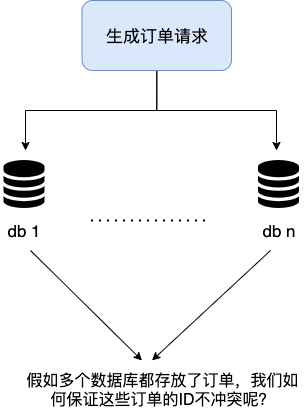

### 分布式 ID 需要满足哪些要求?
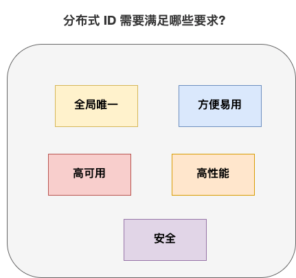

分布式 ID 作为分布式系统中必不可少的一环，很多地方都要用到分布式 ID。

一个最基本的分布式 ID 需要满足下面这些要求：

+ **全局唯一**：ID 的全局唯一性肯定是首先要满足的！
+ **高性能**：分布式 ID 的生成速度要快，对本地资源消耗要小。
+ **高可用**：生成分布式 ID 的服务要保证可用性无限接近于 100%。
+ **方便易用**：拿来即用，使用方便，快速接入！

除了这些之外，一个比较好的分布式 ID 还应保证：

+ **安全**：ID 中不包含敏感信息。
+ **有序递增**：如果要把 ID 存放在数据库的话，ID 的有序性可以提升数据库写入速度。并且，很多时候 ，我们还很有可能会直接通过 ID 来进行排序。
+ **有具体的业务含义**：生成的 ID 如果能有具体的业务含义，可以让定位问题以及开发更透明化（通过 ID 就能确定是哪个业务）。
+ **独立部署**：也就是分布式系统单独有一个发号器服务，专门用来生成分布式 ID。这样就生成 ID 的服务可以和业务相关的服务解耦。不过，这样同样带来了网络调用消耗增加的问题。总的来说，如果需要用到分布式 ID 的场景比较多的话，独立部署的发号器服务还是很有必要的。

## 分布式 ID 常见解决方案
### 数据库
#### 数据库主键自增
这种方式就比较简单直白了，就是通过关系型数据库的自增主键产生来唯一的 ID。


以 MySQL 举例，我们通过下面的方式即可。

**1.创建一个数据库表。**

```sql
CREATE TABLE `sequence_id` (
  `id` bigint(20) unsigned NOT NULL AUTO_INCREMENT,
  `stub` char(10) NOT NULL DEFAULT '',
  PRIMARY KEY (`id`),
  UNIQUE KEY `stub` (`stub`)
) ENGINE=InnoDB DEFAULT CHARSET=utf8mb4;
```

stub 字段无意义，只是为了占位，便于我们插入或者修改数据。并且，给 stub 字段创建了唯一索引，保证其唯一性。

**2.通过 ****replace into**** 来插入数据。**

```java
BEGIN;
REPLACE INTO sequence_id (stub) VALUES ('stub');
SELECT LAST_INSERT_ID();
COMMIT;
```

插入数据这里，我们没有使用 insert into 而是使用 replace into 来插入数据，具体步骤是这样的：

+ 第一步：尝试把数据插入到表中。
+ 第二步：如果主键或唯一索引字段出现重复数据错误而插入失败时，先从表中删除含有重复关键字值的冲突行，然后再次尝试把数据插入到表中。

这种方式的优缺点也比较明显：

+ **优点**：实现起来比较简单、ID 有序递增、存储消耗空间小
+ **缺点**：支持的并发量不大、存在数据库单点问题（可以使用数据库集群解决，不过增加了复杂度）、ID 没有具体业务含义、安全问题（比如根据订单 ID 的递增规律就能推算出每天的订单量，商业机密啊！ ）、每次获取 ID 都要访问一次数据库（增加了对数据库的压力，获取速度也慢）


解决上面的问题：

#### 设置起始值和自增步长


MySQL_1 配置：

```sql
set @@auto increment offset =1;    -- 起始值
set @@auto increment increment=2;  -- 步长
```


MySQL_2 配置：


```sql
set @@auto increment offset =2;    -- 起始值
set @@auto increment increment=2;  -- 步长
```


这样两个MySQL实例的自增ID分别就是：


1、3、5、7、9

2、4、6、8、10

但是如果两个还是无法满足咋办呢？增加第三台MySQL实例需要人工修改一、二两台MySQL实例的起始值和步长，把第三台机器的ID起始生成位置设定在比现有最大自增ID的位置远一些，但必须在一、二两台MySQL实例ID还没有增长到第三台MySQL实例的起始ID值的时候，否则自增ID就要出现重复了，必要时可能还需要停机修改。


优点：解决DB单点问题


缺点：不利于后续扩容，而且实际上单个数据库自身压力还是大，依旧无法满足高并发场景。

 

#### 数据库号段模式
数据库主键自增这种模式，每次获取 ID 都要访问一次数据库，ID 需求比较大的时候，肯定是不行的。

如果我们可以批量获取，然后存在在内存里面，需要用到的时候，直接从内存里面拿就舒服了！这也就是我们说的 **基于数据库的号段模式来生成分布式 ID。**

数据库的号段模式也是目前比较主流的一种分布式 ID 生成方式。像滴滴开源的[Tinyid](https://github.com/didi/tinyid/wiki/tinyid%E5%8E%9F%E7%90%86%E4%BB%8B%E7%BB%8D) 就是基于这种方式来做的。不过，TinyId 使用了双号段缓存、增加多 db 支持等方式来进一步优化。

以 MySQL 举例，我们通过下面的方式即可。

**1. 创建一个数据库表。**

```sql
CREATE TABLE `sequence_id_generator` (
  `id` int(10) NOT NULL,
  `current_max_id` bigint(20) NOT NULL COMMENT '当前最大id',
  `step` int(10) NOT NULL COMMENT '号段的长度',
  `version` int(20) NOT NULL COMMENT '版本号',
  `biz_type`    int(20) NOT NULL COMMENT '业务类型',
   PRIMARY KEY (`id`)
) ENGINE=InnoDB DEFAULT CHARSET=utf8mb4;
```

current_max_id 字段和step字段主要用于获取批量 ID，获取的批量 id 为：current_max_id ~ current_max_id+step。

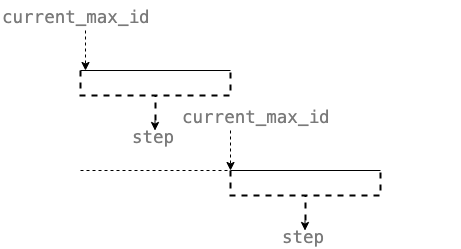

version 字段主要用于解决并发问题（乐观锁）,biz_type 主要用于表示业务类型。

**2. 先插入一行数据。**

```sql
INSERT INTO `sequence_id_generator` (`id`, `current_max_id`, `step`, `version`, `biz_type`)
VALUES
 (1, 0, 100, 0, 101);
```

**3. 通过 SELECT 获取指定业务下的批量唯一 ID**

```sql
SELECT `current_max_id`, `step`,`version` FROM `sequence_id_generator` where `biz_type` = 101
```

结果：

```plain
id current_max_id step version biz_type
1 0 100 0 101
```

**4. 不够用的话，更新之后重新 SELECT 即可。**

```sql
UPDATE sequence_id_generator SET current_max_id = 0+100, version=version+1 WHERE version = 0  AND `biz_type` = 101;
SELECT `current_max_id`, `step`,`version` FROM `sequence_id_generator` where `biz_type` = 101
```

结果：

```plain
id current_max_id step version biz_type
1 100 100 1 101
```

相比于数据库主键自增的方式，**数据库的号段模式对于数据库的访问次数更少，数据库压力更小。**

另外，为了避免单点问题，你可以从使用主从模式来提高可用性。

**数据库号段模式的优缺点:**

+ **优点**：ID 有序递增、存储消耗空间小
+ **缺点**：存在数据库单点问题（可以使用数据库集群解决，不过增加了复杂度）、ID 没有具体业务含义、安全问题（比如根据订单 ID 的递增规律就能推算出每天的订单量，商业机密啊！ ）

#### NoSQL
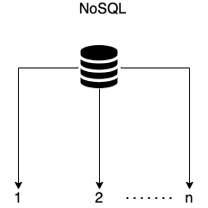

一般情况下，NoSQL 方案使用 Redis 多一些。我们通过 Redis 的 incr 命令即可实现对 id 原子顺序递增。

```bash
127.0.0.1:6379> set sequence_id_biz_type 1
OK
127.0.0.1:6379> incr sequence_id_biz_type
(integer) 2
127.0.0.1:6379> get sequence_id_biz_type
"2"
```

为了提高可用性和并发，我们可以使用 Redis Cluster。Redis Cluster 是 Redis 官方提供的 Redis 集群解决方案（3.0+版本）。

**Redis 方案的优缺点：**

+ **优点**：性能不错并且生成的 ID 是有序递增的
+ **缺点**：和数据库主键自增方案的缺点类似

除了 Redis 之外，MongoDB ObjectId 经常也会被拿来当做分布式 ID 的解决方案。

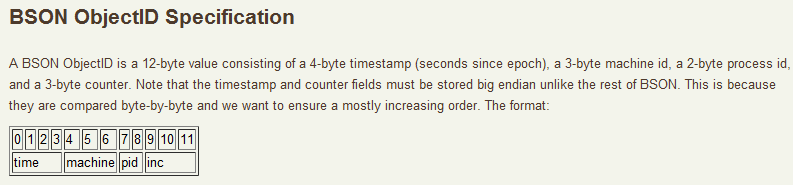

MongoDB ObjectId 一共需要 12 个字节存储：

+ 0~3：时间戳
+ 3~6：代表机器 ID
+ 7~8：机器进程 ID
+ 9~11：自增值

**MongoDB 方案的优缺点：**

+ **优点**：性能不错并且生成的 ID 是有序递增的
+ **缺点**：需要解决重复 ID 问题（当机器时间不对的情况下，可能导致会产生重复 ID）、有安全性问题（ID 生成有规律性）

### 算法
#### UUID
UUID 是 Universally Unique Identifier（通用唯一标识符） 的缩写。UUID 包含 32 个 16 进制数字（8-4-4-4-12）。

JDK 就提供了现成的生成 UUID 的方法，一行代码就行了。

```java
//输出示例：cb4a9edefa5e4585b9bbd60bce986eaa
UUID.randomUUID().tostring().replaceA11("-","");
```

[RFC 4122](https://tools.ietf.org/html/rfc4122) 中关于 UUID 的示例是这样的：


我们这里重点关注一下这个 Version(版本)，不同的版本对应的 UUID 的生成规则是不同的。

5 种不同的 Version(版本)值分别对应的含义（参考[维基百科对于 UUID 的介绍](https://zh.wikipedia.org/wiki/%E9%80%9A%E7%94%A8%E5%94%AF%E4%B8%80%E8%AF%86%E5%88%AB%E7%A0%81)）：

+ **版本 1** : UUID 是根据时间和节点 ID（通常是 MAC 地址）生成；
+ **版本 2** : UUID 是根据标识符（通常是组或用户 ID）、时间和节点 ID 生成；
+ **版本 3、版本 5** : 版本 5 - 确定性 UUID 通过散列（hashing）名字空间（namespace）标识符和名称生成；
+ **版本 4** : UUID 使用[随机性](https://zh.wikipedia.org/wiki/%E9%9A%8F%E6%9C%BA%E6%80%A7)或[伪随机性](https://zh.wikipedia.org/wiki/%E4%BC%AA%E9%9A%8F%E6%9C%BA%E6%80%A7)生成。

下面是 Version 1 版本下生成的 UUID 的示例：


JDK 中通过 UUID 的 randomUUID() 方法生成的 UUID 的版本默认为 4。

```java
UUID uuid = UUID.randomUUID();
int version = uuid.version();// 4
```

从上面的介绍中可以看出，UUID 可以保证唯一性，因为其生成规则包括 MAC 地址、时间戳、名字空间（Namespace）、随机或伪随机数、时序等元素，计算机基于这些规则生成的 UUID 是肯定不会重复的。

虽然，UUID 可以做到全局唯一性，但是，我们一般很少会使用它。

比如使用 UUID 作为 MySQL 数据库主键的时候就非常不合适：

+ 数据库主键要尽量越短越好，而 UUID 的消耗的存储空间比较大（32 个字符串，128 位）。
+ UUID 是无顺序的，InnoDB 引擎下，数据库主键的无序性会严重影响数据库性能。

最后，我们再简单分析一下 **UUID 的优缺点** 

+ **优点**：生成速度比较快、简单易用
+ **缺点**：存储消耗空间大（32 个字符串，128 位）、 不安全（基于 MAC 地址生成 UUID 的算法会造成 MAC 地址泄露)、无序（非自增）、没有具体业务含义、需要解决重复 ID 问题（当机器时间不对的情况下，可能导致会产生重复 ID）

#### Snowflake(雪花算法)
Snowflake 是 Twitter 开源的分布式 ID 生成算法。Snowflake 由 64 bit 的二进制数字组成，这 64bit 的二进制被分成了几部分，每一部分存储的数据都有特定的含义：

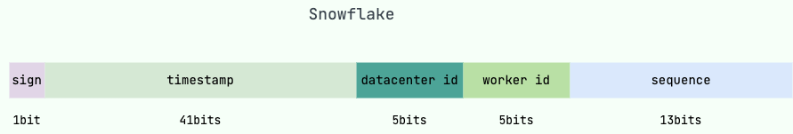

+ **sign(1bit)**:符号位（标识正负），始终为 0，代表生成的 ID 为正数。
+ **timestamp (41 bits)**:一共 41 位，用来表示时间戳，单位是毫秒，可以支撑 2 ^41 毫秒（约 69 年）
+ **datacenter id + worker id (10 bits)**:一般来说，前 5 位表示机房 ID，后 5 位表示机器 ID（实际项目中可以根据实际情况调整）。这样就可以区分不同集群/机房的节点。
+ **sequence (12 bits)**:一共 12 位，用来表示序列号。 序列号为自增值，代表单台机器每毫秒能够产生的最大 ID 数(2^12 = 4096),也就是说单台机器每毫秒最多可以生成 4096 个 唯一 ID。

在实际项目中，我们一般也会对 Snowflake 算法进行改造，最常见的就是在 Snowflake 算法生成的 ID 中加入业务类型信息。

我们再来看看 Snowflake 算法的优缺点：

+ **优点**：生成速度比较快、生成的 ID 有序递增、比较灵活（可以对 Snowflake 算法进行简单的改造比如加入业务 ID）
+ **缺点**：需要解决重复 ID 问题（ID 生成依赖时间，在获取时间的时候，可能会出现时间回拨的问题，也就是服务器上的时间突然倒退到之前的时间，进而导致会产生重复 ID）、依赖机器 ID 对分布式环境不友好（当需要自动启停或增减机器时，固定的机器 ID 可能不够灵活）。


### 开源框架
#### UidGenerator(百度)
[UidGenerator](https://github.com/baidu/uid-generator) 是百度开源的一款基于 Snowflake(雪花算法)的唯一 ID 生成器。

不过，UidGenerator 对 Snowflake(雪花算法)进行了改进，生成的唯一 ID 组成如下：

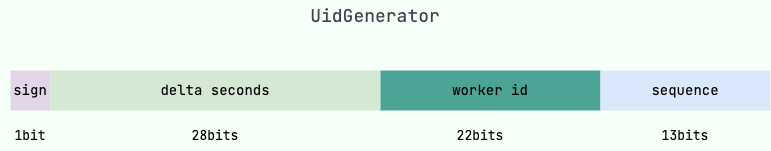

+ **sign(1bit)**:符号位（标识正负），始终为 0，代表生成的 ID 为正数。
+ **delta seconds (28 bits)**:当前时间，相对于时间基点"2016-05-20"的增量值，单位：秒，最多可支持约 8.7 年
+ **worker id (22 bits)**:机器 id，最多可支持约 420w 次机器启动。内置实现为在启动时由数据库分配，默认分配策略为用后即弃，后续可提供复用策略。
+ **sequence (13 bits)**:每秒下的并发序列，13 bits 可支持每秒 8192 个并发。

可以看出，和原始 Snowflake(雪花算法)生成的唯一 ID 的组成不太一样。并且，上面这些参数我们都可以自定义。

UidGenerator 官方文档中的介绍如下：

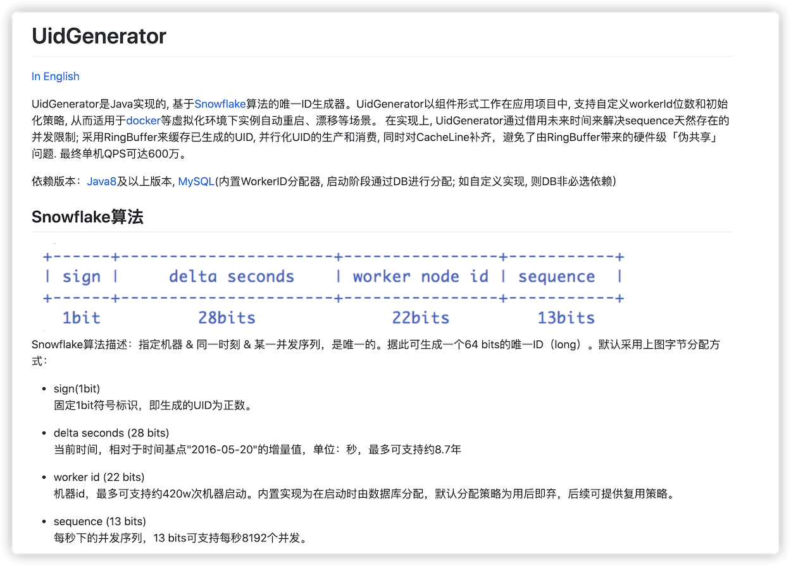

自 18 年后，UidGenerator 就基本没有再维护了

#### Leaf(美团)
[Leaf](https://github.com/Meituan-Dianping/Leaf) 是美团开源的一个分布式 ID 解决方案 。这个项目的名字 Leaf（树叶） 起源于德国哲学家、数学家莱布尼茨的一句话：“There are no two identical leaves in the world”（世界上没有两片相同的树叶） 。这名字起得真心挺不错的，有点文艺青年那味了！

Leaf 提供了 **号段模式** 和 **Snowflake(雪花算法)** 这两种模式来生成分布式 ID。并且，它支持双号段，还解决了雪花 ID 系统时钟回拨问题。不过，时钟问题的解决需要弱依赖于 Zookeeper（使用 Zookeeper 作为注册中心，通过在特定路径下读取和创建子节点来管理 workId） 。

Leaf 的诞生主要是为了解决美团各个业务线生成分布式 ID 的方法多种多样以及不可靠的问题。

Leaf 对原有的号段模式进行改进，比如它这里增加了双号段避免获取 DB 在获取号段的时候阻塞请求获取 ID 的线程。简单来说，就是我一个号段还没用完之前，我自己就主动提前去获取下一个号段

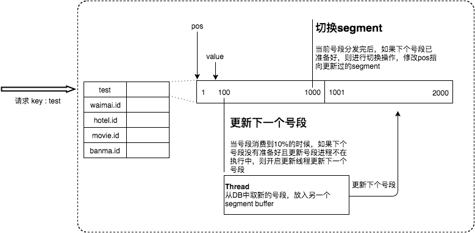

根据项目 README 介绍，在 4C8G VM 基础上，通过公司 RPC 方式调用，QPS 压测结果近 5w/s，TP999 1ms。

#### Tinyid(滴滴)
[Tinyid](https://github.com/didi/tinyid) 是滴滴开源的一款基于数据库号段模式的唯一 ID 生成器。

数据库号段模式的原理我们在上面已经介绍过了。**Tinyid 有哪些亮点呢？**

为了搞清楚这个问题，我们先来看看基于数据库号段模式的简单架构方案。（图片来自于 Tinyid 的官方 wiki:[《Tinyid 原理介绍》](https://github.com/didi/tinyid/wiki/tinyid%E5%8E%9F%E7%90%86%E4%BB%8B%E7%BB%8D)）

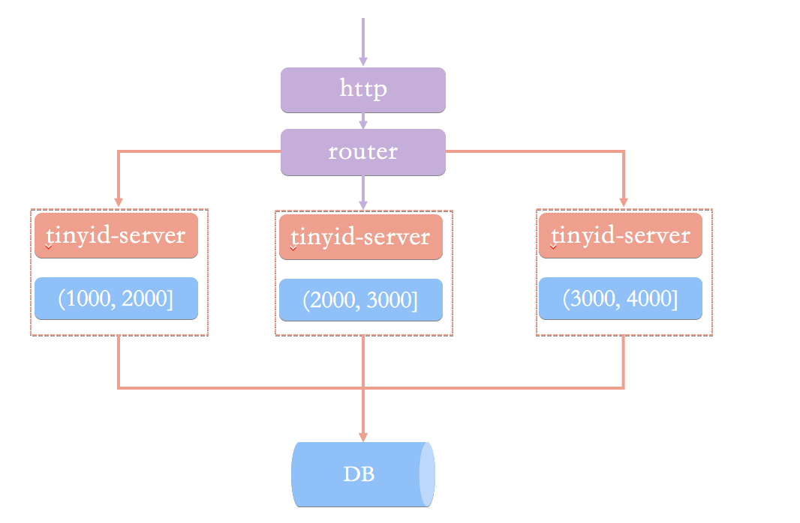

在这种架构模式下，我们通过 HTTP 请求向发号器服务申请唯一 ID。负载均衡 router 会把我们的请求送往其中的一台 tinyid-server。

这种方案有什么问题呢？在我看来（Tinyid 官方 wiki 也有介绍到），主要由下面这 2 个问题：

+ 获取新号段的情况下，程序获取唯一 ID 的速度比较慢。
+ 需要保证 DB 高可用，这个是比较麻烦且耗费资源的。

除此之外，HTTP 调用也存在网络开销。

Tinyid 的原理比较简单，其架构如下图所示：

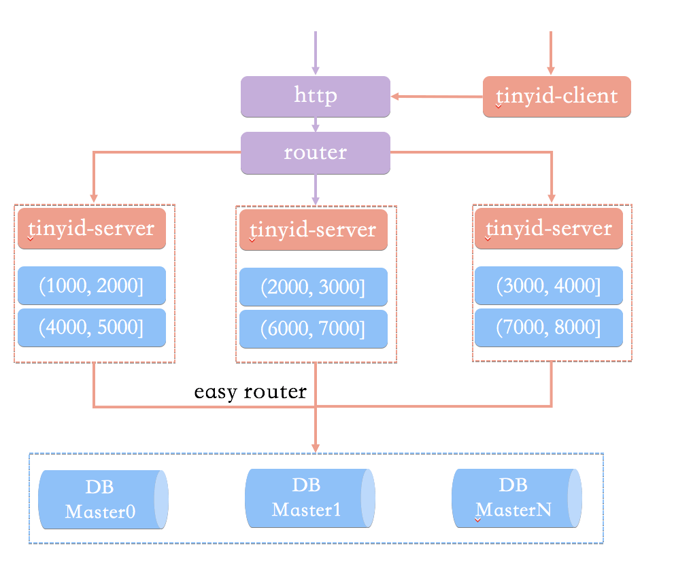

相比于基于数据库号段模式的简单架构方案，Tinyid 方案主要做了下面这些优化：

+ **双号段缓存**：为了避免在获取新号段的情况下，程序获取唯一 ID 的速度比较慢。 Tinyid 中的号段在用到一定程度的时候，就会去异步加载下一个号段，保证内存中始终有可用号段。
+ **增加多 db 支持**：支持多个 DB，并且，每个 DB 都能生成唯一 ID，提高了可用性。
+ **增加 tinyid-client**：纯本地操作，无 HTTP 请求消耗，性能和可用性都有很大提升。

Tinyid 的优缺点这里就不分析了，结合数据库号段模式的优缺点和 Tinyid 的原理就能知道。

####  
#### <font style="color:rgb(51, 51, 51);">IdGenerator(个人)</font>
<font style="color:rgb(51, 51, 51);">和 UidGenerator、Leaf 一样，</font>[IdGenerator](https://github.com/yitter/IdGenerator)<font style="color:rgb(51, 51, 51);"> 也是一款基于 Snowflake(雪花算法)的唯一 ID 生成器。</font><font style="color:rgb(51, 51, 51);">IdGenerator 有如下特点：</font>

+ <font style="color:rgb(51, 51, 51);">生成的唯一 ID 更短；</font>
+ <font style="color:rgb(51, 51, 51);">兼容所有雪花算法（号段模式或经典模式，大厂或小厂）；</font>
+ <font style="color:rgb(51, 51, 51);">原生支持 C#/Java/Go/C/Rust/Python/Node.js/PHP(C 扩展)/SQL/ 等语言，并提供多线程安全调用动态库（FFI）；</font>
+ <font style="color:rgb(51, 51, 51);">解决了时间回拨问题，支持手工插入新 ID（当业务需要在历史时间生成新 ID 时，用本算法的预留位能生成 5000 个每秒）；</font>
+ <font style="color:rgb(51, 51, 51);">不依赖外部存储系统;</font>
+ <font style="color:rgb(51, 51, 51);">默认配置下，ID 可用 71000 年不重复。</font>

<font style="color:rgb(51, 51, 51);">IdGenerator 生成的唯一 ID 组成如下：</font>

+ **<font style="color:rgb(51, 51, 51);">timestamp (位数不固定)</font>**<font style="color:rgb(51, 51, 51);">:时间差，是生成 ID 时的系统时间减去 BaseTime(基础时间，也称基点时间、原点时间、纪元时间，默认值为 2020 年) 的总时间差（毫秒单位）。初始为 5bits，随着运行时间而增加。如果觉得默认值太老，你可以重新设置，不过要注意，这个值以后最好不变。</font>
+ **<font style="color:rgb(51, 51, 51);">worker id (默认 6 bits)</font>**<font style="color:rgb(51, 51, 51);">:机器 id，机器码，最重要参数，是区分不同机器或不同应用的唯一 ID，最大值由 WorkerIdBitLength（默认 6）限定。如果一台服务器部署多个独立服务，需要为每个服务指定不同的 WorkerId。</font>
+ **<font style="color:rgb(51, 51, 51);">sequence (默认 6 bits)</font>**<font style="color:rgb(51, 51, 51);">:序列数，是每毫秒下的序列数，由参数中的 SeqBitLength（默认 6）限定。增加 SeqBitLength 会让性能更高，但生成的 ID 也会更长。</font>

<font style="color:rgb(51, 51, 51);">Java 语言使用示例：</font>[https://github.com/yitter/idgenerator/tree/master/Java](https://github.com/yitter/idgenerator/tree/master/Java)<font style="color:rgb(51, 51, 51);">。</font>

## 总结
1. **数据库**
    1. 主键自增
        * 优点：实现起来比较简单、ID 有序递增、存储消耗空间小。
        * 缺点：支持的并发量不大、存在数据库单点问题（可以使用数据库集群解决，不过增加了复杂度）、ID 没有具体业务含义、安全问题（比如根据订单 ID 的递增规律就能推算出每天的订单量，商业机密啊！ ）、每次获取 ID 都要访问一次数据库（增加了对数据库的压力，获取速度也慢）
    2. 号段模式
        * 优点：ID 有序递增、存储消耗空间小
        * 缺点：存在数据库单点问题(可以使用数据库集群解决，不过增加了复杂度)、ID 没有具体业务含义、安全问题(比如根据订单 ID 的递增规律就能推算出每天的订单量，商业机密啊！)
    3. NoSQL，比如Redis
        * 优点：性能不错并且生成的 ID 是有序递增的
        * 缺点：和数据库主键自增方案的缺点类似
2. **算法**
    1. UUID
        * 优点：生成速度比较快、简单易用
        * 缺点：存储消耗空间大（32 个字符串，128 位）、 不安全（基于 MAC 地址生成 UUID 的算法会造成 MAC 地址泄露)、无序（非自增）、没有具体业务含义、需要解决重复 ID 问题（当机器时间不对的情况下，可能导致会产生重复 ID）
    2. Snowflake(雪花算法)
        * 优点：生成速度比较快、生成的 ID 有序递增、比较灵活（可以对 Snowflake 算法进行简单的改造比如加入业务 ID）
        * 缺点：需要解决重复 ID 问题（ID 生成依赖时间，在获取时间的时候，可能会出现时间回拨的问题，也就是服务器上的时间突然倒退到之前的时间，进而导致会产生重复 ID）、依赖机器 ID 对分布式环境不友好（当需要自动启停或增减机器时，固定的机器 ID 可能不够灵活）。
3. **开源框架**
    1. UidGenerator(百度)：基于Snowflake(雪花算法)做了改进
    2. Leaf(美团)： 支持号段模式 和 Snowflake(雪花算法) 来生成分布式 ID，增加了双号段避免获取 DB 在获取号段的时候阻塞请求获取 ID 的线程
    3. Tinyid(滴滴)
        * 双号段缓存：为了避免在获取新号段的情况下，程序获取唯一 ID 的速度比较慢。 Tinyid 中的号段在用到一定程度的时候，就会去异步加载下一个号段，保证内存中始终有可用号段。
        * 增加多 db 支持：支持多个 DB，并且，每个 DB 都能生成唯一 ID，提高了可用性。
        * 增加 tinyid-client：纯本地操作，无 HTTP 请求消耗，性能和可用性都有很大提升。
    4. IdGenerator(个人)
        * <font style="color:rgb(51, 51, 51);">生成的唯一 ID 更短；</font>
        * <font style="color:rgb(51, 51, 51);">兼容所有雪花算法（号段模式或经典模式，大厂或小厂）；</font>
        * <font style="color:rgb(51, 51, 51);">原生支持 C#/Java/Go/C/Rust/Python/Node.js/PHP(C 扩展)/SQL/ 等语言，并提供多线程安全调用动态库（FFI）；</font>
        * <font style="color:rgb(51, 51, 51);">解决了时间回拨问题，支持手工插入新 ID（当业务需要在历史时间生成新 ID 时，用本算法的预留位能生成 5000 个每秒）；</font>
        * <font style="color:rgb(51, 51, 51);">不依赖外部存储系统;</font>
        * <font style="color:rgb(51, 51, 51);">默认配置下，ID 可用 71000 年不重复。</font>


> 更新: 2024-11-26 20:53:44  
> 原文: <https://www.yuque.com/tulingzhouyu/db22bv/lb1cltxgw0eygfvf>