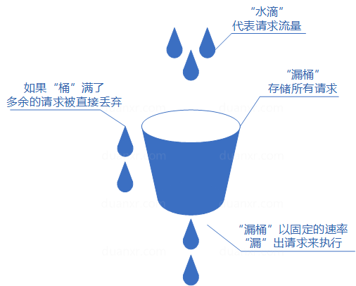

# 互联网大厂高并发限流解决方案

**示例代码**

[附件: flow-demo.ppt](./attachments/uWCIreFiqAPYQKEW/flow-demo.ppt)

_<font style="color:#DF2A3F;">注：将ppt后缀名改为zip后解压</font>_

jdk版本：1.8.0_181

****

**本次分享内容**

1. 高并发下如何保证高可用
2. 限流的核心思想
3. 限流的场景
4. 常见的限流策略


## <font style="color:rgb(51, 51, 51);">1. 高并发下如何保证高可用</font>
### <font style="color:rgb(51, 51, 51);">1.1 什么是高并发？</font>
<font style="color:rgb(51, 51, 51);">高并发（High Concurrency）是一种系统运行过程中遇到的一种“短时间内遇到大量操作请求”的情况，主要发生在web系统集中大量访问收到大量请</font>

<font style="color:rgb(51, 51, 51);">求（例如：秒杀、12306的抢票、天猫双十一、微博热点）。该情况的发生会导致系统在这段时间内执行大量操作，例如对资源的请求，数据库的操作等。</font>

<font style="color:rgb(51, 51, 51);">总的来说，高并发需要一定的用户基数、一定的业务量，才会碰到</font>

### <font style="color:rgb(51, 51, 51);">1.2 高并发的处理指标</font>
<font style="color:rgb(51, 51, 51);">高并发相关常用的一些指标有:</font>

**<font style="color:rgb(51, 51, 51);">1.响应时间（Response Time）</font>**

<font style="color:rgb(51, 51, 51);">响应时间：系统对请求做出响应的时间。例如系统处理一个HTTP请求需要200ms，这个200ms就是系统的响应时间</font>

**<font style="color:rgb(51, 51, 51);">2.吞吐量（Throughput）</font>**

<font style="color:rgb(51, 51, 51);">吞吐量：单位时间内处理的请求数量。</font>

**<font style="color:rgb(51, 51, 51);">3.每秒查询率QPS（Query Per Second）</font>**

<font style="color:rgb(51, 51, 51);">QPS：每秒响应请求数。在互联网领域，这个指标和吞吐量区分的没有这么明显。</font>

**<font style="color:rgb(51, 51, 51);">4.并发用户数</font>**

<font style="color:rgb(51, 51, 51);">并发用户数：同时承载正常使用系统功能的用户数量。例如一个即时通讯系统，同时在线量一定程度上代表了系统的并发用户数。</font>

<font style="color:rgb(51, 51, 51);"></font>

### <font style="color:rgb(51, 51, 51);">1.3 什么是高可用?</font>
**<font style="color:rgb(51, 51, 51);">高可用HA</font>**<font style="color:rgb(51, 51, 51);">（High Availability）是分布式系统架构设计中必须考虑的因素之一，它通常是指，通过设计减少系统不能提供服务的时间。</font>

<font style="color:rgb(51, 51, 51);">假设系统一直能够提供服务，我们说系统的可用性是100%。</font>

<font style="color:rgb(51, 51, 51);">如果系统每运行100个时间单位，会有1个时间单位无法提供服务，我们说系统的可用性是99%。</font>

<font style="color:rgb(51, 51, 51);">我们平常经常看到互联网公司喊口号，我们今年一定要做到3个9、4个9，即99.9%、99.99%，甚至还有5个9，即99.999%。</font>

<font style="color:rgb(51, 51, 51);">年 = 365天 = 8760小时</font>

<font style="color:rgb(51, 51, 51);">99.9 = 8760 * 0.1% = 8760 * 0.001 = 8.76小时 （3个9）</font>

<font style="color:rgb(51, 51, 51);">99.99 = 8760 * 0.0001 = 0.876小时 = 0.876 * 60 = 52.6分钟 （4个9）</font>

<font style="color:rgb(51, 51, 51);">99.999 = 8760 * 0.00001 = 0.0876小时 = 0.0876 * 60 = 5.26分钟 （5个9）</font>

| **<font style="color:rgb(51, 51, 51);">系统可用性%</font>** | **<font style="color:rgb(51, 51, 51);">宕机时间/年</font>** | **<font style="color:rgb(51, 51, 51);">宕机时间/月</font>** | **<font style="color:rgb(51, 51, 51);">宕机时间/周</font>** | **<font style="color:rgb(51, 51, 51);">宕机时间/天</font>** |
| :--- | :--- | :--- | :--- | :--- |
| <font style="color:rgb(51, 51, 51);">90% (1个9)</font> | <font style="color:rgb(51, 51, 51);">36.5 天</font> | <font style="color:rgb(51, 51, 51);">72 小时</font> | <font style="color:rgb(51, 51, 51);">16.8 小时</font> | <font style="color:rgb(51, 51, 51);">2.4 小时</font> |
| <font style="color:rgb(51, 51, 51);">99% (2个9)</font> | <font style="color:rgb(51, 51, 51);">3.65 天</font> | <font style="color:rgb(51, 51, 51);">7.20 小时</font> | <font style="color:rgb(51, 51, 51);">1.68 小时</font> | <font style="color:rgb(51, 51, 51);">14.4 分</font> |
| <font style="color:rgb(51, 51, 51);">99.9% (3个9)</font> | <font style="color:rgb(51, 51, 51);">8.76 小时</font> | <font style="color:rgb(51, 51, 51);">43.8 分</font> | <font style="color:rgb(51, 51, 51);">10.1 分钟</font> | <font style="color:rgb(51, 51, 51);">1.44 分</font> |
| <font style="color:rgb(51, 51, 51);">99.99% (4个9)</font> | <font style="color:rgb(51, 51, 51);">52.56 分</font> | <font style="color:rgb(51, 51, 51);">4.38 分</font> | <font style="color:rgb(51, 51, 51);">1.01 分钟</font> | <font style="color:rgb(51, 51, 51);">8.66 秒</font> |
| <font style="color:rgb(51, 51, 51);">99.999% (5个9)</font> | <font style="color:rgb(51, 51, 51);">5.26 分</font> | <font style="color:rgb(51, 51, 51);">25.9 秒</font> | <font style="color:rgb(51, 51, 51);">6.05 秒</font> | <font style="color:rgb(51, 51, 51);">0.87 秒</font> |


<font style="color:rgb(51, 51, 51);">全年停机52.6分钟才能做到99.999%，即4个9</font>

<font style="color:rgb(51, 51, 51);">全年停机5.26分钟才能做到99.999%，即5个9</font>

**<font style="color:rgb(51, 51, 51);">这么多9代表什么意思呢？</font>**

<font style="color:rgb(51, 51, 51);">实际上这就是一个SLA的概念，是对服务可用性的一个保证。9越多，代表全年服务可用时间越长，服务越稳定，停机时间越短，反之亦然。</font>

**<font style="color:rgb(51, 51, 51);">SLA 是什么?</font>**

<font style="color:rgb(51, 51, 51);">SLA：服务等级协议（简称：SLA，全称：service level agreement）。是在一定开销下为保障服务的性能和可用性，服务提供商与用户间定义的一种双方认可的协定。通常这个开销是驱动提供服务质量的主要因素。</font>

<font style="color:rgb(51, 51, 51);">百度的搜索首页，是业内公认高可用保障非常出色的系统，甚至人们会通过</font>[www.baidu.com](https://www.baidu.com)<font style="color:rgb(51, 51, 51);"> 能不能访问来判断“网络的连通性”，百度高可用的服务让人留下啦“网络通畅，百度就能访问”，“百度打不开，应该是网络连不上”的印象，这其实是对百度HA最高的褒奖。</font>

### <font style="color:rgb(51, 51, 51);">1.4 高并发下如何确保高可用</font>
<font style="color:rgb(51, 51, 51);">高并发下的高可用与普通高可用存在很大差异</font>

<font style="color:rgb(51, 51, 51);">普通高可用只是多节点部署，防止服务进程死亡、机器故障、网络故障。</font>

<font style="color:rgb(51, 51, 51);">高并发意味着流量大、并发高，系统很容易因为流量大而被冲垮，宕机</font>

<font style="color:rgb(51, 51, 51);">解决的思路、方法各不相同。</font>

**<font style="color:rgb(51, 51, 51);">高可用必备手段</font>**

**<font style="color:rgb(51, 51, 51);">集群化、多节点部署：</font>**<font style="color:rgb(51, 51, 51);">冗余、最基础高可用设计</font>

**<font style="color:rgb(51, 51, 51);">失败重试：</font>**<font style="color:rgb(51, 51, 51);">要区分调用失败的类型。有些失败是短暂偶然的（比如网络抖动），进行重试即可。而有些失败是确定，那么重试反而会造成调用请求量的放大，加重对调用系统的负担。经验值：</font>**<font style="color:rgb(51, 51, 51);">重试的次数一般设为3次</font>**<font style="color:rgb(51, 51, 51);">，再多次的重试没有好处。</font>


**<font style="color:rgb(51, 51, 51);">快速回滚：</font>**<font style="color:rgb(51, 51, 51);">出现问题后，能有有效的回滚机制。涉及到数据修改的，发布后会引起脏数据的写入，需要有可靠的回滚流程，保证脏数据的清除。</font>

<font style="color:rgb(51, 51, 51);">除了发布流程外，还应该在其他开发流程上做规范，比如代码控制，集成编译、自动化测试、静态代码扫描等。</font>

**<font style="color:rgb(51, 51, 51);">兜底方案：</font>**<font style="color:rgb(51, 51, 51);">在系统真的出现了不可用的时候，需要有兜底方案。比如一些提示安抚用户，或者设置跳转链接以转移用户的请求。</font>

**<font style="color:rgb(51, 51, 51);">限流：</font>**<font style="color:rgb(51, 51, 51);">流量控制。当请求量超过系统的最大容量后，访问延迟就会增加，超过峰值的流量会拖累整个系统，出现宕机。因此，需要提前流量控制，</font>**<font style="color:rgb(51, 51, 51);">对于超过峰值的流量，可以直接拒绝掉或者选择随机拒绝</font>**<font style="color:rgb(51, 51, 51);">。限流</font>**<font style="color:rgb(51, 51, 51);">结合业务自定义配置</font>**<font style="color:rgb(51, 51, 51);">，</font>**<font style="color:rgb(51, 51, 51);">优先保证核心服务的正常响应</font>**<font style="color:rgb(51, 51, 51);">，非核心服务可直接关闭。</font>

**<font style="color:rgb(51, 51, 51);">降级：</font>**<font style="color:rgb(51, 51, 51);">这类手段不是为了防止故障的发生，而是</font>**<font style="color:rgb(51, 51, 51);">当故障发生后，怎么减小故障所造成的损失</font>**<font style="color:rgb(51, 51, 51);">。比如，系统正常时提供的服务能力是100%，出现系统故障后，我们有措施能让系统服务能力不直接降到了0，而是还能提供部分（比如50%）的服务能力。场景：依赖的服务耗时增加、边缘业务降级</font>

## <font style="color:rgb(51, 51, 51);">2. 限流的核心思想</font>
### <font style="color:rgb(51, 51, 51);">2.1 什么是限流?</font>
<font style="color:rgb(51, 51, 51);">限流是通过对并发访问/请求进行限速，或者对一个时间窗口内的请求进行限速来保护系统，一旦达到限制速率则可以拒绝服务、排队或等待、降级等处理，程序中的限流就是限制请求，请求包括客户端发起的请求，应用内服务间的请求，很多平台都有限流，例如我们调用第三方的api的时候，对方都会限制每天最多只能调用几次之类的。</font>

### <font style="color:rgb(51, 51, 51);">2.2 限流的场景</font>
<font style="color:rgb(51, 51, 51);">天猫双11</font>

<font style="color:rgb(51, 51, 51);">12306</font>

**<font style="color:rgb(51, 51, 51);">前端限流：</font>**<font style="color:rgb(51, 51, 51);">浏览器、app、小程序</font>

<font style="color:rgb(51, 51, 51);">1、JS多次点击1次提交，提 交后置灰</font>

<font style="color:rgb(51, 51, 51);">2、验证码、小游戏、问题回答</font>

**<font style="color:rgb(51, 51, 51);">接入层电流：</font>**<font style="color:rgb(51, 51, 51);">LVS</font>

<font style="color:rgb(51, 51, 51);">对地区限流</font>

<font style="color:rgb(51, 51, 51);">对IP限流</font>

<font style="color:rgb(51, 51, 51);">接入层指的是请求流量的入口，我们可以在这里做很多控制，比如：负载均衡，缓存，限流等。</font>

**<font style="color:rgb(51, 51, 51);">代理层限流：</font>**

<font style="color:rgb(51, 51, 51);">IP限流、用户限流、硬件设备限流(Android设备号)、连接数限流、其他限流策略</font>

<font style="color:rgb(51, 51, 51);">nginx中针对限流有两个模块可以处理：</font>

<font style="color:rgb(51, 51, 51);">1）ngx_http_limit_req_module；连接数限流模块</font>

<font style="color:rgb(51, 51, 51);">2）ngx_http_limit_conn_module；请求限流模块</font>

<font style="color:rgb(51, 51, 51);">连接数限流模块是基于计数器方式实现的，请求限流模块是基于漏桶算法实现的；</font>

<font style="color:rgb(51, 51, 51);">Nginx 常用于服务器反向代理，达到</font>[实现](https://www.colabug.com/tag/shi-xian/)[负载均衡](https://www.colabug.com/tag/fu-zai-jun-heng/)<font style="color:rgb(51, 51, 51);">和保护后端的应用服务器的目的。Nginx 主要通过限制访问频率和并发连接数两种方式达到限制目的，Nginx 配置文件支持丰富的配置命令，比如下面一种配置示例：</font>

<font style="color:rgb(51, 51, 51);">比如 limit_req_zone 的命令含义是对限制的对象（如 URL 地址、服务器地址和客户端 IP 地址等）设置最大访问速率，zone 部分定义了共享内存区的名称和大小。</font>

<font style="color:rgb(51, 51, 51);">limit_conn 可以对指定的 IP 甚至是所在服务主机限制并发连接数量。</font>

**<font style="color:rgb(51, 51, 51);">服务层限流：</font>**<font style="color:rgb(51, 51, 51);">Tomcat、springboot</font>

<font style="color:rgb(51, 51, 51);">线程数限流</font>

<font style="color:rgb(51, 51, 51);">Http连接数限流</font>

<font style="color:rgb(51, 51, 51);">Server.xml、maxConnect、maxThreads</font>

**<font style="color:rgb(51, 51, 51);">接口层限流（API）、业务方法限流：</font>**

<font style="color:rgb(51, 51, 51);">线程数限流、计数器、Sentinel、Hystrix</font>

## <font style="color:rgb(51, 51, 51);">3. 常见的限流策略</font>
### <font style="color:rgb(51, 51, 51);">3.1 计数器</font>
<font style="color:rgb(51, 51, 51);">计数器算法是限流算法里最简单也是最容易实现的一种算法，简单来说就是规定单位时间处理的请求数量规定单位时间处理的请求数量。比如我们规定我们的一个接口一分钟只能访问100次的话。在一开始，我们设置一个计数器counter，每当一个请求过来，counter就加1，如果counter的值大于100并且该请求与第一个请求的间隔时间还在1分钟之内，那么说明请求数过多，触发限流。如果该请求与第一个请求的间隔时间大于1分钟，且counter的值还在限流范围内，那么就重置 counter，具体算法的示意图如下</font>


<font style="color:rgb(51, 51, 51);">问题：这个算法虽然简单，但是有一个十分致命的问题，那就是临界问题：假设有一个恶意用户，他在0:59时，瞬间发送了100个请求，并且1:00又瞬间发送了100个请求，那么其实这个用户在 1秒里面，瞬间发送了200个请求。我们刚才规定的是1分钟最多100个请求， 瞬间超过我们我们阈值的两倍。用户有可能通过算法的这个漏洞，压垮我们的应用。</font>


<font style="color:rgb(51, 51, 51);"></font>

### <font style="color:rgb(51, 51, 51);">3.2 漏桶算法</font>
+ <font style="color:rgb(51, 51, 51);">我们可以把发请求的动作比作成注水到桶中，我们处理请求的过程可以比喻为漏桶漏水。我们往桶中以任意速率流入水，以一定速率流出水。当水超过桶流量则丢弃，因为桶容量是不变的，保证了整体的速率。</font>
+ <font style="color:rgb(51, 51, 51);">实现这个算法的话也很简单，准备一个队列用来保存请求，然后我们定期从队列中拿请求来执行就好了。</font>
+ <font style="color:rgb(51, 51, 51);">漏桶算法概念如下：</font>
    - <font style="color:rgb(51, 51, 51);">将每个请求视作"水滴"放入"漏桶"进行存储；</font>
    - <font style="color:rgb(51, 51, 51);">"漏桶"以固定速率向外"漏"出请求来执行如果"漏桶"空了则停止"漏水"；</font>
    - <font style="color:rgb(51, 51, 51);">如果"漏桶"满了则多余的"水滴"会被直接丢弃。</font>

<font style="color:rgb(51, 51, 51);">漏桶算法多使用队列实现，服务的请求会存到队列中，服务的提供方则按照固定的速率从队列中取出请求并执行，过多的请求则放在队列中排队或直接拒绝。</font>

<font style="color:rgb(51, 51, 51);">漏桶算法的缺陷也很明显，当短时间内有大量的突发请求时，即便此时服务器没有任何负载，每个请求也都得在队列中等待一段时间才能被响应。</font>




**代码实现**

```java
package com.example.flow;

import java.time.LocalDateTime;

public class LeakyBucket {

    //流水速率  固定
    private double rate;
    //桶的大小
    private double burst;
    //最后更新时间
    private int refreshTime;
    //private Long refreshTime;
    //桶里面的水量
    private int water;

    public LeakyBucket(double rate, double burst) {
        this.rate = rate;
        this.burst = burst;
    }

    /**
     * 刷新桶的水量
     */
    private void refreshWater() {
        //long now = System.currentTimeMillis(); //毫秒生成
        LocalDateTime time = LocalDateTime.now();//每秒生成
        int now = time.getSecond();
        //现在时间-上次更新的时间   中间花费的时间(秒)*流水速率=流水量(处理的请求的数量)  通过上次水总量减去流水量等于现在的水量
        //如果流水量太多导致桶里都没那么多水就应该置0, 所以通过math.max函数实现
        water = (int) Math.max(0, water - (now - refreshTime) * rate);
        //更新上次时间
        refreshTime = now;
    }

    /**
     * 获取令牌
     */
    public synchronized boolean tryAcquire() {
        //刷新桶的水量
        refreshWater();
        //如果桶的水量小于桶的容量就可以添加进来
        if (water < burst) {
            water++;
            return true;
        } else {
            return false;
        }
    }

    //漏桶：水滴的漏出速率是每秒 1 滴
    public static LeakyBucket leakyBucket = new LeakyBucket(1, 5);

    public static void main(String[] args) {
        long start = System.currentTimeMillis();
        for (int i = 0; i < 10; i++) {
            new Thread(new Runnable() {
                @Override
                public void run() {
                    System.out.println(leakyBucket.tryAcquire());
                }
            }).start();
        }
        System.out.println("总花费:" + (System.currentTimeMillis() - start));
        System.out.println("线程执行完毕");
    }
}
```

### <font style="color:rgb(51, 51, 51);">3.3 令牌桶算法</font>
<font style="color:rgb(51, 51, 51);">令牌桶算法和漏桶算法一样，我们的主角还是桶，不过现在桶里装的是令牌了。所有的请求在处理之前都需要拿到一个可用的令牌才会被处理；根据限流大小，设置按照一定的速率往桶里添加令牌；桶设置最大的放置令牌限制，当桶满时、新添加的令牌就被丢弃或</font>

<font style="color:rgb(51, 51, 51);">者拒绝；</font><font style="color:rgb(51, 51, 51);">请求达到后首先要获取令牌桶中的令牌，拿着令牌才可以进行其他的业务逻辑，处理完业务逻辑之后，将令牌直接删除；</font>

<font style="color:rgb(51, 51, 51);">令牌桶算法概念如下：</font>

+ <font style="color:rgb(51, 51, 51);">令牌以固定速率生成；</font>
+ <font style="color:rgb(51, 51, 51);">生成的令牌放入令牌桶中存放，如果令牌桶满了则多余的令牌会直接丢弃，当请求到达时，会尝试从令牌桶中取令牌，取到了令牌的请求可以执行；</font>
+ <font style="color:rgb(51, 51, 51);">如果桶空了，那么尝试取令牌的请求会被直接丢弃。</font>

<font style="color:rgb(51, 51, 51);">令牌桶算法既能够将所有的请求平均分布到时间区间内，又能接受服务器能够承受范围内的突发请求，因此是目前使用较为广泛的一种限流算法。</font>


**代码实现**

```java
package com.example.flow;

import com.google.common.util.concurrent.RateLimiter;
import org.junit.Test;

public class TokenBucket {

    @Test
    public void tokenBucketTest() {
        //通过RateLimiter.create(2)每秒生成两个令牌
        //下面第一次获取5个令牌，
        //第二部等他延时2.5s（2.497107）
        //第二次获取2个令牌需要1s(0.994163)
        RateLimiter rateLimiter = RateLimiter.create(2);
        System.out.println(rateLimiter.acquire(5));
        System.out.println(rateLimiter.acquire(2));
        System.out.println(rateLimiter.acquire(1));
    }
}
```

### <font style="color:rgb(51, 51, 51);">3.4 滑动窗口</font>
+ <font style="color:rgb(51, 51, 51);">计数器算法的升级版。</font>
+ <font style="color:rgb(51, 51, 51);">滑动窗口计数器算法相比于固定窗口计数器算法的优化在于：它把时间以一定比例分片，例如我们可以把 1 分钟分为6个窗口。</font>
+ <font style="color:rgb(51, 51, 51);">如图，每格代表的是10秒钟。每过10秒钟，我们的时间窗口就会往右滑动一格。每一个格子都有自己独立的计数器counter，比如当一个请求 在0:35秒的时候到达，那么0:30~0:39对应的counter就会加1，红色虚线框住的六个格子的counter相加不能大于100。</font>
+ <font style="color:rgb(51, 51, 51);">同样的临界问题，0:59到达的100个请求会落在蓝色的格子中，而1:00到达的请求会落在绿色的格 子中。当时间到达1:00时，我们的窗口会往右移动一格，那么此时时间窗口内的总请求数量一共是200个，超过了限定的100个，所以此时能够检测出来触发限流。</font>

<font style="color:rgb(51, 51, 51);">滑动窗口计数器算法概念如下：</font>

+ <font style="color:rgb(51, 51, 51);">将时间划分为多个区间；</font>
+ <font style="color:rgb(51, 51, 51);">在每个区间内每有一次请求就将计数器加一维持一个时间窗口，占据多个区间；</font>
+ <font style="color:rgb(51, 51, 51);">每经过一个区间的时间，则抛弃最老的一个区间，并纳入最新的一个区间；</font>
+ <font style="color:rgb(51, 51, 51);">如果当前窗口内区间的请求计数总和超过了限制数量，则本窗口内所有的请求都被丢弃。</font>

<font style="color:rgb(51, 51, 51);">滑动窗口计数器是通过将窗口再细分，并且按照时间"滑动"，这种算法避免了固定窗口计数器带来的双倍突发请求，但时间区间的精度越高，算法所需的空间容量就越大。</font>


**代码实现**

```java
package com.example.flow;
import java.time.LocalTime;
import java.util.LinkedList;
import java.util.List;
import java.util.Map;
import java.util.Random;
import java.util.concurrent.ConcurrentHashMap;

/**
 * 滑动时间窗口限流算法
 */
public class SlideWindow {


    /**
     * 队列id和队列的映射关系，队列里面存储的是每一次通过时候的时间戳，这样可以使得程序里有多个限流队列
     */
    private volatile static Map<String, List<Long>> MAP = new ConcurrentHashMap<>();

    private SlideWindow() {
    }

    /**
     * 滑动时间窗口限流算法
     * 在指定时间窗口，指定限制次数内，是否允许通过
     *
     * @param listId     队列id
     * @param count      限制次数
     * @param timeWindow 时间窗口大小
     * @return 是否允许通过
     */
    public static synchronized boolean isGo(String listId, int count, long timeWindow) {
        // 获取当前时间
        long nowTime = System.currentTimeMillis();
        // 根据队列id，取出对应的限流队列，若没有则创建
        List<Long> list = MAP.computeIfAbsent(listId, k -> new LinkedList<>());
        // 如果队列还没满，则允许通过，并添加当前时间戳到队列开始位置
        if (list.size() < count) {
            list.add(0, nowTime);
            return true;
        }

        // 队列已满（达到限制次数），则获取队列中最早添加的时间戳
        Long farTime = list.get(count - 1);
        // 用当前时间戳 减去 最早添加的时间戳
        if (nowTime - farTime <= timeWindow) {
            // 若结果小于等于timeWindow，则说明在timeWindow内，通过的次数大于count
            // 不允许通过
            return false;
        } else {
            // 若结果大于timeWindow，则说明在timeWindow内，通过的次数小于等于count
            // 允许通过，并删除最早添加的时间戳，将当前时间添加到队列开始位置
            list.remove(count - 1);
            list.add(0, nowTime);
            return true;
        }
    }

    public static void main(String[] args) throws InterruptedException {
        while (true) {
            // 任意10秒内，只允许2次通过
            System.out.println(LocalTime.now().toString() + SlideWindow.isGo("ListId", 2, 10000L));
            // 睡眠0-10秒
            Thread.sleep(1000 * new Random().nextInt(2));
        }
    }
}
```

## 


> 更新: 2024-08-09 13:50:35  
> 原文: <https://www.yuque.com/tulingzhouyu/db22bv/pa8n08gpfsqt32la>