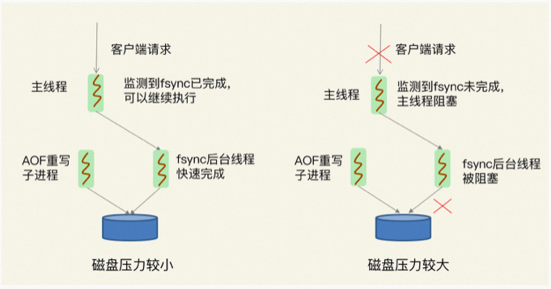

# 京东内部Redis性能优化最佳实践

**<font style="color:rgb(51, 51, 51);">本次分享内容</font>**

<font style="color:rgb(51, 51, 51);">一、Redis性能问题定位</font>

<font style="color:rgb(51, 51, 51);">二、Redis如何优化(基准测试、Bigkey、集中过期、fork优化、内存大页、AOF优化)</font>

<font style="color:rgb(51, 51, 51);">三、总结</font>


# <font style="color:rgb(51, 51, 51);">一、Redis性能问题定位</font>
## <font style="color:rgb(51, 51, 51);">Redis 真的变慢了吗？</font>
<font style="color:rgb(51, 51, 51);">对 Redis 进行基准性能测试</font>

<font style="color:rgb(51, 51, 51);">例如，我的机器配置比较低，当延迟为 2ms 时，我就认为 Redis 变慢了，但是如果你的硬件配置比较高，那么在你的运行环境下，可能延迟是 0.5ms 时就可以认为 Redis 变慢了。</font>

<font style="color:rgb(51, 51, 51);">所以，你只有了解了你的 Redis 在生产环境服务器上的基准性能，才能进一步评估，当其延迟达到什么程度时，才认为 Redis 确实变慢了。</font>

<font style="color:rgb(51, 51, 51);">为了避免业务服务器到 Redis 服务器之间的网络延迟，你需要直接在 Redis 服务器上测试实例的响应延迟情况。执行以下命令，就可以测试出这个实例 60 秒内的最大响应延迟：</font>

```shell
redis-cli --intrinsic-latency 120
Max latency so far: 17 microseconds.
Max latency so far: 44 microseconds.
Max latency so far: 94 microseconds.
Max latency so far: 110 microseconds.
Max latency so far: 119 microseconds.
36481658 total runs (avg latency: 3.2893 microseconds / 3289.32 nanoseconds per run).
Worst run took 36x longer than the average latency.
```

<font style="color:rgb(51, 51, 51);">从输出结果可以看到，这 60 秒内的最大响应延迟为 119 微秒（0.119 毫秒）。你还可以使用以下命令，查看一段时间内 Redis 的最小、最大、平均访问延迟</font>

```powershell
redis-cli -h 127.0.0.1 -p 6379 --latency-history -i 1
min: 0, max: 1, avg: 0.13 (100 samples) -- 1.01 seconds range
min: 0, max: 1, avg: 0.12 (99 samples) -- 1.01 seconds range
min: 0, max: 1, avg: 0.13 (99 samples) -- 1.01 seconds range
min: 0, max: 1, avg: 0.10 (99 samples) -- 1.01 seconds range
min: 0, max: 1, avg: 0.13 (98 samples) -- 1.00 seconds range
min: 0, max: 1, avg: 0.08 (99 samples) -- 1.01 seconds range
```

<font style="color:rgb(51, 51, 51);">如果你观察到的 Redis 运行时延迟是其基线性能的 2 倍及以上，就可以认定 Redis 变慢了。 </font>

<font style="color:rgb(51, 51, 51);">网络对 Redis 性能的影响，一个简单的方法是用 iPerf 这样的工具测试网络极限带宽。</font>

```shell
服务器端
iperf -s -p 12345 -i 1 -M
#iperf: option requires an argument -- M
------------------------------------------------------------
Server listening on TCP port 12345
TCP window size: 4.00 MByte (default)
------------------------------------------------------------
[  4] local 172.20.0.113 port 12345 connected with 172.20.0.114 port 56796
[ ID] Interval       Transfer     Bandwidth
[  4]  0.0- 1.0 sec   614 MBytes  5.15 Gbits/sec
[  4]  1.0- 2.0 sec   622 MBytes  5.21 Gbits/sec
[  4]  2.0- 3.0 sec   647 MBytes  5.42 Gbits/sec
[  4]  3.0- 4.0 sec   644 MBytes  5.40 Gbits/sec
[  4]  4.0- 5.0 sec   651 MBytes  5.46 Gbits/sec
[  4]  5.0- 6.0 sec   652 MBytes  5.47 Gbits/sec
[  4]  6.0- 7.0 sec   669 MBytes  5.61 Gbits/sec
[  4]  7.0- 8.0 sec   670 MBytes  5.62 Gbits/sec
[  4]  8.0- 9.0 sec   667 MBytes  5.59 Gbits/sec
[  4]  9.0-10.0 sec   667 MBytes  5.60 Gbits/sec
[  4]  0.0-10.0 sec  6.35 GBytes  5.45 Gbits/sec
客户端
iperf -c 127.0.0.1 -p 12345 -i 1 -t 10 -w 20K
------------------------------------------------------------
Client connecting to 172.20.0.113, TCP port 12345
TCP window size: 40.0 KByte (WARNING: requested 20.0 KByte)
------------------------------------------------------------
[  3] local 172.20.0.114 port 56796 connected with 172.20.0.113 port 12345
[ ID] Interval       Transfer     Bandwidth
[  3]  0.0- 1.0 sec   614 MBytes  5.15 Gbits/sec
[  3]  1.0- 2.0 sec   622 MBytes  5.21 Gbits/sec
[  3]  2.0- 3.0 sec   646 MBytes  5.42 Gbits/sec
[  3]  3.0- 4.0 sec   644 MBytes  5.40 Gbits/sec
[  3]  4.0- 5.0 sec   651 MBytes  5.46 Gbits/sec
[  3]  5.0- 6.0 sec   652 MBytes  5.47 Gbits/sec
[  3]  6.0- 7.0 sec   669 MBytes  5.61 Gbits/sec
[  3]  7.0- 8.0 sec   670 MBytes  5.62 Gbits/sec
[  3]  8.0- 9.0 sec   667 MBytes  5.59 Gbits/sec
[  3]  9.0-10.0 sec   668 MBytes  5.60 Gbits/sec
[  3]  0.0-10.0 sec  6.35 GBytes  5.45 Gbits/sec
```

## <font style="color:rgb(51, 51, 51);">2. 使用复杂度过高的命令</font>
<font style="color:rgb(51, 51, 51);">首先，第一步，你需要去查看一下 Redis 的慢日志（slowlog）。</font>

<font style="color:rgb(51, 51, 51);">Redis 提供了慢日志命令的统计功能，它记录了有哪些命令在执行时耗时比较久。</font>

<font style="color:rgb(51, 51, 51);">查看 Redis 慢日志之前，你需要设置慢日志的阈值。例如，设置慢日志的阈值为 5 毫秒，并且保留最近 500 条慢日志记录：</font>

```shell
redis-cli -h 127.0.0.1 -p 6379
# 命令执行耗时超过 5 微秒，记录慢日志
CONFIG SET slowlog-log-slower-than 5
# 只保留最近 500 条慢日志
CONFIG SET slowlog-max-len 500
#获取最近的 10 条慢查询命令
redis-cli SLOWLOG GET 10
```

1. <font style="color:rgb(51, 51, 51);">经常使用 O(N) 以上复杂度的命令，例如 SORT、SUNION、ZUNIONSTORE 聚合类命令</font>
2. <font style="color:rgb(51, 51, 51);">使用 O(N) 复杂度的命令，但 N 的值非常大</font>

<font style="color:rgb(51, 51, 51);">第一种情况导致变慢的原因在于，Redis 在操作内存数据时，时间复杂度过高，要花费更多的 CPU 资源。</font>

<font style="color:rgb(51, 51, 51);">第二种情况导致变慢的原因在于，Redis 一次需要返回给客户端的数据过多，更多时间花费在数据协议的组装和网络传输过程中。</font>

<font style="color:rgb(51, 51, 51);">另外，我们还可以从资源使用率层面来分析，如果你的应用程序操作 Redis 的 OPS 不是很大，但 Redis 实例的 </font>**<font style="color:rgb(51, 51, 51);">CPU 使用率却很高</font>**<font style="color:rgb(51, 51, 51);">，那么很有可能是使用了复杂度过高的命令导致的。</font>

## <font style="color:rgb(51, 51, 51);">3. 操作 bigkey</font>
<font style="color:rgb(51, 51, 51);">如果你查询慢日志发现，并不是复杂度过高的命令导致的，而都是 SET / DEL 这种简单命令出现在慢日志中，那么你就要怀疑你的实例是否写入了 bigkey。</font>

```shell
redis-cli -h 127.0.0.1 -p 6379 --bigkeys -i 1
-------- summary -------
Sampled 829675 keys in the keyspace!
Total key length in bytes is 10059825 (avg len 12.13)
Biggest string found 'key:291880' has 10 bytes
Biggest   list found 'mylist:004' has 40 items
Biggest    set found 'myset:2386' has 38 members
Biggest   hash found 'myhash:3574' has 37 fields
Biggest   zset found 'myzset:2704' has 42 members
36313 strings with 363130 bytes (04.38% of keys, avg size 10.00)
787393 lists with 896540 items (94.90% of keys, avg size 1.14)
1994 sets with 40052 members (00.24% of keys, avg size 20.09)
1990 hashs with 39632 fields (00.24% of keys, avg size 19.92)
1985 zsets with 39750 members (00.24% of keys, avg size 20.03)
```

<font style="color:rgb(51, 51, 51);">这里我需要提醒你的是，当执行这个命令时，要注意 2 个问题：</font>

1. <font style="color:rgb(51, 51, 51);">对线上实例进行 bigkey 扫描时，Redis 的 OPS 会突增，为了降低扫描过程中对 Redis 的影响，最好控制一下扫描的频率，指定 -i 参数即可，它表示扫描过程中每次扫描后休息的时间间隔，单位是秒</font>
2. <font style="color:rgb(51, 51, 51);">扫描结果中，对于容器类型（List、Hash、Set、ZSet）的 key，只能扫描出元素最多的 key。但一个 key 的元素多，不一定表示占用内存也多，你还需要根据业务情况，进一步评估内存占用情况。</font>

## <font style="color:rgb(51, 51, 51);">4. 集中过期</font>
<font style="color:rgb(51, 51, 51);">如果你发现，平时在操作 Redis 时，并没有延迟很大的情况发生，但在某个时间点突然出现一波延时，其现象表现为：</font>**<font style="color:rgb(51, 51, 51);">变慢的时间点很有规律，例如某个整点，或者每间隔多久就会发生一波延迟。</font>**

<font style="color:rgb(51, 51, 51);">如果是出现这种情况，那么你需要排查一下，业务代码中是否存在设置大量 key 集中过期的情况。</font>

<font style="color:rgb(51, 51, 51);">如果有大量的 key 在某个固定时间点集中过期，在这个时间点访问 Redis 时，就有可能导致延时变大。</font>

<font style="color:rgb(51, 51, 51);">Redis 的过期数据采用被动过期 + 主动过期两种策略：</font>

1. <font style="color:rgb(51, 51, 51);">被动过期：只有当访问某个 key 时，才判断这个 key 是否已过期，如果已过期，则从实例中删除</font>
2. <font style="color:rgb(51, 51, 51);">主动过期：Redis 内部维护了一个定时任务，默认每隔 100 毫秒（1 秒 10 次）就会从全局的过期哈希表中随机取出 20 个 key，然后删除其中过期的 key，如果过期 key 的比例超过了 25%，则继续重复此过程，直到过期 key 的比例下降到 25% 以下，或者这次任务的执行耗时超过了 25 毫秒，才会退出循环</font>

<font style="color:rgb(51, 51, 51);">注意，</font>**<font style="color:rgb(51, 51, 51);">这个主动过期 key 的定时任务，是在 Redis 主线程中执行的。</font>**

<font style="color:rgb(51, 51, 51);">也就是说如果在执行主动过期的过程中，出现了需要大量删除过期 key 的情况，那么此时应用程序在访问 Redis 时，必须要等待这个过期任务执行结束，Redis 才可以服务这个客户端请求。</font>

<font style="color:rgb(51, 51, 51);">如果此时需要过期删除的是一个 bigkey，那么这个耗时会更久。而且，</font>**<font style="color:rgb(51, 51, 51);">这个操作延迟的命令并不会记录在慢日志中。</font>**

<font style="color:rgb(51, 51, 51);">因为慢日志中</font>**<font style="color:rgb(51, 51, 51);">只记录一个命令真正操作内存数据的耗时</font>**<font style="color:rgb(51, 51, 51);">，而 Redis 主动删除过期 key 的逻辑，是在命令真正执行之前执行的。</font>

## <font style="color:rgb(51, 51, 51);">5. 实例内存达到上限</font>
<font style="color:rgb(51, 51, 51);">当我们把 Redis 当做纯缓存使用时，通常会给这个实例设置一个内存上限 maxmemory，然后设置一个数据淘汰策略。</font>

<font style="color:rgb(51, 51, 51);">当 Redis 内存达到 maxmemory 后，每次写入新的数据之前，</font>**<font style="color:rgb(51, 51, 51);">Redis 必须先从实例中踢出一部分数据，让整个实例的内存维持在 maxmemory 之下</font>**<font style="color:rgb(51, 51, 51);">，然后才能把新数据写进来。</font>

<font style="color:rgb(51, 51, 51);">这个踢出旧数据的逻辑也是需要消耗时间的，而具体耗时的长短，要取决于你配置的淘汰策略：</font>

+ <font style="color:rgb(51, 51, 51);">allkeys-lru：不管 key 是否设置了过期，淘汰最近最少访问的 key</font>
+ **<font style="color:rgb(51, 51, 51);">volatile-lru：只淘汰最近最少访问、并设置了过期时间的 key</font>**
+ <font style="color:rgb(51, 51, 51);">allkeys-random：不管 key 是否设置了过期，随机淘汰 key</font>
+ <font style="color:rgb(51, 51, 51);">volatile-random：只随机淘汰设置了过期时间的 key</font>
+ **<font style="color:rgb(51, 51, 51);">allkeys-ttl：不管 key 是否设置了过期，淘汰即将过期的 key</font>**
+ <font style="color:rgb(51, 51, 51);">noeviction：不淘汰任何 key，实例内存达到 maxmeory 后，再写入新数据直接返回错误</font>
+ <font style="color:rgb(51, 51, 51);">allkeys-lfu：不管 key 是否设置了过期，淘汰访问频率最低的 key（4.0 + 版本支持）</font>
+ <font style="color:rgb(51, 51, 51);">volatile-lfu：只淘汰访问频率最低、并设置了过期时间 key（4.0 + 版本支持）</font>

**<font style="color:rgb(51, 51, 51);">一般最常使用的是 allkeys-lru / volatile-lru 淘汰策略，它们的处理逻辑是，每次从实例中随机取出一批 key（这个数量可配置），然后淘汰一个最少访问的 key，之后把剩下的 key 暂存到一个池子中，继续随机取一批 key，并与之前池子中的 key 比较，再淘汰一个最少访问的 key。以此往复，直到实例内存降到 maxmemory 之下。</font>**

<font style="color:rgb(51, 51, 51);">需要注意的是，Redis 的淘汰数据的逻辑与删除过期 key 的一样，也是在命令真正执行之前执行的，也就是说它也会增加我们操作 Redis 的延迟，而且，写 OPS 越高，延迟也会越明显。</font>


<font style="color:rgb(51, 51, 51);">如果此时你的 Redis 实例中还存储了 bigkey，那么</font>**<font style="color:rgb(51, 51, 51);">在淘汰删除 bigkey 释放内存时，也会耗时比较久。</font>**

## <font style="color:rgb(51, 51, 51);">6.fork 耗时严重</font>
<font style="color:rgb(51, 51, 51);">当 Redis 开启了后台 RDB 和 AOF rewrite 后，在执行时，它们都需要主进程创建出一个子进程进行数据的持久化。</font>

<font style="color:rgb(51, 51, 51);">主进程创建子进程，会调用操作系统提供的 fork 函数。</font>

<font style="color:rgb(51, 51, 51);">而 fork 在执行过程中，</font>**<font style="color:rgb(51, 51, 51);">主进程需要拷贝自己的内存页表给子进程</font>**<font style="color:rgb(51, 51, 51);">，如果这个实例很大，那么这个拷贝的过程也会比较耗时。</font>

<font style="color:rgb(51, 51, 51);">而且这个 fork 过程会消耗大量的 CPU 资源，在完成 fork 之前，整个 Redis 实例会被阻塞住，无法处理任何客户端请求。</font>

<font style="color:rgb(51, 51, 51);">如果此时你的 CPU 资源本来就很紧张，那么 fork 的耗时会更长，甚至达到秒级，这会严重影响 Redis 的性能。</font>

<font style="color:rgb(51, 51, 51);">那如何确认确实是因为 fork 耗时导致的 Redis 延迟变大呢？</font>

<font style="color:rgb(51, 51, 51);">你可以在 Redis 上执行 INFO 命令，查看 latest_fork_usec 项，单位微秒。</font>

```shell
##上一次 fork 耗时，单位微秒
latest_fork_usec:59477
```

<font style="color:rgb(51, 51, 51);">这个时间就是主进程在 fork 子进程期间，整个实例阻塞无法处理客户端请求的时间。</font>

<font style="color:rgb(51, 51, 51);">如果你发现这个耗时很久，就要警惕起来了，这意味在这期间，你的整个 Redis 实例都处于不可用的状态。</font>

<font style="color:rgb(51, 51, 51);">除了数据持久化会生成 RDB 之外，当主从节点第一次建立数据同步时，主节点也创建子进程生成 RDB，然后发给从节点进行一次全量同步，所以，这个过程也会对 Redis 产生性能影响。</font>


## <font style="color:rgb(51, 51, 51);">7. 开启内存大页</font>
<font style="color:rgb(51, 51, 51);">除了上面讲到的子进程 RDB 和 AOF rewrite 期间，fork 耗时导致的延时变大之外，这里还有一个方面也会导致性能问题，这就是操作系统是否开启了</font>**<font style="color:rgb(51, 51, 51);">内存大页机制</font>**<font style="color:rgb(51, 51, 51);">。</font>

<font style="color:rgb(51, 51, 51);">什么是内存大页？</font>

<font style="color:rgb(51, 51, 51);">我们都知道，应用程序向操作系统申请内存时，是按</font>**<font style="color:rgb(51, 51, 51);">内存页</font>**<font style="color:rgb(51, 51, 51);">进行申请的，而常规的内存页大小是 4KB。</font>

<font style="color:rgb(51, 51, 51);">Linux 内核从 2.6.38 开始，支持了</font>**<font style="color:rgb(51, 51, 51);">内存大页机制</font>**<font style="color:rgb(51, 51, 51);">，该机制允许应用程序以 2MB 大小为单位，向操作系统申请内存。</font>

<font style="color:rgb(51, 51, 51);">应用程序每次向操作系统申请的内存单位变大了，但这也意味着申请内存的耗时变长。</font>

**<font style="color:rgb(51, 51, 51);">这对 Redis 会有什么影响呢？</font>**

<font style="color:rgb(51, 51, 51);">当 Redis 在执行后台 RDB，采用 fork 子进程的方式来处理。但主进程 fork 子进程后，此时的</font>**<font style="color:rgb(51, 51, 51);">主进程依旧是可以接收写请求的</font>**<font style="color:rgb(51, 51, 51);">，而进来的写请求，会采用 Copy On Write（写时复制）的方式操作内存数据。</font>

<font style="color:rgb(51, 51, 51);">也就是说，主进程一旦有数据需要修改，Redis 并不会直接修改现有内存中的数据，而是</font>**<font style="color:rgb(51, 51, 51);">先将这块内存数据拷贝出来，再修改这块新内存的数据</font>**<font style="color:rgb(51, 51, 51);">，这就是所谓的「写时复制」。</font>

<font style="color:rgb(51, 51, 51);">写时复制你也可以理解成，谁需要发生写操作，谁就需要先拷贝，再修改。</font>

<font style="color:rgb(51, 51, 51);">这样做的好处是，父进程有任何写操作，并不会影响子进程的数据持久化（子进程只持久化 fork 这一瞬间整个实例中的所有数据即可，不关心新的数据变更，因为子进程只需要一份内存快照，然后持久化到磁盘上）。</font>

<font style="color:rgb(51, 51, 51);">但是请注意，主进程在拷贝内存数据时，这个阶段就涉及到新内存的申请，如果此时操作系统开启了内存大页，那么在此期间，客户端即便只修改 10B 的数据，</font>**<font style="color:rgb(51, 51, 51);">Redis 在申请内存时也会以 2MB 为单位向操作系统申请，申请内存的耗时变长，进而导致每个写请求的延迟增加，影响到 Redis 性能。</font>**

<font style="color:rgb(51, 51, 51);">同样地，如果这个写请求操作的是一个 bigkey，那主进程在拷贝这个 bigkey 内存块时，一次申请的内存会更大，时间也会更久。可见，bigkey 在这里又一次影响到了性能。</font>

## <font style="color:rgb(51, 51, 51);">8. 开启 AOF</font>
<font style="color:rgb(51, 51, 51);">前面我们分析了 RDB 和 AOF rewrite 对 Redis 性能的影响，主要关注点在 fork 上。</font>

<font style="color:rgb(51, 51, 51);">其实，关于数据持久化方面，还有影响 Redis 性能的因素，这次我们重点来看 AOF 数据持久化。</font>

<font style="color:rgb(51, 51, 51);">如果你的 AOF 配置不合理，还是有可能会导致性能问题。</font>

<font style="color:rgb(51, 51, 51);">当 Redis 开启 AOF 后，其工作原理如下：</font>

**<font style="color:rgb(51, 51, 51);">1.Redis 执行写命令后，把这个命令写入到 AOF 文件内存中（write 系统调用）</font>**

**<font style="color:rgb(51, 51, 51);">2.Redis 根据配置的 AOF 刷盘策略，把 AOF 内存数据刷到磁盘上（fsync 系统调用）</font>**

<font style="color:rgb(51, 51, 51);">为了保证 AOF 文件数据的安全性，Redis 提供了 3 种刷盘机制：</font>

<font style="color:rgb(51, 51, 51);">1.appendfsync always：主线程每次执行写操作后立即刷盘，此方案会占用比较大的磁盘 IO 资源，但数据安全性最高</font>

<font style="color:rgb(51, 51, 51);">2.appendfsync no：主线程每次写操作只写内存就返回，内存数据什么时候刷到磁盘，交由操作系统决定，此方案对性能影响最小，但数据安全性也最低，Redis 宕机时丢失的数据取决于操作系统刷盘时机</font>

<font style="color:rgb(51, 51, 51);">3.appendfsync everysec：主线程每次写操作只写内存就返回，然后由后台线程每隔 1 秒执行一次刷盘操作（触发 fsync 系统调用），此方案对性能影响相对较小，但当 Redis 宕机时会丢失 1 秒的数据</font>

<font style="color:rgb(51, 51, 51);">看到这里，我猜你肯定和大多数人的想法一样，选比较折中的方案 appendfsync everysec 就没问题了吧？</font>

<font style="color:rgb(51, 51, 51);">这个方案优势在于，Redis 主线程写完内存后就返回，具体的刷盘操作是放到后台线程中执行的，后台线程每隔 1 秒把内存中的数据刷到磁盘中。</font>

<font style="color:rgb(51, 51, 51);">这种方案既兼顾了性能，又尽可能地保证了数据安全，是不是觉得很完美？</font>

**<font style="color:rgb(51, 51, 51);">但是，这里我要给你泼一盆冷水了，采用这种方案你也要警惕一下，因为这种方案还是存在导致 Redis 延迟变大的情况发生，甚至会阻塞整个 Redis。</font>**

<font style="color:rgb(51, 51, 51);">你试想这样一种情况：当 Redis 后台线程在执行 AOF 文件刷盘时，如果此时磁盘的 IO 负载很高，那这个后台线程在执行刷盘操作（fsync 系统调用）时就会被阻塞住。</font>

<font style="color:rgb(51, 51, 51);">此时的主线程依旧会接收写请求，紧接着，主线程又需要把数据写到文件内存中（write 系统调用），当主线程使用后台子线程执行了一次 fsync，需要再次把新接收的操作记录写回磁盘时，如果主线程发现上一次的 fsync 还没有执行完，那么它就会阻塞。所以，如果后台子线程执行的 fsync 频繁阻塞的话（比如 AOF 重写占用了大量的磁盘 IO 带宽），主线程也会阻塞，导致 Redis 性能变慢。</font>



<font style="color:rgb(51, 51, 51);">看到了么？在这个过程中，主线程依旧有阻塞的风险。</font>

<font style="color:rgb(51, 51, 51);">所以，尽管你的 AOF 配置为 appendfsync everysec，也不能掉以轻心，要警惕磁盘压力过大导致的 Redis 有性能问题。</font>

<font style="color:rgb(51, 51, 51);">那什么情况下会导致磁盘 IO 负载过大？以及如何解决这个问题呢？</font>

<font style="color:rgb(51, 51, 51);">我总结了以下几种情况，你可以参考进行问题排查：</font>

**<font style="color:rgb(51, 51, 51);">1. 子进程正在执行 AOF rewrite，这个过程会占用大量的磁盘 IO 资源</font>**

**<font style="color:rgb(51, 51, 51);">2. 有其他应用程序在执行大量的写文件操作，也会占用磁盘 IO 资源</font>**

**<font style="color:rgb(51, 51, 51);">对于情况 1，说白了就是，Redis 的 AOF 后台子线程刷盘操作，撞上了子进程 AOF rewrite！</font>**


# <font style="color:rgb(51, 51, 51);">二、Redis 如何优化</font>
## <font style="color:rgb(51, 51, 51);">1. 慢查询优化</font>
1. <font style="color:rgb(51, 51, 51);">尽量不使用 O(N) 以上复杂度过高的命令，对于数据的聚合操作，放在客户端做</font>
2. <font style="color:rgb(51, 51, 51);">执行 O(N) 命令，保证 N 尽量的小（推荐 N <= 300），每次获取尽量少的数据，让 Redis 可以及时处理返回</font>

## <font style="color:rgb(51, 51, 51);">2. 集中过期优化</font>
<font style="color:rgb(51, 51, 51);">一般有两种方案来规避这个问题：</font>

1. <font style="color:rgb(51, 51, 51);">集中过期 key 增加一个随机过期时间，把集中过期的时间打散，降低 Redis 清理过期 key 的压力</font>
2. <font style="color:rgb(51, 51, 51);">如果你使用的 Redis 是 4.0 以上版本，可以开启 lazy-free 机制，当删除过期 key 时，把释放内存的操作放到后台线程中执行，避免阻塞主线程。</font>

<font style="color:rgb(51, 51, 51);">第一种方案，在设置 key 的过期时间时，增加一个随机时间，伪代码可以这么写：</font>

```shell
# 在过期时间点之后的 5 分钟内随机过期掉
redis.expireat(key, expire_time + random(300))
```

<font style="color:rgb(51, 51, 51);">第二种方案，Redis 4.0 以上版本，开启 lazy-free 机制：</font>

```shell
# 释放过期 key 的内存，放到后台线程执行
lazyfree-lazy-expire yes
```

**<font style="color:rgb(51, 51, 51);">运维层面，你需要把 Redis 的各项运行状态数据监控起来，在 Redis 上执行 INFO 命令就可以拿到这个实例所有的运行状态数据。</font>**

**<font style="color:rgb(51, 51, 51);">在这里我们需要重点关注 expired_keys 这一项，它代表整个实例到目前为止，累计删除过期 key 的数量。</font>**

**<font style="color:rgb(51, 51, 51);">你需要把这个指标监控起来，当这个指标在很短时间内出现了突增，需要及时报警出来，然后与业务应用报慢的时间点进行对比分析，确认时间是否一致，如果一致，则可以确认确实是因为集中过期 key 导致的延迟变大。</font>**

## <font style="color:rgb(51, 51, 51);">3. 实例内存达到上限优化</font>
1. <font style="color:rgb(51, 51, 51);">避免存储 bigkey，降低释放内存的耗时</font>
2. <font style="color:rgb(51, 51, 51);">淘汰策略改为随机淘汰，随机淘汰比 LRU 要快很多（视业务情况调整）</font>
3. <font style="color:rgb(51, 51, 51);">拆分实例，把淘汰 key 的压力分摊到多个实例上</font>
4. <font style="color:rgb(51, 51, 51);">如果使用的是 Redis 4.0 以上版本，开启 layz-free 机制，把淘汰 key 释放内存的操作放到后台线程中执行（配置 lazyfree-lazy-eviction = yes）</font>

## <font style="color:rgb(51, 51, 51);">4.fork 耗时严重优化</font>
1. <font style="color:rgb(51, 51, 51);">控制 Redis 实例的内存：尽量在 10G 以下，执行 fork 的耗时与实例大小有关，实例越大，耗时越久。</font>
2. <font style="color:rgb(51, 51, 51);">合理配置数据持久化策略：在 slave 节点执行 RDB 备份，推荐在低峰期执行，而对于丢失数据不敏感的业务（例如把 Redis 当做纯缓存使用），可以关闭 AOF 和 AOF rewrite。</font>
3. <font style="color:rgb(51, 51, 51);">Redis 实例不要部署在虚拟机上：</font>**<font style="color:rgb(51, 51, 51);">fork 的耗时也与系统也有关，虚拟机比物理机耗时更久。</font>**
4. <font style="color:rgb(51, 51, 51);">降低主从库全量同步的概率：适当调大 repl-backlog-size 参数，避免主从全量同步。这个缓冲区的大小默认为1MB，如果实例写入量比较大，可以针对性调大此配置。</font>

## <font style="color:rgb(51, 51, 51);">5. 内存大页</font>
<font style="color:rgb(51, 51, 51);">如果采用了内存大页，那么，即使客户端请求只修改 100B 的数据，Redis 也需要拷贝 2MB 的大页。相反，如果是常规内存页机制，只用拷贝 4KB。两者相比，你可以看到，当客户端请求修改或新写入数据较多时，内存大页机制将导致大量的拷贝，这就会影响 Redis 正常的访存操作，最终导致性能变慢。</font>

<font style="color:rgb(51, 51, 51);">首先，我们要先排查下内存大页。方法是：在 Redis 实例运行的机器上执行如下命令:</font>

```shell
$ cat /sys/kernel/mm/transparent_hugepage/enabled
[always] madvise never
```

<font style="color:rgb(51, 51, 51);">如果执行结果是 always，就表明内存大页机制被启动了；如果是 never，就表示，内存大页机制被禁止。</font>

**<font style="color:rgb(51, 51, 51);">在实际生产环境中部署时，我建议你不要使用内存大页机制</font>**<font style="color:rgb(51, 51, 51);">，操作也很简单，只需要执行下面的命令就可以了：</font>

```shell
echo never /sys/kernel/mm/transparent_hugepage/enabled
```

<font style="color:rgb(51, 51, 51);">其实，操作系统提供的内存大页机制，其优势是，可以在一定程序上降低应用程序申请内存的次数。</font>

<font style="color:rgb(51, 51, 51);">但是对于 Redis 这种对性能和延迟极其敏感的数据库来说，我们希望 Redis 在每次申请内存时，耗时尽量短，所以我不建议你在 Redis 机器上开启这个机制。</font>

## <font style="color:rgb(51, 51, 51);">6.AOF 优化</font>
<font style="color:rgb(51, 51, 51);">Redis 提供了一个配置项，当子进程在 AOF rewrite 期间，可以让后台子线程不执行刷盘（不触发 fsync 系统调用）操作。</font>

<font style="color:rgb(51, 51, 51);">这相当于在 AOF rewrite 期间，临时把 appendfsync 设置为了 none，配置如下：</font>

```shell
# AOF rewrite 期间，AOF 后台子线程不进行刷盘操作
# 相当于在这期间，临时把 appendfsync 设置为了 none
no-appendfsync-on-rewrite yes
```

<font style="color:rgb(51, 51, 51);">当然，开启这个配置项，在 AOF rewrite 期间，如果实例发生宕机，那么此时会丢失更多的数据，性能和数据安全性，你需要权衡后进行选择。</font>

<font style="color:rgb(51, 51, 51);">如果占用磁盘资源的是其他应用程序，那就比较简单了，你需要定位到是哪个应用程序在大量写磁盘，然后把这个应用程序迁移到其他机器上执行就好了，避免对 Redis 产生影响。</font>

<font style="color:rgb(51, 51, 51);">当然，如果你对 Redis 的性能和数据安全都有很高的要求，</font>**<font style="color:rgb(51, 51, 51);">那么建议从硬件层面来优化，更换为 SSD 磁盘，提高磁盘的 IO 能力，保证 AOF 期间有充足的磁盘资源可以使用。同时尽可能让 Redis 运行在独立的机器上。</font>**


# <font style="color:rgb(51, 51, 51);">三、Redis性能优化总结</font>
<font style="color:rgb(51, 51, 51);">1、获取 Redis 实例在当前环境下的基线性能。</font>

<font style="color:rgb(51, 51, 51);">2、是否用了慢查询命令？如果是的话，就使用其他命令替代慢查询命令，或者把聚合计算命令放在客户端做。</font>

<font style="color:rgb(51, 51, 51);">3、是否对过期 key 设置了相同的过期时间？对于批量删除的 key，可以在每个 key 的过期时间上加一个随机数，避免同时删除。</font>

<font style="color:rgb(51, 51, 51);">4、是否存在 bigkey？对于 bigkey 的删除操作，如果你的 Redis 是 4.0 及以上的版本，可以直接利用异步线程机制减少主线程阻塞；如果是 Redis 4.0 以前的版本，可以使用 SCAN 命令迭代删除；对于 bigkey 的集合查询和聚合操作，可以使用 SCAN 命令在客户端完成。</font>

<font style="color:rgb(51, 51, 51);">5、Redis AOF 配置级别是什么？业务层面是否的确需要这一可靠性级别？如果我们需要高性能，同时也允许数据丢失，可以将配置项 no-appendfsync-on-rewrite 设置为 yes，避免 AOF 重写和 fsync 竞争磁盘 IO 资源，导致 Redis 延迟增加。当然， 如果既需要高性能又需要高可靠性，最好使用高速固态盘作为 AOF 日志的写入盘。</font>

<font style="color:rgb(51, 51, 51);">6、在 Redis 实例的运行环境中，是否启用了透明大页机制？如果是的话，直接关闭内存大页机制就行了。</font>

<font style="color:rgb(51, 51, 51);">7、是否运行了 Redis 主从集群？如果是的话，把主库实例的数据量大小控制在 2~4GB，以免主从复制时，从库因加载大的 RDB 文件而阻塞。</font>

<font style="color:rgb(51, 51, 51);"></font>


> 更新: 2024-07-15 22:21:19  
> 原文: <https://www.yuque.com/tulingzhouyu/db22bv/eifq47zi2cvfbgk3>