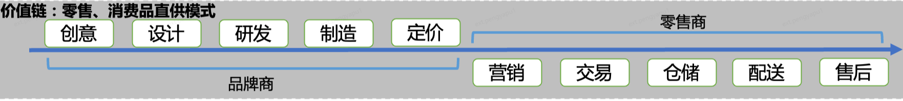
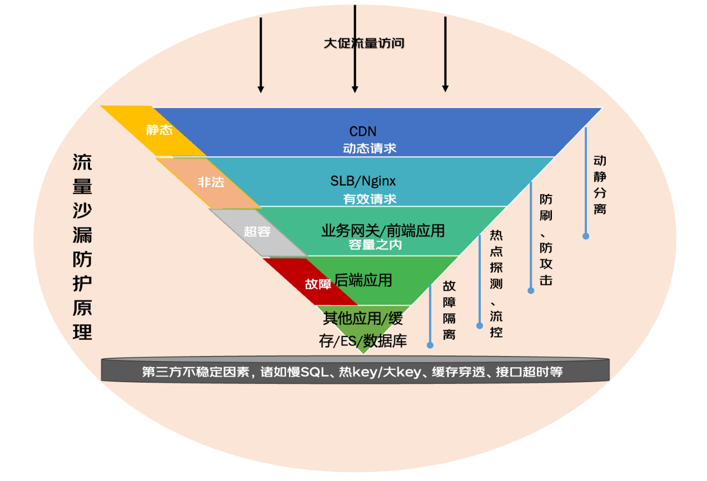
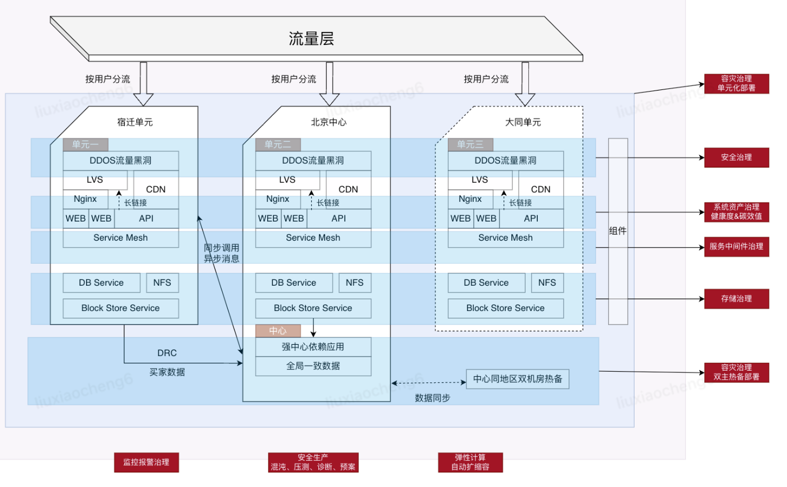

# 京东电商大促高可用保障实践

:::info
**分享内容**

1. 【知历史】电商大促的简介
2. 【清家底】电商平台的商业模式与系统
3. 【明目标】大促备战目标
4. 【定战略】大促整体备战思路
5. 【做战术】大促整体备战工作
6. 【促成长】其他

:::

### 一、【知历史】电商大促的简介
#### 1.1、什么是电商大促
电商大促是电商平台组织的一种大型销售推广活动，目的是通过提供各种优惠、折扣等方法，提高商品销售额和网站流量，增加消费者的购物欲望，以实现销售目标。电商大促活动通常会在一些特定的节点或者节日举行，比如 “11.11”、“618”、“黑色星期五” 等，这些时期的电商大促极具吸引力，既有大量的商品打折优惠，又有丰富多样的活动供消费者参与，是电商平台提升销售业绩的重要手段。 电商大促活动期间，大家可以购买到平时心仪已久的商品，并且价格通常会远低于平时，而电商平台也会通过活动吸引更多的消费者流量和购买力，进一步提升其在电商行业的影响力。**电商大促不仅仅是一种营销方式，也是电商平台和消费者互动、提高用户粘性的有效方式。**

#### 1.2、典型的电商大促活动简介
**618 大促：** 每年 6 月是京东的店庆月，也是京东的电商促销主战场，在店庆月京东都会推出一系列的大型促销活动，从 6 月 1 日延续至 6 月 18 日（近几年开始从 5.20 日左右开启预售模式，但是整体时间依然是以 6 月 1 日开门红为准）。从 2010 年开始，以满减、优惠券等活动的方式，通过单品类、跨店铺等方式逐步蔓延到 23 年的百亿补贴，历时已经 13 年之久为整个京东零售平台的 GMV 营收带来不小的贡献。

**11.11:** 11.11 是指各网络购物平台在每年 11 月 11 日的大型促销活动，最早起源于中国阿里巴巴旗下购物网站在 2009 年 11 月 11 日举办的 “淘宝商城促销日”，现已演变成全行业一年一度的购物活动，及影响全球零售业的消费现象。2012 年 11 月 11 日网络购物全日销售额超过美国网路星期一，成为全球最大的互联网的购物节日。（备注：淘宝商城项目刚独立，后更名为天猫，该营销活动主打品牌商的商品，是想要模仿美国感恩节大促销这种活动，通过一个活动或一个事件，让消费者记住淘宝商城）。（参考维基百科）

**黑色星期五：** Black Friday 最早于 2005 年美国网络 shop.org 创造的购物节日，与 11.11 被电商炒成购物节原因相似。与之相对应的还有兴起于法国、葡萄牙与德国的 Cyber Monday。关于黑色星期五这一叫法的起源，较普遍的一种认为看法是，由于这一天是感恩节（11 月第四个星期四）后开业的第一天。再加上人们通常由此开始圣诞节大采购，很多商店都会顾客盈门从而有大额进帐。传统上商家会用不同颜色的墨水来记账：红色表示亏损即赤字；反之黑色则为有盈利。商家把这个星期五叫做黑色星期五，用以期待这一天过后，年度营收由负转正，由红字转为黑字。而商店的员工则使用黑色星期五这一名字来自嘲，表示这一天会非常忙碌。黑色星期五这一天一般都会是一个大的采购狂潮，销售额是一年中第二或第三高的一天，而通常一年中销售额最高潮是圣诞节前夜或之前的一个星期六。（参考维基百科）

除上述比较大型的电商促销活动外，其他零售电商平台比如苏宁 818、国美 418，以及其他电商平台也在自己造节日，而近几年的拼多多、抖音、快手等电商平台更多的是借势 11.11 或者 618 来提升整个电商平台的 GMV 交易额。

### 二、【清家底】电商平台的商业模式与系统
#### 2.1、电商平台的商业模式
经过上面电商大促简介，大家心里已经有一个简单的电商大促活动认识，对于电商行业从业者，电商大促活动是基本的知识，近几年随着 “新零售”、“无界零售”、“全渠道” 等新词的频出，给原本电商大促活动增加了更多的业务复杂性。这也是为什么会在这里提下系统分类的原因。在整个零售业链路的节点上，刘总曾经提到过 “十节甘蔗” 理论，而我们致力于做的事是后 5 节甘蔗的内容，大家知道**京东是以自建仓储物流打通供应链为核心驱动力**，而淘宝天猫平台更多是聚集在平台交易环节通过营销和兼并购买生态产品带动流量增长为核心驱动力（近几年阿里也开始布局菜鸟平台开始衍生至其他节甘蔗）；拼多多商业模式更侧重于不同的营销模式，所以系统也聚焦在营销、交易侧，采用第三方商家和物流配送体系；抖音、快手直播电商本身是在构建一个流量场，从开始京东、淘宝天猫入驻流量场到现在独立发展电商，他们更多是希望搭建的平台场来实现交易额；

通过上面的讲述其实是想要说一件事，如果单纯字面上说电商大促备战是没有意义的，针对不同环节的 "甘蔗", 整个电商大促中重要性不同，**所以电商大促备战中，需要明确自己的系统在整个业务链路中的位置，同时系统提供的核心功能，是否涉及资损、用户体验、阻碍交易行为或者影响公司名誉、品牌、集团战略、营销计划等内容。**

#### 2.2、电商平台下的系统链路划分
基于上述内容，我们可以基于营销、交易、仓储、配送、售后来划分京东零售整个系统的业务链路环节初步划分，从大促活动来看营销是吸引流量、聚集流量、进行流量转化的手段，属于整个大促活动的核心环节；从我们的电商平台大促目的来说，大促活动更多的是希望带来交易订单的达成，促进交易额的提升，所以整个交易链路是真正目标核心链路，属于整个大促活动的最重要环节；从仓储、配送、售后来看更多的是交易后履约服务保障，这里面更多的是给电商平台带来的口碑影响，和用户的长期体验，对于电商平台长期发展来看也是非常重要，但是在电商大促的特定场景下可能相对前置的交易属于次重要核心环节。因为涉及业务知识比较庞大，以下我简要说明下链路作为大家一个参考

营销链路：营销策略方案制定 -> 营销方案采销 / 商家宣讲 -> 营销方案外部市场公关 -> 营销活动创建 -> 营销活动审核 -> 营销活动投放 -> 促销招商 -> 商家报名 -> 商家选品、发品 -> 营销活动商品审核 -> 营销活动、优惠券、商品的投放 & 推荐

交易链路：登陆（网站 / APP / 小程序 / H5）->京东首页（搜索 & 推荐）->商详 ->购物车 ->结算页 ->收银台（支付）->订单 (订单列表 / 订单详情页)-> 资金对账

履约链路：订单拆分、转移、下传、出管 ->POP 商家 (采销 / 供应商) 接单 ->发货、拣货、打包、出库、打印面单 ->分拣、配送、自提 ->确认收货

售后链路：拒收 / 订单取消 / 售后退货、换货、退款 -> 商家审核 / 快速退款 / 纠风判责 -> 暂停修改订单、拦截物流返仓、原路（部分）退款、上门维修、换新单等 -> 财务对账 -> 客户满意度评价

上面提到的链路因为分叉分支很多，比如时效保证、开寄发票、预售先款 / 先货、商品评价、直播空间、店铺评价、客服处理等等内容未涉及，也从侧面想说明如果想要保障整个电商平台的大促稳定，如果不区分重点的话，那么眉毛胡子一把抓是肯定完不成好的效果，所以这一个环节主要想要阐述说明在特定场景下，电商大促更多的是保障重点在哪里。

### 三、【明目标】大促备战目标
**大促备战目标的核心一个点：稳**。在我们工作中，很多有经验的同学会发现，如何去设计一个良好的系统，大概会从如下几个要素考虑：功能性、可用性、性能效率、安全和扩展性，有些场景可能比如秒杀系统更多考虑的是高并发因素。那么在整个大促备战过程中，基于场景不同，所以我们的大促备战目标也不可同述。但是整体的总目标来说，依然维持在可用性，如何保障交易核心链路更稳、更好的支撑用户购买下单，促成交易。

但是事与愿违，往往我们会发现管理者、项目、产品、研发、测试总是会面临同样的一个问题，资源不足，无论是人力、物力或者财力，永远资源不足的问题是我们要解决的一大核心问题。从古至今，上到将军打仗、皇帝恩济百姓，下到企业家创业，资源不足就决定了我们在做决策的时候，需要集中优势力量兵力结合正确的战略方针，攻击目标最薄弱的环节，保障方案正确落地，正所谓蛇打七寸。所以接下来就很明晰我们要做什么？如何做是我们要考虑的重点。

### 四、【定战略】大促整体备战思路
大促备战是一个完整的事件，具备着详细的故事线，这里面延展开说明下，在领域驱动设计的建模过程中有个事件建模其实就非常好的应证了这一个点，如果我们将人类文明的活动想要梳理清楚，其实很多时候会发现越理越乱，所谓的点 - 线 - 面 - 体，其中线是我们更好的中间表述环节。**基于故事线来看的话，那么整体备战思路，我们拆解为事前 - 事中 - 事后来考虑，** 相对而言会比较全面的将大促备战体系针对特定场景下的备战尽可能全面。

#### 4.1、事前：基于现状进行整体提前工作安排
（1）参与部门 / 集团大促启动会，及时获取最新集团备战导向和最新的战略内容，比如京东的三道防线战略。

（2）进行资源盘点梳理，包含人员、应用、上下游依赖、中间件、数据库，本次大促的 SLA 约定，值班上下游群，问题反馈群，大促备战手册等。

（3）针对可以降低发生概率的事项进行改造，比如梳理核心链路，针对链路上的薄弱点进行改造，并对于日志进行改造可以基于不同场景进行日志输出，规范整个大促备战的指南方案。

（4）宣讲仪式增强备战感知，比如基于大促封版需求开始，进行大促意识宣讲，同时完善监控大盘，补充关键日志，报警邮件短信治理，历届大促相关指标同环比数据对照分析数据表等。

（5）宣讲会后日检工作内容，比如成立应急故障虚拟小组，基于历史故障和常见问题形成故障手册，同时制定限流和降级预案等指南手册。

#### 4.2、事中：基于备战情况保持警惕备战状态
(1) 每日邮件指标报表通晒

（2）每日错误日志收集并反馈和解决

（3）每日监控报警根因分析

（4）每日站会同步当天系统应用和人员情况

（5）跟进部门 / 集团大促备战日例会

#### 4.3、事后：基于整个备战结果进行效果复盘
（1）业务目标的达成情况，比如某个营销活动的达成情况，做的好的，待改善的，可以萃取经验的内容。

（2）产研测团队的系统需求保障情况，比如大促前期和中间上线的需求，上线情况和需求收益达成情况。

（3）系统应用的指标、资源成本、人力成本投入情况，比如每年大促备战基于成熟化的工作流程、工具等内容，在业务变化不大的情况下，成本投入应该逐年下降等。

（4）备战沉淀的经验形成文档资产，每次大促都是系统历炼的一次非常好的机会，期间形成的文档资产都可以归档方便下次使用。

（5）大促备战中的待办工作内容和事项持续跟踪，很多时候团队部门缺少跟踪事项表，只是记录了时间和人但是持续跟踪的事情没有持续性。

### 五、【做战术】大促整体备战工作
#### 5.1、流量沙漏防护原理介绍
因为上述战略中我们提到的内容比较多，我们这里以系统应用为切入点，开始进行系统评估是否属于良好的应用，如果特征因素中有不满足的我们进行薄弱挖掘，比如大促备战中，其实整个防护工作是以流量沙漏防护原理为核心的，从流量请求开始，CDN、Nginx、业务网关 / 前端应用直到后端应用（包含中后台系统）以及依赖的相关组件和其他应用，其实是在一个整个流量沙漏下，最复杂最核心的也是我们最常讲的就是后端应用故障稳定保障。

#### 5.2、流量沙漏防护原理后端应用考虑因素评估表
基于上述的流量沙漏防护原理我们可以进行如下的考虑因素进行后端应用评估，挖掘薄弱点。

| **考虑因素** | **特征** | **措施** |
| :--- | :--- | :--- |
| 功能 / 适用性 | 合适原则 | 系统需求的可理解 |
| 性能效率 | 全面性 | 页面、接口、功能加载时间 |
| | 时间性 | RT 响应时间、吞吐量 |
| | 资源利用率 | 内存、磁盘空间、CPU 使用率 |
| | 可扩展性 | 代码、架构设计 |
| 可用性 | 全面性 | 平均无故障时间、平均修复时间、平均故障间隔时间 |
| | 稳定性 | 平均停机时间 |
| | 容错性 | 错误崩溃、代码覆盖率、多机房容灾、冗余备份等 |
| 可维护性 | 全面性 | 应用维护人力投入情况 |
| | 模块化 | 结构清晰、边界清晰 |
| | 可重复使用性 | 代码、功能复用情况 |
| | 可测试性 | 代码覆盖率 |
| | 可分析性 | 复杂性、代码圈复杂度、服务之间交互耦合等 |
| | 可变更性 | 代码大小、变更、代码耦合、服务单一职责等 |
| 成本 | 全面性 | 开发、测试、部署维护 |
| | 基础设施 | 云 / 本地基础设施成本 |

#### 5.3、流量沙漏防护原理的备战重点 & 应用健康度
CDN 动静分离：主要集中在我们的前后端分离场景下，但是据笔者了解因为历史、组织结构调整交接等各种原因依然有很多应用没完整彻底的前后端分离，界面还是以后端维护和编写；但是如果是核心应用的话基本上都完成了前后端分离，所以这块优化相对简单。

网关安全保障：通常我们的网关分为技术网关和业务网关，技术网关更多关注的是安全、鉴权、防刷、防攻击、限流和降级等功能，业务网关更多的是偏 BFF 层的业务接口适配、裁剪等能力。这块我们应该更多面对的是热点流量峰值的不确定性、用户行为的不确定性以及安全攻击等风控行为，需要结合风控团队对于黑产异常流量、异常 IP、Cookie 自动加入黑名单进行限流操作；同时结合大促压测进行压测指标评估，结合大促预期目标对于系统应用有个合理的阈值和水位管控。

后端应用：后端应用类型、功能、服务面向用户不同决定了高可用的保障手段不同，比如后端应用分类可以基于任务类、工具类、支撑业务类、核心业务类等划分；根据其应用分级的定义程度我们进行应用健康纬度的评估，评估基础硬件资源、容器资源、应用资源、监控报警、链路维度等明细情况，进行薄弱环节治理，比如公司平台的应用健康度能够合理的给应用进行画像，便于问题的诊断和定位。

| **类型** | **检测指标** |
| :--- | :--- |
| 基础资源 | 应用跨集群 |
| 应用跨机房 | |
| 应用跨 POD | |
| 应用 POD 分布 | |
| JIMDB POD 分布 | |
| 网络 TCP 重传 | |
| 应用容器 CPU | |
| JIMDB CPU | |
| JMQ CPU | |
| 数据库 CPU | |
| JIMDB 分片拓扑 | |
| JIMDB 分片 POD | |
| 数据库主从 | |
| 数据库机房 | |
| 数据库规格 | |
| JMQ POD | |
| VIP 机房数量 | |
| 后端机房数量 | |
| 错误后端 (ip) | |
| 集群环境一致 | |
| 容器 | 容器存活 |
| 应用模块化 | |
| GIT 分支 | |
| 灰度更新超时 | |
| CPU 利用率 | |
| 内存使用率 | |
| 磁盘繁忙 | |
| 网络流入 | |
| TCP 连接数 | |
| CPU 利用率 | |
| 内存使用率 | |
| Swap 使用率 | |
| 磁盘繁忙 | |
| 磁盘使用率 (根目录) | |
| 磁盘使用率 (export) | |
| 网络连通性 | |
| 网络流入 | |
| 网络流出 | |
| 系统时间偏差 | |
| 应用 | JSF 版本 |
| JMDB 版本 | |
| JMQ2 版本 | |
| JMQ4 版本 | |
| UMP 版本 | |
| DUCC 版本 | |
| LOG4J 版本 | |
| JVM 版本 | |
| Full GC/Young GC | |
| JVM_XMX 最大堆内存 | |
| JVM_XMS 最小堆内存 | |
| JVM_堆外内存 | |
| JVM_ParallelGCThreads | |
| JVM_GCConcGCThreads | |
| JVM_CICompilerCount | |
| JVM_Metaspace | |
| JVM_CMS 回收阈值 | |
| JVM_新生代大小 | |
| JVM_HeapDump | |
| JVM_Server 模式 | |
| JDOS_日志清理 | |
| JSF_Timeout 超时时间 | |
| JSF_跨单元调用 | |
| JSF_跨环境调用 | |
| JSF_跨机房调用 | |
| JSF_重试次数 | |
| 负载均衡 | |
| JSF_限流 | |
| JSF_动态别名 | |
| JSF_设置黑名单 | |
| JSF_同机房部署 | |
| JSF_别名命名规范 | |
| JSF_混合环境部署 | |
| color 网关 timeout | |
| 最大连接数 | |
| 初始连接数 | |
| connectTimeout | |
| SocketTimeout | |
| maxWait | |
| 时区 | |
| JIMDB FAILOVER 状态 | |
| JIMDB 热 KEY | |
| JIMDB 大 KEY | |
| JIMDB 慢日志 | |
| JIMDB 扫描过期频率 | |
| JIMDB 服务端版本一致 | |
| JIMDB 服务端风险版本 | |
| 淘汰策略 | |
| JIMDB_Swap 交换区 | |
| JIMDB_绑核 | |
| JIMDB_CPU 模式 | |
| JIMDB_网卡软中断 | |
| 慢 SQL | |
| 优先治理慢 SQL | |
| 含外键表 | |
| 索引过多表 | |
| 自增溢出表 | |
| 大表 | |
| 接入方式 | |
| 最大线程数 | |
| JIMDB 读超时 | |
| JIMDB 跨单元调用 | |
| JIMDB 连接超时 | |
| JIMDB 等待超时 | |
| JIMKV 连接超时 | |
| JIMKV 读超时 | |
| JMQ_sendTimeout | |
| 空应用 | |
| 纯预发应用 | |
| 单实例应用 | |
| 预发流量过大 | |
| 预发资源过多 | |
| 不活跃预发分组 | |
| 应用_实例存活 | |
| 应用_Port 存活 | |
| 应用_URL 存活 | |
| JSF_Provider 接口存活 | |
| JSF_Consumer 接口存活 | |
| 依赖 JIMDB 集群异常 Server_OPS 次数 | |
| Server_CPU 利用率 | |
| Server_内存使用率 | |
| Server_内存 RSS | |
| Server_网络流入 | |
| Server_网络流出 | |
| Server_连接数 | |
| tp99 异常次数 | |
| 积压 | |
| broker 主机 - 负载 | |
| broker 主机 - 磁盘繁忙 | |
| JED Qps | |
| JED 连接数 | |
| JED 主从延迟 | |
| 监控报警 | CPU 利用率 |
| 负载 | |
| 内存使用率 | |
| Swap 使用率 | |
| 磁盘繁忙 | |
| 磁盘使用率 | |
| 网络连通性 | |
| TCP 连接数 | |
| TCP 重传 | |
| 网络流入 | |
| 网络流出 | |
| 系统时间偏差 | |
| JsfProvider 组件报警 | |
| JimDB 组件报警 | |
| JmqProducer 组件报警 | |
| Mysql 组件报警 | |
| SpringMVC 组件报警 | |
| UMP JVM 监控 | |
| UMP 方法监控 | |
| JVM_CPU 利用率 | |
| JVM_内存使用率 | |
| JVM_线程数 | |
| FULLGC 次数 | |
| YONGGC 次数 | |
| 方法 TP99 | |
| 方法 TP999 | |
| 方法可用率 | |
| 方法 TP99 配置合理性 | |
| 方法 TP999 配置合理性 | |
| 方法可用率配置合理性 | |
| 方法调用次数 | |
| Port 存活 | |
| URL 存活 | |
| OPS 次数 | |
| 连接数 | |
| 内存使用率 | |
| 主从断开 | |
| 主从复制延迟 | |
| 积压 | |
| 重试 | |
| 主从延迟 | |
| Logbook 关键字报警配置 | |
| 链路超时 | 链路超时 |
| 链路超时 JIMDB 组件 | |

其他应用 / 中间件 / 数据库：我们会发现很多时间我们的问题引入集中在三方因素较多，也是在备战中需要关注的重点：

•- 接口定义不合理，业务周知不到位，新上的业务需求直接在某个时刻脉冲流量到达薄弱依赖将服务打挂；

•- 还有部分是因为上下游依赖不稳定，比如遇到性能瓶颈，业务系统强依赖无法作出降级操作，只能静静等待恢复故障；

•- 在机房方面没有容灾，可能因为通信机房网络问题，电缆被挖断或者信号中断等问题导致网络瘫痪故障不可用；

•- 中间件使用策略异常，比如没有做业务幂等性操作、重试策略未控制次数和时间导致依赖的业务系统无法承接脉冲流量从而服务不可用；

•- 还有依赖的中间件和数据库容量水位已到阈值，没有及时扩容，从而引发业务系统的不可用。

•- 应用操作数据库线程阻塞、死锁、慢 SQL 等造成数据库拖垮服务应用

•- 应用操作缓存 / ES 出现热点的商品造成的数据流量不均引发的服务不可用。

•- 应用内存泄漏、JVM 配置不合理等等

通过上述的流量沙漏防护原理是希望帮助大家能够对于大促备战有个整体框架，从而更好的结合三道防线战略，以及考虑因素评估表和应用画像来决策如何治理整改应用不合理的内容，最终形成相对合理的应用架构。

### 六、【促成长】其他
电商大促相对每个人来说都是很好的成长机会，通过大促备战能够让你更好的补齐自身知识的不足，也能更深入的了解所在团队的核心业务，所以建议无论是业务运营、产品、研发、测试人员都可以简单了解下。

如果作为一个大促备战师需要做到胸有成竹，在大促备战前应该充分了解核心链路业务，做好事前工作梳理，能够有着大促指南手册宣导给团队每一个人，做到精兵强将，人人互为备份，将监控报警可视化面板进行大屏展示，及时捕捉和观察业务变动情况。

如果作为一个事业部架构师或者集团架构师，需要有严格*-清晰的备战路线和里程碑，关注的重点事项以及日例会进行事项跟进和同步，因为当人数超过几十人以后，大促备战更多的是管人、管流程，而不是管应用，所以需要责任到部门、到个人，紧抓流程，同时日例会及时信息沟通减少信息变更差。

> 更新: 2024-07-15 22:21:19  
> 原文: <https://www.yuque.com/tulingzhouyu/db22bv/atg78guyg9qh3e3l>