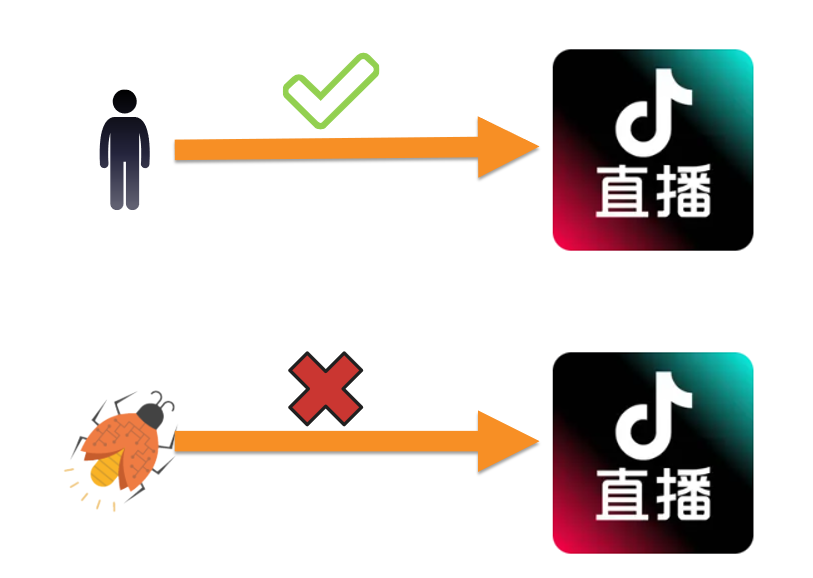
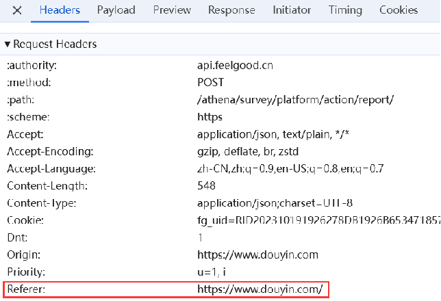

# 你们系统有没有防盗链，怎么做的？

一、什么是盗链

<font style="color:rgba(6, 8, 31, 0.88);">防盗链是指一种保护网络资源的技术，用于防止未经授权的第三方直接引用或盗用服务器上的资源。通过限制非法访问来源（如他人网站或爬虫程序），防盗链确保资源只能被合法、授权的用户正常访问。</font>



+ <font style="color:rgba(6, 8, 31, 0.88);">当用户通过合法渠道（如直接访问网站或应用）请求资源时，服务器会验证来源是可信的，允许访问。 </font>
+ <font style="color:rgba(6, 8, 31, 0.88);">当某些非法来源（如爬虫、恶意程序或其他不被授权的引用）试图盗用资源时，防盗链机制会识别来源不合法，拒绝提供资源。 </font>


## 基于HTTP协议的referer
基于HTTP协议中的 referer做防盗链，可以从网关层或者利用AOP、Filter拦截器实现。



使用Nginx在网关层做防盗链，目前是最简单的方式之一。通过拦截访问资源的请求，valid_referers 关键字定义了白名单，校验请求头中referer地址是否为本站，如不是本站请求，rewrite 转发请求到指定的警告页面。在 server 或者 location 配置模块中加入：valid_referers none blocked，其中 none : 允许没有http_refer的请求访问资源（比如：直接在浏览器输入图片网址）；blocked : 允许不是http://开头的，不带协议的请求访问资源。

```powershell


[root@server1 nginx]# systemctl restart nginx
[root@server1 nginx]# vim conf/nginx.conf
 
 
      location / {
            root /web;
             index index.html;
      }
      location ~* \.(gif|jpg|png|jpeg)$ {
            root /web;
            valid_referers none blocked www.tulingxueyuan.cn;
            if ($invalid_referer){
                return 403;
         }
     }
 
 
     server {
         listen 80;
         server_name www.tulingxueyuan.cn;
         location / {
                 root /bbs;
                 index index.html;
         }
    }

[root@server1 nginx]# systemctl restart nginx
```

 

这种实现可以限制大多数普通的非法请求，但不能限制有目的的请求，因为可以通过伪造referer信息来绕过。另一种是使用Filter拦截器方式。

可以看到，Filter拦截器的实现方式更加简单，拦截指定请求URL，拿到HttpServletRequest 中 referer值比对是否为本站。

```java
public class StaticResourceFilter implements Filter {

    @Override
    public void doFilter(ServletRequest request, ServletResponse response, FilterChain chain)
            throws IOException, ServletException {
        HttpServletRequest httpRequest = (HttpServletRequest) request;
        HttpServletResponse httpResponse = (HttpServletResponse) response;

        // validate Referer
        String referer = httpRequest.getHeader("Referer");
        String allowedDomain = "https://www.tulingxueyuan.cn";
        if (referer == null || !referer.startsWith(allowedDomain)) {
            httpResponse.getWriter().write("403 Forbidden: Hotlinking not allowed");
            return;
        }
                

        chain.doFilter(request, response);
    }
}
```

### 3. Token 验证工具
```java
package com.et.filter;

import javax.servlet.http.HttpServletRequest;
import javax.servlet.http.HttpServletResponse;
import java.io.IOException;

public class TokenValidator {

    public static boolean validateToken(HttpServletRequest request, HttpServletResponse response) throws IOException {
        String token = request.getParameter("token");
        String validToken = "your-predefined-token"; //set your predefined token here

        if (token == null || !token.equals(validToken)) {
            response.getWriter().write("403 Forbidden: Invalid Token");
            return false;
        }

        return true;
    }
}
```

### 4. 时间限制验证工具
```java
package com.et.filter;

import javax.servlet.http.HttpServletRequest;
import javax.servlet.http.HttpServletResponse;
import java.io.IOException;
import java.time.Instant;

public class TimeValidator {

    private static final long ALLOWED_TIME_DIFF = 300; // offset in seconds( 300 seconds)

    public static boolean validateTimestamp(HttpServletRequest request, HttpServletResponse response) throws IOException {
        String timestampStr = request.getParameter("timestamp");

        if (timestampStr == null) {
            response.getWriter().write("403 Forbidden: Missing Timestamp");
            return false;
        }

        try {
            long timestamp = Long.parseLong(timestampStr);
            long currentTimestamp = Instant.now().getEpochSecond();

            if (Math.abs(currentTimestamp - timestamp) > ALLOWED_TIME_DIFF) {
                response.getWriter().write("403 Forbidden: Timestamp Expired");
                return false;
            }
        } catch (NumberFormatException e) {
            response.getWriter().write("403 Forbidden: Invalid Timestamp");
            return false;
        }

        return true;
    }
}
```

<font style="color:rgba(0, 0, 0, 0.9);">  
</font>

 

 


> 更新: 2024-12-18 15:23:18  
> 原文: <https://www.yuque.com/tulingzhouyu/db22bv/zrlk12sphvgnaofw>