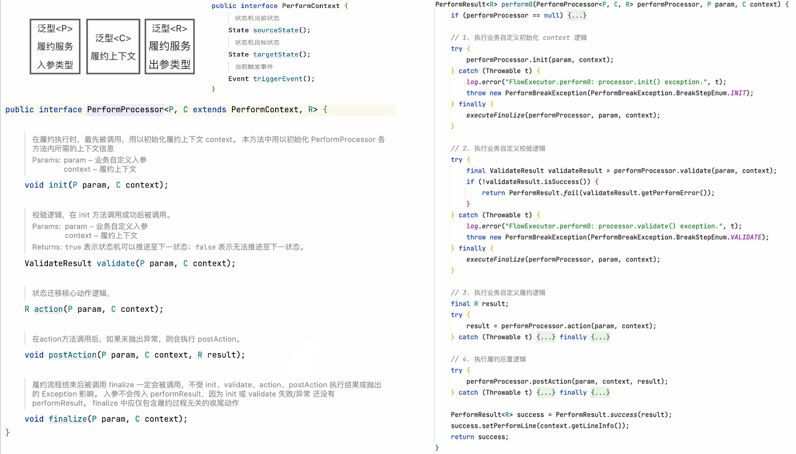

# 咸鱼交易业务状态机方案实践

:::info
**分享内容**

1. 业务背景介绍
2. 主流状态机方案优缺点
3. 咸鱼业务对于状态机方案的要求
4. 咸鱼状态机实现流程
5. 咸鱼状态机整体框架结构
6. 总结

:::

## **业务背景**
### **闲鱼行业产品订单履约**
目前闲鱼行业产品有回收、寄卖、暗拍、验货宝等，**由于行业产品在买家、卖家的基础上引入了服务商角色以及各种玩法、规则，其状态机定义相比于普通的担保交易模型会更加灵活、复杂**。基础的交易模型订单状态只包含： 创建订单 -> 付款 -> 发货 -> 确认收货 。而对于闲鱼行业业务，在中台提供的交易模型之上，附加了诸多行业业务状态，如服务商收货、服务商质检、用户确认质检结果等。 这些业务状态，是通过用户履约操作、服务商履约操作来推进的，而业务状态的维护也需要闲鱼自己来负责。

### **存在问题**
目前，在状态履约的代码逻辑实现上，状态履约方法内使用 IF-ELSE 的结构来判断不同履约动作。在不同的分支里，根据推进节点的不同，存在不同的参数校验、业务执行等等操作。这种原始的实现方式，随着业务的不断发展，逐步暴露出以下问题：

1. 代码接口复杂：目前回收业务推进状态 3 的代码就已经达到上百行，如果把整个状态拓扑的所有履约逻辑都写到一起的话，则整个履约方法将达到上千行，代码内聚高、可读性差。
2. 模板式代码冗余、无复用： 如前置校验、后置消息等。
3. 无整体拓扑视图：回收场景的这一套代码完成后，之后的开发、服务商、测试都不能感知整体的一个拓扑逻辑。现在我们只能使用另外准备的拓扑图去作为解释文档，但代码上是没有能力直接把整个拓扑提取出来的。
4. 可扩展性差：如果要增加状态或者删除状态，或者是增加一条履约的边。那么开发人员都需要去改 if-else。并且开发改起来的时候必须非常的小心谨慎。比如说要加一个状态，那首先需要整体增加一个 else 代码块。另外，在每一个之前 IF-ELSE 分支里面又需要加上判断逻辑，单独处理新加的状态是否可以做迁移等等，所以扩展性是极差的。

此外，横向来看，在行业交易的不同产品下，还存在许多共性需求：

1. 状态拓扑查询：在服务商接入、测试回归等场景，都需要查询当前业务的状态拓扑，以知道当前订单允许推进到那些状态。目前只能依靠另外编写对接文档的方式进行沟通。代码没有直接提取状态的能力，有可能导致了对接文档的滞后性。
2. 状态履约执行：在实际线上履约、对接联调、代码开发、测试回归场景中，都需要执行状态的履约。另外，在不同的场景中，又希望有单独的定制功能，比如：在开发、测试过程中，只能推进测试订单，不能推进实际订单。
3. 履约记录复现：对于一笔订单的状态推进记录可以复现，以帮助技术、运营、客服定位问题。
4. 履约日常监控：对不同的业务，可以统一提供履约结果的监控，业务也可能根据自身需要单独配置监控和报警。

## **解决方案**
### **业界状态机方案调研**
业界几款流行的开源状态机框架 (如 spring-statemachine、 squirrel、smart-engine)，均适用于典型的通过状态机管理系统状态的场景，他们的共性特点是：

1. 通过状态机的定义，表达整个系统状态、控制系统的复杂流转。
2. 提供 xml、或链式调用等方式定义状态机，解决复杂状态机定义可读性差的问题；
3. 每个状态机需要维护一个实例 (对象)；
4. 状态机对象一般是一个单例的、共享的变量，供整个系统访问。状态变换时需要加锁控制并发。

这几款状态机框架通常受管理的对象需要连续的、较长时间的进行跟踪管理，并伴随其完整的生命周期。不适用于订单履约处理，原因是：订单履约方法一般是无状态的，内存不需要对每个处理的订单生成状态机实例。多笔订单对应多个履约请求、多个线程并发调用履约方法。**我们的需求是做一个轻量级的、仅仅用来支持行业交易履约的场景， 开发同学通过简单的 api 就可以定义好拓扑、实现最基础的一两个接口就可以直接运行，监控、日志能力甚至开箱可用。**

### **问题抽象**
针对上节最后提出的问题，我们用抽象的思维，思考在状态流程履约中，哪些是不变的点、哪些是变化的点。 

可以看到，不变的操作有：

+ 状态校验
+ 参数校验
+ 履约执行
+ 后置逻辑

这几个操作，都是每个状态的履约中，可以抽象的操作步骤，是不变的点。每个步骤中的实现细节，是根据不同业务变化的点。那么，我们将不变的流程模板化、将变化的逻辑接口化。

### **状态流程处理**
通过一个 Executor 模板化的执行每个状态履约动作的步骤，如前置判断 (validate)、执行状态动作 (action)、后置动作 (postAction)。对于不同的履约执行动作，抽象出 PerformProcessor 接口，交给业务具体实现。在某个履约流程执行时，Executor 会执行对应的 PerformProcessor。 

### **拓扑抽象**
对于拓扑定义以及状态流处理定义，进行以下抽象： 

### **状态流程处理器**
下面我们来看下状态流程处理器 PerformProcessor。它是一个接口，PerformProcessor 中定义了一下几个方法

+ • init: 初始化流程处理上下文
+ • validate：校验入参
+ • action：执行流程转换动作
+ • postAction：执行后置逻辑
+ • finalize：执行收尾工作 (本方法一定会被执行，无论其他方法是否抛异常)

如上图，Executor 执行器中，会模板化的调用这些方法。

### **拓扑定义**
我们期望定义一个简明易用的 API，来将状态拓扑以及履约处理器串联在一起，完成整个状态机的定义，示意如下： 

### **整体框架结构**
框架包含三层：核心层、胶水层、业务层。核心层提供纯粹的状态机定义、拓扑构造、执行引擎等能力，设计的薄一些，控制架构防腐化；胶水层引入中台订单查询、更新等能力，相对厚一些，简化业务适配成本、优化业务流程。业务层则基于通用的框架接口，面向业务应用，提供表达能力。 

**框架核心层：**聚焦于三个能力：状态拓扑定义、拓扑查询、状态推进。状态拓扑定义对应 FlowBuilder。拓扑查询和状态推进对应核心层的 FlowManager，他会查询 FlowDefination(拓扑定义封装类) 和 调用 FlowExecutor 执行 PerformProcessor。**胶水层**在状态机核心层和业务交互层之间，我们抽取了一层胶水层。目的有两个

1. 抽取胶水层，可以让状态机核心层更纯粹，只关心状态履约的定义、流转逻辑，不耦合业务依赖。核心层将相关的信息定义为泛型，也是这个道理。因为入参、出参、履约上下文不影响状态机的流转逻辑，所以核心使用泛型定义。具体类型由上层实现。另外，胶水层中也可以做一些业务相关的通用动作，如记录状态转换日志等。
2. 可扩展：该层目前使用 TC 的 BizOrder 信息，供闲鱼订单业务使用。但如果需要扩展，可以另行封装其他胶水层，不影响核心层我们看到胶水层声明了上下文泛型为 BizOrderContext， 该对象中包含 TC 的 BizOrderDO、PayOrder 等信息。由于目前闲鱼订单都是依赖中台订单，所以目前回收履约、验货宝履约等都直接使用 BizOrder 胶水层即可。 但如果某个业务实现需要其他领域的 DO，则可以水平扩展胶水层。

**业务层**最上层是业务交互层，在不同的业务域内，提供不同的履约功能，比如回收、验货宝都会单独封装对应的履约服务。主要能力：

    1. 对外提供业务履约、测试工具、机器人联调等能力，可分别做权限校验等逻辑
    2. 对内基于胶水层，进行拓扑查询、状态推进等动作

### **配套设施**
+ 订单推单工具：面向日常开发和测试，业务层基于状态机框架，封装了推单工具。针对一笔订单，可自动获取当前业务状态、可履约动作、自定义入参。
+ 统一日志 & 监控：基于框架收口的履约入口，可以提供跨业务统一的日志格式，进而搭建统一的、开箱可用的履约日志查询和监控。

## **总结**
通过抽象订单状态履约的通用问题，提出一套轻量状态机解决方案。解决了业务灵活多变带来的诸多技术痛点：

1. 通过状态机履约处理器的封装，隔离了每个履约动作的业务逻辑， 解决了接口代码复杂、可读性差的问题；

2. 业务可将通用的业务处理逻辑、校验逻辑等封装在通用的处理器中，使得相同逻辑可复用，解决了代码冗余、难复用的问题；

3. 通过拓扑的抽象，天然的可以获取到业务的整体状态拓扑，对于联调、业务对接等都提供了便利；

4. 如遇需求需要调整状态拓扑，只需修改拓扑定义，即可灵活删除或者新增状态拓扑关系。 

展望：闲鱼行业交易团队，在闲鱼回收、寄卖、验货宝的交易履约底层，已全量采用本状态机引擎，实现了订单状态的统一履约控制、履约日志回溯、监控能力。而后续基于本框架，履约逻辑自动回归、履约异常定位可视化等应用场景都将持续构建。

> 更新: 2024-07-15 22:21:19  
> 原文: <https://www.yuque.com/tulingzhouyu/db22bv/ca3lqckwqpgphkhx>