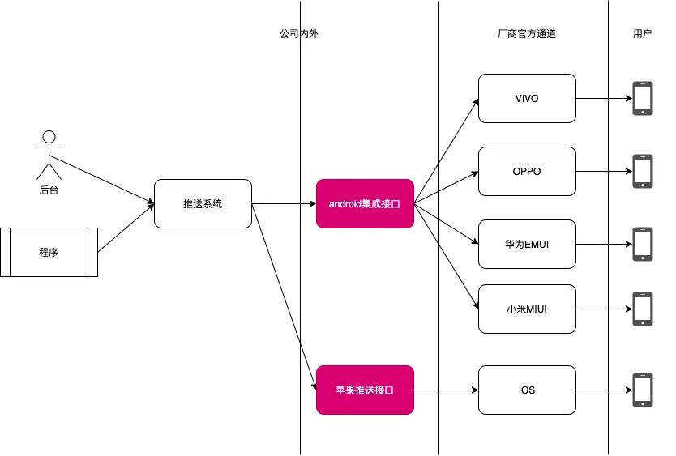
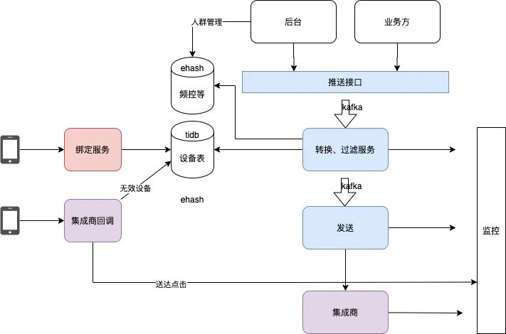
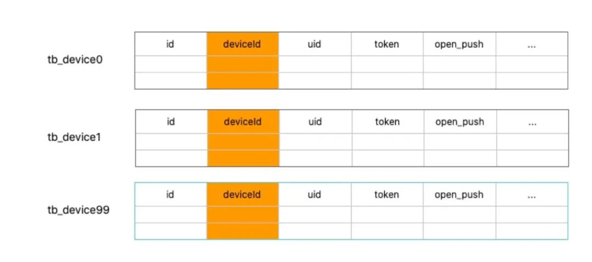
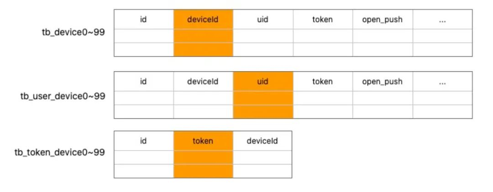
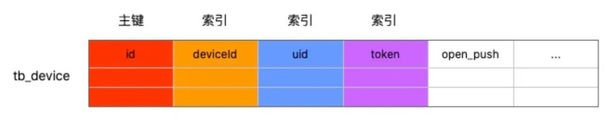
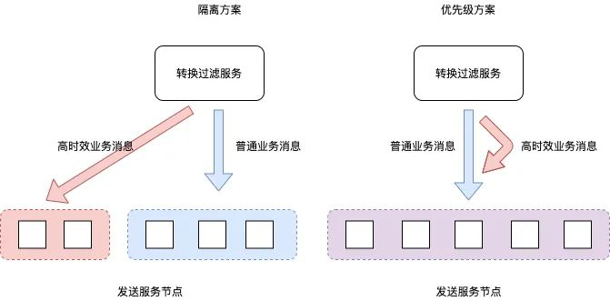
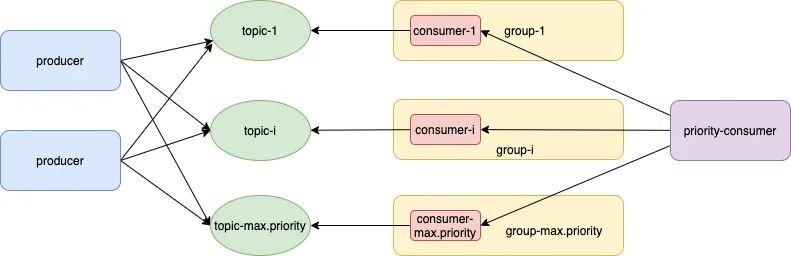

# 喜马拉雅亿级推送系统实践

**本次分享内容**

1. 业务背景和推送系统架构设计
2. 业务过滤机制设计
3. 分库分表下的多维查询问题
4. 特殊业务的时效性问题
5. 过滤机制的存储和性能问题
6. 总结

## <font style="color:rgb(51, 51, 51);">背景介绍</font>


<font style="color:rgb(51, 51, 51);">首先介绍下推送系统的作用，如上图是一个新闻业务的推送 / 通知，推送主要就是在用户不打开 APP 的时候有一个手段触达用户，保持 APP 的存在感，提高 APP 的日活。公司目前主要用推送的业务包括 </font>

1. <font style="color:#DF2A3F;">主播开播</font><font style="color:rgb(51, 51, 51);">，公司有直播业务，主播在开直播的时候会给这个主播的所有粉丝发一个推送开播提醒</font>
2. <font style="color:#DF2A3F;">专辑更新</font><font style="color:rgb(51, 51, 51);">，平台上有非常多的专辑，专辑下面是一系列具体的声音，比如一本儿小说是一个专辑，小说有很多章节，那么当小说更新章节的时候给所有订阅这个专辑的用户发一个更新的提醒。</font>
3. <font style="color:#DF2A3F;">个性化、新闻业务</font><font style="color:rgb(51, 51, 51);">等。</font>

<font style="color:rgb(51, 51, 51);">既然想给一个用户发推送，系统要跟这个用户设备之间有一个联系的通道。自建通道需要 App 常驻后台，而手机厂商因为省电等原因普遍采取 “激进” 的后台进程管理策略，导致自建通道质量较差。目前通道一般是由 “推送服务商” 去维护，也就是说公司内的推送系统并不直接给用户发推送，推送流转流程如下：</font>



<font style="color:rgb(51, 51, 51);">国内的几大厂商 hmov 有自己官方的推送通道，但是每一家接口都不一样，所以一些厂商比如小米、个推提供集成接口。发送时推送系统发给集成商，然后集成商根据具体的设备，发给 hmov 这些具体的厂商，最终发给用户。</font>

<font style="color:rgb(51, 51, 51);">给设备发推送的时候，必须说清楚你要发的是什么内容，即 title、message/body，还要指定给哪个设备发推送。我们以 token 来标识一个设备， 在不同的场景下 token 的含义是不一样的，公司内部一般用 uid 或者 deviceId 标识一个设备，对于集成商、hmov 也有自己对设备的唯一 “编号”，所以公司内部的推送服务，要负责进行 uid、deviceId 到集成商 token 的转换。</font>

## <font style="color:rgb(51, 51, 51);">整体设计</font>
### <font style="color:rgb(51, 51, 51);">技术架构设计</font>


<font style="color:rgb(51, 51, 51);">推送整体上是一个基于队列的流式处理系统，上图右侧是主链路，各个业务方通过推送接口给推送系统发推送，推送接口会把数据发到一个队列，由转换和过滤服务消费。转换就是上文说的 uid/deviceId 到 token 的转换，过滤下文专门讲，转换过滤处理后发给发送模块，最终给到集成商接口。</font>

<font style="color:rgb(51, 51, 51);">App 启动时会向服务端发送绑定请求，上报 uid/deviceId 与 token 的绑定关系。当卸载 / 重装 App 等导致 token 失效时，集成商通过 http 回调告知推送系统。各个组件都会通过 kafka 发送流水到公司的 xstream 实时流处理集群，聚合数据并落盘到 mysql，最终由 grafana 提供各种报表展示。</font>

### <font style="color:rgb(51, 51, 51);">业务过滤机制设计</font>
<font style="color:rgb(51, 51, 51);">各个业务方可以无脑给用户发推送，但推送系统要有节制，因此要对业务消息有选择的过滤，包括以下几点（按支持的先后顺序）：</font>

1. <font style="color:rgb(51, 51, 51);">用户开关，App 支持配置用户开关，若用户关闭了推送，则不向用户设备发推送。</font>
2. <font style="color:rgb(51, 51, 51);">文案排重，一个用户不能收到重复的文案，用于防止上游业务方发送逻辑出错。</font>
3. <font style="color:rgb(51, 51, 51);">频率控制，每一个业务对应一个 msg_type，设定 xx 时间内最多发 xx 条推送。</font>
4. <font style="color:rgb(51, 51, 51);">静默时间，每天 xx 点到 xx 点不给用户发推送，以免打扰用户休息。</font>
5. <font style="color:rgb(51, 51, 51);">用户 / 消息分级</font>
6. <font style="color:rgb(51, 51, 51);">每一个 msg/msg_type 有一个 level，给重要 / 高 level 业务更多发送机会。</font>
7. <font style="color:rgb(51, 51, 51);">当用户一天收到 xx 条推送时，不是重要的消息就不再发给这些用户。</font>

## <font style="color:rgb(51, 51, 51);">一些具体的技术问题</font>
### [分库分表下的多维查询问题](about:blank)
<font style="color:rgb(51, 51, 51);">喜马拉雅现在已经有 6 亿 + 用户，对应的推送系统的设备表（记录 uid/deviceId 到 token 的映射）也有类似的量级，所以对设备表进行了分库分表，以 deviceId 为分表列。</font>



<font style="color:rgb(51, 51, 51);">但实际上经常有根据 uid/token 的查询需求，因此还需要建立以 uid/token 到 deviceId 的映射关系。因为 uid 查询的场景也很频繁，因此 uid 副表也拥有和主表同样的字段。</font>



<font style="color:rgb(51, 51, 51);">因为每天会进行一两次全局推，且针对沉默用户（不常使用 app）也有专门的推送，存储方面实际上不存在 “热点”，虽然使用了缓存，但作用很有限，且占用空间巨大。多分表以及缓存导致数据存在三四个副本，不同逻辑使用不同副本，经常出现不一致问题（追求一致则影响性能）， 查询代码非常复杂且性能较低。最终选择了将设备数据存储在 tidb 上，在性能够用的前提下，大大简化了代码。</font>



### <font style="color:rgb(51, 51, 51);">特殊业务的时效性问题</font>
<font style="color:rgb(51, 51, 51);">推送系统是基于队列的，“先到先推”。大部分业务不要求很高的实时性，但直播业务要求半个小时送达，新闻业务更是 “欲求不满”，越快越好。若进行新闻推送时，队列中有巨量的“专辑更新” 推送等待处理，则专辑更新业务会严重干扰新闻业务的送达。</font>



<font style="color:rgb(51, 51, 51);">一开始我们认为这是一个隔离问题，比如 10 个消费节点，3 个专门负责高时效性业务，7 个节点负责一般业务。当时队列用的是 rabbitmq，为此改造了 spring-rabbit 支持根据 msyType 将消息路由到特定节点。该方案有以下缺点：</font>

1. <font style="color:rgb(51, 51, 51);">总有一些机器很忙的时候，另一些机器在 “袖手旁观”。</font>
2. <font style="color:rgb(51, 51, 51);">新增业务时，需要额外配置 msgType 到消费节点的映射关系，维护成本较高。</font>
3. <font style="color:rgb(51, 51, 51);">rabbitmq 基于内存实现，推送瞬时高峰时占用内存较大，进而引发 rabbitmq 不稳定。</font>

<font style="color:rgb(51, 51, 51);">后来我们觉察到这是一个优先级问题，高优先级业务 / 消息可以插队，于是封装 kafka 支持优先级，比较好的解决了隔离性方案带来的问题。具体实现是建立多个 topic，一个 topic 代表一个优先级，封装 kafka 主要是封装消费端的逻辑（即构造一个 PriorityConsumer）。</font>



<font style="color:rgb(51, 51, 51);">备注：为描述简单，本文使用</font><font style="color:rgb(51, 51, 51);background-color:rgb(243, 244, 244);">consumer.poll(num)</font><font style="color:rgb(51, 51, 51);">来描述使用 consumer 拉取 num 个消息，与真实 kafka api 不一致，请知悉。</font>

<font style="color:rgb(51, 51, 51);">PriorityConsumer 实现有三种方案</font>

1. <font style="color:rgb(51, 51, 51);">poll 到内存后重新排序。java 有现成的基于内存的优先级队列 PriorityQueue 或 PriorityBlockingQueue，kafka consumer 正常消费，并将 poll 到的数据重新 push 到优先级队列。</font>
2. <font style="color:rgb(51, 51, 51);">如果使用有界队列，队列打满后，后面的消息优先级再高也 put 不进去，失去 “插队” 效果</font>
3. <font style="color:rgb(51, 51, 51);">如果使用无界队列，本来应堆在 kafka 上的消息都会堆到内存里，OOM 的风险很大。</font>
4. <font style="color:rgb(51, 51, 51);">先拉取高优先级 topic 的数据，只要有就一直消费，直到没有数据再消费低一级 topic。消费低一级 topic 的过程中，如果发现有高一级 topic 消息到来，则转向消费高优先级消息。</font>

<font style="color:rgb(51, 51, 51);">该方案实现较为复杂，且在晚高峰等推送密集的时间段，可能会导致低优先级业务完全失去推送机会。</font>

5. <font style="color:rgb(51, 51, 51);">优先级从高到低，循环拉取数据，一次循环的逻辑为</font>

```plain
consumer-1.poll(topic1-num);
cosumer-i.poll(topic-i-num);
consumer-max.priority.poll(topic-max.priority-num)
```

<font style="color:rgb(51, 51, 51);">如果</font><font style="color:rgb(51, 51, 51);background-color:rgb(243, 244, 244);">topic1-num=topic-i-num=topic-max.priority-num</font><font style="color:rgb(51, 51, 51);">，则该方案是没有优先级效果的。topic1-num 可以视为权重，我们约定</font><font style="color:rgb(51, 51, 51);background-color:rgb(243, 244, 244);">topic-高-num=2 * topic-低-num</font><font style="color:rgb(51, 51, 51);">，同一时刻所有 topic 都会被消费，通过一次消费数量的多少来变相实现 “插队效果”。具体细节上还借鉴了“滑动窗口” 策略来优化某个优先级的 topic 长期没有消息时总的消费性能。</font>

<font style="color:rgb(51, 51, 51);">从中我们可以看到，时效问题先是被理解为一个隔离问题，后被视为优先级问题，最终转化为了一个权重问题。</font>

### <font style="color:rgb(51, 51, 51);">过滤机制的存储和性能问题</font>
<font style="color:rgb(51, 51, 51);">影响发送速度的主要就是 tidb 查询和过滤逻辑，过滤机制又分为存储和性能两个问题。</font>

<font style="color:rgb(51, 51, 51);">以 xx 业务频控限制 “一个小时最多发送一条” 为例，第一版实现时，redis kv 结构为 </font><font style="color:rgb(51, 51, 51);background-color:rgb(243, 244, 244);"><deviceId_msgtype,已发送推送数量></font><font style="color:rgb(51, 51, 51);">, 频控实现逻辑为</font>

1. <font style="color:rgb(51, 51, 51);">发送时，</font><font style="color:rgb(51, 51, 51);background-color:rgb(243, 244, 244);">incr key</font><font style="color:rgb(51, 51, 51);">，发送次数加 1</font>
2. <font style="color:rgb(51, 51, 51);">如果超限（incr 命令返回值 > 发送次数上限），则不推送。</font>
3. <font style="color:rgb(51, 51, 51);">若未超限且返回值为 1，说明在 msgtype 频控周期内第一次向该 deviceId 发消息，需</font><font style="color:rgb(51, 51, 51);background-color:rgb(243, 244, 244);">expire key</font><font style="color:rgb(51, 51, 51);">设置过期时间 (等于频控周期)。</font>

<font style="color:rgb(51, 51, 51);">上述方案有以下缺点</font>

1. <font style="color:rgb(51, 51, 51);">目前公司有 60 + 推送业务， 6 亿 + deviceId，一共 6 亿 * 60 个 key ，占用空间巨大。</font>
2. <font style="color:rgb(51, 51, 51);">很多时候，处理一个 deviceId 需要 2 条指令：incr+expire</font>

<font style="color:rgb(51, 51, 51);">为此</font>

1. <font style="color:rgb(51, 51, 51);">使用 pika（基于磁盘的 redis）替换 redis，磁盘空间可以满足存储需求。</font>
2. <font style="color:rgb(51, 51, 51);">委托系统架构组扩充了 redis 协议，支持新结构 ehash</font>

<font style="color:rgb(51, 51, 51);">ehash 基于 redis hash 修改，是一个两级 map </font><font style="color:rgb(51, 51, 51);background-color:rgb(243, 244, 244);"><key,field,value></font><font style="color:rgb(51, 51, 51);">，除了 key 可以设置有效期外，field 也可以支持有效期，且支持有条件的设置有效期。</font>

1. <font style="color:rgb(51, 51, 51);">频控数据的存储结构由</font><font style="color:rgb(51, 51, 51);background-color:rgb(243, 244, 244);"><deviceId_msgtype,value></font><font style="color:rgb(51, 51, 51);">变为 </font><font style="color:rgb(51, 51, 51);background-color:rgb(243, 244, 244);"><deviceId,msgtype,value></font><font style="color:rgb(51, 51, 51);">，这样对于多个 msgtype，deviceId 只存一次，节省了占用空间。</font>
2. <font style="color:rgb(51, 51, 51);">incr 和 expire 合并为 1 条指令：</font><font style="color:rgb(51, 51, 51);background-color:rgb(243, 244, 244);">incr(key,filed,expire)</font><font style="color:rgb(51, 51, 51);">，减少了一次网络通信。</font>
3. <font style="color:rgb(51, 51, 51);">当 field 未设置有效期时，则为其设置有效期</font>
4. <font style="color:rgb(51, 51, 51);">当 field 还未过期时，则忽略有效期参数</font>

<font style="color:rgb(51, 51, 51);">因为推送系统重度使用 incr 指令，可以视为一条写指令，大部分场景还用了 pipeline 来实现批量写的效果，我们委托系统架构组小伙伴专门优化了 pika 的写入性能，支持 “写模式”（优化了写场景下的相关参数），qps 达到 10w 以上。</font>

<font style="color:rgb(51, 51, 51);">ehash 结构在流水记录时也发挥了重要作用，比如</font><font style="color:rgb(51, 51, 51);background-color:rgb(243, 244, 244);"><deviceId,msgId,100001002></font><font style="color:rgb(51, 51, 51);">，其中 100001002 是我们约定的一个数据格式示例值，前中后三个部分（每个部分占 3 位）分别表示了某个消息（msgId）针对 deviceId 的发送、接收和点击详情，比如头 3 位 “100” 表示因发送时处于静默时间段所以发送失败。</font>

## <font style="color:rgb(51, 51, 51);">总结</font>
<font style="color:rgb(51, 51, 51);">推送在业务设计上也做了很多工作，比如如何将送达、点击数据反馈到拦截逻辑中，因为技术问题较少，此处不再赘述。在推送系统的实践中，最深的体会就是要能够将业务需求转化为基础组件的技术需求，比如使用 tidb 替换 mysql 分库分表、kafka 支持优先级、pika 支持 ehash 结构等，推动公司优秀组件的引入和创新。同时，要对底层技术有一定的熟悉，比如因为有看过 redis 的源码，了解 hash 的大致实现，进而想到通过改造 pika/redis 解决业务及性能问题，否则很容易一直在业务层打转。</font>


> 更新: 2024-07-15 22:21:20  
> 原文: <https://www.yuque.com/tulingzhouyu/db22bv/ia491gw6i2h2rrq8>