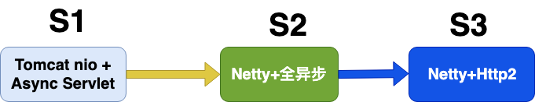
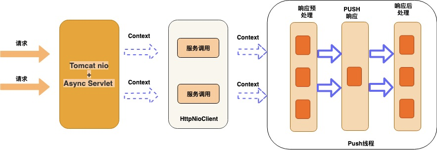
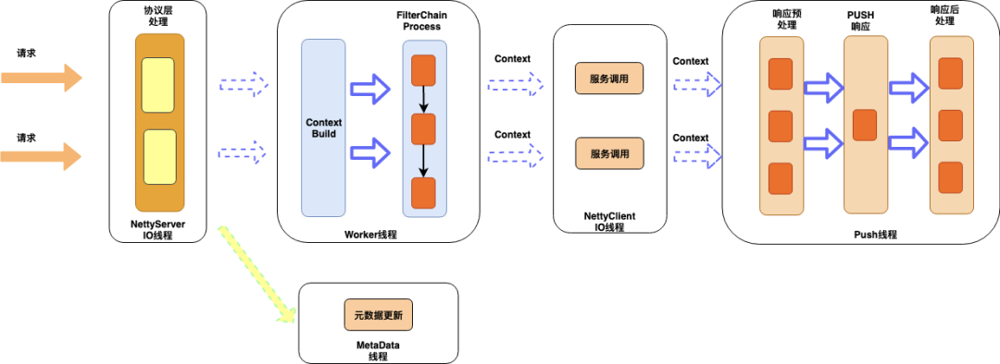
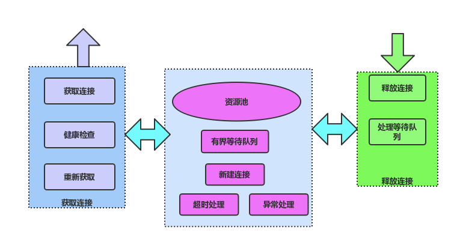
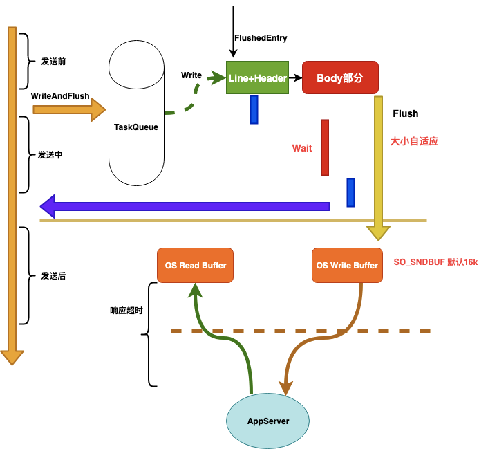
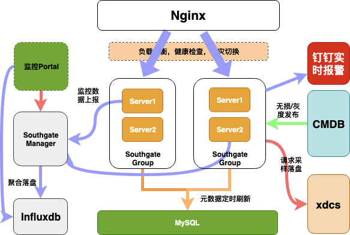
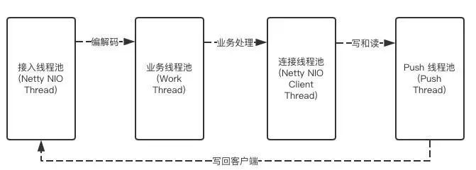

# 喜马拉雅自研网关技术实践

**分享内容**

1. 业务背景
2. 架构1.0 之 <font style="color:rgb(51, 51, 51);">Tomcat nio + AsyncServlet</font>
3. <font style="color:rgb(51, 51, 51);">架构2.0 </font>之 <font style="color:rgb(51, 51, 51);">Netty + 全异步 </font>
4. <font style="color:rgb(51, 51, 51);">架构3.0 </font>之 <font style="color:rgb(51, 51, 51);">Netty + Http2 </font>
5. <font style="color:rgb(51, 51, 51);">总结</font>


### <font style="color:rgb(51, 51, 51);">业务背景</font>
<font style="color:rgb(51, 51, 51);">网关是一个比较成熟了的产品，基本上各大互联网公司都会有网关这个中间件，来解决一些公有业务的上浮，而且能快速的更新迭代，如果没有网关，要更新一个公有特性，就要推动所有业务方都更新和发布，那是效率极低的事，有网关后，这一切都变得不是问题，喜马拉雅也是一样，用户数增长达到 6 亿多的级别，Web 服务个数达到 600+，基本都接入网关接入，日处理 200 亿加次调用，单机 QPS 高峰达到 4w+。</font>

<font style="color:rgb(51, 51, 51);">网关除了要实现最基本的功能反向代理外，还有公有特性，比如黑白名单，流控，鉴权，熔断，API 发布，监控和报警等，我们还根据业务方的需求实现了流量调度，流量 Copy，预发布，智能化升降级，流量预热等相关功能，下面就我们网关在这些方便的一些实践经验以及发展历程，下面是喜马拉雅网关的演化过程：</font>



### 架构1.0<font style="color:rgb(51, 51, 51);"> Tomcat nio + AsyncServlet</font>
> <font style="color:rgb(119, 119, 119);">网关在架构设计时最为关键点，就是网关在接收到请求，调用后端服务时不能阻塞 Block，否则网关的吞吐量很难上去，因为最耗时的就是调用后端服务这个远程调用过程，如果这里是阻塞的，那你的 tomcat 的工作线程都 block 主了，在等待后端服务响应的过程中，不能去处理其他的请求, 这个地方一定要异步</font>
>

<font style="color:rgb(51, 51, 51);">架构图如下： </font>



<font style="color:rgb(51, 51, 51);">这版我们实现单独的 Push 层，作为网关收到响应后，响应客户端时，通过这层实现，和后端服务的通信是 HttpNioClient，对业务的支持黑白名单，流控，鉴权，API 发布等功能，这版只是功能上达到网关的要求，但是处理能力很快就成了瓶颈，单机 qps 到 5k 的时候，就会不停的 full gc，后面通过 dump 线上的堆分析，发现全是 tomcat 缓存了很多 http 的请求，因为 tomcat 默认会缓存 200 个 requestProcessor，每个 prcessor 都关联了一个 request，还有就是 servlet3.0 tomcat 的异步实现会出现内存泄漏，后面通过减少这个配置，效果明显。但性能肯定就下降了，总结了下，基于 tomcat 做为接入端，有如下几个问题：</font>

#### <font style="color:rgb(51, 51, 51);">Tomcat 自身的问题</font>
+ <font style="color:rgb(51, 51, 51);">缓存太多，tomcat 用了很多对象池技术，特别是一个 processorCache 默认 200，在并发回收时会存在没有把 jmx 里的对象删除，导致内存泄露，流量一高很容易触发 gc。</font>
+ <font style="color:rgb(51, 51, 51);">内存 copy，tomcat 的默认是用堆内存 processorCache 默认 200，以数据需要读到堆内，而我们后端服务是 netty，有堆外内存，需要通过数次 copy。</font>
+ <font style="color:rgb(51, 51, 51);">tomcat 还有个问题是读 body 是阻塞的, tomcat 的 nio 模型和 reactor 模型不一样，读 body 是 block 的。</font>

#### <font style="color:rgb(51, 51, 51);">HttpNioClient 的问题</font>
+ <font style="color:rgb(51, 51, 51);">获取和释放连接都需要加锁，对应网关这样的代理服务场景，会频繁的建连和关闭连接，势必会影响性能。</font>

<font style="color:rgb(51, 51, 51);">基于 tomcat 的存在的这些问题，我们后面对接入端做改造，用 Netty 做接入层和服务调用层，也就是我们的第二版，能彻底解决上面的问题，达到理想的性能。</font>

### 架构2.0<font style="color:rgb(51, 51, 51);"> Netty + 全异步</font>
<font style="color:rgb(119, 119, 119);">基于 Netty 的优势，我们实现了全异步，无锁，分层的架构</font>

<font style="color:rgb(51, 51, 51);">先看下我们基于 Netty 做接入端的架构图 </font>



#### <font style="color:rgb(51, 51, 51);">接入层</font>
<font style="color:rgb(119, 119, 119);">Netty 的 io 线程，负责 http 协议的编解码工作，同时对协议层面的异常做监控报警</font>

<font style="color:rgb(51, 51, 51);">对 http 协议的编解码做了优化，对异常，攻击性请求监控可视化，比如我们对 http 的请求行和请求头大小是有限制的，tomcat 是请求行和请求加在一起，不超过 8k，netty 是分别有大小限制，假如客户端发送了超过阀值的请求，带 cookie 的请求很容易超过，正常情况下，netty 就直接响应 400 给客户端，经过改造后，我们只取正常大小的部分，同时标记协议解析失败，到业务层后，就可以判断出是那个服务出现这类问题，其他的一些攻击性的请求，比如只发请求头，不发 body / 或者发部分这些都需要监控和报警。</font>

#### <font style="color:rgb(51, 51, 51);">业务逻辑层</font>
<font style="color:rgb(119, 119, 119);">负责对 API 路由，流量调度等一序列的支持业务的公有逻辑，都在这层实现，采样责任连模式，这层不会有 io 操作。</font>

<font style="color:rgb(51, 51, 51);">在业界和一些大厂的网关设计中，业务逻辑层基本都是设计成责任连模式，公有的业务逻辑也在这层实现，我们在这层也是相同的套路，支持了：</font>

+ <font style="color:rgb(51, 51, 51);">用户鉴权和登陆校验，支持接口级别配置</font>
+ <font style="color:rgb(51, 51, 51);">黑白名单，分全局和应用，以及 ip 维度，参数级别</font>
+ <font style="color:rgb(51, 51, 51);">流量控制，支持自动和手动，自动是对超大流量自动拦截，通过令牌桶算法实现</font>
+ <font style="color:rgb(51, 51, 51);">智能熔断，在 Hystrix 的基础上做了改进，支持自动升降级，我们是全部自动的，也支持手动配置立即熔断，就是发现服务异常比例达到阀值，就自动触发熔断</font>
+ <font style="color:rgb(51, 51, 51);">灰度发布，我对新启动的机器的流量支持类似 tcp 的慢启动机制，给</font><font style="color:rgb(51, 51, 51);">机器一个预热的时间窗口</font>
+ <font style="color:rgb(51, 51, 51);">统一降级，我们对所有转发失败的请求都会找统一降级的逻辑，只要业务方配了降级规则，都会降级，我们对降级规则是支持到参数级别的，包含请求头里的值，是非常细粒度的，另外我们还会和 varnish 打通，支持 varnish 的优雅降级</font>

> Varnish是高性能开源的反向代理服务器和HTTP缓存服务器，Varnish的功能与Squid服务器相似，都可以用来做HTTP缓存。Squid是从硬盘读取缓存的数据，而Varnish把数据存放在内存中，直接从读取内存，避免了频繁在内存、磁盘中交换文件，所以Varnish要相对更高效，但也有缺点，内存中的缓存在服务器重启后会丢失
>

+ <font style="color:rgb(51, 51, 51);">流量调度，支持业务根据筛选规则，对流量筛选到对应的机器，也支持只让筛选的流量访问这台机器，这在查问题 / 新功能发布验证时非常用，可以先通过小部分流量验证再大面积发布上线。</font>
+ <font style="color:rgb(51, 51, 51);">流量 copy，我们支持对线上的原始请求根据规则 copy 一份，写入到 mq 或者其他的 upstream，来做线上跨机房验证和压力测试。</font>
+ <font style="color:rgb(51, 51, 51);">请求日志采样，我们对所有的失败的请求都会采样落盘，提供业务方排查问题支持，也支持业务方根据规则进行个性化采样，我们采样了整个生命周期的数据，包含请求和响应相关的所有数据。</font>

<font style="color:rgb(51, 51, 51);">上面提到的这么多都是对流量的治理，我们每个功能都是一个 filter，处理失败都不影响转发流程，而且所有的这些规则的元数据在网关启动时就会全部初始化好，在执行的过程中，不会有 IO 操作，目前有些设计会对多个 filter 做并发执行，由于我们的都是内存操作，开销并不大，所以我们目前并没有支持并发执行，还有个就是规则会修改，我们修改规则时，会通知网关服务，做实时刷新，我们对内部自己的这种元数据更新的请求，通过独立的线程处理，防止 io 在操作时影响业务线程。</font>

#### <font style="color:rgb(51, 51, 51);">服务调用层</font>
<font style="color:rgb(119, 119, 119);">服务调用对于代理网关服务是关键的地方，一定需要异步，我们通过 netty 实现, 同时也很好的利用了 netty 提供的连接池，做到了获取和释放都是无锁操作</font>

##### <font style="color:rgb(51, 51, 51);">异步 Push</font>
<font style="color:rgb(51, 51, 51);">网关在发起服务调用后，让工作线程继续处理其他的请求，而不需要等待服务端返回，这里的设计是我们为每个请求都会创建一个上下文，我们在发完请求后，把该请求的 context 绑定到对应的连接上，等 netty 收到服务端响应时，就会在给连接上执行 read 操作，解码完后，再从给连接上获取对应的 context，通过 context 可以获取到接入端的 session，这样 push 就通过 session 把响应写回客户端了，这样设计也是基于 http 的连接是独占的，即连接可以和请求上下文绑定。</font>

##### <font style="color:rgb(51, 51, 51);">连接池</font>
<font style="color:rgb(51, 51, 51);">连接池的原理如下图：</font>



<font style="color:rgb(51, 51, 51);">服务调用层除了异步发起远程调用外，还需要对后端服务的连接进行管理，http 不同于 rpc，http 的连接是独占的，所以在释放的时候要特别小心，一定要等服务端响应完了才能释放，还有就是连接关闭的处理也要小心，总结如下几点：</font>

+ <font style="color:rgb(51, 51, 51);">Connection:close</font>
+ <font style="color:rgb(51, 51, 51);">空闲超时，关闭连接</font>
+ <font style="color:rgb(51, 51, 51);">读超时关闭连接</font>
+ <font style="color:rgb(51, 51, 51);">写超时，关闭连接</font>
+ <font style="color:rgb(51, 51, 51);">reset、fin</font>

<font style="color:rgb(51, 51, 51);">上面几种需要关闭连接的场景，下面主要说下 Connection:close 和空闲写超时两种，其他的应该是比较常见的比如读超时，连接空闲超时，收到 fin，reset 码这几个。</font>

> <font style="color:rgb(51, 51, 51);">reset跟fin的区别：正常关闭连接的时候发的包是fin，但是如果是异常关闭连接，则发送reset包</font>
>

##### <font style="color:rgb(51, 51, 51);">Connection:close</font>
<font style="color:rgb(51, 51, 51);">后端服务是 tomcat，tomcat 对连接重用的次数是有限制的，默认是 100 次，当达到 100 次后，tomcat 会通过在响应头里添加 Connection:close，让客户端关闭该连接，否则如果再用该连接发送的话，会出现 400。</font>

##### <font style="color:rgb(51, 51, 51);">写超时</font>
<font style="color:rgb(51, 51, 51);">首先网关什么时候开始计算服务的超时时间，如果从调用 writeAndFlush 开始就计算，这其实是包含了 netty 对 http 的 encode 时间和从队列里把请求发出去即 flush 的时间，这样是对后端服务不公平的，所以需要在真正 flush 成功后开始计时，这样是和服务端最接近的，当然还包含了网络往返时间和内核协议栈处理的时间，这个不可避免，但基本不变。</font>

<font style="color:rgb(51, 51, 51);">所以我们是 flush 成功回调后开始启动超时任务，这里就有个注意的地方，如果 flush 不能快速回调，比如来了一个大的 post 请求，body 部分比较大，而 netty 发送的时候第一次默认是发 1k 的大小，如果还没有发完，则增大发送的大小继续发，如果netty 在 16 次后还没有发送完成，则不会再继续发送，而是提交一个 flushTask 到任务队列，待下次执行到后再发送，这时 flush 回调的时间就比较大，导致这样的请求不能及时关闭，而且后端服务 tomcat 会一直阻塞在读 body 的地方，基于上面的分析，所以我们需要一个写超时，对大的 body 请求，通过写超时来及时关闭。</font>

### <font style="color:rgb(51, 51, 51);">全链路超时机制</font>
<font style="color:rgb(51, 51, 51);">下面是我们在整个</font><font style="color:rgb(51, 51, 51);">链</font><font style="color:rgb(51, 51, 51);">路中一个超时处理的机制。</font>



+ <font style="color:rgb(51, 51, 51);">协议解析超时</font>
+ <font style="color:rgb(51, 51, 51);">等待队列超时</font>
+ <font style="color:rgb(51, 51, 51);">建连超时</font>
+ <font style="color:rgb(51, 51, 51);">等待连接超时</font>
+ <font style="color:rgb(51, 51, 51);">写前检查是否超时</font>
+ <font style="color:rgb(51, 51, 51);">写超时</font>
+ <font style="color:rgb(51, 51, 51);">响应超时</font>

### <font style="color:rgb(51, 51, 51);">监控报警</font>
<font style="color:rgb(119, 119, 119);">网关业务方能看到的是监控和报警，我们是实现秒级别报警和秒级别的监控，监控数据定时上报给我们的管理系统，由管理系统负责聚合统计，落盘到 influxdb</font>

<font style="color:rgb(51, 51, 51);">我们对 http 协议做了全面的监控和报警，无论是协议层的还是服务层的</font>

#### <font style="color:rgb(51, 51, 51);">协议层</font>
+ <font style="color:rgb(51, 51, 51);">攻击性请求，只发头，不发 / 发部分 body，采样落盘，还原现场，并报警</font>
+ <font style="color:rgb(51, 51, 51);">Line or Head or Body 过大的请求，采样落盘，还原现场，并报警</font>

#### <font style="color:rgb(51, 51, 51);">应用层</font>
+ <font style="color:rgb(51, 51, 51);">耗时监控，有慢请求，超时请求，以及 tp99，tp999 等</font>
+ <font style="color:rgb(51, 51, 51);">qps 监控和报警</font>
+ <font style="color:rgb(51, 51, 51);">带宽监控和报警，支持对请求和响应的行，头，body 单独监控。</font>
+ <font style="color:rgb(51, 51, 51);">响应码监控，特别是 400，和 404</font>
+ <font style="color:rgb(51, 51, 51);">连接监控, 我们对接入端的连接，以及和后端服务的连接，后端服务连接上待发送字节大小也都做了监控</font>
+ <font style="color:rgb(51, 51, 51);">失败请求监控</font>
+ <font style="color:rgb(51, 51, 51);">流量抖动报警，这是非常有必要的，流量抖动要么是出了问题，要么就是出问题的前兆。</font>

### <font style="color:rgb(51, 51, 51);">总体架构</font>


### <font style="color:rgb(51, 51, 51);">性能优化实践</font>
#### <font style="color:rgb(51, 51, 51);">对象池技术</font>
<font style="color:rgb(51, 51, 51);">对于高并发系统，频繁的创建对象不仅有分配内存的开销外，还有对 gc 会造成压力，我们在实现时会对频繁使用的比如线程池的任务 task，StringBuffer 等会做写重用，减少频繁的申请内存的开销。</font>

#### <font style="color:rgb(51, 51, 51);">上下文切换</font>
<font style="color:rgb(51, 51, 51);">高并发系统，通常都采用异步设计，异步化后，不得不考虑线程上下文切换的问题，我们的线程模型如下：</font>



<font style="color:rgb(51, 51, 51);">我们整个网关没有涉及到 io 操作，但我们在业务逻辑这块还是和 netty 的 io 编解码线程异步，是有两个原因，1 是防止开发写的代码有阻塞，2 是业务逻辑打日志可能会比较多，在突发的情况下，但是我们在 push 线程时，支持用 netty 的 io 线程替代，这里做的工作比较少，这里有异步修改为同步后 (通过修改配置调整)，cpu 的上下文切换减少 20%，进而提高了整体的吞吐量，就是不能为了异步而异步，zuul2 的设计和我们的类似，但是要注意打大量日志的风险，在出现异常时，高并发下日志多是系统杀手，会 block 住线程，特别要注意，最好用 log4j2。</font>

#### <font style="color:rgb(51, 51, 51);">GC 优化</font>
<font style="color:rgb(51, 51, 51);">在高并发系统，gc 的优化不可避免，我们在用了对象池技术和堆外内存时，对象很少进入老年代，另外我们年轻代会设置的比较大，而且 SurvivorRatio=2，晋升年龄设置最大 15，尽量对象在年轻代就回收掉， 但监控发现老年代的内存还是会缓慢增长，通过 dump 分析，我们每个后端服务创建一个连接，都时有一个 socket，socket 的 AbstractPlainSocketImpl，而 AbstractPlainSocketImpl 就重写了 Object 类的 finalize 方法，实现如下：</font>

```plain
/**
 * Cleans up if the user forgets to close it.
 */
protected void finalize() throws IOException {
    close();
}
```

<font style="color:rgb(51, 51, 51);">是为了我们没有主动关闭连接，做的一个兜底，在 gc 回收的时候，先把对应的连接资源给释放了, 由于 finalize 的机制是通过 jvm 的 Finalizer 线程来处理的，而且 Finalizer 线程的优先级不高，默认是 8，需要等到 Finalizer 线程把 ReferenceQueue 的对象对于的 finalize 方法执行完，还要等到下次 gc 时，才能把该对象回收，导致创建连接的这些对象在年轻代不能立即回收，从而进入了老年代，这也是为啥老年代会一直缓慢增长的问题。</font>

#### <font style="color:rgb(51, 51, 51);">后端连接优化</font>
###### <font style="color:rgb(119, 119, 119);">连接复用</font>
<font style="color:rgb(51, 51, 51);">网关和后端服务大部分是 http 的情况下，必然存在大量短连接，而后端服务绝大部分是 tomcat，tomcat 默认对一个连接复用的次数是有限制的，默认是 100 次，通过 maxKeepAliveRequests 修改，改大后，流量高的情况下能尽量复用连接，不用频繁关闭和新建。</font>

###### <font style="color:rgb(119, 119, 119);">Backlog</font>
<font style="color:rgb(51, 51, 51);">tomcat 默认的 backlog 是 100，通过 acceptCount 参数指定，这个是控制 tcp 连接队列大小的，太小容易导致客户端建连超时，比如 full gc 一次，会导致 accept 不能执行，完成握手的连接都在连接队列里，如果满了，os 会忽略建连的 syn 包，导致客户端建连超时，一般会加大这个参数</font>

### 架构3.0 <font style="color:rgb(51, 51, 51);">Netty + Http2(未来规划)</font>
<font style="color:rgb(51, 51, 51);">现在我们都是基于 http1，现在 http2 相对于 http1 关键实现了在连接层面的服务，即一个连接上可以发送多个 http 请求，即 http 的连接也能和 rpc 的连接一样，建几个连接就可以了，彻底解决了 http1 连接不能复用导致每次都建连和慢启动的开销，我们也在基于 netty 升级到 http2, 除了技术升级外，我们对监控报警也一直在持续优化，怎么提供给业务方准确无误的报警，也是一直在努力，还有一个就是降级，作为统一接入网关，和业务方做好全方位的降级措施，也是一直在完善的点，保证全站任何故障都能通过网关第一时间降级，也是我们的重点。</font>

### <font style="color:rgb(51, 51, 51);">总结</font>
<font style="color:rgb(51, 51, 51);">网关已经是一个互联网公司的标配，这里总结实践过程中的一些心得和体会，希望给大家一些参考以及一些问题的解决思路，我们也还在不断完善中，同时平台架构也在做多活，稳定性等富有挑战性的项目</font>

  
 


> 更新: 2024-07-15 22:21:20  
> 原文: <https://www.yuque.com/tulingzhouyu/db22bv/vo7e4d75xqznuxi0>