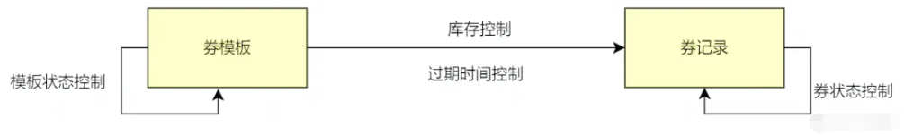
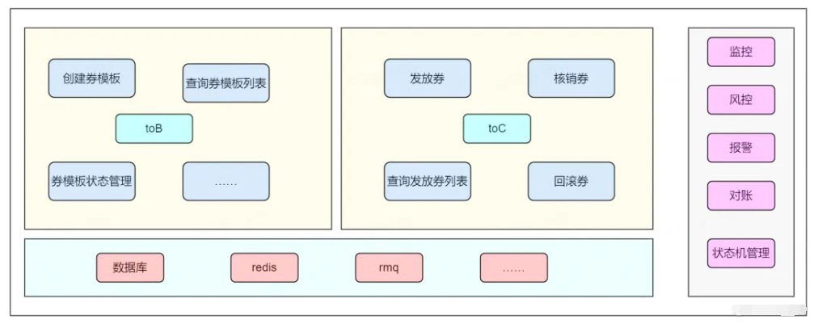
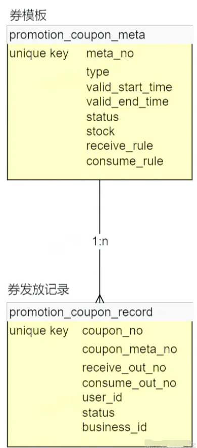
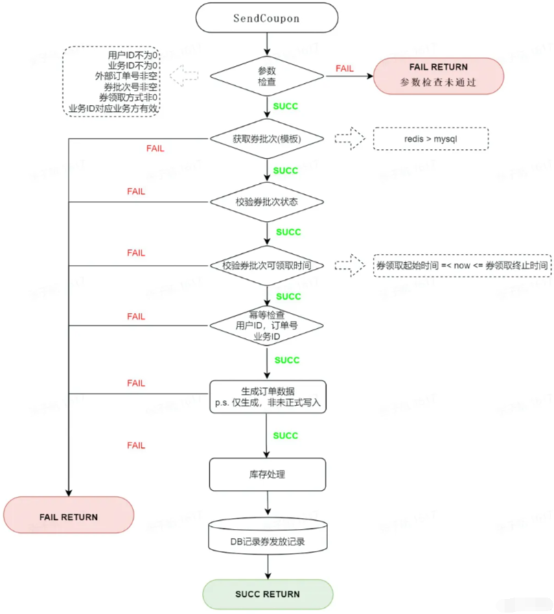
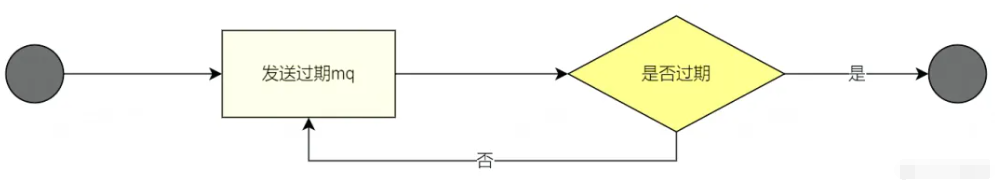
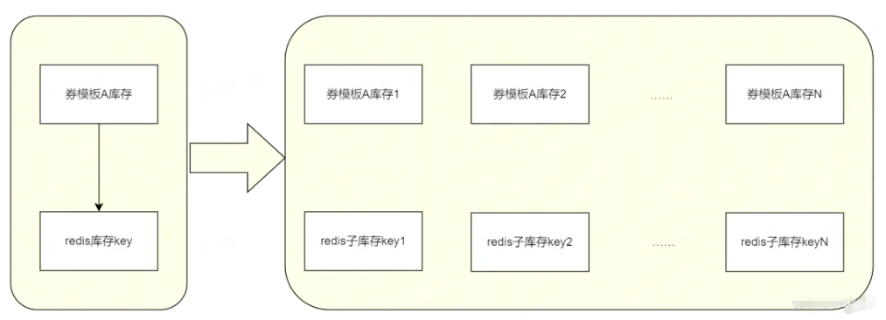
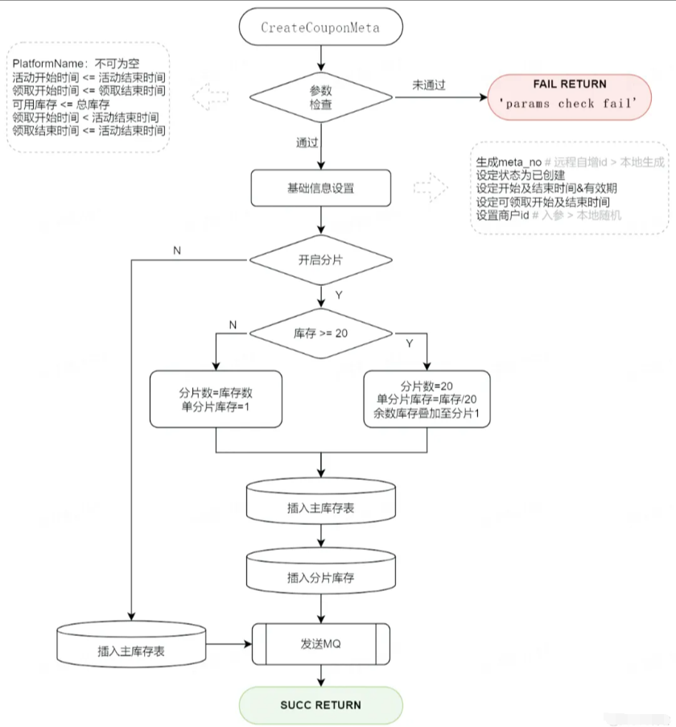
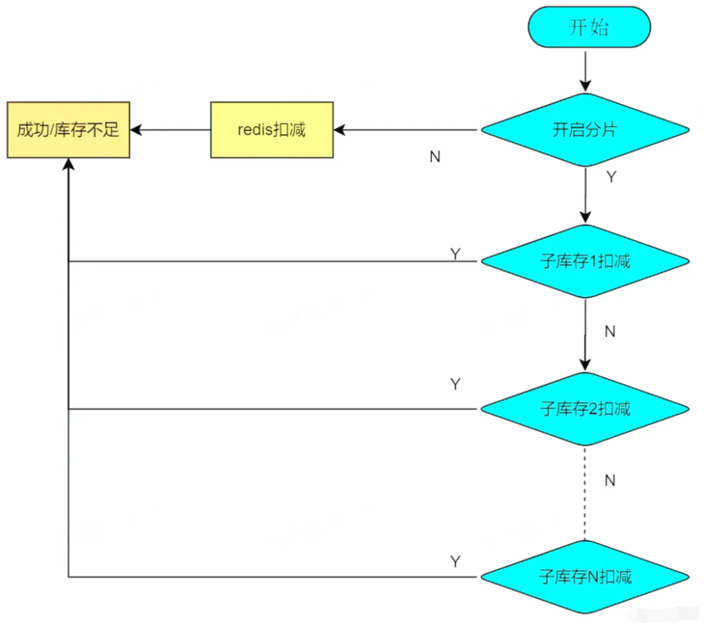
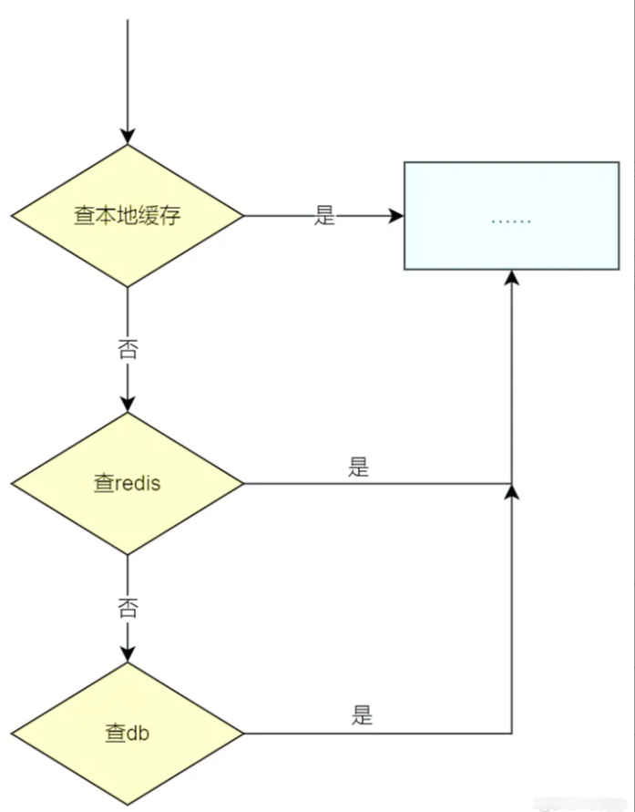

# 如何从零搭建10W QPS 高并发优惠券系统

:::info
<font style="color:rgb(23, 35, 63);">春节活动中，多个业务方都有发放优惠券的需求，且对发券的 QPS 量级有明确的需求。所有的优惠券发放、核销、查询都需要一个新系统来承载。因此，我们需要设计、开发一个能够支持十万级 QPS 的券系统，并且对优惠券完整的生命周期进行维护。</font>

:::

## <font style="color:rgb(34, 34, 34);">需求拆解及技术选型</font>
### <font style="color:rgb(34, 34, 34);">需求拆解</font>
+ <font style="color:rgb(51, 51, 51);">要配置券，会涉及到券批次（券模板）创建，券模板的有效期以及券的库存信息</font>
+ <font style="color:rgb(51, 51, 51);">要发券，会涉及到券记录的创建和管理（过期时间，状态）</font>

<font style="color:rgb(23, 35, 63);">因此，我们可以将需求先简单拆解为两部分：</font>



<font style="color:rgb(23, 35, 63);">同时，无论是券模板还是券记录，都需要开放查询接口，支持券模板/券记录的查询。</font>

### <font style="color:rgb(34, 34, 34);">系统选型及中间件</font>
<font style="color:rgb(23, 35, 63);">确定了基本的需求，我们根据需求，进一步分析可能会用到的中间件，以及系统整体的组织方式。</font>

<font style="color:rgb(23, 35, 63);">存储</font>

<font style="color:rgb(23, 35, 63);">由于券模板、券记录这些都是需要持久化的数据，同时还需要支持条件查询，所以我们选用通用的结构化存储 MySQL 作为存储中间件。</font>

<font style="color:rgb(23, 35, 63);">缓存</font>

+ <font style="color:rgb(51, 51, 51);">由于发券时需要券模板信息，大流量情况下，不可能每次都从 MySQL 获取券模板信息，因此考虑引入缓存</font>
+ <font style="color:rgb(51, 51, 51);">同理，券的库存管理，或者叫库存扣减，也是一个高频、实时的操作，因此也考虑放入缓存中</font>

<font style="color:rgb(23, 35, 63);">主流的缓存 Redis 可以满足我们的需求，因此我们选用 Redis 作为缓存中间件。</font>

<font style="color:rgb(23, 35, 63);">消息队列</font>

<font style="color:rgb(23, 35, 63);">由于券模板/券记录都需要展示过期状态，并且根据不同的状态进行业务逻辑处理，因此有必要引入延迟消息队列来对券模板/券状态进行处理。RocketMQ 支持延时消息，因此我们选用 RocketMQ 作为消息队列。</font>

<font style="color:rgb(23, 35, 63);">系统框架</font>

<font style="color:rgb(23, 35, 63);">发券系统作为下游服务，是需要被上游服务所调用的。公司内部服务之间，采用的都是 RPC 服务调用，系统开发语言使用的是 golang，因此我们使用 golang 服务的 RPC 框架 kitex 进行代码编写。</font>

<font style="color:rgb(23, 35, 63);">我们采用 kitex+MySQL+Redis+RocketMQ 来实现发券系统，RPC 服务部署在公司的 docker 容器中。</font>

## <font style="color:rgb(34, 34, 34);">系统开发与实践</font>
### <font style="color:rgb(34, 34, 34);">系统设计实现</font>
<font style="color:rgb(23, 35, 63);">系统整体架构</font>

<font style="color:rgb(23, 35, 63);">从需求拆解部分我们对大致要开发的系统有了一个了解，下面给出整体的一个系统架构，包含了一些具体的功能。</font>



<font style="color:rgb(23, 35, 63);">数据结构 ER 图</font>

<font style="color:rgb(23, 35, 63);">与系统架构对应的，我们需要建立对应的 MySQL 数据存储表。</font>



<font style="color:rgb(23, 35, 63);">核心逻辑实现</font>

**<font style="color:rgb(23, 35, 63);">发券：</font>**

+ <font style="color:rgb(51, 51, 51);">发券流程分为三部分：参数校验、幂等校验、库存扣减。</font>



<font style="color:rgb(23, 35, 63);">幂等操作用于保证发券请求不正确的情况下，业务方通过重试、补偿的方式再次请求，可以最终只发出一张券，防止资金损失。</font>

**<font style="color:rgb(23, 35, 63);">券过期：</font>**

<font style="color:rgb(23, 35, 63);">券过期是一个状态推进的过程，这里我们使用 RocketMQ 来实现。</font>



+ <font style="color:rgb(51, 51, 51);">由于 RocketMQ 支持的延时消息有最大限制，而卡券的有效期不固定，有可能会超过限制，所以我们将卡券过期消息循环处理，直到卡券过期。</font>

### <font style="color:rgb(34, 34, 34);">大流量、高并发场景下的问题及解决方案</font>
<font style="color:rgb(23, 35, 63);">实现了系统的基本功能后，我们来讨论一下，如果在大流量、高并发的场景下，系统可能会遇到的一些问题及解决方案。</font>

<font style="color:rgb(23, 35, 63);">存储瓶颈及解决方案</font>

**<font style="color:rgb(23, 35, 63);">瓶颈：</font>**

<font style="color:rgb(23, 35, 63);">在系统架构中，我们使用了 MySQL、Redis 作为存储组件。我们知道，单个服务器的 I/O 能力终是有限的，在实际测试过程中，能够得到如下的数据：</font>

+ <font style="color:rgb(51, 51, 51);">单个 MySQL 的每秒写入在 4000 QPS 左右，超过这个数字，MySQL 的 I/O 时延会剧量增长。</font>
+ <font style="color:rgb(51, 51, 51);">MySQL 单表记录到达了千万级别，查询效率会大大降低，如果过亿的话，数据查询会成为一个问题。</font>
+ <font style="color:rgb(51, 51, 51);">Redis 单分片的写入瓶颈在 2w 左右，读瓶颈在 10w 左右</font>

**<font style="color:rgb(23, 35, 63);">解决方案：</font>**

1. <font style="color:rgb(51, 51, 51);">读写分离。在查询券模板、查询券记录等场景下，我们可以将 MySQL 进行读写分离，让这部分查询流量走 MySQL 的读库，从而减轻 MySQL 写库的查询压力。</font>
2. <font style="color:rgb(51, 51, 51);">分治。在软件设计中，有一种分治的思想，对于存储瓶颈的问题，业界常用的方案就是分而治之：流量分散、存储分散，即：分库分表。</font>
+ <font style="color:rgb(51, 51, 51);">发券，归根结底是要对用户的领券记录做持久化存储。对于 MySQL 本身 I/O 瓶颈来说，我们可以在不同服务器上部署 MySQL 的不同分片，对 MySQL 做水平扩容，这样一来，写请求就会分布在不同的 MySQL 主机上，这样就能够大幅提升 MySQL 整体的吞吐量。</font>
+ <font style="color:rgb(51, 51, 51);">给用户发了券，那么用户肯定需要查询自己获得的券。基于这个逻辑，我们以 user_id 后四位为分片键，对用户领取的记录表做水平拆分，以支持用户维度的领券记录的查询。</font>
+ <font style="color:rgb(51, 51, 51);">每种券都有对应的数量，在给用户发券的过程中，我们是将发券数记录在 Redis 中的，大流量的情况下，我们也需要对 Redis 做水平扩容，减轻 Redis 单机的压力。</font>

**<font style="color:rgb(23, 35, 63);">容量预估：</font>**

<font style="color:rgb(23, 35, 63);">基于上述思路，在要满足发券 12w QPS 的需求下，我们预估一下存储资源。</font>

<font style="color:rgb(23, 35, 63);">a. MySQL 资源</font>

<font style="color:rgb(23, 35, 63);">在实际测试中，单次发券对 MySQL 有一次非事务性写入，MySQL 的单机的写入瓶颈为 4000，据此可以计算我们需要的 MySQL 主库资源为：</font>

```plain
120000/4000 = 30

1.
```

<font style="color:rgb(23, 35, 63);">b. Redis 资源</font>

<font style="color:rgb(23, 35, 63);">假设 12w 的发券 QPS，均为同一券模板，单分片的写入瓶颈为 2w，则需要的最少 Redis 分片为：</font>

```plain
120000/20000 = 6

1.
```

<font style="color:rgb(23, 35, 63);">热点库存问题及解决方案</font>

**<font style="color:rgb(23, 35, 63);">问题</font>**

<font style="color:rgb(23, 35, 63);">大流量发券场景下，如果我们使用的券模板为一个，那么每次扣减库存时，访问到的 Redis 必然是特定的一个分片，因此，一定会达到这个分片的写入瓶颈，更严重的，可能会导致整个 Redis 集群不可用。</font>

**<font style="color:rgb(23, 35, 63);">解决方案</font>**

<font style="color:rgb(23, 35, 63);">热点库存的问题，业界有通用的方案：即，扣减的库存 key 不要集中在某一个分片上。如何保证这一个券模板的 key 不集中在某一个分片上呢，我们拆 key（拆库存）即可。如图：</font>



<font style="color:rgb(23, 35, 63);">在业务逻辑中，我们在建券模板的时候，就将这种热点券模板做库存拆分，后续扣减库存时，也扣减相应的子库存即可。</font>

**<font style="color:rgb(23, 35, 63);">建券</font>**



**<font style="color:rgb(23, 35, 63);">库存扣减</font>**



<font style="color:rgb(23, 35, 63);">这里还剩下一个问题，即：扣减子库存，每次都是从 1 开始进行的话，那对 Redis 对应分片的压力其实并没有减轻，因此，我们需要做到：每次请求，</font>**<font style="color:rgb(23, 35, 63);">随机不重复的轮询子库存</font>**<font style="color:rgb(23, 35, 63);">。以下是本项目采取的一个具体思路：</font>

<font style="color:rgb(23, 35, 63);">Redis 子库存的 key 的最后一位是分片的编号，如：xxx_stock_key1、xxx_stock_key2……，在扣减子库存时，我们先生成对应分片总数的随机不重复数组，如第一次是[1,2,3]，第二次可能是[3,1,2]，这样，每次扣减子库存的请求，就会分布到不同的 Redis 分片上，缓轻 Redis 单分片压力的同时，也能支持更高 QPS 的扣减请求。</font>

<font style="color:rgb(23, 35, 63);">这种思路的一个问题是，当我们库存接近耗尽的情况下，很多分片子库存的轮询将变得毫无意义，因此我们可以在每次请求的时候，将子库存的剩余量记录下来，当某一个券模板的子库存耗尽后，随机不重复的轮询操作直接跳过这个子库存分片，这样能够优化系统在库存即将耗尽情况下的响应速度。</font>

<font style="color:rgb(23, 35, 63);">业界针对 Redis 热点 key 的处理，除了分 key 以外，还有一种 key 备份的思路：即，将相同的 key，用某种策略备份到不同的 Redis 分片上去，这样就能将热点打散。这种思路适用于那种读多写少的场景，不适合应对发券这种大流量写的场景。在面对具体的业务场景时，我们需要根据业务需求，选用恰当的方案来解决问题。</font>

<font style="color:rgb(23, 35, 63);">券模板获取失败问题及解决方案</font>

**<font style="color:rgb(23, 35, 63);">问题</font>**

<font style="color:rgb(23, 35, 63);">高 QPS，高并发的场景下，即使我们能将接口的成功率提升 0.01%，实际表现也是可观的。现在回过头来看下整个发券的流程：查券模板（Redis）-->校验-->幂等（MySQL）--> 发券（MySQL）。在查券模板信息时，我们会请求 Redis，这是强依赖，在实际的观测中，我们会发现，Redis 超时的概率大概在万分之 2、3。因此，这部分发券请求是必然失败的。</font>

**<font style="color:rgb(23, 35, 63);">解决方案</font>**

<font style="color:rgb(23, 35, 63);">为了提高这部分请求的成功率，我们有两种方案。</font>

<font style="color:rgb(23, 35, 63);">一是从 Redis 获取券模板失败时，内部进行重试；二是将券模板信息缓存到实例的本地内存中，即引入</font>**<font style="color:rgb(23, 35, 63);">二级缓存</font>**<font style="color:rgb(23, 35, 63);">。</font>

<font style="color:rgb(23, 35, 63);">内部重试可以提高一部分请求的成功率，但无法从根本上解决 Redis 存在超时的问题，同时重试的次数也和接口响应的时长成正比。二级缓存的引入，可以从根本上避免 Redis 超时造成的发券请求失败。因此我们选用二级缓存方案：</font>



<font style="color:rgb(23, 35, 63);">当然，引入了本地缓存，我们还需要在每个服务实例中启动一个定时任务来将最新的券模板信息刷入到本地缓存和 Redis 中，将模板信息刷入 Redis 中时，要加分布式锁，防止多个实例同时写 Redis 给 Redis 造成不必要的压力。</font>

### <font style="color:rgb(34, 34, 34);">服务治理</font>
<font style="color:rgb(23, 35, 63);">系统开发完成后，还需要通过一系列操作保障系统的可靠运行。</font>

1. <font style="color:rgb(51, 51, 51);">超时设置。优惠券系统是一个 RPC 服务，因此我们需要设置合理的 RPC 超时时间，保证系统不会因为上游系统的故障而被拖垮。例如发券的接口，我们内部执行时间不超过 100ms，因此接口超时我们可以设置为 500ms，如果有异常请求，在 500ms 后，就会被拒绝，从而保障我们服务稳定的运行。</font>
2. <font style="color:rgb(51, 51, 51);">监控与报警。对于一些核心接口的监控、稳定性、重要数据，以及系统 CPU、内存等的监控，我们会在 Grafana 上建立对应的可视化图表，在春节活动期间，实时观测 Grafana 仪表盘，以保证能够最快观测到系统异常。同时，对于一些异常情况，我们还有完善的报警机制，从而能够第一时间感知到系统的异常。</font>
3. <font style="color:rgb(51, 51, 51);">限流。优惠券系统是一个底层服务，实际业务场景下会被多个上游服务所调用，因此，合理的对这些上游服务进行限流，也是保证优惠券系统本身稳定性必不可少的一环。</font>
4. <font style="color:rgb(51, 51, 51);">资源隔离。因为我们服务都是部署在 docker 集群中的，因此为了保证服务的高可用，服务部署的集群资源尽量分布在不同的物理区域上，以避免由集群导致的服务不可用。</font>

## <font style="color:rgb(34, 34, 34);">系统压测及实际表现</font>
<font style="color:rgb(23, 35, 63);">做完了上述一系列的工作后，是时候检验我们服务在生产环境中的表现了。当然，新服务上线前，首先需要对服务进行压测。这里总结一下压测可能需要注意的一些问题及压测结论。</font>

### <font style="color:rgb(34, 34, 34);">注意事项</font>
1. <font style="color:rgb(51, 51, 51);">首先是压测思路，由于我们一开始无法确定 docker 的瓶颈、存储组件的瓶颈等。所以我们的压测思路一般是：</font>
+ <font style="color:rgb(51, 51, 51);">找到单实例瓶颈</font>
+ <font style="color:rgb(51, 51, 51);">找到 MySQL 一主的写瓶颈、读瓶颈</font>
+ <font style="color:rgb(51, 51, 51);">找到 Redis 单分片写瓶颈、读瓶颈</font>

<font style="color:rgb(23, 35, 63);">得到了上述数据后，我们就可以粗略估算所需要的资源数，进行服务整体的压测了。</font>

1. <font style="color:rgb(51, 51, 51);">压测资源也很重要，提前申请到足量的压测资源，才能合理制定压测计划。</font>
2. <font style="color:rgb(51, 51, 51);">压测过程中，要注意服务和资源的监控，对不符合预期的部分要深入思考，优化代码。</font>
3. <font style="color:rgb(51, 51, 51);">适时记录压测数据，才能更好的复盘。</font>
4. <font style="color:rgb(51, 51, 51);">实际的使用资源，一般是压测数据的 1.5 倍，我们需要保证线上有部分资源冗余以应对突发的流量增长。</font>

### <font style="color:rgb(34, 34, 34);">结论</font>
<font style="color:rgb(23, 35, 63);">系统在 13w QPS 的发券请求下，请求成功率达到 99.9%以上，系统监控正常。春节红包雨期间，该优惠券系统承载了两次红包雨的全部流量，期间未出现异常，圆满完成了发放优惠券的任务。</font>

## <font style="color:rgb(34, 34, 34);">系统的业务思考</font>
+ <font style="color:rgb(51, 51, 51);">目前的系统，只是单纯支持了高并发的发券功能，对于券的业务探索并不足够。后续需要结合业务，尝试批量发券（券包）、批量核销等功能</font>
+ <font style="color:rgb(51, 51, 51);">发券系统只是一个最底层的业务中台，可以适配各种场景，后续可以探索支持更多业务。</font>

## <font style="color:rgb(34, 34, 34);">总结</font>
<font style="color:rgb(23, 35, 63);">从零搭建一个大流量、高并发的优惠券系统，首先应该充分理解业务需求，然后对需求进行拆解，根据拆解后的需求，合理选用各种中间件；本文主要是要建设一套优惠券系统，因此会使用各类存储组件和消息队列，来完成优惠券的存储、查询、过期操作；</font>

<font style="color:rgb(23, 35, 63);">在系统开发实现过程中，对核心的发券、券过期实现流程进行了阐述，并针对大流量、高并发场景下可能遇到的存储瓶颈、热点库存、券模板缓存获取超时的问题提出了对应的解决方案。其中，我们使用了分治的思想，对存储中间件进行水平扩容以解决存储瓶颈；采取库存拆分子库存思路解决热点库存问题；引入本地缓存解决券模板从 Redis 获取超时的问题。最终保证了优惠券系统在大流量高并发的情景下稳定可用；</font>

<font style="color:rgb(23, 35, 63);">除开服务本身，我们还从服务超时设置、监控报警、限流、资源隔离等方面对服务进行了治理，保障服务的高可用；</font>

<font style="color:rgb(23, 35, 63);">压测是一个新服务不可避免的一个环节，通过压测我们能够对服务的整体情况有个明确的了解，并且压测期间暴露的问题也会是线上可能遇到的，通过压测，我们能够对新服务的整体情况做到心里有数，对服务上线正式投产就更有信心了。</font>


> 更新: 2024-07-15 22:21:18  
> 原文: <https://www.yuque.com/tulingzhouyu/db22bv/ygrp9ooiwlt6tv2e>