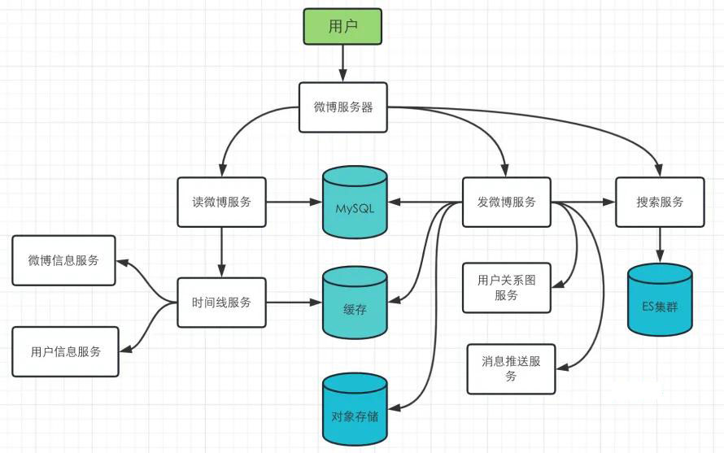
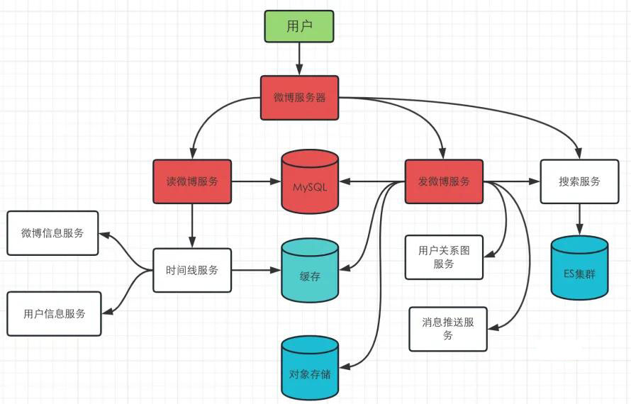
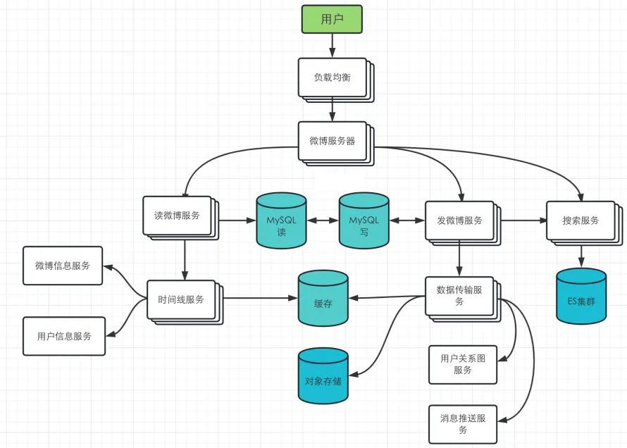

# 如何设计一个微博系统

:::info
**本次分享内容**

1. 系统设计在考察什么？
2. 系统设计常见误区
3. 如何搞定系统设计(4步法)
4. 实战4步法解决微博设计(确定场景、整体设计、核心模块、拓展设计)

:::

## 系统设计在考察什么？
系统设计面试中，经常会被问到如何设计微信、如何设计微博、微信朋友圈、百度、12306系统…… 如果是没有准备过，一般都会不知所措，难以找到切入点，我们怎么能在如此短的时间内设计出来一个由成千上万的码农、PM，经年累月地迭代出来的如此优秀的产品？如果面试者这么优秀，那还面试啥？百度、谷歌也不可能只是一个搜索框而已，底下的东西复杂去了。本次分享会介绍一个解决系统设计类问题的通用框架，无论什么问题，朝这几步走，一定能找到解决办法。

所以首先要明确，系统问题的答案一定不可能是全面的，面试官也不会期望我们给出一个满分答案。所谓的系统设计面试实际上是在模拟一个场景：两名同事在一起就一个模糊的问题，讨论一番，得出一个还不错的解决方案。

**因此在这个过程中，我们需要与面试官进行充分的沟通，了解清楚需求，回应面试官的各种问题，阐述我们设计的方案。最终设计的结果是开放性的，没有标准答案；而面试官会在这个过程中，会充分挖掘我们的沟通、分析、解决问题的能力，最后给出通过与否的结论。**

## 常见误区
### 没有方向，只提出各种关键词
在面试中，常见的错误是面试官给出问题后，候选人就开始怼各种关键词，什么 Load Balancer，Memcache，NodeJS，MongoDB，MySQL.

不是说我们不能说这些技术词汇，但是系统设计首先我们需要搞清楚具体的需求，然后在大概确定系统架构，最后才根据场景进行技术选型，因为并不存在一个完全完美的系统设计，往往都是各方面之间的均衡，至于如何均衡，需要结合面试官的要求和具体实际来选择。

### 一开始直奔最优解
系统设计考察我们如何去解决一个具体的问题，在实际工作中，我们也是先实现功能之后，再在此基础上去进行针对性的优化；在面试中同样也十分重要，一方面，面试官希望看到你从一开始设计系统，到慢慢完善的过程，另外，系统设计其实没有最优解，往往都是各种因素之间权衡后的结果，就像 CAP 理论一样，无法同时满足，我们的系统只要能满足面试官提出来的要求，刚好够用就行。

### 闷头设计不沟通
很多人在听到问题之后，就开始闷头设计，丝毫不会和面试官进行沟通交流。这样不仅不利于自己理解题目意图，而且让面试官无法了解你是如何一步步去解决问题的过程。

这个时候可以把面试官当做一位同事，比如你对题目不理解，可以提出问题搞清楚题目意图；又比如你在哪个环节卡住了，也不要一直闷在那，可以大胆向面试官求助寻求提示，也能节省不少时间。

就像开始说的，系统设计没有最优解，你的思路和解决问题的过程很重要，而这些就是通过不断的沟通来传递给面试官的。

## 如何搞定系统设计 - 4 步法
针对系统设计，这里给大家提供一个 4 步法解决方案，无论是任何系统设计的题目，都可以按照这几步去思考解决。

### 1. 确定问题需求
这一步主要是确定问题的需求和系统使用场景，为了搞清楚这个问题，需要和面试官你来我往地问问题。

在做设计的同时，问面试官的要求是什么，做出合理的假设、取舍，让面试官看出你的思考过程，最终综合所有的信息完成一个还不错的设计。不要害怕问问题。那并不会说明我们不懂，而是让面试官理解我们的思考过程。当我们问出问题后，面试官要么给出明确的回答；要么让我们自己做出假设。当需要做出假设时，我们需要把假设写下来备用。

这个举个例子，比如面试官让你设计 weibo，因为 weibo 的功能较为庞大，例如发微博、微博时间线、关注、取消关注、微博热搜榜等等，我们无法在短短的面试时间内完成这么多功能设计，所以这时候可以询问面试官我们需要实现哪些功能。

比如需要实现微博时间线的功能，我们得进一步确认，整体用户量多大，系统的 QPS 多大，因为这涉及到我们后续的系统设计，而且如果对于 QPS 特别高的情况，在后续的设计中需要针对此进行专门的扩展性优化。

**QPS 有什么用？**

+ QPS = 100，那么用你的笔记本作 Web 服务器就好了；
+ QPS = 1K，一台好点的 Web 服务器也能应付，需要考虑 Single Point Failure；
+ QPS = 1m，则需要建设一个 1000 台 Web 服务器的集群，并且要考虑如何 Maintainance（某一台挂了怎么办）。

QPS 和 服务器 / 数据库之间的关系：

+ 一台 Web Server 承受量约为 1K 的 QPS（考虑到逻辑处理时间以及数据库查询的瓶颈）；
+ 一台 SQL Database 承受量约为 1K 的 QPS（如果 JOIN 和 INDEX query 比较多的话，这个值会更小）；
+ 一台 NoSQL Database (Cassandra) 约承受量是 10k 的 QPS；
+ 一台 NoSQL Database (Memcached) 约承受量是 1M 的 QPS。

以下是一些通用的问题，可以通过询问系统相关的问题，搞清楚面试官的意图和系统的使用场景。

+ 系统的功能是什么
+ 系统的目标群体是什么
+ 系统的用户量有多大
+ 希望每秒钟处理多少请求？
+ 希望处理多少数据？
+ 希望的读写比率？
+ 系统的扩张规模怎么样，这涉及到后续的扩展

**总结，在这一步，不要设计具体的系统，把问题搞清楚就行。不要害怕问问题，那并不会说明我们不懂，而是让面试官理解我们的思考过程。**

### 2. 完成整体设计
这一步根据系统的具体要求，我们将其划分为几个功能独立的模块，然后做出一张整体的架构图，并依据此架构图，看是否能实现上一步所提出来的需求。

如果可能的话，设想几个具体的例子，对着图演练一遍。这让我们能更坚定当前的设计，有时候还能发现一些未考虑到的边界 case。

这里说的比较抽象，具体可以参考下面的实战环节，来理解如何完成整体设计。

### 3. 深入模块设计
至此，我们已经完成了系统的整体设计，接下来需要根据面试官的要求对模块进行具体设计。

比如需要设计一个短网址的系统，上一步中可能已经把系统分为了如下三个模块：

+ 生成完整网址的 hash 值，并进行存储。
+ 短网址转换为完整 url。
+ 短网址转换的 API。

这一步中我们需要对上面三个模块进行具体设计，这里面就涉及到实际的技术选型了。下面举个简单的例子。

1. 比如说生成网址的 hash 值，假设别名是 [tinyurl.com/](https://link.juejin.cn/?target=http%3A%2F%2Ftinyurl.com%2F)<alias_hash>，alias_hash 是固定长度的字符串。
2. 如果长度为 7，包含 [A-Z, a-z, 0-9]，则可以提供 62 ^ 7 ~= 3500 亿个 URL。至于 3500 亿的网址数目是否能满足要求，目前世界上总共有 2 亿多个网站，平均每个网站 1000 个网址来计算，也是够用的。而且后续可以引入网址过期的策略。
3. 首先，我们将所有的映射存储在一个数据库中。 一个简单的方法是使用 alias_hash 作为每个映射的 ID，可以生成一个长度为 7 的随机字符串。 所以我们可以先存储 <ID，URL>。 当用户输入一个长 URL [www.lfeng.tech](https://link.juejin.cn/?target=http%3A%2F%2Fwww.lfeng.tech) 时，系统创建一个随机的 7 个字符的字符串，如 abcd123 作为 ID，并插入条目 <"abcd123", "[www.lfeng.tech">](https://link.juejin.cn/?target=http%3A%2F%2Fwww.lfeng.tech%2522%253E) 进入数据库。
4. 在运行期间，当有人访问 [tinyurl.com/abcd123](https://tinyurl.com/abcd123) 时，我们… ID abcd123 查找并重定向到相应的 URL [www.lfeng.tech。](https://link.juejin.cn/?target=http%3A%2F%2Fwww.lfeng.tech%25E3%2580%2582)

当然，上面的例子中只解决了生成网址的问题，还有网址的存储、网址生成 hash 值之后产生碰撞如何解决等等，都需要在这个阶段解决。这里面涉及到各种存储方案的选择、数据库的设计等等，不在这里细讲

### 4. 可扩展性设计
这是最后一步，面试官可能会针对系统中的某个模块，给出扩展性相关的问题，这块的问题可以分为两类：

1. **当前系统的优化**。因为没有完美的系统，我们的设计的也不例外，因此这类问题需要我们认真反思系统的设计，找出其中可能的缺陷，提出具体的解决方案。
2. **扩展当前系统**。例如我们当前的设计能够支撑 100w 用户，那么当用户数达到 1000w 时，需要如何应对等等。

这里面可能涉及到水平扩展、垂直扩展、缓存、负载均衡、数据库的拆分的同步等

## 实战4步法解决Weibo设计
这部分我以 Weibo 的设计为例，带大家过一遍如何用 4 步法解决实际的系统设计。

### 确定 weibo 的使用场景
因为 weibo 功能较多，这里没有面试官的提示，我们假定需要实现**微博的时间线以及搜索**的功能。

基于这个设定，我们需要解决如下几个问题：

+ 用户发微博：服务能够将微博推送给对应的关注者，同时可能需要相应的提醒。
+ 用户浏览自己的微博时间线。
+ 用户浏览主页微博，也就是需要将用户关注对象的微博呈现出来。
+ 用户能够搜索微博。
+ 整个系统具有高可用性。

#### 初步估算
基于上面的需求，我们进一步做出一些假设，然后计算出大概的储存需求和 QPS，因为后续的技术选型依赖于当前系统的规模。这里我做出如下假定：

+ 假设有 1 亿活跃用户，每人平均每天 5 条微博，也就是每天 5 亿条微博，每月 150 亿条。
+ 每条微博的平均阅读量是 20，也就是每月 3000 亿阅读量。
+ 对于搜索，假定每人每天搜索 5 次，一个月也就是 150 亿次搜索请求。

下面进一步对存储和 QPS 进行估算，

首先是储存，每条微博至少包含如下几个内容：

+ 微博id：8 bytes
+ 用户id：32 bytes
+ 微博正文：140 bytes
+ 媒体文件：10 KB (这里只考虑媒体文件对应的链接)

总共 10KB 左右。

每月 150 亿条微博，也就是 0.14PB，每年 1.68PB。

其次是 QPS，这里涉及到 3 个接口：

+ 发微博接口：每天 5 亿条微博，也就是大约 6000QPS
+ 阅读微博接口：每天 100 亿阅读，也就是大约 12 万 QPS
+ 搜索微博接口：每天每人搜索 5 次，那也大约 6000QPS。

这里估算出来的数据为后续技术选型做参考。

### 完成 weibo 整体设计
根据上面的分析，这一步将主要服务拆分出来，可以分为读微博服务、发微博服务、搜索服务；同时还有相关的时间线服务、微博信息服务，用户信息服务、用户关系图服务、消息推送服务等等。考虑到服务高可用，这里也引入了缓存。

拆分好了之后，根据用户使用场景，可以设计出如下图所示的系统架构图，注意到目前为止，都是粗略设计，我们只需要将服务抽象出来，完成具体的功能即可。后续步骤会对主要服务进行详细设计。

下图的架构中，主要实现了用户发微博、浏览微博时间线和搜索的场景。

### 设计核心模块
上一步我们完成了微博的架构设计，这一步从用户场景入手，详细设计核心模块。

#### 用户发微博
用户发微博的时候，发微博服务需要完成如下几项工作：

+ 将微博写入到 MySQL 等关系型数据库，考虑到流量较大，这里可以引入 Kafka 等 MQ 来进行削峰。
+ 查询用户关系图服务，找到该用户的所有 follower，然后把微博插入到所有 follower 的时间线上，注意到这里时间线的信息都是存放在缓存中的。
+ 将微博数据导入到搜索集群中，提供给后续搜索使用。
+ 将微博的媒体文件存放到对象储存中。
+ 调用消息推送服务，将消息推送到所有的 followers。这里同样可以采用一个 MQ 来进行异步消息推送。

对于每个用户，我们可以用一个 Redis 的 list，来存放所有该用户关注对象的微博信息，类似如下：

| 第 N 条微博 | 第 N+1 条微博 | 第 N+2 条微博 |

|-|-|-|

| 8 bytes 8 bytes 1 byte | 8 bytes 8 bytes 1 byte | 8 bytes 8 bytes 1 byte |

| weibo_id user_id meta | weibo_id user_id meta | weibo_id user_id meta|

后续的时间线服务，可以根据这个列表生成用户的时间线微博。

#### 用户浏览微博时间线
当用户浏览主页时间线时，微博时间线服务会完成如下的工作：

+ 从上面设计的 Redis list 中拿到时间线上所有的微博 id 和用户 id，可以在 O(1) 时间内完成。
+ 查询微博信息服务，来获取这些微博的详细信息，这些信息可以存放在缓存中，O(N) 时间内可以完成。
+ 查询用户信息服务，来获取每条微博对应用户的详细信息，同样也是 O(N) 时间完成。

注意到这里有一个特殊的情形，就是用户浏览自己的微博列表，对于这种情况，如果频率不是很高的情况，可以直接从 MySQL 中取出用户所有的微博即可。

#### 用户搜索微博
当用户搜索微博时，会发生下面的事情：

+ 搜索服务首先会进行预处理，包括对输入文本的分词、正则化、词语纠错等等处理。
+ 接着将处理好的结果组装成查询语句，在集群中完成对应的查询，获取搜索结果。
+ 最后根据用户的设置，可能需要对结果进行排序、聚合等等，最后将处理好的结果返回给用户。

### 系统扩展设计
在做系统扩展设计之前，我们可以依据下面几个步骤，找出系统中可能存在的瓶颈，然后进行针对性优化。

（1）对各个模块进行 benckmark 测试，并记录对应的响应时间等重要数据；

（2）综合各种数据，找到系统的瓶颈所在；

（3）解决瓶颈问题，并在各种可选方案之间的做权衡，就像开头所说，没有完美的系统。

下面针对我们刚才设计的微博系统，可能的瓶颈存在于下面几个地方：

+ 微博服务器的入口。这里承受了最大的流量，因此可以引入负载均衡进缓解。
+ 发微博服务。可以看到这里需要和大量的服务进行交互，在流量很大的情况下，很容易成为整个系统的瓶颈，因此可以考虑将其进行水平扩展，或者将发微博服务进行进一步拆分，拆成各个小组件之后，再进行单独优化。
+ MySQL 服务器。这里存储着用户信息、微博信息等，也承载了很大的流量，可以考虑将读写进行分离，同时引入主从服务器来保证高可用。
+ 读微博服务。在某些热点事件时，读微博服务会接收巨大的流量，可以引入相应的手段对读服务进行自动扩展，比如 K8s 的水平扩展等，方便应对各种突发情况。

下面是进一步优化之后的系统架构图：

针对这个系统，我们还可以进一步优化，以下是几个思路，也可以自己思考看看

+ 对于有大量粉丝的用户，比如很多明星；在现有架构上明星每次都会将微博利用数据传输服务，发到每个粉丝的时间线上去，这样其实会造成大量的流量，针对这种情况，可以将这些明星用户单独处理，每当粉丝在刷新主页的时候，会根据这些粉丝的时间线以及明星的微博信息，合并来生成粉丝的主页时间线，避免了不必要的流量浪费。
+ 只保存最近一段时间的微博数据在缓存中， 这主要是为了节省集群空间，并且一般热点微博都是最近的微博。
+ 只保存活跃用户的主页时间线在缓存中，对于过去一段时间内，比如 30 天内未活跃的用户，我们只有在该用户首次浏览的时候，从 DB 中将数据 load 出来组成时间线。

扩展的方向不止上面说的这几点，大家可以从缓存（CDN，用户缓存、服务器缓存）、异步（MQ、微服务等等）、数据库调优等方向去思考，看如何提升整体性能。

> 更新: 2024-10-27 15:02:26  
> 原文: <https://www.yuque.com/tulingzhouyu/db22bv/wlt8ggmuadehzhmo>