# 如何设计一个秒杀系统

## 前言：
:::info
<font style="color:rgb(34, 34, 34);">说起秒杀，我想你肯定不陌生，近些年，从双十一购物到春节抢红包，再到 12306 抢火车票，“秒杀”的场景处处可见。简单来说，秒杀就是在同一个时刻有大量的请求争抢购买同一个商品并完成交易的过程，用技术的行话来说就是大量的并发读和并发写。不管是哪一门语言，并发都是程序员们最为头疼的部分。本文从七个方面，来详细讲一下秒杀系统要如何设计，应该注意哪些事情。</font>

:::

**主要考察**：<font style="color:rgb(64, 64, 64);">性能瓶颈，缓存的高可用问题。主要从预处理，数据库，IO，批处理，缓存，池化，消息队列，零拷贝，无锁等来考虑</font>**<font style="color:rgb(64, 64, 64);">，</font>**<font style="color:rgb(64, 64, 64);">针对问题寻找解决方案</font>

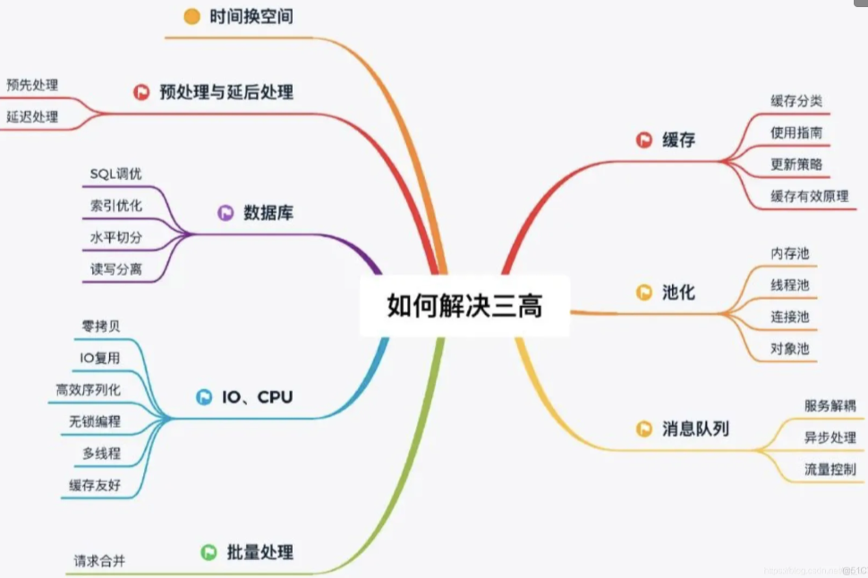

<font style="color:rgb(34, 34, 34);">通常分布式系统结构图如下</font>：

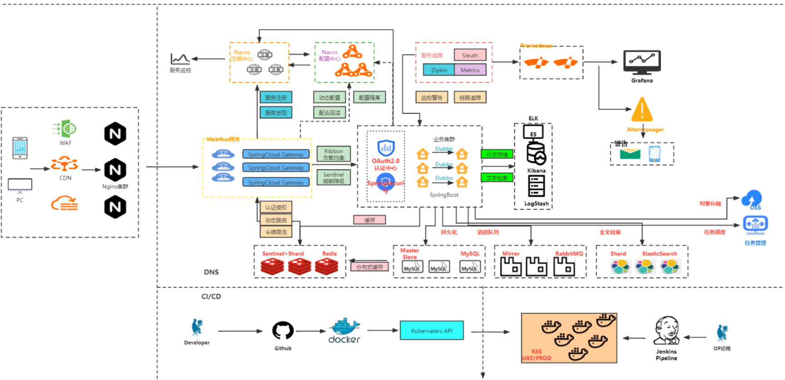

<font style="color:rgb(34, 34, 34);">总的思路可以按照业务流程 每个环节 ，从 </font><font style="color:#DF2A3F;">拦</font><font style="color:rgb(34, 34, 34);">截 和 分</font><font style="color:#DF2A3F;">摊</font><font style="color:rgb(34, 34, 34);">来考虑。如上图中可以</font>

<font style="color:rgb(34, 34, 34);">端：开始将请求拦在系统上游 ，可通过JS限时提交次数 CDN动静分离等</font>

<font style="color:rgb(34, 34, 34);">站点：用户(uid)标识 鉴权防刷 拦截恶意发包. 限流降级，监控预警</font>

<font style="color:rgb(34, 34, 34);">服务：先到多级缓存(CDN，Nginx，Ehcache，Redis，BufferPool)读写分离，再根据数据库 进行异步分批，削峰填谷( 请求队列批次) 等</font>

<font style="color:rgb(34, 34, 34);">数据：数据库缓存，读写分离，集群，SQL优化</font>

<font style="color:rgb(34, 34, 34);">每层都可以考虑分摊，加入负载均衡多网关多中心多数据库实例分流处理， 纵向多级缓存策略 层层过滤分摊压力</font>

<font style="color:rgb(34, 34, 34);"></font>

## <font style="color:rgb(34, 34, 34);">01 | 设计秒杀系统注意的4要1不要架构原则</font>
<font style="color:rgb(34, 34, 34);">对于一个软件而言而言，你可以很快增删改查做出一个秒杀系统，但是要让它支持高并发访问就没那么容易了。</font>

<font style="color:rgb(34, 34, 34);">比如说，如何让系统面对百万级的请求流量不出故障？如何保证高并发情况下数据的一致性写？完全靠堆服务器来解决吗？这显然不是最好的解决方案。</font>

<font style="color:rgb(34, 34, 34);">在我看来，秒杀系统本质上就是一个满足大并发、高性能和高可用的分布式系统。今天，我们就来聊聊，如何在满足一个良好架构的分布式系统基础上，针对秒杀这种业务做到极致的性能改进。</font>

### <font style="color:rgb(34, 34, 34);">1. 数据要尽量少</font>
<font style="color:rgb(34, 34, 34);">所谓“数据要尽量少”，首先是指用户请求的数据能少就少。请求的数据包括上传给系统的数据和系统返回给用户的数据（通常就是网页）。</font>

<font style="color:rgb(34, 34, 34);">为啥“数据要尽量少”呢？因为首先这些数据在网络上传输需要时间，其次不管是请求数据还是返回数据都需要服务器做处理，而服务器在写网络时通常都要做压缩和字符编码，这些都非常消耗 CPU，所以减少传输的数据量可以显著减少 CPU 的使用。</font>

<font style="color:rgb(34, 34, 34);">例如，我们可以简化秒杀页面的大小，去掉不必要的页面装修效果，等等。其次，“数据要尽量少”还要求系统依赖的数据能少就少，包括系统完成某些业务逻辑需要读取和保存的数据，这些数据一般是和后台服务以及数据库打交道的。调用其他服务会涉及数据的序列化和反序列化，而这也是 CPU 的一大杀手，同样也会增加延时。而且，数据库本身也容易成为一个瓶颈，所以和数据库打交道越少越好，数据越简单、越小则越好。</font>

### <font style="color:rgb(51, 51, 51);">2. 请求数要尽量</font><font style="color:rgb(34, 34, 34);">少</font>
<font style="color:rgb(34, 34, 34);">用户请求的页面返回后，浏览器渲染这个页面还要包含其他的额外请求，比如说，这个页面依赖的 CSS/JavaScript、图片，以及 Ajax 请求等等都定义为“额外请求”，这些额外请求应该尽量少。因为浏览器每发出一个请求都多少会有一些消耗。</font>

<font style="color:rgb(34, 34, 34);">例如建立连接要做三次握手，有的时候有页面依赖或者连接数限制，一些请求（例如 JavaScript）还需要串行加载等。另外，如果不同请求的域名不一样的话，还涉及这些域名的 DNS 解析，可能会耗时更久。所以你要记住的是，减少请求数可以显著减少以上这些因素导致的资源消耗。</font>

<font style="color:rgb(34, 34, 34);">例如，减少请求数最常用的一个实践就是合并 CSS 和 JavaScript 文件，把多个 JavaScript 文件合并成一个文件，在 URL 中用逗号隔开（https://g.xxx.com/tm/xx-b/4.0.94/mods/??module-preview/index.xtpl.js,module-jhs/index.xtpl.js,module-focus/index.xtpl.js）。这种方式在服务端仍然是单个文件各自存放，只是服务端会有一个组件解析这个URL，然后动态把这些文件合并起来一起返回。</font>

### <font style="color:rgb(51, 51, 51);">3. 路径要尽量短</font>
<font style="color:rgb(34, 34, 34);">所谓“路径”，就是用户发出请求到返回数据这个过程中，需求经过的中间的节点数。通常，这些节点可以表示为一个系统或者一个新的 Socket 连接（比如代理服务器只是创建一个新的 Socket 连接来转发请求）。每经过一个节点，一般都会产生一个新的 Socket 连接。然而，每增加一个连接都会增加新的不确定性。</font>

<font style="color:rgb(34, 34, 34);">从概率统计上来说，假如一次请求经过 5 个节点，每个节点的可用性是 99.9% 的话，那么整个请求的可用性是：99.9% 的 5 次方，约等于 99.5%。所以缩短请求路径不仅可以增加可用性，同样可以有效提升性能（减少中间节点可以减少数据的序列化与反序列化），并减少延时（可以减少网络传输耗时）。要缩短访问路径有一种办法，就是多个相互强依赖的应用合并部署在一起，把远程过程调用（RPC）变成 JVM 内部之间的方法调用。</font>

### <font style="color:rgb(51, 51, 51);">4. 依赖要尽量少</font>
<font style="color:rgb(34, 34, 34);">所谓依赖，指的是要完成一次用户请求必须依赖的系统或者服务，这里的依赖指的是</font>**<font style="color:rgb(34, 34, 34);">强依赖</font>**<font style="color:rgb(34, 34, 34);">。</font>

<font style="color:rgb(34, 34, 34);">举个例子，比如说你要展示秒杀页面，而这个页面必须强依赖商品信息、用户信息，还有其他如优惠券、成交列表等这些对秒杀不是非要不可的信息（</font>**<font style="color:rgb(34, 34, 34);">弱依赖</font>**<font style="color:rgb(34, 34, 34);">），这些弱依赖在紧急情况下就可以去掉。</font>

<font style="color:rgb(34, 34, 34);">要减少依赖，我们可以给</font>**<font style="color:rgb(34, 34, 34);">系统进行分级</font>**<font style="color:rgb(34, 34, 34);">，比如 0 级系统、1 级系统、2 级系统、3 级系统，0 级系统如果是最重要的系统，那么 0 级系统强依赖的系统也同样是最重要的系统，以此类推。</font>

<font style="color:rgb(34, 34, 34);">注意，0 级系统要尽量减少对 1 级系统的强依赖，防止重要的系统被不重要的系统拖垮。例如支付系统是 0 级系统，而优惠券是 1 级系统的话，在极端情况下可以把优惠券给降级，防止支付系统被优惠券这个 1 级系统给拖垮。</font>

### <font style="color:rgb(51, 51, 51);">5. 不要有单点</font>
<font style="color:rgb(34, 34, 34);">系统中的单点可以说是系统架构上的一个大忌，因为单点意味着没有备份，风险不可控，我们设计分布式系统最重要的原则就是“消除单点”。</font>

<font style="color:rgb(34, 34, 34);">那如何避免单点呢？我认为关键点是避免将服务的状态和机器绑定，即把服务无状态化，这样服务就可以在机器中随意移动。如何那把服务的状态和机器解耦呢？这里也有很多实现方式。</font>

<font style="color:rgb(34, 34, 34);">例如把和机器相关的配置动态化，这些参数可以通过配置中心来动态推送，在服务启动时动态拉取下来，我们在这些配置中心设置一些规则来方便地改变这些映射关系。应用无状态化是有效避免单点的一种方式，但是像存储服务本身很难无状态化，因为数据要存储在磁盘上，本身就要和机器绑定，那么这种场景一般要通过冗余多个备份的方式来解决单点问题。前面介绍了这些设计上的一些原则，但是你有没有发现，我一直说的是“尽量”而不是“绝对”？我想你肯定会问是不是请求最少就一定最好，我的答案是“不一定”。我们曾经把有些 CSS 内联进页面里，这样做可以减少依赖一个 CSS 的请求从而加快首页的渲染，但是同样也增大了页面的大小，又不符合“数据要尽量少”的原则，这种情况下我们为了提升首屏的渲染速度，只把首屏的 HTML 依赖的 CSS 内联进来，其他 CSS 仍然放到文件中作为依赖加载，尽量实现首屏的打开速度与整个页面加载性能的平衡。所以说，架构是一种平衡的艺术，而最好的架构一旦脱离了它所适应的场景，一切都将是空谈。我希望你记住的是，这里所说的几点都只是一个个方向，你应该尽量往这些方向上去努力，但也要考虑平衡其他因素。</font>

### <font style="color:rgb(51, 51, 51);">不同场景下的不同架构案例</font>
<font style="color:rgb(34, 34, 34);">前面我说了一些架构上的原则，那么针对“秒杀”这个场景，怎样才是一个好的架构呢？下面我以淘宝早期秒杀系统架构的演进为主线，来帮你梳理不同的请求体量下，我认为的最佳秒杀系统架构。</font>

<font style="color:rgb(34, 34, 34);">如果你想快速搭建一个简单的秒杀系统，只需要把你的商品购买页面增加一个“定时上架”功能，仅在秒杀开始时才让用户看到购买按钮，当商品的库存卖完了也就结束了。这就是当时第一个版本的秒杀系统实现方式。但随着请求量的加大（比如从 1w/s 到了 10w/s 的量级），这个简单的架构很快就遇到了瓶颈，因此需要做架构改造来提升系统性能。</font>

#### <font style="color:rgb(51, 51, 51);">这些架构改造包括：</font>
<font style="color:rgb(51, 51, 51);">把秒杀系统独立出来单独打造一个系统，这样可以有针对性地做优化，例如这个独立出来的系统就减少了店铺装修的功能，减少了页面的复杂度；</font><font style="color:rgb(51, 51, 51);">在系统部署上也独立做一个机器集群，这样秒杀的大流量就不会影响到正常的商品购买集群的机器负载；</font><font style="color:rgb(51, 51, 51);">将热点数据（如库存数据）单独放到一个缓存系统中，以提高“读性能”；</font><font style="color:rgb(51, 51, 51);">增加秒杀答题，防止有秒杀器抢单。</font><font style="color:rgb(34, 34, 34);">此时的系统架构变成了下图这个样子。最重要的就是，秒杀详情成为了一个独立的新系统，另外核心的一些数据放到了缓存（Cache）中，其他的关联系统也都以独立集群的方式进行部署。</font>

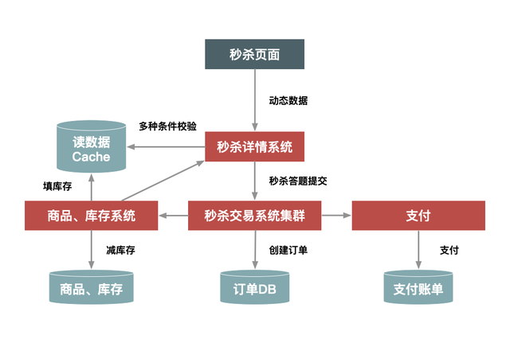<font style="color:rgb(153, 153, 153);"></font>

<font style="color:rgb(34, 34, 34);">然而这个架构仍然支持不了超过 100w/s 的请求量，所以为了进一步提升秒杀系统的性能，我们又对架构做进一步升级，比如：</font>

<font style="color:rgb(51, 51, 51);">对页面进行彻底的动静分离，使得用户秒杀时不需要刷新整个页面，而只需要点击抢宝按钮，借此把页面刷新的数据降到最少；</font><font style="color:rgb(51, 51, 51);">在服务端对秒杀商品进行本地缓存，不需要再调用依赖系统的后台服务获取数据，甚至不需要去公共的缓存集群中查询数据，这样不仅可以减少系统调用，而且能够避免压垮公共缓存集群。</font><font style="color:rgb(51, 51, 51);">增加系统限流保护，防止最坏情况发生。</font><font style="color:rgb(34, 34, 34);">经过这些优化，系统架构变成了下图中的样子。在这里，我们对页面进行了进一步的静态化，秒杀过程中不需要刷新整个页面，而只需要向服务端请求很少的动态数据。而且，最关键的详情和交易系统都增加了本地缓存，来提前缓存秒杀商品的信息，热点数据库也做了独立部署，等等。</font>

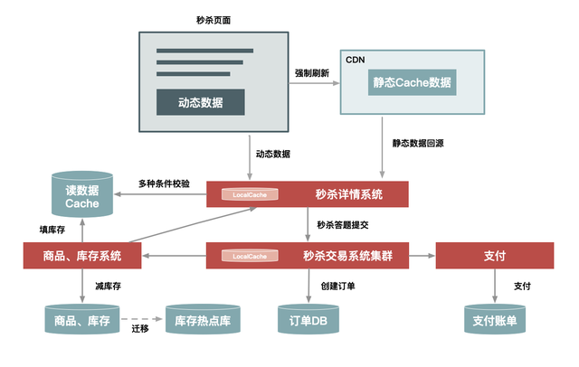<font style="color:rgb(153, 153, 153);"></font>

<font style="color:rgb(34, 34, 34);">从前面的几次升级来看，其实越到后面需要定制的地方越多，也就是越“不通用”。例如，把秒杀商品缓存在每台机器的内存中，这种方式显然不适合太多的商品同时进行秒杀的情况，因为单机的内存始终有限。所以要取得极致的性能，就要在其他地方（比如，通用性、易用性、成本等方面）有所牺牲。</font>

<font style="color:rgb(34, 34, 34);"></font>

## <font style="color:rgb(34, 34, 34);">02 | 做好动静分离？处理缓存命中和失效</font>
### <font style="color:rgb(34, 34, 34);">数据的动静分离</font>
<font style="color:rgb(34, 34, 34);">不知道你之前听过这个解决方案吗？</font>

<font style="color:rgb(34, 34, 34);">不管你有没有听过，我都建议你先停下来思考动静分离的价值。如果你的系统还没有开始应用动静分离的方案，那你也可以想想为什么没有，是之前没有想到，还是说业务体量根本用不着？</font>

<font style="color:rgb(34, 34, 34);">不过我可以确信地说，如果你在一个业务飞速发展的公司里，并且你在深度参与公司内类秒杀类系统的架构或者开发工作，那么你迟早会想到动静分离的方案。为什么？</font>

<font style="color:rgb(34, 34, 34);">很简单，秒杀的场景中，</font>**<font style="color:rgb(51, 51, 51);">对于系统的要求其实就三个字：快、准、稳。</font>**

<font style="color:rgb(34, 34, 34);">那怎么才能“快”起来呢？我觉得抽象起来讲，就只有两点，一点是提高单次请求的效率，一点是减少没必要的请求。今天我们聊到的“动静分离”其实就是瞄着这个大方向去的。</font><font style="color:rgb(34, 34, 34);">不知道你是否还记得，最早的秒杀系统其实是要刷新整体页面的，但后来秒杀的时候，你只要点击“刷新抢宝”按钮就够了，这种变化的本质就是动静分离，分离之后，客户端大幅度减少了请求的数据量。这不自然就“快”了吗？</font>

### <font style="color:rgb(0, 0, 0);">何为动静数据</font>
<font style="color:rgb(34, 34, 34);">那到底什么才是动静分离呢？所谓“动静分离”，其实就是把用户请求的数据（如 HTML 页面）划分为“动态数据”和“静态数据”。</font>

<font style="color:rgb(34, 34, 34);">简单来说，“动态数据”和“静态数据”的主要区别就是看页面中输出的数据是否和 URL、浏览者、时间、地域相关，以及是否含有 Cookie 等私密数据。比如说：</font>

<font style="color:rgb(34, 34, 34);">很多媒体类的网站，某一篇文章的内容不管是你访问还是我访问，它都是一样的。所以它就是一个典型的静态数据，但是它是个动态页面。</font>

<font style="color:rgb(34, 34, 34);">我们如果现在访问淘宝的首页，每个人看到的页面可能都是不一样的，淘宝首页中包含了很多根据访问者特征推荐的信息，而这些个性化的数据就可以理解为动态数据了。</font>

<font style="color:rgb(34, 34, 34);">这里再强调一下，我们所说的静态数据，不能仅仅理解为传统意义上完全存在磁盘上的 HTML 页面，它也可能是经过 Java 系统产生的页面，但是它输出的页面本身不包含上面所说的那些因素。也就是所谓“动态”还是“静态”，并不是说数据本身是否动静，而是数据中是否含有和访问者相关的个性化数据。</font>

<font style="color:rgb(34, 34, 34);">还有一点要注意，就是页面中“不包含”，指的是“页面的 HTML 源码中不含有”，这一点务必要清楚。理解了静态数据和动态数据，我估计你很容易就能想明白“动静分离”这个方案的来龙去脉了。分离了动静数据，我们就可以对分离出来的静态数据做缓存，有了缓存之后，静态数据的“访问效率”自然就提高了。</font>

### <font style="color:rgb(51, 51, 51);">那么，怎样对静态数据做缓存呢？</font>
**<font style="color:rgb(51, 51, 51);">我在这里总结了几个重点。</font>**

#### <font style="color:rgb(51, 51, 51);">第一，你应该把静态数据缓存到离用户最近的地方。</font>
<font style="color:rgb(34, 34, 34);">静态数据就是那些相对不会变化的数据，因此我们可以把它们缓存起来。缓存到哪里呢？常见的就三种，用户浏览器里、CDN 上或者在服务端的 Cache 中。你应该根据情况，把它们尽量缓存到离用户最近的地方。</font>

#### <font style="color:rgb(51, 51, 51);">第二，静态化改造就是要直接缓存 HTTP 连接。</font>
<font style="color:rgb(34, 34, 34);">相较于普通的数据缓存而言，你肯定还听过系统的静态化改造。静态化改造是直接缓存 HTTP 连接而不是仅仅缓存数据，如下图所示，Web 代理服务器根据请求 URL，直接取出对应的 HTTP 响应头和响应体然后直接返回，这个响应过程简单得连 HTTP 协议都不用重新组装，甚至连 HTTP 请求头也不需要解析。</font>

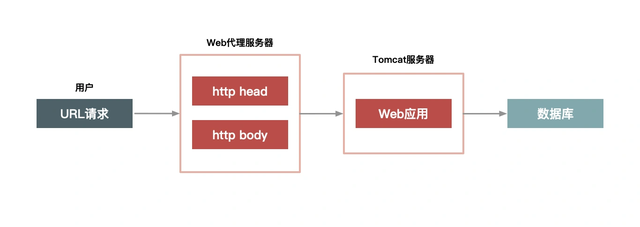<font style="color:rgb(153, 153, 153);"></font>

#### <font style="color:rgb(51, 51, 51);">第三，让谁来缓存静态数据也很重要。</font>
<font style="color:rgb(34, 34, 34);">不同语言写的 Cache 软件处理缓存数据的效率也各不相同。以 Java 为例，因为 Java 系统本身也有其弱点（比如不擅长处理大量连接请求，每个连接消耗的内存较多，Servlet 容器解析 HTTP 协议较慢），所以你可以不在 Java 层做缓存，而是直接在 Web 服务器层上做，这样你就可以屏蔽 Java 语言层面的一些弱点；而相比起来，Web 服务器（如 Nginx、Apache、Varnish）也更擅长处理大并发的静态文件请求。</font>

### <font style="color:rgb(0, 0, 0);">如何做动静分离的改造</font>
<font style="color:rgb(34, 34, 34);">理解了动静态数据的“why”和“what”，接下来我们就要看“how”了。我们如何把动态页面改造成适合缓存的静态页面呢？其实也很简单，就是去除前面所说的那几个影响因素，把它们单独分离出来，做动静分离。</font>

<font style="color:rgb(34, 34, 34);">下面，我以典型的商品详情系统为例来详细介绍。这里，你可以先打开京东或者淘宝的商品详情页，看看这个页面里都有哪些动静数据。</font>

#### <font style="color:rgb(34, 34, 34);">以下 </font><font style="color:rgb(51, 51, 51);">5 个方面</font><font style="color:rgb(34, 34, 34);">来分离出动态内容。</font>
**<font style="color:rgb(51, 51, 51);">- URL 唯一化。</font>**<font style="color:rgb(34, 34, 34);">商品详情系统天然地就可以做到 URL 唯一化，比如每个商品都由 ID 来标识，那么</font><font style="color:rgb(34, 34, 34);"> </font><font style="color:rgb(34, 34, 34);">http://item.xxx.com/item.htm?id=xxxx</font><font style="color:rgb(34, 34, 34);">就可以作为唯一的 URL 标识。为啥要 URL 唯一呢？前面说了我们是要缓存整个 HTTP 连接，那么以什么作为 Key 呢？就以 URL 作为缓存的 Key，例如以 id=xxx 这个格式进行区分。</font>

**<font style="color:rgb(51, 51, 51);">- 分离浏览者相关的因素。</font>**<font style="color:rgb(34, 34, 34);">浏览者相关的因素包括是否已登录，以及登录身份等，这些相关因素我们可以单独拆分出来，通过动态请求来获取。</font>

**<font style="color:rgb(51, 51, 51);">- 分离时间因素。</font>**<font style="color:rgb(34, 34, 34);">服务端输出的时间也通过动态请求获取。</font>

**<font style="color:rgb(51, 51, 51);">- 异步化地域因素。</font>**<font style="color:rgb(34, 34, 34);">详情页面上与地域相关的因素做成异步方式获取，当然你也可以通过动态请求方式获取，只是这里通过异步获取更合适。</font>

**<font style="color:rgb(51, 51, 51);">- 去掉 Cookie。</font>**<font style="color:rgb(34, 34, 34);">服务端输出的页面包含的 Cookie 可以通过代码软件来删除，如 Web 服务器 Varnish 可以通过 unset req.http.cookie 命令去掉 Cookie。注意，这里说的去掉 Cookie 并不是用户端收到的页面就不含 Cookie 了，而是说，在缓存的静态数据中不含有 Cookie。</font>

<font style="color:rgb(34, 34, 34);">分离出动态内容之后，如何组织这些内容页就变得非常关键了。这里我要提醒你一点，因为这其中很多动态内容都会被页面中的其他模块用到，如判断该用户是否已登录、用户 ID 是否匹配等，所以这个时候我们应该将这些信息 JSON 化（用 JSON 格式组织这些数据），以方便前端获取。</font>

<font style="color:rgb(34, 34, 34);">前面我们介绍里用缓存的方式来处理静态数据。而动态内容的处理通常有两种方案：ESI（Edge Side Includes）方案和 CSI（Client Side Include）方案。</font>

**<font style="color:rgb(51, 51, 51);">ESI 方案（或者 SSI）：</font>**<font style="color:rgb(34, 34, 34);">即在 Web 代理服务器上做动态内容请求，并将请求插入到静态页面中，当用户拿到页面时已经是一个完整的页面了。这种方式对服务端性能有些影响，但是用户体验较好。</font>

**<font style="color:rgb(51, 51, 51);">CSI 方案。</font>**<font style="color:rgb(34, 34, 34);">即单独发起一个异步 JavaScript 请求，以向服务端获取动态内容。这种方式服务端性能更佳，但是用户端页面可能会延时，体验稍差。</font>

### <font style="color:rgb(0, 0, 0);">动静分离的几种架构方案</font>
<font style="color:rgb(34, 34, 34);">前面我们通过改造把静态数据和动态数据做了分离，那么如何在系统架构上进一步对这些动态和静态数据重新组合，再完整地输出给用户呢？这就涉及对用户请求路径进行合理的架构了。根据架构上的复杂度，</font>**<font style="color:rgb(51, 51, 51);">有 3 种方案可选：实体机单机部署；统一 Cache 层；上 CDN。</font>**

**<font style="color:rgb(34, 34, 34);">方案 1：实体机单机部署</font>**

<font style="color:rgb(34, 34, 34);">这种方案是将虚拟机改为实体机，以增大 Cache 的容量，并且采用了一致性 Hash 分组的方式来提升命中率。这里将 Cache 分成若干组，是希望能达到命中率和访问热点的平衡。Hash 分组越少，缓存的命中率肯定就会越高，但短板是也会使单个商品集中在一个分组中，容易导致 Cache 被击穿，所以我们应该适当增加多个相同的分组，来平衡访问热点和命中率的问题。这里我给出了实体机单机部署方案的结构图，如下：</font>

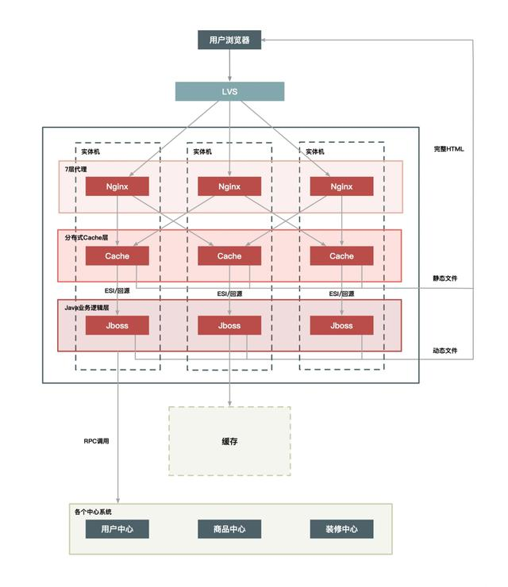<font style="color:rgb(153, 153, 153);"></font>

**<font style="color:rgb(51, 51, 51);">实体机单机部署有以下几个优点：</font>**

<font style="color:rgb(34, 34, 34);">没有网络瓶颈，而且能使用大内存；既能提升命中率，又能减少 Gzip 压缩；减少 Cache 失效压力，因为采用定时失效方式，例如只缓存 3 秒钟，过期即自动失效。</font>

<font style="color:rgb(34, 34, 34);">这个方案中，虽然把通常只需要虚拟机或者容器运行的 Java 应用换成实体机，优势很明显，它会增加单机的内存容量，但是一定程度上也造成了 CPU 的浪费，因为单个的 Java 进程很难用完整个实体机的 CPU。</font>

<font style="color:rgb(34, 34, 34);">另外就是，一个实体机上部署了 Java 应用又作为 Cache 来使用，这造成了运维上的高复杂度，所以这是一个折中的方案。如果你的公司里，没有更多的系统有类似需求，那么这样做也比较合适，如果你们有多个业务系统都有静态化改造的需求，那还是建议把 Cache 层单独抽出来公用比较合理，如下面的方案 2 所示。</font>

**<font style="color:rgb(34, 34, 34);">方案 2：统一 Cache 层</font>**

<font style="color:rgb(34, 34, 34);">所谓统一 Cache 层，就是将单机的 Cache 统一分离出来，形成一个单独的 Cache 集群。统一 Cache 层是个更理想的可推广方案，该方案的结构图如下：</font>

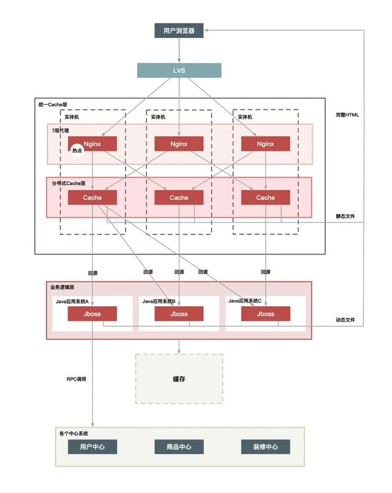<font style="color:rgb(153, 153, 153);"></font>

<font style="color:rgb(34, 34, 34);">将 Cache 层单独拿出来统一管理可以减少运维成本，同时也方便接入其他静态化系统。此外，它还有一些优点。 </font>

<font style="color:rgb(34, 34, 34);">单独一个 Cache 层，可以减少多个应用接入时使用 Cache 的成本。这样接入的应用只要维护自己的 Java 系统就好，不需要单独维护 Cache，而只关心如何使用即可</font><font style="color:rgb(34, 34, 34);">统一 Cache 的方案更易于维护，如后面加强监控、配置的自动化，只需要一套解决方案就行，统一起来维护升级也比较方便。</font><font style="color:rgb(34, 34, 34);">可以共享内存，最大化利用内存，不同系统之间的内存可以动态切换，从而能够有效应对各种攻击。</font>

**<font style="color:rgb(51, 51, 51);">这种方案虽然维护上更方便了，但是也带来了其他一些问题，比如缓存更加集中，导致：</font>**

<font style="color:rgb(34, 34, 34);">Cache 层内部交换网络成为瓶颈；</font><font style="color:rgb(34, 34, 34);">缓存服务器的网卡也会是瓶颈；</font><font style="color:rgb(34, 34, 34);">机器少风险较大，挂掉一台就会影响很大一部分缓存数据。</font>

<font style="color:rgb(34, 34, 34);">要解决上面这些问题，可以再对 Cache 做 Hash 分组，即一组 Cache 缓存的内容相同，这样能够避免热点数据过度集中导致新的瓶颈产生。</font>

**<font style="color:rgb(34, 34, 34);">方案 3：上 CDN</font>**

<font style="color:rgb(34, 34, 34);">在将整个系统做动静分离后，我们自然会想到更进一步的方案，就是将 Cache 进一步前移到 CDN 上，因为 CDN 离用户最近，效果会更好。</font>

<font style="color:rgb(34, 34, 34);">但是要想这么做，</font>**<font style="color:rgb(51, 51, 51);">有以下几个问题需要解决。</font>**

**<font style="color:rgb(51, 51, 51);">失效问题。</font>**<font style="color:rgb(34, 34, 34);">前面我们也有提到过缓存时效的问题，不知道你有没有理解，我再来解释一下。谈到静态数据时，我说过一个关键词叫“相对不变”，它的言外之意是“可能会变化”。比如一篇文章，现在不变，但如果你发现个错别字，是不是就会变化了？如果你的缓存时效很长，那用户端在很长一段时间内看到的都是错的。所以，这个方案中也是，我们需要保证 CDN 可以在秒级时间内，让分布在全国各地的 Cache 同时失效，这对 CDN 的失效系统要求很高。</font>

**<font style="color:rgb(51, 51, 51);">命中率问题。</font>**<font style="color:rgb(34, 34, 34);">Cache 最重要的一个衡量指标就是“高命中率”，不然 Cache 的存在就失去了意义。同样，如果将数据全部放到全国的 CDN 上，必然导致 Cache 分散，而 Cache 分散又会导致访问请求命中同一个 Cache 的可能性降低，那么命中率就成为一个问题。</font>

**<font style="color:rgb(51, 51, 51);">发布更新问题</font>**<font style="color:rgb(34, 34, 34);">。如果一个业务系统每周都有日常业务需要发布，那么发布系统必须足够简洁高效，而且你还要考虑有问题时快速回滚和排查问题的简便性。</font>

<font style="color:rgb(34, 34, 34);">从前面的分析来看，将商品详情系统放到全国的所有 CDN 节点上是不太现实的，因为存在失效问题、命中率问题以及系统的发布更新问题。那么是否可以选择若干个节点来尝试实施呢？答案是“可以”，但是这样的节点*需要满足几个条件： *</font><font style="color:rgb(34, 34, 34);">靠近访问量比较集中的地区；</font><font style="color:rgb(34, 34, 34);">离主站相对较远；</font><font style="color:rgb(34, 34, 34);">节点到主站间的网络比较好，而且稳定；</font><font style="color:rgb(34, 34, 34);">节点容量比较大，不会占用其他 CDN 太多的资源。</font>

<font style="color:rgb(34, 34, 34);">最后，还有一点也很重要，那就是：</font>**<font style="color:rgb(51, 51, 51);">节点不要太多</font>**<font style="color:rgb(34, 34, 34);">。基于上面几个因素，选择 CDN 的二级 Cache 比较合适，因为二级 Cache 数量偏少，容量也更大，让用户的请求先回源的 CDN 的二级 Cache 中，如果没命中再回源站获取数据</font><font style="color:rgb(34, 34, 34);">部署方式如下图所示：</font>

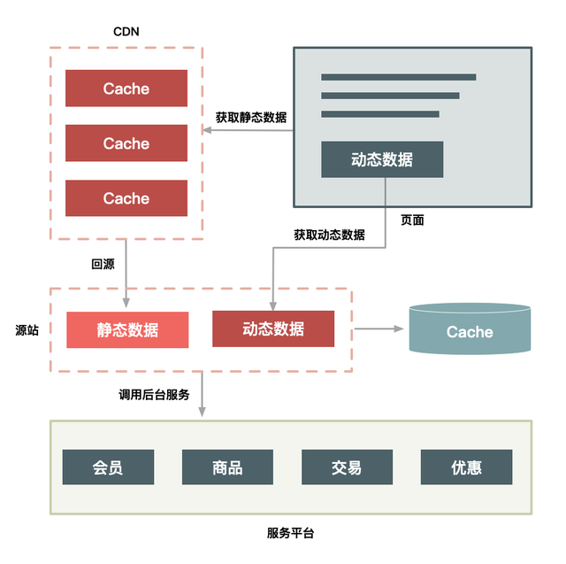<font style="color:rgb(153, 153, 153);"></font>

<font style="color:rgb(6, 6, 7);">这三种动静分离方案各有优缺点，一般选择哪种取决于具体的应用场景和需求，以下是详细介绍：</font>

#### <font style="color:rgb(6, 6, 7);">实体机单机部署</font>
+ **<font style="color:rgb(6, 6, 7);">优点</font>**<font style="color:rgb(6, 6, 7);">：</font>
    - **<font style="color:rgb(6, 6, 7);">无网络瓶颈</font>**<font style="color:rgb(6, 6, 7);">：数据传输无需经过复杂的网络环境，能充分利用机器的大内存，提升数据处理速度</font><font style="color:rgb(6, 6, 7);">。</font>
    - **<font style="color:rgb(6, 6, 7);">命中率高</font>**<font style="color:rgb(6, 6, 7);">：通过一致性Hash分组，可有效提升缓存命中率，减少对后端数据库的访问压力</font><font style="color:rgb(6, 6, 7);">。</font>
    - **<font style="color:rgb(6, 6, 7);">减少Gzip压缩</font>**<font style="color:rgb(6, 6, 7);">：在本地进行数据处理，无需频繁进行网络传输中的Gzip压缩操作，进一步提高效率</font><font style="color:rgb(6, 6, 7);">。</font>
    - **<font style="color:rgb(6, 6, 7);">缓存失效压力小</font>**<font style="color:rgb(6, 6, 7);">：采用定时失效方式，如只缓存3秒钟，过期自动失效，减少了缓存失效的复杂操作</font><font style="color:rgb(6, 6, 7);">。</font>
+ **<font style="color:rgb(6, 6, 7);">缺点</font>**<font style="color:rgb(6, 6, 7);">：</font>
    - **<font style="color:rgb(6, 6, 7);">CPU资源浪费</font>**<font style="color:rgb(6, 6, 7);">：单个Java进程很难用完整个实体机的CPU，造成了一定的CPU资源浪费</font><font style="color:rgb(6, 6, 7);">。</font>
    - **<font style="color:rgb(6, 6, 7);">运维复杂</font>**<font style="color:rgb(6, 6, 7);">：一台机器上既要部署Java应用，又要作为缓存服务器，增加了运维的复杂度</font><font style="color:rgb(6, 6, 7);">。</font>

#### <font style="color:rgb(6, 6, 7);">统一Cache层</font>
+ **<font style="color:rgb(6, 6, 7);">优点</font>**<font style="color:rgb(6, 6, 7);">：</font>
    - **<font style="color:rgb(6, 6, 7);">运维成本低</font>**<font style="color:rgb(6, 6, 7);">：将缓存层单独分离出来统一管理，只需一套解决方案，方便对缓存进行监控、配置自动化等维护升级操作</font><font style="color:rgb(6, 6, 7);">。</font>
    - **<font style="color:rgb(6, 6, 7);">接入成本低</font>**<font style="color:rgb(6, 6, 7);">：其他应用接入时，只需维护自己的Java系统，不关心缓存，降低了接入成本</font><font style="color:rgb(6, 6, 7);">。</font>
    - **<font style="color:rgb(6, 6, 7);">内存利用率高</font>**<font style="color:rgb(6, 6, 7);">：不同系统之间可以共享内存，实现内存的动态切换，有效应对各种攻击</font><font style="color:rgb(6, 6, 7);">。</font>
+ **<font style="color:rgb(6, 6, 7);">缺点</font>**<font style="color:rgb(6, 6, 7);">：</font>
    - **<font style="color:rgb(6, 6, 7);">网络瓶颈</font>**<font style="color:rgb(6, 6, 7);">：Cache层内部交换网络及缓存服务器的网卡容易成为瓶颈，影响数据传输效率</font><font style="color:rgb(6, 6, 7);">。</font>
    - **<font style="color:rgb(6, 6, 7);">风险集中</font>**<font style="color:rgb(6, 6, 7);">：机器数量较少，一旦挂掉一台，就会导致很大一部分缓存数据受到影响</font><font style="color:rgb(6, 6, 7);">。</font>

#### <font style="color:rgb(6, 6, 7);">上CDN层</font>
+ **<font style="color:rgb(6, 6, 7);">优点</font>**<font style="color:rgb(6, 6, 7);">：</font>
    - **<font style="color:rgb(6, 6, 7);">地理分布广</font>**<font style="color:rgb(6, 6, 7);">：CDN节点在地理上分散，用户可以就近访问内容资源，大大缩短了数据传输距离，使静态内容能够更快地到达用户端，提高访问速度</font><font style="color:rgb(6, 6, 7);">。</font>
    - **<font style="color:rgb(6, 6, 7);">命中率高</font>**<font style="color:rgb(6, 6, 7);">：使用CDN的二级缓存，由于二级缓存节点数更少、容量更大，能够保持较高的命中率</font><font style="color:rgb(6, 6, 7);">。</font>
    - **<font style="color:rgb(6, 6, 7);">缓存更新方便</font>**<font style="color:rgb(6, 6, 7);">：在CDN上方便进行主动失效、缓存更新等操作，确保用户获取到最新的静态内容</font><font style="color:rgb(6, 6, 7);">。</font>
+ **<font style="color:rgb(6, 6, 7);">缺点</font>**<font style="color:rgb(6, 6, 7);">：</font>
    - **<font style="color:rgb(6, 6, 7);">缓存失效问题</font>**<font style="color:rgb(6, 6, 7);">：静态数据可能会发生变化，需要保证CDN在秒级内，让分布在各地的缓存同时失效，否则用户可能会获取到旧的内容</font><font style="color:rgb(6, 6, 7);">。</font>

<font style="color:rgb(6, 6, 7);">一般来说，对于访问量大、对静态内容加载速度要求高的网站或应用，如大型电商网站、视频网站等，</font>**<font style="color:rgb(6, 6, 7);">上CDN</font>**<font style="color:rgb(6, 6, 7);">是较好的选择，因为它能有效利用CDN的分布式节点优势，快速分发静态内容，提升用户体验。而对于一些对数据安全性和隐私性要求较高，且访问量相对较小的内部系统或企业应用，可能会更倾向于选择</font>**<font style="color:rgb(6, 6, 7);">实体机单机部署</font>**<font style="color:rgb(6, 6, 7);">，以确保数据的可控性和安全性。而</font>**<font style="color:rgb(6, 6, 7);">统一Cache层</font>**<font style="color:rgb(6, 6, 7);">方案则适用于那些需要多个应用共享缓存资源，且对缓存的运维管理有较高要求的场景。</font>

<font style="color:rgb(34, 34, 34);">使用 CDN 的二级 Cache 作为缓存，可以达到和当前服务端静态化 Cache 类似的命中率，因为节点数不多，Cache 不是很分散，访问量也比较集中，这样也就解决了命中率问题，同时能够给用户最好的访问体验，是当前比较理想的一种 CDN 化方案。</font>

<font style="color:rgb(34, 34, 34);">除此之外，CDN 化部署方案还有以下几个特点：</font>

<font style="color:rgb(51, 51, 51);">把整个页面缓存在用户浏览器中；</font><font style="color:rgb(51, 51, 51);">如果强制刷新整个页面，也会请求 CDN；</font><font style="color:rgb(51, 51, 51);">实际有效请求，只是用户对“刷新抢宝”按钮的点击。</font><font style="color:rgb(34, 34, 34);">这样就把 90% 的静态数据缓存在了用户端或者 CDN 上，当真正秒杀时，用户只需要点击特殊的“刷新抢宝”按钮，而不需要刷新整个页面。这样一来，系统只是向服务端请求很少的有效数据，而不需要重复请求大量的静态数据。秒杀的动态数据和普通详情页面的动态数据相比更少，性能也提升了 3 倍以上。</font>

<font style="color:rgb(34, 34, 34);">所以“抢宝”这种设计思路，让我们不用刷新页面就能够很好地请求到服务端最新的动态数据。</font>

### <font style="color:rgb(34, 34, 34);">解决CDN缓存失效</font><font style="color:rgb(6, 6, 7);">策略：</font>
#### <font style="color:rgb(6, 6, 7);">1. 配置缓存刷新</font>
<font style="color:rgb(6, 6, 7);">配置缓存刷新是最直接的方法，适用于需要立即刷新的场景。CDN服务商通常提供多种刷新方式，包括目录刷新和URL刷新。</font>

+ **<font style="color:rgb(6, 6, 7);">目录刷新</font>**<font style="color:rgb(6, 6, 7);">：适用于更新整个目录下的所有文件。操作步骤如下：</font>
    1. <font style="color:rgb(6, 6, 7);">登录CDN控制台。</font>
    2. <font style="color:rgb(6, 6, 7);">选择需要刷新的域名。</font>
    3. <font style="color:rgb(6, 6, 7);">点击“缓存刷新”，选择“目录刷新”。</font>
    4. <font style="color:rgb(6, 6, 7);">输入需要刷新的目录路径，点击“确认”即可。</font>
+ **<font style="color:rgb(6, 6, 7);">URL刷新</font>**<font style="color:rgb(6, 6, 7);">：适用于更新特定的文件。操作步骤如下：</font>
    1. <font style="color:rgb(6, 6, 7);">登录CDN控制台。</font>
    2. <font style="color:rgb(6, 6, 7);">选择需要刷新的域名。</font>
    3. <font style="color:rgb(6, 6, 7);">点击“缓存刷新”，选择“URL刷新”。</font>
    4. <font style="color:rgb(6, 6, 7);">输入需要刷新的URL，点击“确认”即可。</font>

#### <font style="color:rgb(6, 6, 7);">2. 利用API接口</font>
<font style="color:rgb(6, 6, 7);">对于有编程能力的团队，使用API接口自动刷新缓存是一个更灵活高效的方法。CDN服务商通常提供丰富的API接口，支持缓存刷新、预热等操作。</font>

+ **<font style="color:rgb(6, 6, 7);">获取API凭证</font>**<font style="color:rgb(6, 6, 7);">：首先，您需要获取CDN API的访问凭证，包括SecretId和SecretKey。这些凭证可以在CDN控制台的“访问管理”中获取。</font>
+ **<font style="color:rgb(6, 6, 7);">编写刷新脚本</font>**<font style="color:rgb(6, 6, 7);">：根据您的需求，编写一个脚本来调用CDN的缓存刷新API。以下是我之前写过的一份刷新API的代码：</font>

```java
import java.io.UnsupportedEncodingException;
import java.net.URLEncoder;
import java.nio.charset.StandardCharsets;
import java.security.MessageDigest;
import java.security.NoSuchAlgorithmException;
import java.util.ArrayList;
import java.util.Collections;
import java.util.List;
import java.util.Map;
import java.util.TreeMap;
import org.apache.http.NameValuePair;
import org.apache.http.message.BasicNameValuePair;
import org.apache.http.client.utils.URLEncodedUtils;
import javax.crypto.Mac;
import javax.crypto.spec.SecretKeySpec;
/**
 * @Auth:TianMing
 * @Description： 调用CDN缓存刷新API
 */
public class CDNRefresh {
    //生成签名。首先对参数进行排序，然后使用HmacSHA1算法生成签名
    public static String getSignature(String secretKey, Map<String, String> params) throws NoSuchAlgorithmException, UnsupportedEncodingException {
        // 对参数进行排序
        TreeMap<String, String> sortedParams = new TreeMap<>(params);
        StringBuilder encodedParams = new StringBuilder();
        for (Map.Entry<String, String> entry : sortedParams.entrySet()) {
            encodedParams.append(entry.getKey()).append("=").append(URLEncoder.encode(entry.getValue(), StandardCharsets.UTF_8.name()));
            encodedParams.append("&");
        }
        // 去掉最后一个&
        encodedParams.deleteCharAt(encodedParams.length() - 1);

        // 使用HmacSHA1算法生成签名
        Mac sha1Hmac = Mac.getInstance("HmacSHA1");
        SecretKeySpec secretKeySpec = new SecretKeySpec(secretKey.getBytes(StandardCharsets.UTF_8), "HmacSHA1");
        sha1Hmac.init(secretKeySpec);
        byte[] hash = sha1Hmac.doFinal(encodedParams.toString().getBytes(StandardCharsets.UTF_8));
        StringBuilder signature = new StringBuilder();
        for (byte b : hash) {
            String hex = Integer.toHexString((b & 0xFF) | 0x100).substring(1, 3);
            signature.append(hex);
        }
        return signature.toString();
    }
    //构建请求URL。将参数和签名添加到请求URL中  
    public static String refreshCache(String secretId, String secretKey, String urls) throws NoSuchAlgorithmException, UnsupportedEncodingException {
        String base_url = "https://cdn.api.qcloud.com/v2/index.php";
        Map<String, String> params = new TreeMap<>();
        params.put("Action", "RefreshCdnUrl");
        params.put("SecretId", secretId);
        params.put("Timestamp", String.valueOf(System.currentTimeMillis() / 1000));
        params.put("Nonce", String.valueOf(System.currentTimeMillis()));
        params.put("urls.0", urls);

        // 获取签名
        String signature = getSignature(secretKey, params);
        params.put("Signature", signature);

        // 构建请求URL
        List<NameValuePair> nameValuePairs = new ArrayList<>();
        for (Map.Entry<String, String> entry : params.entrySet()) {
            nameValuePairs.add(new BasicNameValuePair(entry.getKey(), entry.getValue()));
        }
        String requestUrl = base_url + "?" + URLEncodedUtils.format(nameValuePairs, StandardCharsets.UTF_8);

        // 发送GET请求
        // 这里可以使用HttpClient等工具发送请求，这里仅展示构建请求URL的过程
        // 例如使用Apache HttpClient发送请求
        // CloseableHttpClient httpClient = HttpClients.createDefault();
        // HttpGet httpget = new HttpGet(requestUrl);
        // CloseableHttpResponse response = httpClient.execute(httpget);
        // try {
        //     // 处理响应
        // } finally {
        //     response.close();
        // }

        return requestUrl;
    }
   //调用 refreshCache 方法，生成请求URL并打印
    public static void main(String[] args) {
        try {
            String secretId = "TiMi_SecretId";
            String secretKey = "TiMi_SecretKey";
            String urls = "https://tuling.com/path/to/your/file";
            //构建请求URL，实际发送请求时可以使用 HttpClient 等工具
            String requestUrl = refreshCache(secretId, secretKey, urls);
            //真实场景记录异步日志
            System.out.println(requestUrl);
            //捕获异常，确保在运行时不会因为这些异常而导致程序崩溃。
        } catch (NoSuchAlgorithmException | UnsupportedEncodingException e) {
            e.printStackTrace();
        }
    }
}
```

#### <font style="color:rgb(6, 6, 7);">3. 定期策略刷新</font>
<font style="color:rgb(6, 6, 7);">对于内容更新频繁的网站，可以通过定期策略刷新缓存来保证内容的及时性。这种方法适用于大部分资源都需要定期更新的场景。</font>

+ **<font style="color:rgb(6, 6, 7);">设置缓存规则</font>**<font style="color:rgb(6, 6, 7);">：在CDN控制台，可以为不同类型的文件设置不同的缓存过期时间。例如，图片、CSS、JS文件可以设置较长的缓存时间，而HTML文件可以设置较短的缓存时间。具体操作步骤如下：</font>
    1. <font style="color:rgb(6, 6, 7);">登录CDN控制台。</font>
    2. <font style="color:rgb(6, 6, 7);">选择需要设置缓存规则的域名。</font>
    3. <font style="color:rgb(6, 6, 7);">点击“缓存配置”，选择“缓存规则”。</font>
    4. <font style="color:rgb(6, 6, 7);">根据文件类型设置不同的缓存过期时间，点击“确认”即可。</font>

#### <font style="color:rgb(6, 6, 7);">4. 合理设置HTTP缓存头</font>
<font style="color:rgb(6, 6, 7);">通过调整HTTP缓存头，可以更精细地控制缓存行为，确保用户获取到最新内容。</font>

+ **<font style="color:rgb(6, 6, 7);">合理配置Cache-Control</font>**<font style="color:rgb(6, 6, 7);">：根据实际需求设置合适的Cache-Control指令，如</font>`max-age`<font style="color:rgb(6, 6, 7);">、</font>`no-cache`<font style="color:rgb(6, 6, 7);">、</font>`public`<font style="color:rgb(6, 6, 7);">等，以控制CDN和浏览器的缓存行为。</font>
+ **<font style="color:rgb(6, 6, 7);">利用ETag和Last-Modified</font>**<font style="color:rgb(6, 6, 7);">：通过ETag和Last-Modified头部信息，可以进一步优化缓存策略，确保客户端获取到最新内容。</font>

#### <font style="color:rgb(6, 6, 7);">5. 版本控制</font>
<font style="color:rgb(6, 6, 7);">当静态资源更新时，更改文件名或版本号，确保用户总是获取最新版本的资源，避免浏览器缓存旧版本资源。</font>

#### <font style="color:rgb(6, 6, 7);">6. 监控和日志分析</font>
<font style="color:rgb(6, 6, 7);">利用CDN提供商的监控和日志功能，实时了解CDN性能表现，及时发现并解决潜在问题，优化服务质量。</font>

<font style="color:rgb(6, 6, 7);">通过以上方法，可以有效解决CDN缓存失效问题，提高网站性能和用户体验。</font>

<font style="color:rgb(34, 34, 34);"></font>

## <font style="color:rgb(34, 34, 34);">03 | 二八原则：处理好系统的“热点数据”</font>
### <font style="color:rgb(0, 0, 0);">什么是“热点”</font>
<font style="color:rgb(34, 34, 34);">热点分为</font>**<font style="color:rgb(51, 51, 51);">热点操作和热点数据</font>**<font style="color:rgb(34, 34, 34);">。所谓“热点操作”，例如大量的刷新页面、大量的添加购物车、双十一零点大量的下单等都属于此类操作。对系统来说，这些操作可以抽象为“读请求”和“写请求”，这两种热点请求的处理方式大相径庭，读请求的优化空间要大一些，而写请求的瓶颈一般都在存储层，优化的思路就是根据 CAP 理论做平衡，这个内容我在“减库存”一文再详细介绍。</font>

<font style="color:rgb(34, 34, 34);">而“热点数据”比较好理解，那就是用户的热点请求对应的数据。而热点数据又分为“静态热点数据”和“动态热点数据”</font>

<font style="color:rgb(34, 34, 34);">所谓“</font>**<font style="color:rgb(34, 34, 34);">静态热点数据</font>**<font style="color:rgb(34, 34, 34);">”，就是能够提前预测的热点数据。例如，我们可以通过卖家报名的方式提前筛选出来，通过报名系统对这些热点商品进行打标。另外，我们还可以通过大数据分析来提前发现热点商品，比如我们分析历史成交记录、用户的购物车记录，来发现哪些商品可能更热门、更好卖，这些都是可以提前分析出来的热点。</font>

<font style="color:rgb(34, 34, 34);">所谓“</font>**<font style="color:rgb(34, 34, 34);">动态热点数据</font>**<font style="color:rgb(34, 34, 34);">”，就是不能被提前预测到的，系统在运行过程中临时产生的热点。例如，卖家在抖音上做了广告，然后商品一下就火了，导致它在短时间内被大量购买。由于热点操作是用户的行为，我们不好改变，但能做一些限制和保护，所以本文我主要针对热点数据来介绍如何进行优化。</font>

### <font style="color:rgb(0, 0, 0);">发现热点数据</font>
<font style="color:rgb(34, 34, 34);">前面，我介绍了如何对单个秒杀商品的页面数据进行动静分离，以便针对性地对静态数据做优化处理，那么另外一个关键的问题来了：</font>

<font style="color:rgb(34, 34, 34);">如何发现这些秒杀商品，或者更准确地说，如何发现热点商品呢？</font>

<font style="color:rgb(34, 34, 34);">你可能会说“参加秒杀的商品就是秒杀商品啊”，没错，关键是系统怎么知道哪些商品参加了秒杀活动呢？所以，你要有一个机制提前来区分普通商品和秒杀商品。</font>

<font style="color:rgb(34, 34, 34);">我们从发现静态热点和发现动态热点两个方面来看一下。</font>

**<font style="color:rgb(34, 34, 34);">发现静态热点数据</font>**

<font style="color:rgb(34, 34, 34);">如前面讲的，静态热点数据可以通过商业手段，例如强制让卖家通过报名参加的方式提前把热点商品筛选出来，实现方式是通过一个运营系统，把参加活动的商品数据进行打标，然后通过一个后台系统对这些热点商品进行预处理，如提前进行缓存。但是这种通过报名提前筛选的方式也会带来新的问题，即增加卖家的使用成本，而且实时性较差，也不太灵活。不过，除了提前报名筛选这种方式，你还可以通过技术手段提前预测，例如对买家每天访问的商品进行大数据计算，然后统计出 TOP N 的商品，我们可以认为这些 TOP N 的商品就是热点商品。</font>

**<font style="color:rgb(34, 34, 34);">发现动态热点数据</font>**

<font style="color:rgb(34, 34, 34);">我们可以通过卖家报名或者大数据预测这些手段来提前预测静态热点数据，但这其中有一个痛点，就是实时性较差，如果我们的系统能在秒级内自动发现热点商品那就完美了。能够动态地实时发现热点不仅对秒杀商品，对其他热卖商品也同样有价值，所以我们需要想办法实现热点的动态发现功能。</font>

### <font style="color:rgb(51, 51, 51);">动态热点发现系统的具体实现</font>
<font style="color:rgb(34, 34, 34);">1、构建一个异步的系统，它可以收集交易链路上各个环节中的中间件产品的热点 Key，如 Nginx、缓存、RPC 服务框架等这些中间件（一些中间件产品本身已经有热点统计模块）。</font>

<font style="color:rgb(34, 34, 34);">2、建立一个热点上报和可以按照需求订阅的热点服务的下发规范，主要目的是通过交易链路上各个系统（包括详情、购物车、交易、优惠、库存、物流等）访问的时间差，把上游已经发现的热点透传给下游系统，提前做好保护。比如，对于大促高峰期，详情系统是最早知道的，在统一接入层上 Nginx 模块统计的热点 URL。</font>

<font style="color:rgb(34, 34, 34);">3、将上游系统收集的热点数据发送到热点服务台，然后下游系统（如交易系统）就会知道哪些商品会被频繁调用，然后做热点保护。</font>

<font style="color:rgb(34, 34, 34);">这里我给出了一个图，其中用户访问商品时经过的路径有很多，我们主要是依赖前面的导购页面（包括首页、搜索页面、商品详情、购物车等）提前识别哪些商品的访问量高，通过这些系统中的中间件来收集热点数据，并记录到日志中。</font>

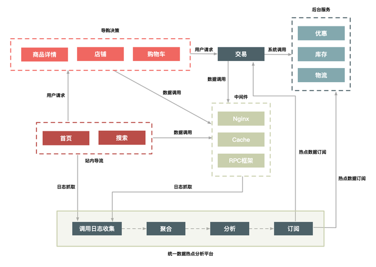<font style="color:rgb(153, 153, 153);"></font>

<font style="color:rgb(34, 34, 34);">我们通过部署在每台机器上的 Agent 把日志汇总到聚合和分析集群中，然后把符合一定规则的热点数据，通过订阅分发系统再推送到相应的系统中。你可以是把热点数据填充到 Cache 中，或者直接推送到应用服务器的内存中，还可以对这些数据进行拦截，总之下游系统可以订阅这些数据，然后根据自己的需求决定如何处理这些数据。</font>

<font style="color:rgb(34, 34, 34);">打造热点发现系统时，我根据以往经验总结了</font>

### <font style="color:rgb(51, 51, 51);">几点注意事项</font>
<font style="color:rgb(34, 34, 34);">1、这个热点服务后台抓取热点数据日志最好采用异步方式，因为“异步”一方面便于保证通用性，另一方面又不影响业务系统和中间件产品的主流程。</font>

<font style="color:rgb(34, 34, 34);">2、热点服务发现和中间件自身的热点保护模块并存，每个中间件和应用还需要保护自己。热点服务台提供热点数据的收集和订阅服务，便于把各个系统的热点数据透明出来。</font>

<font style="color:rgb(34, 34, 34);">3、热点发现要做到接近实时（3s 内完成热点数据的发现），因为只有做到接近实时，动态发现才有意义，才能实时地对下游系统提供保护。</font>

### <font style="color:rgb(34, 34, 34);">处理热点数据</font>
<font style="color:rgb(34, 34, 34);">处理热点数据通常有几种思路：</font>**<font style="color:rgb(51, 51, 51);">一是优化，二是限制，三是隔离。</font>**<font style="color:rgb(34, 34, 34);">先来说说优化。优化热点数据最有效的办法就是缓存热点数据，如果热点数据做了动静分离，那么可以长期缓存静态数据。但是，缓存热点数据更多的是“临时”缓存，即不管是静态数据还是动态数据，都用一个队列短暂地缓存数秒钟，由于队列长度有限，可以采用 LRU 淘汰算法替换。</font>

<font style="color:rgb(34, 34, 34);">再来说说限制。限制更多的是一种保护机制，限制的办法也有很多，例如对被访问商品的 ID 做一致性 Hash，然后根据 Hash 做分桶，每个分桶设置一个处理队列，这样可以把热点商品限制在一个请求队列里，防止因某些热点商品占用太多的服务器资源，而使其他请求始终得不到服务器的处理资源。</font>

<font style="color:rgb(34, 34, 34);">最后介绍一下隔离。秒杀系统设计的第一个原则就是将这种热点数据隔离出来，不要让 1% 的请求影响到另外的 99%，隔离出来后也更方便对这 1% 的请求做针对性的优化。</font>

<font style="color:rgb(34, 34, 34);">具体到“秒杀”业务，我们可以在以下几个层次实现隔离。</font>

**<font style="color:rgb(51, 51, 51);">业务隔离</font>**<font style="color:rgb(34, 34, 34);">。把秒杀做成一种营销活动，卖家要参加秒杀这种营销活动需要单独报名，从技术上来说，卖家报名后对我们来说就有了已知热点，因此可以提前做好预热。</font>

**<font style="color:rgb(51, 51, 51);">系统隔离。</font>**<font style="color:rgb(34, 34, 34);">系统隔离更多的是运行时的隔离，可以通过分组部署的方式和另外 99% 分开。秒杀可以申请单独的域名，目的也是让请求落到不同的集群中。</font>

**<font style="color:rgb(51, 51, 51);">数据隔离。</font>**<font style="color:rgb(34, 34, 34);">秒杀所调用的数据大部分都是热点数据，比如会启用单独的 Cache 集群或者 MySQL 数据库来放热点数据，目的也是不想 0.01% 的数据有机会影响 99.99% 数据。</font>

<font style="color:rgb(34, 34, 34);"></font>

## <font style="color:rgb(34, 34, 34);">04 | 流量削峰这事应该怎么做？</font>
### <font style="color:rgb(0, 0, 0);">为什么要削峰？</font>
<font style="color:rgb(34, 34, 34);">我们知道服务器的处理资源是恒定的，你用或者不用它的处理能力都是一样的，所以出现峰值的话，很容易导致忙到处理不过来，闲的时候却又没有什么要处理。但是由于要保证服务质量，我们的很多处理资源只能按照忙的时候来预估，而这会导致资源的一个浪费。</font>

<font style="color:rgb(34, 34, 34);">这就好比因为存在早高峰和晚高峰的问题，所以有了错峰限行的解决方案。削峰的存在，一是可以让服务端处理变得更加平稳，二是可以节省服务器的资源成本。针对秒杀这一场景，削峰从本质上来说就是更多地延缓用户请求的发出，以便减少和过滤掉一些无效请求，它遵从“请求数要尽量少”的原则。</font>

<font style="color:rgb(34, 34, 34);">今天，我就来介绍一下流量削峰的一些操作思路：</font>**<font style="color:rgb(51, 51, 51);">排队、答题、分层过滤</font>**<font style="color:rgb(34, 34, 34);">。这几种方式都是无损（即不会损失用户的发出请求）的实现方案，当然还有些有损的实现方案，包括我们后面要介绍的关于稳定性的一些办法，比如限流和机器负载保护等一些强制措施也能达到削峰保护的目的，当然这都是不得已的一些措施，因此就不归类到这里了</font>

<font style="color:rgb(34, 34, 34);">排队要对流量进行削峰，最容易想到的解决方案就是用消息队列来缓冲瞬时流量，把同步的直接调用转换成异步的间接推送，中间通过一个队列在一端承接瞬时的流量洪峰，在另一端平滑地将消息推送出去。在这里，消息队列就像“水库”一样， 拦蓄上游的洪水，削减进入下游河道的洪峰流量，从而达到减免洪水灾害的目的。用消息队列来缓冲瞬时流量的方案，如下图所示：</font>

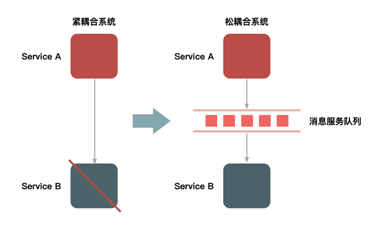<font style="color:rgb(153, 153, 153);"></font>

<font style="color:rgb(34, 34, 34);">但是，如果流量峰值持续一段时间达到了消息队列的处理上限，例如本机的消息积压达到了存储空间的上限，消息队列同样也会被压垮，这样虽然保护了下游的系统，但是和直接把请求丢弃也没多大的区别。就像遇到洪水爆发时，即使是有水库恐怕也无济于事</font>

<font style="color:rgb(34, 34, 34);">除了消息队列，类似的排队方式还有很多，例如：</font>

<font style="color:rgb(34, 34, 34);">1、利用线程池加锁等待也是一种常用的排队方式；</font>

<font style="color:rgb(34, 34, 34);">2、先进先出、先进后出等常用的内存排队算法的实现方式；</font>

<font style="color:rgb(34, 34, 34);">3、把请求序列化到文件中，然后再顺序地读文件（例如基于 MySQL binlog 的同步机制）来恢复请求等方式。</font>

<font style="color:rgb(34, 34, 34);"></font>

<font style="color:rgb(34, 34, 34);">你是否还记得，最早期的秒杀只是纯粹地刷新页面和点击购买按钮，它是后来才增加了答题，前端还做了js控制等功能。那么，为什么要增加答题功能呢？</font>

<font style="color:rgb(34, 34, 34);">这主要是为了增加请求前拦截方式，提高购买的复杂度，从而达到两个目的。</font>

**<font style="color:rgb(34, 34, 34);">第一个目的</font>**<font style="color:rgb(34, 34, 34);">是防止部分买家使用秒杀器在参加秒杀时作弊。2011 年秒杀非常火的时候，秒杀器也比较猖獗，因而没有达到全民参与和营销的目的，所以系统增加了答题来限制秒杀器。增加答题后，下单的时间基本控制在 2s 后，秒杀器的下单比例也大大下降。答题页面如下图所示。</font>

<font style="color:rgb(153, 153, 153);"></font>

**<font style="color:rgb(34, 34, 34);">第二个目的</font>**<font style="color:rgb(34, 34, 34);">其实就是延缓请求，起到对请求流量进行削峰的作用，从而让系统能够更好地支持瞬时的流量高峰。这个重要的功能就是把峰值的下单请求拉长，从以前的 1s 之内延长到 2s~10s。这样一来，请求峰值基于时间分片了。这个时间的分片对服务端处理并发非常重要，会大大减轻压力。而且，由于请求具有先后顺序，靠后的请求到来时自然也就没有库存了，因此根本到不了最后的下单步骤，所以真正的并发写就非常有限了。这种设计思路目前用得非常普遍，如当年支付宝的“咻一咻”、微信的“摇一摇”都是类似的方式。</font>

<font style="color:rgb(34, 34, 34);">这里，我重点说一下秒杀答题的设计思路。</font>

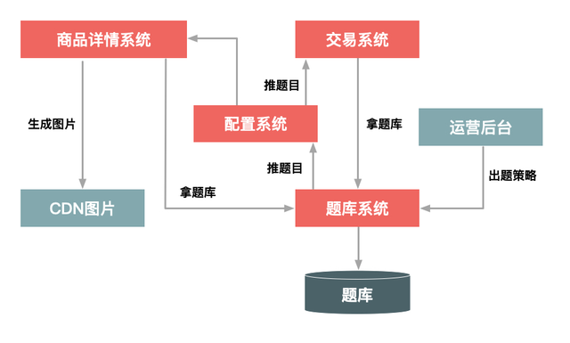<font style="color:rgb(153, 153, 153);"></font>

<font style="color:rgb(34, 34, 34);">如上图所示，整个秒杀答题的逻辑主要分为 3 部分。</font>

**<font style="color:rgb(51, 51, 51);">题库生成模块</font>**<font style="color:rgb(34, 34, 34);">，这个部分主要就是生成一个个问题和答案，其实题目和答案本身并不需要很复杂，重要的是能够防止由机器来算出结果，即防止秒杀器来答题。</font>**<font style="color:rgb(51, 51, 51);">题库的推送模块</font>**<font style="color:rgb(34, 34, 34);">，用于在秒杀答题前，把题目提前推送给详情系统和交易系统。题库的推送主要是为了保证每次用户请求的题目是唯一的，目的也是防止答题作弊。</font>**<font style="color:rgb(51, 51, 51);">题目的图片生成模块</font>**<font style="color:rgb(34, 34, 34);">，用于把题目生成为图片格式，并且在图片里增加一些干扰因素。这也同样是为防止机器直接来答题，它要求只有人才能理解题目本身的含义。这里还要注意一点，由于答题时网络比较拥挤，我们应该把题目的图片提前推送到 CDN 上并且要进行预热，不然的话当用户真正请求题目时，图片可能加载比较慢，从而影响答题的体验。</font>

<font style="color:rgb(34, 34, 34);">其实真正答题的逻辑比较简单，很好理解：当用户提交的答案和题目对应的答案做比较，如果通过了就继续进行下一步的下单逻辑，否则就失败。我们可以把问题和答案用下面这样的 key 来进行 MD5 加密：</font>

**<font style="color:rgb(51, 51, 51);">问题 key</font>**<font style="color:rgb(34, 34, 34);">：userId+itemId+question_Id+time+PK</font>**<font style="color:rgb(51, 51, 51);">答案 key</font>**<font style="color:rgb(34, 34, 34);">：userId+itemId+answer+PK</font>

<font style="color:rgb(34, 34, 34);">验证的逻辑如下图所示：</font>

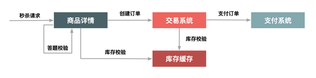<font style="color:rgb(153, 153, 153);"></font>

<font style="color:rgb(34, 34, 34);">注意，这里面的验证逻辑，除了验证问题的答案以外，还包括用户本身身份的验证，例如是否已经登录、用户的 Cookie 是否完整、用户是否重复频繁提交等。</font><font style="color:rgb(34, 34, 34);">除了做正确性验证，我们还可以对提交答案的时间做些限制，例如从开始答题到接受答案要超过 1s，因为小于 1s 是人为操作的可能性很小，这样也能防止机器答题的情况。</font>

### <font style="color:rgb(34, 34, 34);">分层过滤拦截</font>
<font style="color:rgb(34, 34, 34);">前面介绍的排队和答题要么是少发请求，要么对发出来的请求进行缓冲，而针对秒杀场景还有一种方法，就是对请求进行分层过滤拦截，从而过滤掉拦截一些无效的请求。分层过滤其实就是采用“漏斗”式设计来处理请求的，如下图所示。</font>

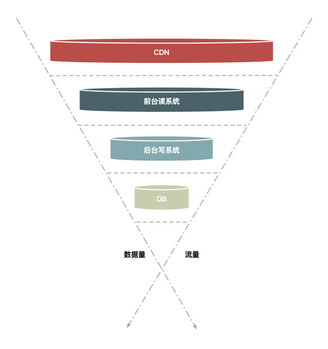<font style="color:rgb(153, 153, 153);"></font>

<font style="color:rgb(34, 34, 34);">假如请求分别经过 CDN、前台读系统（如商品详情系统）、后台系统（如交易系统）和数据库这几层，那么：</font>

<font style="color:rgb(34, 34, 34);">大部分数据和流量在用户浏览器或者 CDN 上获取，这一层可以拦截大部分数据的读取；</font><font style="color:rgb(34, 34, 34);">经过第二层（即前台系统）时数据（包括强一致性的数据）尽量得走 Cache，过滤一些无效的请求；</font><font style="color:rgb(34, 34, 34);">再到第三层后台系统，主要做数据的二次检验，对系统做好保护和限流，这样数据量和请求就进一步减少；</font><font style="color:rgb(34, 34, 34);">最后在数据层完成数据的强一致性校验。</font>

<font style="color:rgb(34, 34, 34);">这样就像漏斗一样，尽量把数据量和请求量一层一层地过滤和减少了。</font>

<font style="color:rgb(34, 34, 34);">更多拦截防刷移步：</font>[接口被刷百万QPS，怎么防？](https://www.yuque.com/tulingzhouyu/db22bv/sabap6mrnfbv92gf)

### <font style="color:rgb(51, 51, 51);">分层过滤拦截的核心思想是</font><font style="color:rgb(34, 34, 34);">：</font>
<font style="color:rgb(34, 34, 34);">在不同的层次尽可能地过滤掉无效请求，让“漏斗”最末端的才是有效请求。而要达到这种效果，我们就必须对数据做分层的校验。</font>

<font style="color:rgb(34, 34, 34);">分层校验的基本原则是： </font>

<font style="color:rgb(34, 34, 34);">将动态请求的读数据缓存（Cache）在 Web 端，过滤掉无效的数据读；</font><font style="color:rgb(34, 34, 34);">对读数据不做强一致性校验，减少因为一致性校验产生瓶颈的问题；</font><font style="color:rgb(34, 34, 34);">对写数据进行基于时间的合理分片，过滤掉过期的失效请求；</font><font style="color:rgb(34, 34, 34);">对写请求做限流保护，将超出系统承载能力的请求过滤掉；</font><font style="color:rgb(34, 34, 34);">对写数据进行强一致性校验，只保留最后有效的数据。</font>

<font style="color:rgb(34, 34, 34);"></font>

## <font style="color:rgb(34, 34, 34);">05 | 影响性能的因素？如何提高系统的性能？</font>
### <font style="color:rgb(0, 0, 0);">影响性能的因素</font>
<font style="color:rgb(34, 34, 34);">那么，哪些因素对性能有影响呢？</font>

<font style="color:rgb(34, 34, 34);">在回答这个问题之前，我们先定义一下“性能”，服务设备不同对性能的定义也是不一样的，例如 CPU 主要看主频、磁盘主要看 IOPS（Input/Output Operations Per Second，即每秒进行读写操作的次数）。</font>

<font style="color:rgb(34, 34, 34);">而今天我们讨论的主要是系统服务端性能，一般用 QPS（Query Per Second，每秒请求数）来衡量，还有一个影响和 QPS 也息息相关，那就是响应时间（Response Time，RT），它可以理解为服务器处理响应的耗时。</font>

<font style="color:rgb(34, 34, 34);">正常情况下响应时间（RT）越短，一秒钟处理的请求数（QPS）自然也就会越多，这在单线程处理的情况下看起来是线性的关系，即我们只要把每个请求的响应时间降到最低，那么性能就会最高。</font>

<font style="color:rgb(34, 34, 34);">但是你可能想到响应时间总有一个极限，不可能无限下降，所以又出现了另外一个维度，即通过多线程，来处理请求。这样理论上就变成了“总 QPS =（1000ms / 响应时间）× 线程数量”，这样性能就和两个因素相关了，一个是一次响应的服务端耗时，一个是处理请求的线程数。</font>

<font style="color:rgb(34, 34, 34);">首先，我们先来看看响应时间和 QPS 有啥关系。</font>

<font style="color:rgb(34, 34, 34);">对于大部分的 Web 系统而言，响应时间一般都是由 CPU 执行时间和线程等待时间（比如 RPC、IO 等待、Sleep、Wait 等）组成，即服务器在处理一个请求时，一部分是 CPU 本身在做运算，还有一部分是在各种等待。</font>

<font style="color:rgb(34, 34, 34);">如果代理服务器本身没有 CPU 消耗，我们在每次给代理服务器代理的请求加个延时，即增加响应时间，但是这对代理服务器本身的吞吐量并没有多大的影响，因为代理服务器本身的资源并没有被消耗，可以通过增加代理服务器的处理线程数，来弥补响应时间对代理服务器的 QPS 的影响。</font>

<font style="color:rgb(34, 34, 34);">其实，真正对性能有影响的是 CPU 的执行时间。这也很好理解，因为 CPU 的执行真正消耗了服务器的资源。经过实际的测试，如果减少 CPU 一半的执行时间，就可以增加一倍的 QPS。</font>

<font style="color:rgb(34, 34, 34);">也就是说，我们应该致力于减少 CPU 的执行时间。</font>

<font style="color:rgb(34, 34, 34);">其次，我们再来看看线程数对 QPS 的影响。</font>

<font style="color:rgb(34, 34, 34);">单看“总 QPS”的计算公式，你会觉得线程数越多 QPS 也就会越高，但这会一直正确吗？显然不是，线程数不是越多越好，因为线程本身也消耗资源，也受到其他因素的制约。例如，线程越多系统的线程切换成本就会越高，而且每个线程也都会耗费一定内存。</font>

<font style="color:rgb(34, 34, 34);">那么，设置什么样的线程数最合理呢？其实很多多线程的场景都有一个默认配置，即“线程数 = 2 * CPU 核数 + 1”。除去这个配置，还有一个根据最佳实践得出来的公式：</font>

<font style="color:rgb(153, 153, 153);">线程数 = [(线程等待时间 + 线程 CPU 时间) / 线程 CPU 时间] × CPU 数量</font>

<font style="color:rgb(34, 34, 34);">当然，最好的办法是通过性能测试来发现最佳的线程数。</font><font style="color:rgb(34, 34, 34);">换句话说，要提升性能我们就要减少 CPU 的执行时间，另外就是要设置一个合理的并发线程数，通过这两方面来显著提升服务器的性能。</font><font style="color:rgb(34, 34, 34);">现在，你知道了如何来快速提升性能，那接下来你估计会问，我应该怎么发现系统哪里最消耗 CPU 资源呢？</font>

<font style="color:rgb(34, 34, 34);">如何发现瓶颈</font>

<font style="color:rgb(34, 34, 34);">就服务器而言，会出现瓶颈的地方有很多，例如 CPU、内存、磁盘以及网络等都可能会导致瓶颈。此外，不同的系统对瓶颈的关注度也不一样，例如对缓存系统而言，制约它的是内存，而对存储型系统来说 I/O 更容易是瓶颈。</font>

<font style="color:rgb(34, 34, 34);">我们定位的场景是秒杀，它的瓶颈更多地发生在 CPU 上。</font>

<font style="color:rgb(34, 34, 34);">怎样简单地判断 CPU 是不是瓶颈呢？一个办法就是看当 QPS 达到极限时，你的服务器的 CPU 使用率是不是超过了 95%，如果没有超过，那么表示 CPU 还有提升的空间，要么是有锁限制，要么是有过多的本地 I/O 等待发生。</font>

<font style="color:rgb(34, 34, 34);"></font>

### <font style="color:rgb(34, 34, 34);">如何优化系统</font>
<font style="color:rgb(34, 34, 34);">对 Java 系统来说，可以优化的地方很多，这里我重点说一下比较有效的几种手段，供你参考，它们是：</font>**<font style="color:rgb(51, 51, 51);">减少编码、减少序列化、Java 极致优化、并发读优化、多活架构</font>**<font style="color:rgb(34, 34, 34);">。接下来，我们分别来看一下。</font>

#### <font style="color:rgb(34, 34, 34);">1. 减少编码</font>
<font style="color:rgb(34, 34, 34);">Java 的编码运行比较慢，这是 Java 的一大硬伤。在很多场景下，只要涉及字符串的操作（如输入输出操作、I/O 操作）都比较耗 CPU 资源，不管它是磁盘 I/O 还是网络 I/O，因为都需要将字符转换成字节，而这个转换必须编码。每个字符的编码都需要查表，而这种查表的操作非常耗资源，所以减少字符到字节或者相反的转换、减少字符编码会非常有成效。减少编码就可以大大提升性能</font>

#### <font style="color:rgb(34, 34, 34);">2. 减少序列化</font>
<font style="color:rgb(34, 34, 34);">序列化也是 Java 性能的一大天敌，减少 Java 中的序列化操作也能大大提升性能。又因为序列化往往是和编码同时发生的，所以减少序列化也就减少了编码。</font>

<font style="color:rgb(34, 34, 34);">序列化大部分是在 RPC 中发生的，因此避免或者减少 RPC 就可以减少序列化，当然当前的序列化协议也已经做了很多优化来提升性能。有一种新的方案，就是可以将多个关联性比较强的应用进行“合并部署”，而减少不同应用之间的 RPC 也可以减少序列化的消耗。</font>

<font style="color:rgb(34, 34, 34);">所谓“合并部署”，就是把两个原本在不同机器上的不同应用合并部署到一台机器上，当然不仅仅是部署在一台机器上，还要在同一个 Tomcat 容器中，且不能走本机的 Socket，这样才能避免序列化的产生。</font>

<font style="color:rgb(34, 34, 34);">另外针对秒杀场景，我们还可以做得更极致一些，接下来我们来看第 3 点：Java 极致优化。</font>

#### <font style="color:rgb(34, 34, 34);">3. Java 极致优化</font>
<font style="color:rgb(34, 34, 34);">Java 和通用的 Web 服务器（如 Nginx 或 Apache 服务器）相比，在处理大并发的 HTTP 请求时要弱一点，所以一般我们都会对大流量的 Web 系统做静态化改造，让大部分请求和数据直接在 Nginx 服务器或者 Web 代理服务器（如 Varnish、Squid 等）上直接返回（这样可以减少数据的序列化与反序列化），而 Java 层只需处理少量数据的动态请求。针对这些请求，我们可以使用以下手段进行优化：</font>

<font style="color:rgb(34, 34, 34);">1、直接使用 Servlet 处理请求。避免使用传统的 MVC 框架，这样可以绕过一大堆复杂且用处不大的处理逻辑，节省 1ms 时间（具体取决于你对 MVC 框架的依赖程度）</font><font style="color:rgb(34, 34, 34);">2、直接输出流数据。使用 resp.getOutputStream() 而不是 resp.getWriter() 函数，可以省掉一些不变字符数据的编码，从而提升性能；数据输出时推荐使用 JSON 而不是模板引擎（一般都是解释执行）来输出页面。</font>

#### <font style="color:rgb(34, 34, 34);">4. 并发读优化</font>
<font style="color:rgb(34, 34, 34);">也许有读者会觉得这个问题很容易解决，无非就是放到 Tair 缓存里面。集中式缓存为了保证命中率一般都会采用一致性 Hash，所以同一个 key 会落到同一台机器上。虽然单台缓存机器也能支撑 30w/s 的请求，但还是远不足以应对像“大秒”这种级别的热点商品。那么，该如何彻底解决单点的瓶颈呢？</font>

<font style="color:rgb(34, 34, 34);">答案是采用应用层的 LocalCache，即在秒杀系统的单机上缓存商品相关的数据。</font>

<font style="color:rgb(34, 34, 34);">那么，又如何缓存（Cache）数据呢？你需要划分成动态数据和静态数据分别进行处理：</font>

<font style="color:rgb(34, 34, 34);">1、像商品中的“标题”和“描述”这些本身不变的数据，会在秒杀开始之前全量推送到秒杀机器上，并一直缓存到秒杀结束；</font>

<font style="color:rgb(34, 34, 34);">2、像库存这类动态数据，会采用“被动失效”的方式缓存一定时间（一般是数秒），失效后再去缓存拉取最新的数据。</font>

#### <font style="color:rgb(34, 34, 34);">5. 多活架构</font>
<font style="color:rgb(34, 34, 34);">可选</font><font style="color:rgb(6, 6, 7);">多活架构：同城双活-双机房和异地多活-两地三中心。这两种架构都是用于提高系统的可用性和容错能力，确保在某个机房或数据中心发生故障时，系统仍能继续提供服务。</font>

<font style="color:rgb(6, 6, 7);">同城双活-双机房</font>

+ <font style="color:rgb(6, 6, 7);">定义</font><font style="color:rgb(6, 6, 7);">：两个机房部署在同一城市，物理距离较近，通过专线网络连接。</font>
+ <font style="color:rgb(6, 6, 7);">特点</font><font style="color:rgb(6, 6, 7);">：</font>
    - <font style="color:rgb(6, 6, 7);">由于物理距离较近，专线连接的延迟相对较小，通常在1ms以内（100公里内）。</font>
    - <font style="color:rgb(6, 6, 7);">比单个机房内的延迟（0.1ms）稍大，但整体延迟是可以接受的。</font>
+ <font style="color:rgb(6, 6, 7);">优点</font><font style="color:rgb(6, 6, 7);">：</font>
    - <font style="color:rgb(6, 6, 7);">提高系统的可用性和容错能力，即使一个机房发生故障，另一个机房仍能继续提供服务。</font>
    - <font style="color:rgb(6, 6, 7);">专线连接保证了数据传输的稳定性和安全性。</font>
+ <font style="color:rgb(6, 6, 7);">参考延迟</font><font style="color:rgb(6, 6, 7);">：</font>
    - <font style="color:rgb(6, 6, 7);">同机房：0.1ms</font>
    - <font style="color:rgb(6, 6, 7);">同城双机房：1ms（100公里内）</font>
    - <font style="color:rgb(6, 6, 7);">北京到广州：55ms</font>

<font style="color:rgb(6, 6, 7);">异地多活-两地三中心</font>

+ <font style="color:rgb(6, 6, 7);">定义</font><font style="color:rgb(6, 6, 7);">：两个城市，三个机房，其中两个机房在同一个城市，第三个机房部署在异地，只做数据灾备。</font>
+ <font style="color:rgb(6, 6, 7);">特点</font><font style="color:rgb(6, 6, 7);">：</font>
    - <font style="color:rgb(6, 6, 7);">两个机房在同一个城市，可以同时提供服务，提高系统的可用性。</font>
    - <font style="color:rgb(6, 6, 7);">第三个机房部署在异地，主要用于数据灾备，确保在极端情况下数据的安全性。</font>
+ <font style="color:rgb(6, 6, 7);">优点：</font>
    - <font style="color:rgb(6, 6, 7);">提高系统的容错能力和数据安全性，即使两个机房同时发生故障，异地的第三个机房仍能保证数据的安全。</font>
    - <font style="color:rgb(6, 6, 7);">通过异地灾备，可以减少数据丢失的风险，提高数据的可靠性。</font>
+ <font style="color:rgb(6, 6, 7);">部署策略：</font>
    - <font style="color:rgb(6, 6, 7);">两个机房在同一个城市，可以同时提供服务，提高系统的可用性。</font>
    - <font style="color:rgb(6, 6, 7);">第三个机房部署在异地，主要用于数据灾备，确保在极端情况下数据的安全性。</font>

<font style="color:rgb(6, 6, 7);">这两种多活架构都是为了提高系统的可用性和容错能力，但它们的部署方式和侧重点有所不同。同城双活-双机房更侧重于提高系统的可用性，而异地多活-两地三中心则更侧重于数据的安全性和可靠性。</font>

## <font style="color:rgb(34, 34, 34);">06 | 秒杀系统“减库存”设计的核心逻辑</font>
<font style="color:rgb(34, 34, 34);">大前提在于业务是否允许超卖，通常电商产品都不做处理，部分是做补偿性处理，但也有部分需要强一致不允许超卖。</font>

### <font style="color:rgb(0, 0, 0);">减库存有哪几种方式</font>
<font style="color:rgb(34, 34, 34);">在正常的电商平台购物场景中，用户的实际购买过程一般分为两步：下单和付款。你想买一台 iPhone 手机，在商品页面点了“立即购买”按钮，核对信息之后点击“提交订单”，这一步称为下单操作。下单之后，你只有真正完成付款操作才能算真正购买，也就是俗话说的“落袋为安”。</font>

<font style="color:rgb(34, 34, 34);">那如果你是架构师，你会在哪个环节完成减库存的操作呢？总结来说，减库存操作一般有如下几个方式：</font>

**<font style="color:rgb(51, 51, 51);">下单减库存，</font>**<font style="color:rgb(34, 34, 34);">即当买家下单后，在商品的总库存中减去买家购买数量。下单减库存是最简单的减库存方式，也是控制最精确的一种，下单时直接通过数据库的事务机制控制商品库存，这样一定不会出现超卖的情况。但是你要知道，有些人下完单可能并不会付款。</font>**<font style="color:rgb(51, 51, 51);">付款减库存，</font>**<font style="color:rgb(34, 34, 34);">即买家下单后，并不立即减库存，而是等到有用户付款后才真正减库存，否则库存一直保留给其他买家。但因为付款时才减库存，如果并发比较高，有可能出现买家下单后付不了款的情况，因为可能商品已经被其他人买走了</font>**<font style="color:rgb(51, 51, 51);">预扣库存，</font>**<font style="color:rgb(34, 34, 34);">这种方式相对复杂一些，买家下单后，库存为其保留一定的时间（如 10 分钟），超过这个时间，库存将会自动释放，释放后其他买家就可以继续购买。在买家付款前，系统会校验该订单的库存是否还有保留：如果没有保留，则再次尝试预扣；如果库存不足（也就是预扣失败）则不允许继续付款；如果预扣成功，则完成付款并实际地减去库存。</font>

**<font style="color:rgb(51, 51, 51);">以上这几种减库存的方式都会存在一些问题，下面我们一起来看下。</font>**

### <font style="color:rgb(0, 0, 0);">减库存可能存在的问题</font>
<font style="color:rgb(34, 34, 34);">由于购物过程中存在两步或者多步的操作，因此在不同的操作步骤中减库存，就会存在一些可能被恶意买家利用的漏洞，例如发生恶意下单的情况。</font>

<font style="color:rgb(34, 34, 34);">假如我们采用“</font>**<font style="color:rgb(34, 34, 34);">下单减库存</font>**<font style="color:rgb(34, 34, 34);">”的方式，即用户下单后就减去库存，正常情况下，买家下单后付款的概率会很高，所以不会有太大问题。但是有一种场景例外，就是当卖家参加某个活动时，此时活动的有效时间是商品的黄金售卖时间，如果有竞争对手通过恶意下单的方式将该卖家的商品全部下单，让这款商品的库存减为零，那么这款商品就不能正常售卖了。要知道，这些恶意下单的人是不会真正付款的，这正是“下单减库存”方式的不足之处。</font>

<font style="color:rgb(34, 34, 34);">既然“下单减库存”可能导致恶意下单，从而影响卖家的商品销售，那么有没有办法解决呢？</font>

<font style="color:rgb(34, 34, 34);">你可能会想，采用“</font>**<font style="color:rgb(34, 34, 34);">付款减库存</font>**<font style="color:rgb(34, 34, 34);">”的方式是不是就可以了？的确可以。但是，“付款减库存”又会导致另外一个问题：</font>**<font style="color:rgb(34, 34, 34);">库存超卖</font>**<font style="color:rgb(34, 34, 34);">。</font>

<font style="color:rgb(34, 34, 34);">假如有 100 件商品，就可能出现 300 人下单成功的情况，因为下单时不会减库存，所以也就可能出现下单成功数远远超过真正库存数的情况，这尤其会发生在做活动的热门商品上。这样一来，就会导致很多买家下单成功但是付不了款，买家的购物体验自然比较差。</font>

<font style="color:rgb(34, 34, 34);">可以看到，不管是“下单减库存”还是“付款减库存”，都会导致商品库存不能完全和实际售卖情况对应起来的情况，看来要把商品准确地卖出去还真是不容易啊！</font>

<font style="color:rgb(34, 34, 34);">那么，既然“下单减库存”和“付款减库存”都有缺点，我们能否把两者相结合，将两次操作进行前后关联起来，下单时先预扣，在规定时间内不付款再释放库存，即采用“</font>**<font style="color:rgb(34, 34, 34);">预扣库存</font>**<font style="color:rgb(34, 34, 34);">”这种方式呢？</font>

<font style="color:rgb(34, 34, 34);">这种方案确实可以在一定程度上缓解上面的问题。但是否就彻底解决了呢？其实没有！针对恶意下单这种情况，虽然把有效的付款时间设置为 10 分钟，但是恶意买家完全可以在 10 分钟后再次下单，或者采用一次下单很多件的方式把库存减完。针对这种情况，解决办法还是要结合安全和反作弊的措施来制止。</font>

<font style="color:rgb(34, 34, 34);">例如，给经常下单不付款的买家进行识别打标（可以在被打标的买家下单时不减库存）、给某些类目设置最大购买件数（例如，参加活动的商品一人最多只能买 3 件），以及对重复下单不付款的操作进行次数限制等。</font>

<font style="color:rgb(34, 34, 34);">针对“库存超卖”这种情况，在 10 分钟时间内下单的数量仍然有可能超过库存数量，遇到这种情况我们只能区别对待：</font>

<font style="color:rgb(34, 34, 34);">对普通的商品下单数量超过库存数量的情况，可以通过补货来解决；</font>

<font style="color:rgb(34, 34, 34);">但是有些卖家完全不允许库存为负数的情况，那只能在买家付款时提示库存不足。</font>

<font style="color:rgb(34, 34, 34);"></font>

### <font style="color:rgb(0, 0, 0);">大型秒杀中如何减库存？</font>
<font style="color:rgb(34, 34, 34);">目前来看，业务系统中最常见的就是预扣库存方案，像你在买机票、买电影票时，下单后一般都有个“有效付款时间”，超过这个时间订单自动释放，这都是典型的预扣库存方案。而具体到秒杀这个场景，应该采用哪种方案比较好呢？</font>

<font style="color:rgb(34, 34, 34);">由于参加秒杀的商品，一般都是“抢到就是赚到”，所以成功下单后却不付款的情况比较少，再加上卖家对秒杀商品的库存有严格限制，所以秒杀商品采用“下单减库存”更加合理。另外，理论上由于“下单减库存”比“预扣库存”以及涉及第三方支付的“付款减库存”在逻辑上更为简单，所以性能上更占优势。</font>

<font style="color:rgb(34, 34, 34);">“下单减库存”在数据一致性上，主要就是保证大并发请求时库存数据不能为负数，也就是要保证数据库中的库存字段值不能为负数，一般我们有多种解决方案：一种是在应用程序中通过事务来判断，即保证减后库存不能为负数，否则就回滚；另一种办法是直接设置数据库的字段数据为无符号整数，这样减后库存字段值小于零时会直接执行 SQL 语句来报错；再有一种就是使用 CASE WHEN 判断语句，例如这样的 SQL 语句：</font>

<font style="color:rgb(34, 34, 34);">UPDATE item SET inventory = CASE WHEN inventory >= xxx THEN inventory-xxx ELSE inventory END</font><font style="color:rgb(34, 34, 34);"> </font>

**<font style="color:rgb(0, 0, 0);"></font>**

### <font style="color:rgb(0, 0, 0);">秒杀减库存的极致优化</font>
<font style="color:rgb(34, 34, 34);">在交易环节中，“库存”是个关键数据，也是个热点数据，因为交易的各个环节中都可能涉及对库存的查询。但是，我在前面介绍分层过滤时提到过，秒杀中并不需要对库存有精确的一致性读，把库存数据放到缓存（Cache）中，可以大大提升读性能。解决大并发读问题，可以采用 LocalCache（即在秒杀系统的单机上缓存商品相关的数据）和对数据进行分层过滤的方式，但是像减库存这种大并发写无论如何还是避免不了，这也是秒杀场景下最为核心的一个技术难题。</font>

**<font style="color:rgb(51, 51, 51);">因此，这里我想专门来说一下秒杀场景下减库存的极致优化思路，包括如何在缓存中减库存以及如何在数据库中减库存。</font>**

<font style="color:rgb(34, 34, 34);">秒杀商品和普通商品的减库存还是有些差异的，例如商品数量比较少，交易时间段也比较短，因此这里有一个大胆的假设，即能否把秒杀商品减库存直接放到缓存系统中实现，也就是直接在缓存中减库存或者在一个带有持久化功能的缓存系统（如 Redis）中完成呢？</font>

<font style="color:rgb(34, 34, 34);">如果你的秒杀商品的减库存逻辑非常单一，比如没有复杂的 SKU 库存和总库存这种联动关系的话，我觉得完全可以。但是如果有比较复杂的减库存逻辑，或者需要使用事务，你还是必须在数据库中完成减库存。</font>

<font style="color:rgb(34, 34, 34);">由于 MySQL 存储数据的特点，同一数据在数据库里肯定是一行存储（MySQL），因此会有大量线程来竞争 InnoDB 行锁，而并发度越高时等待线程会越多，TPS（Transaction Per Second，即每秒处理的消息数）会下降，响应时间（RT）会上升，数据库的吞吐量就会严重受影响。</font>

<font style="color:rgb(34, 34, 34);">这就可能引发一个问题，就是单个热点商品会影响整个数据库的性能， 导致 0.01% 的商品影响 99.99% 的商品的售卖，这是我们不愿意看到的情况。一个解决思路是遵循前面介绍的原则进行隔离，把热点商品放到单独的热点库中。但是这无疑会带来维护上的麻烦，比如要做热点数据的动态迁移以及单独的数据库等。</font>

<font style="color:rgb(34, 34, 34);">而分离热点商品到单独的数据库还是没有解决并发锁的问题，我们应该怎么办呢？</font>

### <font style="color:rgb(34, 34, 34);">要解决并发锁的问题，</font><font style="color:rgb(51, 51, 51);">有三种办法：</font>
#### <font style="color:rgb(51, 51, 51);">应用层做排队</font><font style="color:rgb(34, 34, 34);">。</font>
<font style="color:rgb(34, 34, 34);">按照商品维度设置队列顺序执行，这样能减少同一台机器对数据库同一行记录进行操作的并发度，同时也能控制单个商品占用数据库连接的数量，防止热点商品占用太多的数据库连接。</font>

#### <font style="color:rgb(51, 51, 51);">数据库层做排队</font><font style="color:rgb(34, 34, 34);">。</font>
<font style="color:rgb(34, 34, 34);">应用层只能做到单机的排队，但是应用机器数本身很多，这种排队方式控制并发的能力仍然有限，所以如果能在数据库层做全局排队是最理想的。阿里的数据库团队开发了针对这种 MySQL 的 InnoDB 层上的补丁程序（patch），可以在数据库层上对单行记录做到并发排队。</font>

<font style="color:rgb(34, 34, 34);">你可能有疑问了，排队和锁竞争不都是要等待吗，有啥区别？</font>

<font style="color:rgb(34, 34, 34);">如果熟悉 MySQL 的话，你会知道 InnoDB 内部的死锁检测，以及 MySQL Server 和 InnoDB 的切换会比较消耗性能，淘宝的 MySQL 核心团队还做了很多其他方面的优化，如 COMMIT_ON_SUCCESS 和 ROLLBACK_ON_FAIL 的补丁程序，配合在 SQL 里面加提示（hint），在事务里不需要等待应用层提交（COMMIT），而在数据执行完最后一条 SQL 后，直接根据 TARGET_AFFECT_ROW 的结果进行提交或回滚，可以减少网络等待时间（平均约 0.7ms）。据我所知，目前阿里 MySQL 团队已经将包含这些补丁程序的 MySQL 开源。</font>

<font style="color:rgb(34, 34, 34);">另外，数据更新问题除了前面介绍的热点隔离和排队处理之外，还有些场景（如对商品的 lastmodifytime 字段的）更新会非常频繁，在某些场景下这些多条 SQL 是可以合并的，一定时间内只要执行最后一条 SQL 就行了，以便减少对数据库的更新操作。</font>

#### <font style="color:rgb(34, 34, 34);">固定机器MQ异步队列。</font>
1. **<font style="color:rgb(6, 6, 7);">Nginx 路由策略配置</font>**<font style="color:rgb(6, 6, 7);">：</font>
    - <font style="color:rgb(6, 6, 7);">使用 Nginx 的哈希（Hash）策略，根据请求中的唯一值（如 ID）进行哈希计算，将请求路由到固定的服务器。这样可以确保相同 ID 的请求总是被发送到同一个服务器，从而保证数据的一致性和顺序性。</font>
    - <font style="color:rgb(6, 6, 7);">配置示例：</font>

```java
nginx
http {
    upstream backend {
        hash $arg_id;  # 假设请求中的 ID 通过 URL 参数传递，如 /api? id=123
        server backend1.example.com;
        server backend2.example.com;
        server backend3.example.com;
    }
    server {
    listen 80;
    location / {
    proxy_pass http://backend;
    }
}
}
```

    - <font style="color:rgb(6, 6, 7);">通过上述配置，Nginx 会根据请求中的</font><font style="color:rgb(6, 6, 7);"> </font>`id`<font style="color:rgb(6, 6, 7);"> </font><font style="color:rgb(6, 6, 7);">参数进行哈希计算，并将请求路由到固定的后端服务器。</font>
2. **<font style="color:rgb(6, 6, 7);">使用 MQ/内存队列进行顺序处理</font>**<font style="color:rgb(6, 6, 7);">：</font>
    - **<font style="color:rgb(6, 6, 7);">消息队列（MQ）</font>**<font style="color:rgb(6, 6, 7);">：使用消息队列（如 Kafka 或 RabbitMQ）来处理请求，确保消息的顺序性。</font>
        * **<font style="color:rgb(6, 6, 7);">Kafka</font>**<font style="color:rgb(6, 6, 7);">：Kafka 支持按 key 进行分区，确保相同 key 的消息被发送到同一个 partition，从而保证消息的顺序性。消费者可以单线程或多个线程处理同一个 partition 的消息，但需要确保每个 partition 内的消息处理顺序。</font>
            + <font style="color:rgb(6, 6, 7);">配置示例：</font>

```java
/**
 * @Auth:TianMing
 * @Description： 使用 MQ/内存队列进行顺序处理
 */
public class OrderlyQueue {
    private Queue<Message> messages;
    public OrderlyQueue() {
        messages = new LinkedList<>();
    }
    public void addMessage(Message message) {
        messages.add(message);
    }
    public Message getMessage() {
        return messages.poll();
    }
}
```

            + <font style="color:rgb(6, 6, 7);">通过上述代码，可以创建一个顺序队列，确保消息按顺序处理。</font>
        * **<font style="color:rgb(6, 6, 7);">RabbitMQ</font>**<font style="color:rgb(6, 6, 7);">：可以拆分多个 queue，每个 queue 一个 consumer，或者使用一个 queue 但内部用内存队列做排队，确保消息的顺序性。</font>
            + <font style="color:rgb(6, 6, 7);">配置示例：</font>

```java
/**
 * @Auth:TianMing
 * @Description： 使用 MQ/内存队列进行顺序处理
 */
public class OrderlyQueue {
    private Queue<Message> messages;
    public OrderlyQueue() {
        messages = new LinkedList<>();
    }
    public void addMessage(Message message) {
        messages.add(message);
    }
    public Message getMessage() {
        return messages.poll();
    }
}
```

            + <font style="color:rgb(6, 6, 7);">通过上述代码，可以创建一个顺序队列，确保消息按顺序处理。</font>
3. **<font style="color:rgb(6, 6, 7);">确保消息的顺序性</font>**<font style="color:rgb(6, 6, 7);">：</font>
    - **<font style="color:rgb(6, 6, 7);">消息编号</font>**<font style="color:rgb(6, 6, 7);">：为每个消息分配一个唯一的编号，并在发送和消费时按照编号的顺序进行。这种方法可以保证消息的顺序性，即使消息在队列中发生了乱序。</font>
        * <font style="color:rgb(6, 6, 7);">示例代码：</font>

```java
/**
 * @Auth:TianMing
 * @Description： 确保消息的顺序性
 */
public class OrderedQueue {
    private Map<Long, Message> messages;
    private Long currentId;
    public OrderedQueue() {
        messages = new HashMap<>();
        currentId = 0L;
    }
    public void addMessage(Message message) {
        message.setId(currentId++);
        messages.put(message.getId(), message);
    }
    public Message getMessage(Long id) {
        return messages.get(id);
    }
}
```

        * <font style="color:rgb(6, 6, 7);">通过上述代码，可以为每个消息分配一个唯一的编号，并在处理时按编号顺序获取消息。</font>

<font style="color:rgb(6, 6, 7);">通过上述步骤，可以确保在高并发场景下，针对修改的唯一值（如 ID）的请求能够被正确路由到固定的服务器，并通过消息队列确保消息的顺序处理。这样可以有效避免数据不一致和顺序混乱的问题，提高系统的稳定性和可靠性。</font>

<font style="color:rgb(6, 6, 7);"></font>

## <font style="color:rgb(34, 34, 34);">07 | </font><font style="color:rgb(6, 6, 7);">高并发下单请求积压过多的解决方案</font>
<font style="color:rgb(6, 6, 7);">最后我们总结一波在高并发场景下，如果业务复杂导致请求积压过多，可以采取以下几种策略来优化系统性能，确保请求能够被及时处理：</font>

#### <font style="color:rgb(6, 6, 7);">1. 增加消费者数量或优化消费者性能</font>
+ **<font style="color:rgb(6, 6, 7);">水平扩展消费者</font>**<font style="color:rgb(6, 6, 7);">：增加消费者的数量，以提高并行处理能力。在一个消费者组里增加更多的消费者，可以提高该组的消息处理能力。</font>
+ **<font style="color:rgb(6, 6, 7);">优化消费逻辑</font>**<font style="color:rgb(6, 6, 7);">：减少每条消息处理所需的时间。例如，通过减少不必要的数据库访问、缓存常用数据、或优化算法等方式。</font>
+ **<font style="color:rgb(6, 6, 7);">多线程消费</font>**<font style="color:rgb(6, 6, 7);">：如果消费者支持多线程处理，并且是非顺序性消息，可通过增加线程数来提升消费速率。</font>

#### <font style="color:rgb(6, 6, 7);">2. 控制消息生产速率</font>
+ **<font style="color:rgb(6, 6, 7);">限流措施</font>**<font style="color:rgb(6, 6, 7);">：对生产者实施限流措施，确保其生产速率不会超过消费者的处理能力。</font>
+ **<font style="color:rgb(6, 6, 7);">批量发送</font>**<font style="color:rgb(6, 6, 7);">：调整生产者的发送策略，使用批量发送减少网络请求次数，提高系统吞吐量。</font>

#### <font style="color:rgb(6, 6, 7);">3. 资源优化和网络增强</font>
+ **<font style="color:rgb(6, 6, 7);">服务器升级</font>**<font style="color:rgb(6, 6, 7);">：提升处理能力，例如增加 CPU、扩大内存，或提高 I/O 性能。</font>
+ **<font style="color:rgb(6, 6, 7);">网络优化</font>**<font style="color:rgb(6, 6, 7);">：确保网络带宽和稳定性，避免网络延迟和故障成为瓶颈。</font>

#### <font style="color:rgb(6, 6, 7);">4. 改进错误和异常处理机制</font>
+ **<font style="color:rgb(6, 6, 7);">错误处理策略</font>**<font style="color:rgb(6, 6, 7);">：合理设置消息的重试次数和重试间隔，避免过多无效重试造成的额外负担。</font>
+ **<font style="color:rgb(6, 6, 7);">死信队列管理</font>**<font style="color:rgb(6, 6, 7);">：对于无法处理的消息，移动到死信队列，并定期分析和处理这些消息。</font>

#### <font style="color:rgb(6, 6, 7);">5. 系统和配置优化</font>
+ **<font style="color:rgb(6, 6, 7);">增加 Canal 实例数量</font>**<font style="color:rgb(6, 6, 7);">：通过增加 Canal 实例的数量，可以提升系统的并发处理能力，从而减少单个实例的负载压力。</font>
+ **<font style="color:rgb(6, 6, 7);">优化数据存储</font>**<font style="color:rgb(6, 6, 7);">：选择合适的数据库来存储 Canal 的数据。可以考虑使用高性能的数据库，或者进行数据分片和分库存储，以提高读写性能。</font>
+ **<font style="color:rgb(6, 6, 7);">使用异步处理</font>**<font style="color:rgb(6, 6, 7);">：将耗时操作异步化，减少阻塞情况的发生。可以利用多线程、异步队列等方式来实现。</font>
+ **<font style="color:rgb(6, 6, 7);">调整内存参数</font>**<font style="color:rgb(6, 6, 7);">：根据实际情况，增加 Canal 实例的内存大小，以提高内存的使用效率。</font>
+ **<font style="color:rgb(6, 6, 7);">调整网络参数</font>**<font style="color:rgb(6, 6, 7);">：增加 Canal 的网络缓冲区大小，以减少网络传输延迟。</font>
+ **<font style="color:rgb(6, 6, 7);">设置合适的事件队列大小</font>**<font style="color:rgb(6, 6, 7);">：根据实际需求和系统负载情况，调整 Canal 事件队列的大小，确保能够及时处理所有事件。</font>

#### <font style="color:rgb(6, 6, 7);">6. 增加消息队列节点提高吞吐</font>
+ **<font style="color:rgb(6, 6, 7);">并行处理 binlog 事件</font>**<font style="color:rgb(6, 6, 7);">：尽管 binlog 接收阶段为了保序采用串行，但在深度解析（阶段3）后，可以探索将数据分发到多个 Canal 实例进行并行处理和存储，从而分散处理压力。</font>
+ **<font style="color:rgb(6, 6, 7);">引入消息队列</font>**<font style="color:rgb(6, 6, 7);">：在步骤3或4阶段介入 MQ 系统，如 RocketMQ 或 Kafka，利用其高吞吐特性和消息持久化能力，实现 CanalEntry 的异步生产和消费，减轻 Canal Server 的压力并提升整体吞吐。</font>

#### <font style="color:rgb(6, 6, 7);">7. 临时紧急扩容</font>
+ **<font style="color:rgb(6, 6, 7);">修复 consumer 问题</font>**<font style="color:rgb(6, 6, 7);">：先修复 consumer 的问题，确保其恢复消费速度，然后将现有 consumer 都停掉。</font>
+ **<font style="color:rgb(6, 6, 7);">新建临时 topic 和 queue</font>**<font style="color:rgb(6, 6, 7);">：新建一个 topic，partition 是原来的 10 倍，临时建立好原先 10 倍的 queue 数量。</font>
+ **<font style="color:rgb(6, 6, 7);">分发数据</font>**<font style="color:rgb(6, 6, 7);">：写一个临时的分发数据的 consumer 程序，这个程序部署上去消费积压的数据，消费之后不做耗时的处理，直接均匀轮询写入临时建立好的 10 倍数量的 queue。</font>
+ **<font style="color:rgb(6, 6, 7);">临时征用机器</font>**<font style="color:rgb(6, 6, 7);">：临时征用 10 倍的机器来部署 consumer，每一批 consumer 消费一个临时 queue 的数据。这种做法相当于是临时将 queue 资源和 consumer 资源扩大 10 倍，以正常的 10 倍速度来消费数据。</font>
+ **<font style="color:rgb(6, 6, 7);">恢复原架构</font>**<font style="color:rgb(6, 6, 7);">：等快速消费完积压数据之后，恢复原先部署的架构，重新用原先的 consumer 机器来消费消息。</font>

<font style="color:rgb(6, 6, 7);">通过上述策略，可以有效解决高并发场景下请求积压过多的问题，确保系统的稳定性和可靠性。</font>

# <font style="color:rgb(6, 6, 7);"></font>
**<font style="color:rgb(6, 6, 7);">实战落地参看：</font>**[**07-双十一高并发抢购(秒杀)系统三高架构实战**](https://www.processon.com/view/link/659551179dab311b9589ef15)


> 更新: 2025-06-09 21:15:00  
> 原文: <https://www.yuque.com/tulingzhouyu/db22bv/zmh8bxm30a2a81p2>