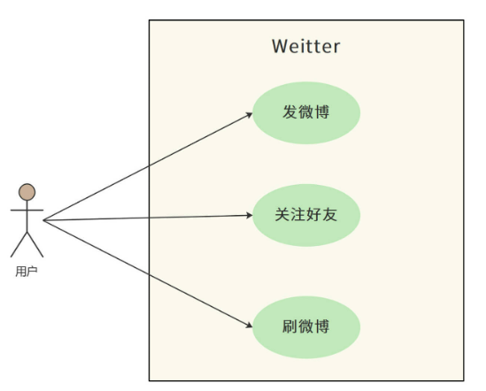
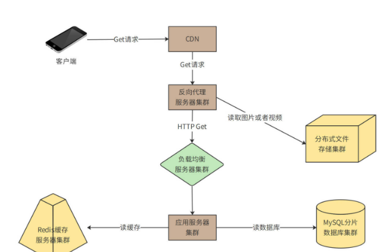
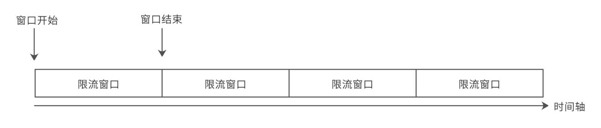
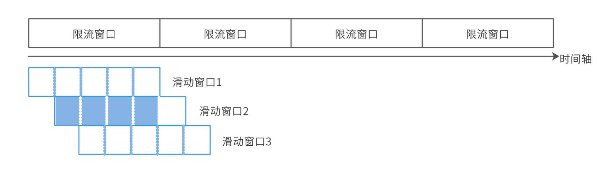

# 微博系统设计：怎么应对热点事件的突发访问压力

:::info
<font style="color:rgb(77, 77, 77);">微博（microblog）是一种允许用户即时更新简短文本（比如140个字符），并可以公开发布的微型博客形式。今天我们就来开发一个面向全球用户、可以支持10亿级用户体量的微博系统，系统名称为“Weitter”。</font>

<font style="color:rgb(77, 77, 77);">我们知道，微博有一个重要特点就是部分明星大V拥有大量的粉丝。如果明星们发布一条比较有话题性的个人花边新闻，比如宣布结婚或者离婚，就会引起粉丝们大量的转发和评论，进而引起更大规模的用户阅读和传播。</font>

<font style="color:rgb(77, 77, 77);">这种突发的单一热点事件导致的高并发访问会给系统带来极大的负载压力，处理不当甚至会导致</font>系统崩溃<font style="color:rgb(77, 77, 77);">。而这种崩溃又会成为事件热点的一部分，进而引来更多的围观和传播。</font>

<font style="color:rgb(77, 77, 77);">因此，Weitter的技术挑战，一方面是微博这样类似的信息流</font>系统架构<font style="color:rgb(77, 77, 77);">是如何设计的，另一方面就是如何解决大V们的热点消息产生的突发高并发访问压力，保障系统的可用性。今天我们就来看看这样的系统架构该怎么设计。</font>

:::

### **<font style="color:rgb(79, 79, 79);">1 需求分析</font>**
<font style="color:rgb(77, 77, 77);">Weitter的核心功能只有三个：发微博，关注好友，刷微博。</font>



1. <font style="color:rgb(51, 51, 51);">发微博：用户可以发表微博，内容包含不超过140个字的文本，可以包含图片和视频。</font>
2. <font style="color:rgb(51, 51, 51);">关注好友：用户可以关注其他用户。</font>
3. <font style="color:rgb(51, 51, 51);">刷微博：用户打开自己的微博主页，主页显示用户关注的好友最近发表的微博；用户向下滑动页面（或者点刷新按钮），主页将更新关注好友的最新微博，且最新的微博显示在最上方；主页一次显示20条微博，当用户滑动到主页底部后，继续向上滑动，会按照时间顺序，显示当前页面后续的20条微博。</font>
4. <font style="color:rgb(51, 51, 51);">此外，用户还可以收藏、转发、评论微博。</font>

#### **<font style="color:rgb(79, 79, 79);">1. 性能指标估算</font>**
<font style="color:rgb(77, 77, 77);">系统按10亿用户设计，按20%日活估计，大约有2亿日活用户（DAU），其中每个日活用户每天发表一条微博，并且平均有500个关注者。</font>

<font style="color:rgb(77, 77, 77);">而对于</font>**<font style="color:rgb(77, 77, 77);">发微博所需的存储空间</font>**<font style="color:rgb(77, 77, 77);">，我们做如下估算。</font>

+ **<font style="color:rgb(51, 51, 51);">文本内容存储空间</font>**

<font style="color:rgb(77, 77, 77);">遵循惯例，每条微博140个字，如果以UTF8编码存储汉字计算，则每条微博需要</font><font style="color:rgb(77, 77, 77);">s</font><font style="color:rgb(77, 77, 77);">m</font><font style="color:rgb(77, 77, 77);">a</font><font style="color:rgb(77, 77, 77);">l</font><font style="color:rgb(77, 77, 77);">l</font><font style="color:rgb(77, 77, 77);">140</font><font style="color:rgb(77, 77, 77);">t</font><font style="color:rgb(77, 77, 77);">i</font><font style="color:rgb(77, 77, 77);">m</font><font style="color:rgb(77, 77, 77);">e</font><font style="color:rgb(77, 77, 77);">s</font><font style="color:rgb(77, 77, 77);">3</font><font style="color:rgb(77, 77, 77);">=</font><font style="color:rgb(77, 77, 77);">420</font><font style="color:rgb(77, 77, 77);">𝑠</font><font style="color:rgb(77, 77, 77);">𝑚</font><font style="color:rgb(77, 77, 77);">𝑎</font><font style="color:rgb(77, 77, 77);">𝑙</font><font style="color:rgb(77, 77, 77);">𝑙</font><font style="color:rgb(77, 77, 77);">140</font><font style="color:rgb(77, 77, 77);">𝑡</font><font style="color:rgb(77, 77, 77);">𝑖</font><font style="color:rgb(77, 77, 77);">𝑚</font><font style="color:rgb(77, 77, 77);">𝑒</font><font style="color:rgb(77, 77, 77);">𝑠</font><font style="color:rgb(77, 77, 77);">3</font><font style="color:rgb(77, 77, 77);">=</font><font style="color:rgb(77, 77, 77);">420</font><font style="color:rgb(77, 77, 77);">个字节的存储空间。除了汉字内容以外，每条微博还需要存储微博ID、用户ID、时间戳、经纬度等数据，按80个字节计算。那么每天新发表微博文本内容需要的存储空间为100GB。</font>

<font style="color:rgb(77, 77, 77);">s</font><font style="color:rgb(77, 77, 77);">m</font><font style="color:rgb(77, 77, 77);">a</font><font style="color:rgb(77, 77, 77);">l</font><font style="color:rgb(77, 77, 77);">l</font><font style="color:rgb(77, 77, 77);">2</font><font style="color:rgb(77, 77, 77);">亿</font><font style="color:rgb(77, 77, 77);">t</font><font style="color:rgb(77, 77, 77);">i</font><font style="color:rgb(77, 77, 77);">m</font><font style="color:rgb(77, 77, 77);">e</font><font style="color:rgb(77, 77, 77);">s</font><font style="color:rgb(77, 77, 77);">(</font><font style="color:rgb(77, 77, 77);">420</font><font style="color:rgb(77, 77, 77);">B</font><font style="color:rgb(77, 77, 77);">+</font><font style="color:rgb(77, 77, 77);">80</font><font style="color:rgb(77, 77, 77);">B</font><font style="color:rgb(77, 77, 77);">)</font><font style="color:rgb(77, 77, 77);">=</font><font style="color:rgb(77, 77, 77);">100</font><font style="color:rgb(77, 77, 77);">G</font><font style="color:rgb(77, 77, 77);">B</font><font style="color:rgb(77, 77, 77);">/</font><font style="color:rgb(77, 77, 77);">天</font><font style="color:rgb(77, 77, 77);">𝑠</font><font style="color:rgb(77, 77, 77);">𝑚</font><font style="color:rgb(77, 77, 77);">𝑎</font><font style="color:rgb(77, 77, 77);">𝑙</font><font style="color:rgb(77, 77, 77);">𝑙</font><font style="color:rgb(77, 77, 77);">2</font><font style="color:rgb(77, 77, 77);">亿</font><font style="color:rgb(77, 77, 77);">𝑡</font><font style="color:rgb(77, 77, 77);">𝑖</font><font style="color:rgb(77, 77, 77);">𝑚</font><font style="color:rgb(77, 77, 77);">𝑒</font><font style="color:rgb(77, 77, 77);">𝑠</font><font style="color:rgb(77, 77, 77);">(</font><font style="color:rgb(77, 77, 77);">420</font><font style="color:rgb(77, 77, 77);">𝐵</font><font style="color:rgb(77, 77, 77);">+</font><font style="color:rgb(77, 77, 77);">80</font><font style="color:rgb(77, 77, 77);">𝐵</font><font style="color:rgb(77, 77, 77);">)</font><font style="color:rgb(77, 77, 77);">=</font><font style="color:rgb(77, 77, 77);">100</font><font style="color:rgb(77, 77, 77);">𝐺</font><font style="color:rgb(77, 77, 77);">𝐵</font><font style="color:rgb(77, 77, 77);">/</font><font style="color:rgb(77, 77, 77);">天</font>

+ **<font style="color:rgb(51, 51, 51);">多媒体文件存储空间</font>**

<font style="color:rgb(77, 77, 77);">除了140字文本内容，微博还可以包含图片和视频，按每5条微博包含一张图片，每10条微博包含一个视频估算，每张图片500KB，每个视频2MB，每天还需要60TB的多媒体文件存储空间。</font>

<font style="color:rgb(77, 77, 77);">s</font><font style="color:rgb(77, 77, 77);">m</font><font style="color:rgb(77, 77, 77);">a</font><font style="color:rgb(77, 77, 77);">l</font><font style="color:rgb(77, 77, 77);">l</font><font style="color:rgb(77, 77, 77);">2</font><font style="color:rgb(77, 77, 77);">亿</font><font style="color:rgb(77, 77, 77);">d</font><font style="color:rgb(77, 77, 77);">i</font><font style="color:rgb(77, 77, 77);">v</font><font style="color:rgb(77, 77, 77);">5</font><font style="color:rgb(77, 77, 77);">t</font><font style="color:rgb(77, 77, 77);">i</font><font style="color:rgb(77, 77, 77);">m</font><font style="color:rgb(77, 77, 77);">e</font><font style="color:rgb(77, 77, 77);">s</font><font style="color:rgb(77, 77, 77);">500</font><font style="color:rgb(77, 77, 77);">K</font><font style="color:rgb(77, 77, 77);">B</font><font style="color:rgb(77, 77, 77);">+</font><font style="color:rgb(77, 77, 77);">2</font><font style="color:rgb(77, 77, 77);">亿</font><font style="color:rgb(77, 77, 77);">d</font><font style="color:rgb(77, 77, 77);">i</font><font style="color:rgb(77, 77, 77);">v</font><font style="color:rgb(77, 77, 77);">10</font><font style="color:rgb(77, 77, 77);">t</font><font style="color:rgb(77, 77, 77);">i</font><font style="color:rgb(77, 77, 77);">m</font><font style="color:rgb(77, 77, 77);">e</font><font style="color:rgb(77, 77, 77);">s</font><font style="color:rgb(77, 77, 77);">2</font><font style="color:rgb(77, 77, 77);">M</font><font style="color:rgb(77, 77, 77);">B</font><font style="color:rgb(77, 77, 77);">=</font><font style="color:rgb(77, 77, 77);">60</font><font style="color:rgb(77, 77, 77);">T</font><font style="color:rgb(77, 77, 77);">B</font><font style="color:rgb(77, 77, 77);">/</font><font style="color:rgb(77, 77, 77);">天</font><font style="color:rgb(77, 77, 77);">𝑠</font><font style="color:rgb(77, 77, 77);">𝑚</font><font style="color:rgb(77, 77, 77);">𝑎</font><font style="color:rgb(77, 77, 77);">𝑙</font><font style="color:rgb(77, 77, 77);">𝑙</font><font style="color:rgb(77, 77, 77);">2</font><font style="color:rgb(77, 77, 77);">亿</font><font style="color:rgb(77, 77, 77);">𝑑</font><font style="color:rgb(77, 77, 77);">𝑖</font><font style="color:rgb(77, 77, 77);">𝑣</font><font style="color:rgb(77, 77, 77);">5</font><font style="color:rgb(77, 77, 77);">𝑡</font><font style="color:rgb(77, 77, 77);">𝑖</font><font style="color:rgb(77, 77, 77);">𝑚</font><font style="color:rgb(77, 77, 77);">𝑒</font><font style="color:rgb(77, 77, 77);">𝑠</font><font style="color:rgb(77, 77, 77);">500</font><font style="color:rgb(77, 77, 77);">𝐾</font><font style="color:rgb(77, 77, 77);">𝐵</font><font style="color:rgb(77, 77, 77);">+</font><font style="color:rgb(77, 77, 77);">2</font><font style="color:rgb(77, 77, 77);">亿</font><font style="color:rgb(77, 77, 77);">𝑑</font><font style="color:rgb(77, 77, 77);">𝑖</font><font style="color:rgb(77, 77, 77);">𝑣</font><font style="color:rgb(77, 77, 77);">10</font><font style="color:rgb(77, 77, 77);">𝑡</font><font style="color:rgb(77, 77, 77);">𝑖</font><font style="color:rgb(77, 77, 77);">𝑚</font><font style="color:rgb(77, 77, 77);">𝑒</font><font style="color:rgb(77, 77, 77);">𝑠</font><font style="color:rgb(77, 77, 77);">2</font><font style="color:rgb(77, 77, 77);">𝑀</font><font style="color:rgb(77, 77, 77);">𝐵</font><font style="color:rgb(77, 77, 77);">=</font><font style="color:rgb(77, 77, 77);">60</font><font style="color:rgb(77, 77, 77);">𝑇</font><font style="color:rgb(77, 77, 77);">𝐵</font><font style="color:rgb(77, 77, 77);">/</font><font style="color:rgb(77, 77, 77);">天</font>

<font style="color:rgb(77, 77, 77);">对于</font>**<font style="color:rgb(77, 77, 77);">刷微博的访问并发量</font>**<font style="color:rgb(77, 77, 77);">，我们做如下估算。</font>

+ **<font style="color:rgb(51, 51, 51);">QPS</font>**

<font style="color:rgb(77, 77, 77);">假设两亿日活用户每天浏览两次微博，每次向上滑动或者进入某个人的主页10次，每次显示20条微博，每天刷新微博次数40亿次，即40亿次微博查询接口调用，平均QPS大约5万。</font>

<font style="color:rgb(77, 77, 77);">s</font><font style="color:rgb(77, 77, 77);">m</font><font style="color:rgb(77, 77, 77);">a</font><font style="color:rgb(77, 77, 77);">l</font><font style="color:rgb(77, 77, 77);">l</font><font style="color:rgb(77, 77, 77);">40</font><font style="color:rgb(77, 77, 77);">亿</font><font style="color:rgb(77, 77, 77);">d</font><font style="color:rgb(77, 77, 77);">i</font><font style="color:rgb(77, 77, 77);">v</font><font style="color:rgb(77, 77, 77);">（</font><font style="color:rgb(77, 77, 77);">24</font><font style="color:rgb(77, 77, 77);">t</font><font style="color:rgb(77, 77, 77);">i</font><font style="color:rgb(77, 77, 77);">m</font><font style="color:rgb(77, 77, 77);">e</font><font style="color:rgb(77, 77, 77);">s</font><font style="color:rgb(77, 77, 77);">60</font><font style="color:rgb(77, 77, 77);">t</font><font style="color:rgb(77, 77, 77);">i</font><font style="color:rgb(77, 77, 77);">m</font><font style="color:rgb(77, 77, 77);">e</font><font style="color:rgb(77, 77, 77);">s</font><font style="color:rgb(77, 77, 77);">60</font><font style="color:rgb(77, 77, 77);">）</font><font style="color:rgb(77, 77, 77);">=</font><font style="color:rgb(77, 77, 77);">46296</font><font style="color:rgb(77, 77, 77);">/</font><font style="color:rgb(77, 77, 77);">秒</font><font style="color:rgb(77, 77, 77);">𝑠</font><font style="color:rgb(77, 77, 77);">𝑚</font><font style="color:rgb(77, 77, 77);">𝑎</font><font style="color:rgb(77, 77, 77);">𝑙</font><font style="color:rgb(77, 77, 77);">𝑙</font><font style="color:rgb(77, 77, 77);">40</font><font style="color:rgb(77, 77, 77);">亿</font><font style="color:rgb(77, 77, 77);">𝑑</font><font style="color:rgb(77, 77, 77);">𝑖</font><font style="color:rgb(77, 77, 77);">𝑣</font><font style="color:rgb(77, 77, 77);">（</font><font style="color:rgb(77, 77, 77);">24</font><font style="color:rgb(77, 77, 77);">𝑡</font><font style="color:rgb(77, 77, 77);">𝑖</font><font style="color:rgb(77, 77, 77);">𝑚</font><font style="color:rgb(77, 77, 77);">𝑒</font><font style="color:rgb(77, 77, 77);">𝑠</font><font style="color:rgb(77, 77, 77);">60</font><font style="color:rgb(77, 77, 77);">𝑡</font><font style="color:rgb(77, 77, 77);">𝑖</font><font style="color:rgb(77, 77, 77);">𝑚</font><font style="color:rgb(77, 77, 77);">𝑒</font><font style="color:rgb(77, 77, 77);">𝑠</font><font style="color:rgb(77, 77, 77);">60</font><font style="color:rgb(77, 77, 77);">）</font><font style="color:rgb(77, 77, 77);">=</font><font style="color:rgb(77, 77, 77);">46296</font><font style="color:rgb(77, 77, 77);">/</font><font style="color:rgb(77, 77, 77);">秒</font>

<font style="color:rgb(77, 77, 77);">高峰期QPS按平均值2倍计算，所以系统需要满足10万QPS。</font>

+ **<font style="color:rgb(51, 51, 51);">网络带宽</font>**

<font style="color:rgb(77, 77, 77);">10万QPS刷新请求，每次返回微博20条，那么每秒需访问200万条微博。按此前估计，每5条微博包含一张图片，每10条微博包含一个视频，需要的</font>**<font style="color:rgb(77, 77, 77);">网络总带宽</font>**<font style="color:rgb(77, 77, 77);">为4.8Tb/s。</font>

<font style="color:rgb(77, 77, 77);">s</font><font style="color:rgb(77, 77, 77);">m</font><font style="color:rgb(77, 77, 77);">a</font><font style="color:rgb(77, 77, 77);">l</font><font style="color:rgb(77, 77, 77);">l</font><font style="color:rgb(77, 77, 77);">（</font><font style="color:rgb(77, 77, 77);">200</font><font style="color:rgb(77, 77, 77);">万</font><font style="color:rgb(77, 77, 77);">d</font><font style="color:rgb(77, 77, 77);">i</font><font style="color:rgb(77, 77, 77);">v</font><font style="color:rgb(77, 77, 77);">5</font><font style="color:rgb(77, 77, 77);">t</font><font style="color:rgb(77, 77, 77);">i</font><font style="color:rgb(77, 77, 77);">m</font><font style="color:rgb(77, 77, 77);">e</font><font style="color:rgb(77, 77, 77);">s</font><font style="color:rgb(77, 77, 77);">500</font><font style="color:rgb(77, 77, 77);">K</font><font style="color:rgb(77, 77, 77);">B</font><font style="color:rgb(77, 77, 77);">+</font><font style="color:rgb(77, 77, 77);">200</font><font style="color:rgb(77, 77, 77);">万</font><font style="color:rgb(77, 77, 77);">d</font><font style="color:rgb(77, 77, 77);">i</font><font style="color:rgb(77, 77, 77);">v</font><font style="color:rgb(77, 77, 77);">10</font><font style="color:rgb(77, 77, 77);">t</font><font style="color:rgb(77, 77, 77);">i</font><font style="color:rgb(77, 77, 77);">m</font><font style="color:rgb(77, 77, 77);">e</font><font style="color:rgb(77, 77, 77);">s</font><font style="color:rgb(77, 77, 77);">2</font><font style="color:rgb(77, 77, 77);">M</font><font style="color:rgb(77, 77, 77);">B</font><font style="color:rgb(77, 77, 77);">）</font><font style="color:rgb(77, 77, 77);">t</font><font style="color:rgb(77, 77, 77);">i</font><font style="color:rgb(77, 77, 77);">m</font><font style="color:rgb(77, 77, 77);">e</font><font style="color:rgb(77, 77, 77);">s</font><font style="color:rgb(77, 77, 77);">8</font><font style="color:rgb(77, 77, 77);">b</font><font style="color:rgb(77, 77, 77);">i</font><font style="color:rgb(77, 77, 77);">t</font><font style="color:rgb(77, 77, 77);">=</font><font style="color:rgb(77, 77, 77);">4.8</font><font style="color:rgb(77, 77, 77);">T</font><font style="color:rgb(77, 77, 77);">b</font><font style="color:rgb(77, 77, 77);">/</font><font style="color:rgb(77, 77, 77);">s</font><font style="color:rgb(77, 77, 77);">𝑠</font><font style="color:rgb(77, 77, 77);">𝑚</font><font style="color:rgb(77, 77, 77);">𝑎</font><font style="color:rgb(77, 77, 77);">𝑙</font><font style="color:rgb(77, 77, 77);">𝑙</font><font style="color:rgb(77, 77, 77);">（</font><font style="color:rgb(77, 77, 77);">200</font><font style="color:rgb(77, 77, 77);">万</font><font style="color:rgb(77, 77, 77);">𝑑</font><font style="color:rgb(77, 77, 77);">𝑖</font><font style="color:rgb(77, 77, 77);">𝑣</font><font style="color:rgb(77, 77, 77);">5</font><font style="color:rgb(77, 77, 77);">𝑡</font><font style="color:rgb(77, 77, 77);">𝑖</font><font style="color:rgb(77, 77, 77);">𝑚</font><font style="color:rgb(77, 77, 77);">𝑒</font><font style="color:rgb(77, 77, 77);">𝑠</font><font style="color:rgb(77, 77, 77);">500</font><font style="color:rgb(77, 77, 77);">𝐾</font><font style="color:rgb(77, 77, 77);">𝐵</font><font style="color:rgb(77, 77, 77);">+</font><font style="color:rgb(77, 77, 77);">200</font><font style="color:rgb(77, 77, 77);">万</font><font style="color:rgb(77, 77, 77);">𝑑</font><font style="color:rgb(77, 77, 77);">𝑖</font><font style="color:rgb(77, 77, 77);">𝑣</font><font style="color:rgb(77, 77, 77);">10</font><font style="color:rgb(77, 77, 77);">𝑡</font><font style="color:rgb(77, 77, 77);">𝑖</font><font style="color:rgb(77, 77, 77);">𝑚</font><font style="color:rgb(77, 77, 77);">𝑒</font><font style="color:rgb(77, 77, 77);">𝑠</font><font style="color:rgb(77, 77, 77);">2</font><font style="color:rgb(77, 77, 77);">𝑀</font><font style="color:rgb(77, 77, 77);">𝐵</font><font style="color:rgb(77, 77, 77);">）</font><font style="color:rgb(77, 77, 77);">𝑡</font><font style="color:rgb(77, 77, 77);">𝑖</font><font style="color:rgb(77, 77, 77);">𝑚</font><font style="color:rgb(77, 77, 77);">𝑒</font><font style="color:rgb(77, 77, 77);">𝑠</font><font style="color:rgb(77, 77, 77);">8</font><font style="color:rgb(77, 77, 77);">𝑏</font><font style="color:rgb(77, 77, 77);">𝑖</font><font style="color:rgb(77, 77, 77);">𝑡</font><font style="color:rgb(77, 77, 77);">=</font><font style="color:rgb(77, 77, 77);">4.8</font><font style="color:rgb(77, 77, 77);">𝑇</font><font style="color:rgb(77, 77, 77);">𝑏</font><font style="color:rgb(77, 77, 77);">/</font><font style="color:rgb(77, 77, 77);">𝑠</font>

### **<font style="color:rgb(79, 79, 79);">2 概要设计</font>**
<font style="color:rgb(77, 77, 77);">在需求分析中我们可以看到，Weitter的业务逻辑比较简单，但是</font>**<font style="color:rgb(77, 77, 77);">并发量</font>**<font style="color:rgb(77, 77, 77);">和</font>**<font style="color:rgb(77, 77, 77);">数据量</font>**<font style="color:rgb(77, 77, 77);">都比较大，所以，</font>**<font style="color:rgb(77, 77, 77);">系统架构的核心就是解决高并发的问题</font>**<font style="color:rgb(77, 77, 77);">，系统整体部署模型如下。</font>


<font style="color:rgb(77, 77, 77);">这里包含了“Get请求”和“Post请求”两条链路，Get请求主要处理刷微博的操作，Post请求主要处理发微博的请求，这两种请求处理也有重合的部分，我们拆分着来看。</font>

<font style="color:rgb(77, 77, 77);">我们先来看看</font>**<font style="color:rgb(77, 77, 77);">Get请求</font>**<font style="color:rgb(77, 77, 77);">的部分。</font>



<font style="color:rgb(77, 77, 77);">用户通过CDN访问Weitter的数据中心、图片以及视频等极耗带宽的请求，绝大部分可以被CDN缓存命中，也就是说，4.8Tb/s的带宽压力，90%以上可以通过CDN消化掉。</font>

<font style="color:rgb(77, 77, 77);">没有被CDN命中的请求，一部分是图片和视频请求，其余主要是用户刷新微博请求、查看用户信息请求等，这些请求到达数据中心的反向代理服务器。反向代理服务器检查本地缓存是否有请求需要的内容。如果有，就直接返回；如果没有，对于图片和视频文件，会通过分布式文件存储集群获取相关内容并返回。分布式文件存储集群中的图片和视频是用户发表微博的时候，上传上来的。</font>

<font style="color:rgb(77, 77, 77);">对于用户微博内容等请求，如果反向代理服务器没有缓存，就会通过负载均衡服务器到达应用服务器处理。应用服务器首先会从Redis缓存服务器中，检索当前用户关注的好友发表的最新微博，并构建一个结果页面返回。如果Redis中缓存的微博数据量不足，构造不出一个结果页面需要的20条微博，应用服务器会继续从MySQL分片数据库中查找数据。</font>

<font style="color:rgb(77, 77, 77);">以上处理流程主要是针对读（http get）请求，那如果是发表微博这样的写（http post）请求呢？我们再来看一下</font>**<font style="color:rgb(77, 77, 77);">写请求</font>**<font style="color:rgb(77, 77, 77);">部分的图。</font>


<font style="color:rgb(77, 77, 77);">你会看到，客户端不需要通过CDN和反向代理，而是直接通过负载均衡服务器到达应用服务器。应用服务器一方面会将发表的微博写入Redis缓存集群，一方面写入分片数据库中。</font>

<font style="color:rgb(77, 77, 77);">在写入数据库的时候，如果直接写数据库，当有高并发的写请求突然到来，可能会导致数据库过载，进而引发系统崩溃。所以，数据库写操作，包括发表微博、关注好友、评论微博等，都写入到消息队列服务器，由消息队列的消费者程序从消息队列中按照一定的速度消费消息，并写入数据库中，保证数据库的负载压力不会突然增加。</font>

### **<font style="color:rgb(79, 79, 79);">3 详细设计</font>**
<font style="color:rgb(77, 77, 77);">用户刷新微博的时候，如何能快速得到自己关注的好友的最新微博列表？10万QPS的并发量如何应对？如何避免数据库负载压力太大以及如何快速响应用户请求？详细设计将基于功能需求和概要设计，主要讨论这些问题。</font>

#### **<font style="color:rgb(79, 79, 79);">3.1 微博的发表/订阅问题</font>**
<font style="color:rgb(77, 77, 77);">Weitter用户关注好友后，如何快速得到所有好友的最新发表的微博内容，即发表/订阅问题，是微博的核心业务问题。</font>

<font style="color:rgb(77, 77, 77);">一种简单的办法就是“推模式”，即建一张用户订阅表，用户关注的好友发表微博后，立即在用户订阅中为该用户插入一条记录，记录用户id和好友发表的微博id。这样当用户刷新微博的时候，只需要从用户订阅表中按用户id查询所有订阅的微博，然后按时间顺序构建一个列表即可。也就是说，</font>**<font style="color:rgb(77, 77, 77);">推模式是在用户发</font>**<font style="color:rgb(77, 77, 77);">微博</font>**<font style="color:rgb(77, 77, 77);">的时候推送给所有的关注者</font>**<font style="color:rgb(77, 77, 77);">，如下图，用户发表了微博0，他的所有关注者的订阅表都插入微博0。</font>


<font style="color:rgb(77, 77, 77);">推模式实现起来比较简单，但是推模式意味着，如果一个用户有大量的关注者，那么该用户每发表一条微博，就需要在订阅表中为每个关注者插入一条记录。而对于明星用户而言，可能会有几千万的关注者，明星用户发表一条微博，就会导致上千万次的数据库插入操作，直接导致系统崩溃。</font>

<font style="color:rgb(77, 77, 77);">所以，对于10亿级用户的微博系统而言，我们需要使用“拉模式”解决发表/订阅问题。也就是说，用户刷新微博的时候，根据其关注的好友列表，查询每个好友近期发表的微博，然后将所有微博按照时间顺序排序后构建一个列表。也就是说，</font>**<font style="color:rgb(77, 77, 77);">拉模式是在用户刷微博的时候拉取他关注的所有好友的最新微博</font>**<font style="color:rgb(77, 77, 77);">，如下图：</font>


<font style="color:rgb(77, 77, 77);">拉模式极大降低了发表微博时写入数据的负载压力，但是却又急剧增加了刷微博时候读数据库的压力。因为对于用户关注的每个好友，都需要进行一次数据库查询。如果一个用户关注了大量好友，查询压力也是非常巨大的。</font>

<font style="color:rgb(77, 77, 77);">所以，首先需要限制用户关注的好友数，在Weitter中，普通用户关注上限是2000人，VIP用户关注上限是5000人。其次，需要尽量减少刷新时查询数据库的次数，也就是说，微博要尽量通过缓存读取。</font>

<font style="color:rgb(77, 77, 77);">但即使如此，你会发现每次刷新的查询压力还是太大，所以Weitter最终采用“推拉结合”的模式。也就是说，如果用户当前在线，那么就会使用推模式，系统会在缓存中为其创建一个好友最新发表微博列表，关注的好友如果有新发表微博，就立即将该微博插入列表的头部，当该用户刷新微博的时候，只需要将这个列表返回即可。</font>

<font style="color:rgb(77, 77, 77);">如果用户当前不在线，那么系统就会将该列表删除。当用户登录刷新的时候，用拉模式为其重新构建列表。</font>

<font style="color:rgb(77, 77, 77);">那么如何确定一个用户是否在线？一方面可以通过用户操作时间间隔来判断，另一方面也可以通过机器学习，预测用户的上线时间，利用系统空闲时间，提前为其构建最新微博列表。</font>

#### **<font style="color:rgb(79, 79, 79);">3.2 缓存使用策略</font>**
<font style="color:rgb(77, 77, 77);">通过前面的分析我们已经看到，Weitter是一个典型的高并发读操作的场景。10万QPS刷新请求，每个请求需要返回20条微博，如果全部到数据库中查询的话，数据库的QPS将达到200万，即使是使用分片的分布式数据库，这种压力也依然是无法承受的。所以，我们需要大量使用缓存以改善性能，提高吞吐能力。</font>

<font style="color:rgb(77, 77, 77);">但是缓存的空间是有限的，我们必定不能将所有数据都缓存起来。一般缓存使用的是LRU淘汰算法，即当缓存空间不足时，将最近最少使用的缓存数据删除，空出缓存空间存储新数据。</font>

<font style="color:rgb(77, 77, 77);">但是LRU算法并不适合微博的场景，因为在拉模式的情况下，当用户刷新微博的时候，我们需要确保其关注的好友最新发表的微博都能展示出来，如果其关注的某个好友较少有其他关注者，那么这个好友发表的微博就很可能会被LRU算法淘汰删除出缓存。对于这种情况，系统就不得不去数据库中进行查询。</font>

<font style="color:rgb(77, 77, 77);">而最关键的是，系统并不能知道哪些好友的数据通过读缓存就可以得到全部最新的微博，而哪些好友需要到数据库中查找。因此不得不全部到数据库中查找，这就失去了使用缓存的意义。</font>

<font style="color:rgb(77, 77, 77);">基于此，我们在Weitter中使用</font>**<font style="color:rgb(77, 77, 77);">时间淘汰算法</font>**<font style="color:rgb(77, 77, 77);">，**也就是将最近一定天数内发布的微博全部缓存起来，用户刷新微博的时候，只需要在缓存中进行查找。如果查找到的微博数满足一次返回的条数（20条），就直接返回给用户；如果缓存中的微博数不足，就再到数据库中查找。</font>

<font style="color:rgb(77, 77, 77);">最终，Weitter决定缓存7天内发表的全部微博，需要的缓存空间约700G。缓存的key为用户ID，value为用户最近7天发表的微博ID列表。而微博ID和微博内容分别作为key和value也缓存起来。</font>

<font style="color:rgb(77, 77, 77);">此外，对于特别热门的微博内容，比如某个明星的离婚微博，这种针对单个微博内容的高并发访问，由于访问压力都集中一个缓存key上，会给单台Redis服务器造成极大的负载压力。因此，微博还会启用</font>**<font style="color:rgb(77, 77, 77);">本地缓存模式</font>**<font style="color:rgb(77, 77, 77);">，即应用服务器在内存中缓存特别热门的微博内容，应用构建微博刷新页的时候，会优先检查微博ID对应的微博内容是否在本地缓存中。</font>

<font style="color:rgb(77, 77, 77);">Weitter最后确定的本地缓存策略是：针对拥有100万以上关注者的大V用户，缓存其48小时内发表的全部微博。</font>

<font style="color:rgb(77, 77, 77);">现在，我们来看一下Weitter整体的缓存架构。</font>


#### **<font style="color:rgb(79, 79, 79);">3.3 数据库分片策略</font>**
<font style="color:rgb(77, 77, 77);">前面我们分析过，Weitter每天新增2亿条微博。也就是说，平均每秒钟需要写入2400条微博，高峰期每秒写入4600条微博。这样的写入压力，对于单机数据库而言是无法承受的。而且，每年新增700亿条微博记录，这也超出了单机数据库的存储能力。因此，Weitter的数据库需要采用分片部署的分布式数据库。分片的规则可以采用用户ID分片或者微博 ID分片。</font>

<font style="color:rgb(77, 77, 77);">如果按用户ID（的hash值）分片，那么一个用户发表的全部微博都会保存到一台数据库服务器上。这样做的好处是，当系统需要按用户查找其发表的微博的时候，只需要访问一台服务器就可以完成。</font>

<font style="color:rgb(77, 77, 77);">但是这样做也有缺点，对于一个明星大V用户，其数据访问会成热点，进而导致这台服务器负载压力太大。同样地，如果某个用户频繁发表微博，也会导致这台服务器数据增长过快。</font>

<font style="color:rgb(77, 77, 77);">要是按微博 ID（的hash值）分片，虽然可以避免上述按用户ID分片的热点聚集问题，但是当查找一个用户的所有微博时，需要访问所有的分片数据库服务器才能得到所需的数据，对数据库服务器集群的整体压力太大。</font>

<font style="color:rgb(77, 77, 77);">综合考虑，用户ID分片带来的热点问题，可以通过优化缓存来改善；而某个用户频繁发表微博的问题，可以通过设置每天发表微博数上限（每个用户每天最多发表50条微博）来解决。最终，Weitter采用按用户ID分片的策略。</font>

## <font style="color:rgb(79, 79, 79);">如何避免超预期的高并发压力压垮系统？</font>
<font style="color:rgb(77, 77, 77);">在互联网高可用架构设计中，限流是一种经典的高可用架构模式。因为某些原因，大量用户突然访问我们的系统时，或者有黑客恶意用DoS（Denial of Service，拒绝服务）方式攻击我们的系统时，这种未曾预期的高并发访问对系统产生的负载压力可能会导致系统崩溃。</font>

<font style="color:rgb(77, 77, 77);">解决这种问题的一个主要手段就是限流，即拒绝部分访问请求，使访问负载压力降低到一个系统可以承受的程度。这样虽然有部分用户访问失败，但是整个系统依然是可用的，依然能对外提供服务，而不是因为负载压力太大而崩溃，导致所有用户都不能访问。</font>

<font style="color:rgb(77, 77, 77);">为此，我们准备开发一个限流器，产品名称为“Diana”。</font>

### **<font style="color:rgb(79, 79, 79);">14.1 需求分析</font>**
<font style="color:rgb(77, 77, 77);">我们将Diana定位为一个限流器组件，即Diana的主要应用场景是部署在微服务网关或者其他HTTP服务器入口，以过滤器的方式对请求进行过滤，对超过限流规则的请求返回“服务不可用”HTTP响应。</font>

<font style="color:rgb(77, 77, 77);">Diana的限流规则可通过配置文件获取，并需要支持本地配置和远程配置两种方式，远程配置优先于本地配置。限流方式包括：</font>

+ <font style="color:rgb(51, 51, 51);">全局限流：针对所有请求进行限流，即保证整个系统处理的请求总数满足限流配置。</font>
+ <font style="color:rgb(51, 51, 51);">账号限流：针对账号进行限流，即对单个账号发送的请求进行限流。</font>
+ <font style="color:rgb(51, 51, 51);">设备限流：针对设备进行限流，即对单个客户端设备发送的请求进行限流。</font>
+ <font style="color:rgb(51, 51, 51);">资源限流：针对某个资源（即某个URL）进行限流，即保证访问该资源的请求总数满足限流配置。</font>

<font style="color:rgb(77, 77, 77);">并且Diana设计应遵循开闭原则，能够支持灵活的限流规则功能扩展，即未来在不修改现有代码和兼容现有配置文件的情况下，支持新的配置规则。</font>

### **<font style="color:rgb(79, 79, 79);">14.2 概要设计</font>**
<font style="color:rgb(77, 77, 77);">Diana的设计目标是一个限流器组件，即Diana并不是一个独立的系统，不可以独立部署进行限流，而是部署在系统网关（或者其他HTTP服务器上），作为网关的一个组件进行限流，部署模型如下：</font>


<font style="color:rgb(77, 77, 77);">用户请求（通过负载均衡服务器）到达网关服务器。网关服务器本质也是一个HTTP服务器，限流器是部署在网关中的一个过滤器（filter）组件，和网关中的签名校验过滤器、用户权限过滤器等配置在同一个过滤器责任链（Chain of Responsibility）上。限流器应该配置在整个过滤器责任链的前端，也就是说，如果请求超过了限流，请求不需要再进入其他过滤器，直接被限流器拒绝。</font>

<font style="color:rgb(77, 77, 77);">用户请求进入限流器后，根据限流策略，判断该请求是否已经超过限流，如果超过，限流器直接返回状态码为503（Too Many Requests）的响应；如果没有超过限流，请求继续向下处理（经过其他网关过滤器），并最终调用微服务完成处理。</font>

<font style="color:rgb(77, 77, 77);">限流器的策略可以在本地配置，也可以通过远程的配置中心服务器加载，即远程配置。远程配置优先于本地配置。</font>

#### **<font style="color:rgb(79, 79, 79);">14.2.1 限流模式设计</font>**
<font style="color:rgb(77, 77, 77);">请求是否超过限流，主要就是判断单位时间请求数量是否超过配置的请求限流数量。单位时间请求数量，可以本地记录，也可以远程记录。方便起见，本地记录称作本地限流，远程记录称作远程限流（也叫分布式限流）。</font>

<font style="color:rgb(77, 77, 77);">本地限流意味着，每个网关服务器需要根据本地记录的单位时间请求数量进行限流。假设限流配置为每秒限流50请求，如果该网关服务器本地记录的当前一秒内接受请求数量达到50，那么这一秒内的后续请求都返回503响应。如果整个系统部署了100台网关服务器，每个网关配置本地限流为每秒50，那么，整个系统每秒最多可以处理5000个请求。</font>

<font style="color:rgb(77, 77, 77);">远程限流意味着，所有网关共享同一个限流数量，每个网关服务器收到请求后，从远程服务器中获取单位时间内已处理请求数，如果超过限流，就返回503响应。也就是说，可能某个网关服务器一段时间内根本就没有请求到达，但是远程的已处理请求数已经达到了限流上限，那么这台网关服务器也必须拒绝请求。我们使用Redis作为记录单位时间请求数量的远程服务器。</font>

#### **<font style="color:rgb(79, 79, 79);">14.2.2 高可用设计</font>**
<font style="color:rgb(77, 77, 77);">为了保证配置中心服务器和Redis服务器宕机时，限流器组件的高可用。限流器应具有自动降级功能，即配置中心不可用，则使用本地配置；Redis服务器不可用，则降级为本地限流。</font>

### **<font style="color:rgb(79, 79, 79);">14.3 详细设计</font>**
<font style="color:rgb(77, 77, 77);">常用的限流算法有4种，固定窗口（Window）限流算法，滑动窗口（Sliding Window）限流算法，漏桶（Leaky Bucket）限流算法，令牌桶（Token Bucket）限流算法。我们将详细讨论这四种算法的实现。</font>

<font style="color:rgb(77, 77, 77);">此外，限流器运行期需要通过配置文件获取对哪些URL路径进行限流；本地限流还是分布式限流；对用户限流还是对设备限流，还是对所有请求限流；限流的阈值是多少；阈值的时间单位是什么；具体使用哪种限流算法。因此，我们需要先看下配置文件的设计。</font>

#### **<font style="color:rgb(79, 79, 79);">14.3.1 配置文件设计</font>**
<font style="color:rgb(77, 77, 77);">Diana限流器使用YAML进行配置，配置文件举例如下：</font>

```plain
Url:/
rules:
 - actor:device
   unit:second
   rpu:10
   algo:TB
   scope:global- actor:all
   unit:second
   rpu:50
   algo:W
   scope:local
```

<font style="color:rgb(77, 77, 77);">配置文件的配置项有7种，分别说明如下：</font>

1. <font style="color:rgb(51, 51, 51);">Url记录限流的资源地址，”/“表示所有请求，配置文件中的路径可以互相包含，比如“/”包含“/sample”，限流器要先匹配“/”的限流规则，如果“/”的限流规则还没有触发（即访问”/“的流量，也就是单位时间所有的请求总和没有达到限流规则），则再匹配“/sample”。</font>
2. <font style="color:rgb(51, 51, 51);">每个Url可以配置多个规则rules，每个规则包括actor，unit，rpu，algo，scope</font>
3. <font style="color:rgb(51, 51, 51);">actor为限流对象，可以是账号（actor），设备（device），全部（all）</font>
4. <font style="color:rgb(51, 51, 51);">unit为限流时间单位，可以是秒（second），分（minute），时（hour），天（day）</font>
5. <font style="color:rgb(51, 51, 51);">rpu为单位时间限流请求数（request per unit），即上面unit定义的单位时间内允许通过的请求数目，如unit为second，rpu为100，表示每秒允许通过100个请求，每秒超过100个请求就进行限流，返回503响应</font>
6. <font style="color:rgb(51, 51, 51);">scope为rpu生效范围，可以是本地（local），也可以是全局（global），scope也决定了单位时间请求数量是记录在本地还是远程，local记录在本地，global记录在远程。</font>
7. <font style="color:rgb(51, 51, 51);">algo限流算法，可以是window，sliding window，leaky bucket，token bucket 。</font>

<font style="color:rgb(77, 77, 77);">Diana支持配置4种限流算法，使用者可以根据自己的需求场景，为不同资源地址配置不同的限流算法，下面详细描述这四种算法实现。</font>

#### **<font style="color:rgb(79, 79, 79);">14.3.2 固定窗口（Window）限流算法</font>**
<font style="color:rgb(77, 77, 77);">固定窗口限流算法就是将配置文件中的时间单位unit作为一个时间窗口，每个窗口仅允许限制流量内的请求通过，如图。</font>



<font style="color:rgb(77, 77, 77);">我们将时间轴切分成一个一个的限流窗口，每个限流窗口有一个窗口开始时间和一个窗口结束时间，窗口开始时，计数器清零，每进入一个请求，计数器就记录+1。如果请求数目超过rpu配置的限流请求数，就拒绝服务，返回503响应。当前限流窗口结束后，就进入下个限流窗口，计数器再次清零，重新开始。处理流程活动图如下。</font>


<font style="color:rgb(77, 77, 77);">上图包括“初始化”和“处理流程”两个泳道。初始化的时候，设置“窗口计数器”和“当前窗口结束时间”两个变量。处理请求的时候，判断当前时间是否大于“当前窗口结束时间”，如果大于，那么重置“窗口计数器”和“当前窗口结束时间”两个变量；如果没有，窗口计数器+1，并判断计数器是否大于配置的限流请求数rpu，根据结果决定是否进行限流。</font>

<font style="color:rgb(77, 77, 77);">这里的“窗口计数器”可以本地记录，也可以远程记录，也就是配置中的local和global。固定窗口算法在配置文件中algo项可配置“window”或者缩写“W”。</font>

<font style="color:rgb(77, 77, 77);">固定窗口实现比较容易，但是如果使用这种限流算法，在一个限流时间单位内，通过的请求数可能是rpu的两倍，无法达到限流的目的，如下图。</font>


<font style="color:rgb(77, 77, 77);">假设单位时间请求限流数rpu为100，在第一个限流窗口快要到结束时间的时候，突然进来100个请求，因为这个请求量在限流范围内，所以没有触发限流，请求全部通过。然后进入第二个限流窗口，限流计数器清零。这时又忽然进入100个请求，因为已经进入第二个限流窗口，所以也没触发限流。在短时间内，通过了200个请求，这样可能会给系统造成巨大的负载压力。</font>

#### **<font style="color:rgb(79, 79, 79);">14.3.3 滑动窗口（Sliding Window）限流算法</font>**
<font style="color:rgb(77, 77, 77);">改进固定窗口缺陷的方法是采用滑动窗口限流算法，如下图。</font>



<font style="color:rgb(77, 77, 77);">滑动窗口就是将限流窗口内部切分成一些更小的时间片，然后在时间轴上滑动，每次滑动，滑过一个小时间片，就形成一个新的限流窗口，即滑动窗口。然后在这个滑动窗口内执行固定窗口算法即可。</font>

<font style="color:rgb(77, 77, 77);">滑动窗口可以避免固定窗口出现的放过两倍请求的问题，因为一个短时间内出现的所有请求必然在一个滑动窗口内，所以一定会被滑动窗口限流。</font>

<font style="color:rgb(77, 77, 77);">滑动窗口的算法实现基本和固定窗口一致，只要改动重置“窗口计数器”和“当前窗口结束时间”的逻辑就可以。固定窗口算法重置为窗口结束时间+1 unit 时间，滑动窗口算法重置为窗口结束时间+1个时间片。但是固定窗口算法重置后，窗口计数器为0，而滑动窗口需要将窗口计数器设置为当前窗口已经经过的时间片的请求总数，比如上图里，一个滑动窗口被分为5个时间片，滑动窗口2的浅蓝色部分就是已经经过了4个时间片。</font>

<font style="color:rgb(77, 77, 77);">滑动窗口算法在配置文件中algo项可配置“sliding window”或者缩写“SW”。</font>

#### **<font style="color:rgb(79, 79, 79);">14.3.4 漏桶（Leaky Bucket）限流算法</font>**
<font style="color:rgb(77, 77, 77);">漏桶限流算法是模拟水流过一个有漏洞的桶进而限流的思路，如图。</font>


<font style="color:rgb(77, 77, 77);">水龙头的水先流入漏桶，再通过漏桶底部的孔流出。如果流入的水量太大，底部的孔来不及流出，就会导致水桶太满溢出去。</font>

<font style="color:rgb(77, 77, 77);">限流器利用漏桶的这个原理设计漏桶限流算法，用户请求先流入到一个特定大小的漏桶中，系统以特定的速率从漏桶中获取请求并处理。如果用户请求超过限流，就会导致漏桶被请求数据填满，请求溢出，返回503响应。</font>

<font style="color:rgb(77, 77, 77);">所以漏桶算法不仅可以限流，当流量超过限制的时候会拒绝处理，直接返回503响应，还能控制请求的处理速度。</font>

<font style="color:rgb(77, 77, 77);">实践中，可以采用队列当做漏桶。如图。</font>


<font style="color:rgb(77, 77, 77);">构建一个特定长度的队列queue作为漏桶，开始的时候，队列为空，用户请求到达后从队列尾部写入队列，而应用程序从队列头部以特定速率读取请求。当读取速度低于写入速度的时候，一段时间后，队列会被写满，这时候写入队列操作失败。写入失败的请求直接构造503响应返回。</font>

<font style="color:rgb(77, 77, 77);">但是使用队列这种方式，实际上是把请求处理异步化了（写入请求的线程和获取请求的线程不是同一个线程），并不适合我们目前同步网关的场景（如果使用前面设计过的Flower框架开发的异步网关就可以用这种队列方式）。</font>

<font style="color:rgb(77, 77, 77);">因此Diana实现漏桶限流算法并不使用消息队列，而是阻塞等待。根据限流配置文件计算每个请求之间的间隔时间，例如：限流每秒10个请求，那么每两个请求的间隔时间就必须>=100ms。用户请求到达限流器后，根据当前最近一个请求处理的时间和阻塞的请求线程数目，计算当前请求线程的sleep时间。每个请求线程的sleep时间不同，最后就可以实现每隔100ms唤醒一个请求线程去处理，从而达到漏桶限流的效果。</font>

<font style="color:rgb(77, 77, 77);">计算请求线程sleep时间的伪代码如下：</font>

```plain
初始化 :
间隔时间 = 100ms;
阻塞线程数 = 0;
最近请求处理时间戳  = 0；
long sleep时间(){
  //最近没有请求，不阻塞if((now - 最近请求处理时间戳） >= 间隔时间 and 阻塞线程数 <= 0）{
    最近请求处理时间戳 = now;
    return0; //不阻塞
  }
  //排队请求太多，漏桶溢出if(阻塞线程数 > 最大溢出线程数) {
    return MAX_TIME;//MAX_TIME表示阻塞时间无穷大，当前请求被限流
  }
  //请求在排队，阻塞等待
    阻塞线程数++;
    return 间隔时间 * 阻塞线程数 - (now - 最近请求处理时间戳) ;
}
```

<font style="color:rgb(77, 77, 77);">请求线程sleep时间结束，继续执行的时候，修改阻塞线程数：</font>

```sql
最近请求处理时间戳 = now;
阻塞线程数--;
```

<font style="color:rgb(77, 77, 77);">注意，以上代码多线程并发执行，需要进行加锁操作。</font>

<font style="color:rgb(77, 77, 77);">使用漏桶限流算法，即使系统资源很空闲，多个请求同时到达时，漏桶也是慢慢地一个接一个地去处理请求，这其实并不符合人们的期望，因为这样就是在浪费计算资源。因此除非有特别的场景需求，否则不推荐使用该算法。</font>

<font style="color:rgb(77, 77, 77);">漏桶算法的algo配置项名称为“leaky bucket”或者“LB”。</font>

##### **<font style="color:rgb(79, 79, 79);">令牌桶（Token Bucket）限流算法</font>**
<font style="color:rgb(77, 77, 77);">令牌桶是另一种桶限流算法，模拟一个特定大小的桶，然后向桶中以特定的速度放入令牌（token），请求到达后，必须从桶中取出一个令牌才能继续处理。如果桶中已经没有令牌了，那么当前请求就被限流，返回503响应。如果桶中的令牌放满了，令牌桶也会溢出。</font>


<font style="color:rgb(77, 77, 77);">上面的算法描述似乎需要有一个专门线程生成令牌，还需要一个数据结构模拟桶。实际上，令牌桶的实现，只需要在请求获取令牌的时候，通过时间计算，就可以算出令牌桶中的总令牌数。伪代码如下：</font>

```plain
初始化 :
最近生成令牌时间戳 = 0；
总令牌数 = 0；
令牌生成时间间隔 = 100ms;
boolean 获取令牌(){
  //令牌桶中有令牌，直接取令牌即可if(总令牌数 >= 1){
    总令牌数--；
    return true;
  }
  //令牌桶中没有令牌了，重算现在令牌桶中的总令牌数，可能算出的总令牌数依然为0
  总令牌数 = min(令牌数上限值，总令牌数 + 
  (now - 最近生成令牌时间戳) / 令牌生成时间间隔)；
  if(总令牌数 >= 1){
    总令牌数--；
    最近生成令牌时间戳 = now；//有令牌了，才能重设时间returntrue；
  }
  return false；
}
```

<font style="color:rgb(77, 77, 77);">令牌桶限流算法综合效果比较好，能在最大程度利用系统资源处理请求的基础上，实现限流的目标，建议通常场景中优先使用该算法，Diana的缺省配置算法也是令牌桶。令牌桶算法的algo配置项名称为“token bucket”或“TB”。</font>


> 更新: 2024-08-16 22:05:16  
> 原文: <https://www.yuque.com/tulingzhouyu/db22bv/wi1cmg1fhxdofwls>