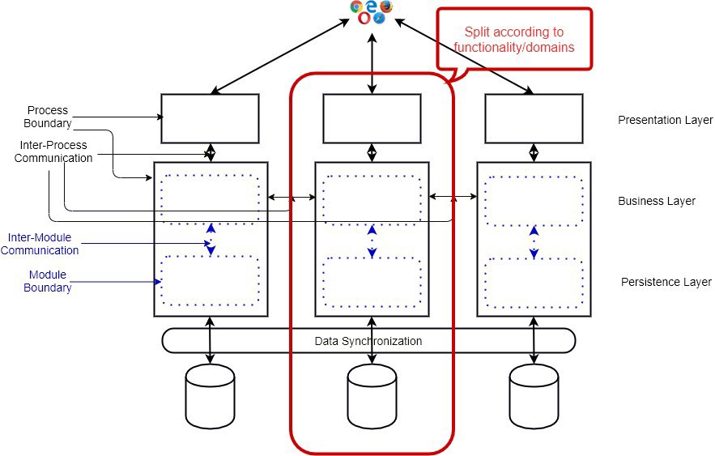
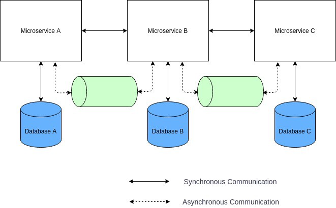
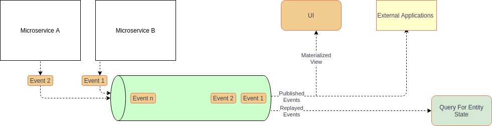
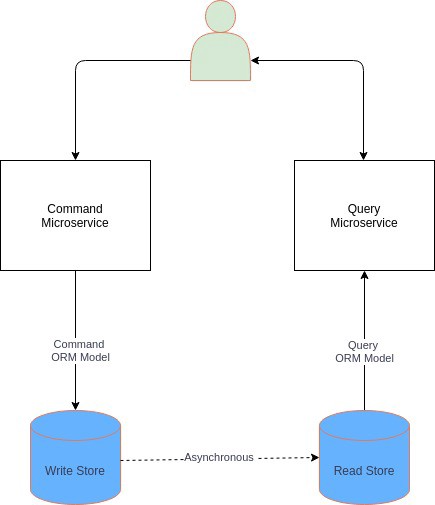
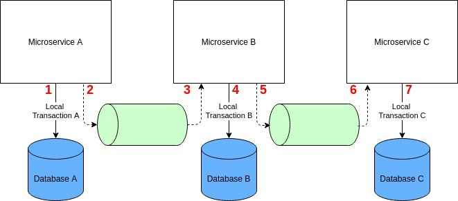
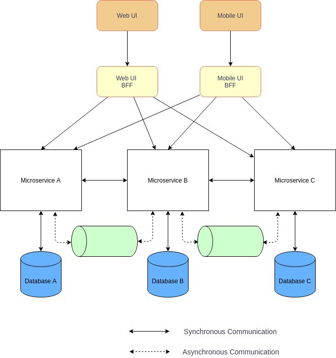
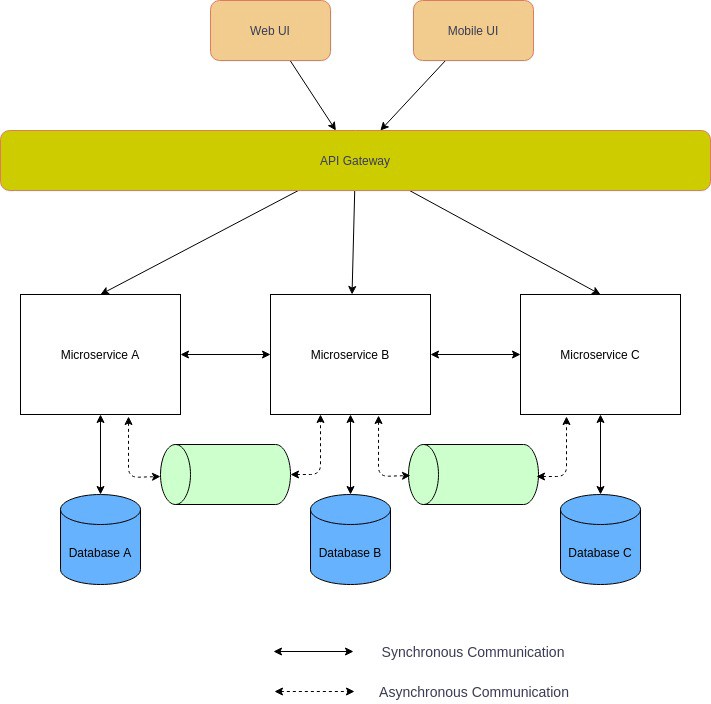
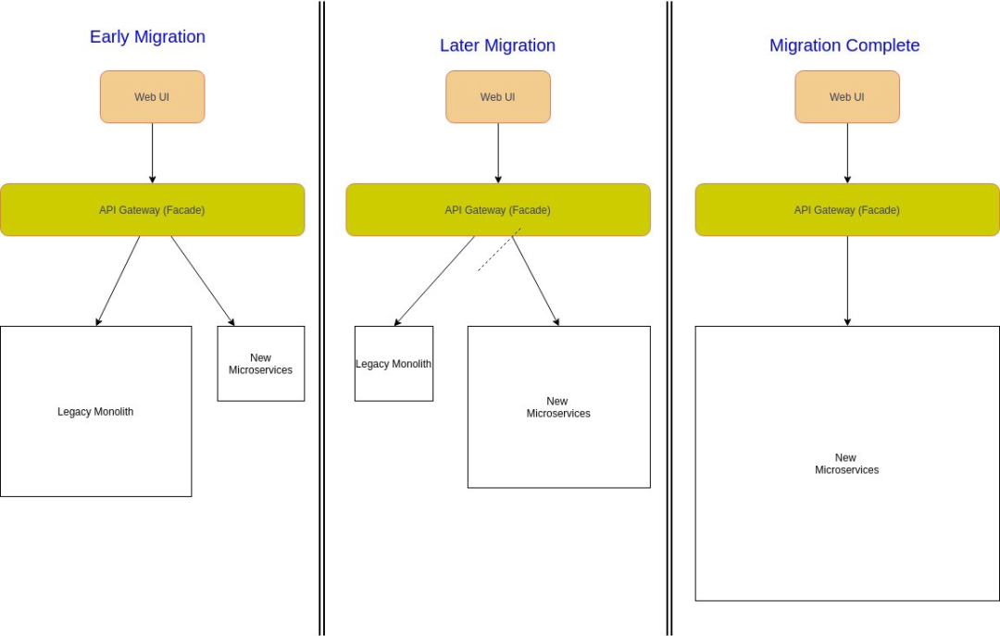
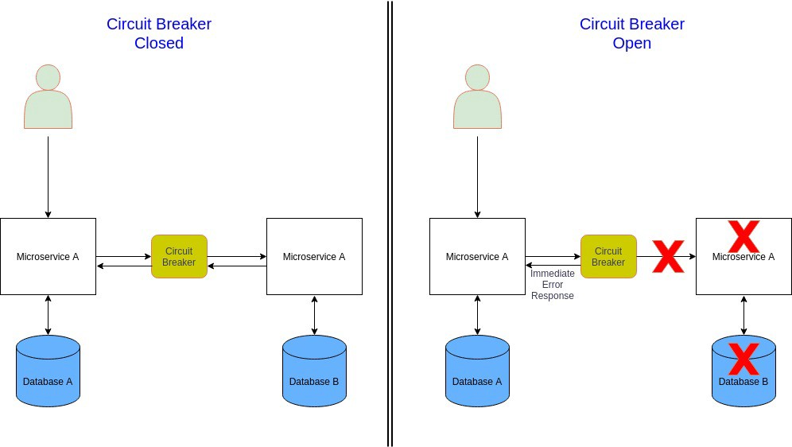

# 微服务架构常用十种设计模式

**本次分享内容**

1. 微服务架构
2. 微服务架构的优点
3. 微服务架构的缺点
4. 何时使用微服务架构
5. 微服务架构常用十种设计模式(包括其优缺点、用例、上下文、技术栈示例)
6. 总结

# 微服务架构
什么是微服务架构？

微服务架构指的是将大型复杂系统按功能或者业务需求垂直切分成更小的子系统，这些子系统以独立部署的子进程存在，它们之间通过轻量级的、跨语言的同步（比如 REST，gRPC）或者异步（消息）网络调用进行通信。

下面是基于微服务架构的商业 Web 应用的组件视图：

**微服务架构的重要特征：**

+ 整个应用程序被拆分成相互独立但包含多个内部模块的子进程。
+ 与模块化的单体应用（Modular Monoliths）或 SOA 相反，微服务应用程序根据业务范围或领域垂直拆分。
+ 微服务边界是外部的，微服务之间通过网络调用（RPC 或消息）相互通信。
+ 微服务是独立的进程，它们可以独立部署。
+ 它们以轻量级的方式进行通信，不需要任何智能通信通道。

# 微服务架构的优点
+ 更好的开发规模。
+ 更快的开发速度。
+ 支持迭代开发或现代化增量开发。
+ 充分利用现代软件开发生态系统的优势（云、容器、 DevOps、Serverless）。
+ 支持水平缩放和细粒度缩放。
+ 小体量，较低了开发人员的认知复杂性。

# 微服务架构的缺点
+ 更高数量级的活动组件（服务、数据库、进程、容器、框架）。
+ 复杂性从代码转移到基础设施。
+ RPC 调用和网络通信的大量增加。
+ 整个系统的安全性管理更具有挑战性。
+ 整个系统的设计变得更加困难。
+ 引入了分布式系统的复杂性。

# 何时使用微服务架构
+ 大规模 Web 应用开发。
+ 跨团队企业级应用协作开发。
+ 长期收益优先于短期收益。
+ 团队拥有能够设计微服务架构的软件架构师或高级工程师。

# 微服务架构常用十种设计模式
## 独享数据库（Database per Microservice）
当一家公司将大型单体系统替换成一组微服务，首先要面临的最重要决策是关于数据库。单体架构会使用大型中央数据库。即使转移到微服务架构许多架构师仍倾向于保持数据库不变。虽然有一些短期收益，但它却是反模式的，特别是在大规模系统中，微服务将在数据库层严重耦合，整个迁移到微服务的目标都将面临失败（例如，团队授权、独立开发等问题）。

更好的方法是为每个微服务提供自己的数据存储，这样服务之间在数据库层就不存在强耦合。这里我使用数据库这一术语来表示逻辑上的数据隔离，也就是说微服务可以共享物理数据库，但应该使用分开的数据结构、集合或者表，这还将有助于确保微服务是按照领域驱动设计的方法正确拆分的。

**优点**

+ 数据由服务完全所有。
+ 服务的开发团队之间耦合度降低。

**缺点**

+ 服务间的数据共享变得更有挑战性。
+ 在应用范围的保证 ACID 事务变得困难许多。
+ 细心设计如何拆分单体数据库是一项极具挑战的任务。

**何时使用独享数据库**

+ 在大型企业应用程序中。
+ 当团队需要完全把控微服务以实现开发规模扩展和速度提升。

**何时不宜使用独享数据库**

+ 在小规模应用中。
+ 如果是单个团队开发所有微服务。

**可用技术示例**

所有 SQL、 NoSQL 数据库都提供数据的逻辑分离（例如，单独的表、集合、结构、数据库）。

## 事件源（Event Sourcing）
在微服务架构中，特别使用独享数据库时，微服务之间需要进行数据交换。对于弹性高可伸缩的和可容错的系统，它们应该通过交换事件进行异步通信。在这种情况，您可能希望进行类似更新数据库并发送消息这样的原子操作，如果在大数据量的分布式场景使用关系数据库，您将无法使用两阶段锁协议（2PL），因为它无法伸缩。而 NoSQL 数据库因为大多不支持两阶段锁协议甚至无法实现分布式事务。

在这些场景，可以基于事件的架构使用事件源模式。在传统数据库中，直接存储的是业务实体的当前 “状态”，而在事件源中任何“状态” 更新事件或其他重要事件都会被存储起来，而不是直接存储实体本身。这意味着业务实体的所有更改将被保存为一系列不可变的事件。因为数据是作为一系列事件存储的，而非直接更新存储，所以各项服务可以通过重放事件存储中的事件来计算出所需的数据状态。

**优点**

+ 为高可伸缩系统提供原子性操作。
+ 自动记录实体变更历史，包括时序回溯功能。
+ 松耦合和事件驱动的微服务。

**缺点**

+ 从事件存储中读取实体成为新的挑战，通常需要额外的数据存储（CQRS 模式）。
+ 系统整体复杂性增加了，通常需要领域驱动设计。
+ 系统需要处理事件重复（幂等）或丢失。
+ 变更事件结构成为新的挑战。

**何时使用事件源**

+ 使用关系数据库的、高可伸缩的事务型系统。
+ 使用 NoSQL 数据库的事务型系统。
+ 弹性高可伸缩微服务架构。
+ 典型的消息驱动或事件驱动系统（电子商务、预订和预约系统）。

**何时不宜使用事件源**

+ 使用 SQL 数据库的低可伸缩性事务型系统
+ 在服务可以同步交换数据（例如，通过 API）的简单微服务架构中。

**可用技术示例**

事件存储：EventStoreDB， Apache Kafka， Confluent Cloud， AWS Kinesis， Azure Event Hub， GCP Pub/Sub， Azure Cosmos DB， MongoDB， Cassandra. Amazon DynamoDB

框架：Lagom， Akka， Spring， akkatecture， Axon，Eventuate

## 命令和查询职责分离（CQRS）
如果我们使用事件源，那么从事件存储中读取数据就变得困难了。要从数据存储中获取实体，我们需要处理所有的实体事件。有时我们对读写操作还会有不同的一致性和吞吐量要求。

这种情况，我们可以使用 CQRS 模式。在该模式中，系统的数据修改部分（命令）与数据读取部分（查询）是分离的。而 CQRS 模式有两种容易令人混淆的模式，分别是简单的和高级的。

在其简单形式中，不同实体或 ORM 模型被用于读写操作，如下所示：

CQRS （简单）

它有助于强化单一职责原则和分离关注点，从而实现更简洁的设计。

在其高级形式中，会有不同的数据存储用于读写操作。高级的 CQRS 通常结合事件源模式。根据不同情况，会使用不同类型的写数据存储和读数据存储。写数据存储是 “记录的系统”，也就是整个系统的核心源头。

CQRS（高级）

对于读频繁的应用程序或微服务架构，OLTP 数据库（任何提供 ACID 事务保证的关系或非关系数据库）或分布式消息系统都可以被用作写存储。对于写频繁的应用程序（写操作高可伸缩性和大吞吐量），需要使用写可水平伸缩的数据库（如全球托管的公共云数据库）。标准化的数据则保存在写数据存储中。

对搜索（例如 Apache Solr、Elasticsearch）或读操作（KV 数据库、文档数据库）进行优化的非关系数据库常被用作读存储。许多情况会在需要 SQL 查询的地方使用读可伸缩的关系数据库。非标准化和特殊优化过的数据则保存在读存储中。

数据是从写存储异步复制到读存储中的，所以读存储和写存储之间会有延迟，但最终是一致的。

**优点**

+ 在事件驱动的微服务中数据读取速度更快。
+ 数据的高可用性。
+ 读写系统可独立扩展。

**缺点**

+ 读数据存储是弱一致性的（最终一致性）。
+ 整个系统的复杂性增加了，混乱的 CQRS 会显着危害整个项目。

**何时使用 CQRS**

+ 在高可扩展的微服务架构中使用事件源。
+ 在复杂领域模型中，读操作需要同时查询多个数据存储。
+ 在读写操作负载差异明显的系统中。

**何时不宜使用 CQRS**

+ 在没有必要存储大量事件的微服务架构中，用事件存储快照来计算实体状态是一个更好的选择。
+ 在读写操作负载相近的系统中。

**可用技术示例**

写存储：EventStoreDB， Apache Kafka， Confluent Cloud， AWS Kinesis， Azure Event Hub， GCP Pub/Sub， Azure Cosmos DB， MongoDB， Cassandra. Amazon DynamoDB

读存储：Elastic Search， Solr， Cloud Spanner， Amazon Aurora， Azure Cosmos DB， Neo4j

框架：Lagom， Akka， Spring， akkatecture， Axon， Eventuate

## Saga
如果微服务使用独享数据库，那么通过分布式事务管理一致性是一个巨大的挑战。你无法使用传统的两阶段提交协议，因为它要么不可伸缩（关系数据库），要么不被支持（多数非关系数据库）。

但您还是可以在微服务架构中使用 Saga 模式实现分布式事务。Saga 是 1987 年开发的一种古老模式，是关系数据库中关于大事务的一个替代概念。但这种模式的一种现代变种对分布式事务也非常有效。Saga 模式是一个本地事务序列，其每个事务在一个单独的微服务内更新数据存储并发布一个事件或消息。Saga 中的首个事务是由外部请求（事件或动作）初始化的，一旦本地事务完成（数据已保存在数据存储且消息或事件已发布），那么发布的消息或事件则会触发 Saga 中的下一个本地事务。

如果本地事务失败，Saga 将执行一系列补偿事务来回滚前面本地事务的更改。

Saga 事务协调管理主要有两种形式：

+ 事件编排 Choreography：分散协调，每个微服务生产并监听其他微服务的事件或消息然后决定是否执行某个动作。
+ 命令编排 Orchestration：集中协调，由一个协调器告诉参与的微服务哪个本地事务需要执行。

**优点**

+ 为高可伸缩或松耦合的、事件驱动的微服务架构提供一致性事务。
+ 为使用了不支持 2PC 的非关系数据库的微服务架构提供一致性事务。

**缺点**

+ 需要处理瞬时故障，并且提供等幂性。
+ 难以调试，而且复杂性随着微服务数量增加而增加。

**何时使用 Saga**

+ 在使用了事件源的高可伸缩、松耦合的微服务中。
+ 在使用了分布式非关系数据库的系统中。

**何时不宜使用 Saga**

+ 使用关系数据库的低可伸缩性事务型系统。
+ 在服务间存在循环依赖的系统中。

**可用技术示例**

Axon， Eventuate， Narayana

## 面向前端的后端 （BFF）
在现代商业应用开发，特别是微服务架构中，前后端应用是分离和独立的服务，它们通过 API 或 GraphQL 连接。如果应用程序还有移动 App 客户端，那么 Web 端和移动客户端使用相同的后端微服务就会出现问题。因为移动客户端和 Web 客户端有不同的屏幕尺寸、显示屏、性能、能耗和网络带宽，它们的 API 需求不同。

面向前端的后端模式适用于需要为特殊 UI 定制单独后端的场景。它还提供了其他优势，比如作为下游微服务的封装，从而减少 UI 和下游微服务之间的频繁通信。此外，在高安全要求的场景中，BFF 为部署在 DMZ 网络中的下游微服务提供了更高的安全性。

**优点**

+ 分离 BFF 之间的关注点，使得我们可以为具体的 UI 优化他们。
+ 提供更高的安全性。
+ 减少 UI 和下游微服务之间频繁的通信。

**缺点**

+ BFF 之间代码重复。
+ 大量的 BFF 用于其他用户界面（例如，智能电视，Web，移动端，PC 桌面版）。
+ 需要仔细的设计和实现，BFF 不应该包含任何业务逻辑，而应只包含特定客户端逻辑和行为。

**何时使用 BFF**

+ 如果应用程序有多个含不同 API 需求的 UI。
+ 出于安全需要，UI 和下游微服务之间需要额外的层。
+ 如果在 UI 开发中使用微前端。

**何时不宜使用 BFF**

+ 如果应用程序虽有多个 UI，但使用的 API 相同。
+ 如果核心微服务不是部署在 DMZ 网络中。

**可用技术示例**

任何后端框架（Node.js，Spring，Django，Laravel，Flask，Play，…）都能支持。

## API 网关
在微服务架构中，UI 通常连接多个微服务。如果微服务是细粒度的（FaaS） ，那么客户端可能需要连接非常多的微服务，这将变得繁杂和具有挑战性。此外，这些服务包括它们的 API 还将不断进化。大型企业还希望能有其他横切关注点（SSL 终止、身份验证、授权、节流、日志记录等）。

一个解决这些问题的可行方法是使用 API 网关。API 网关位于客户端 APP 和后端微服务之间充当 facade，它可以是反向代理，将客户端请求路由到适当的后端微服务。它还支持将客户端请求扇出到多个微服务，然后将响应聚合后返回给客户端。它还支持必要的横切关注点。

**优点**

+ 在前端和后端服务之间提供松耦合。
+ 减少客户端和微服务之间的调用次数。
+ 通过 SSL 终端、身份验证和授权实现高安全性。
+ 集中管理的横切关注点，例如，日志记录和监视、节流、负载平衡。

**缺点**

+ 可能导致微服务架构中的单点故障。
+ 额外的网络调用带来的延迟增加。
+ 如果不进行扩展，它们很容易成为整个企业应用的瓶颈。
+ 额外的维护和开发费用。

**何时使用 API 网关**

+ 在复杂的微服务架构中，它几乎是必须的。
+ 在大型企业中，API 网关是中心化安全性和横切关注点的必要工具。

**何时不宜使用 API 网关**

+ 在安全和集中管理不是最优先要素的私人项目或小公司中。
+ 如果微服务的数量相当少。

**可用技术示例**

Amazon API 网关， Azure API 管理， Apigee， Kong， WSO2 API 管理器

## Strangler(扼杀者)
如果想在运行中的项目中使用微服务架构，我们需要将遗留的或现有的单体应用迁移到微服务。将现有的大型在线单体应用程序迁移到微服务是相当有挑战性的，因为这可能破坏应用程序的可用性。

一个解决方案是使用 Strangler 模式。Strangler 模式意味着通过使用新的微服务逐步替换特定功能，将单体应用程序增量地迁移到微服务架构。此外，新功能只在微服务中添加，而不再添加到遗留的单体应用中。然后配置一个 Facade （API 网关）来路由遗留单体应用和微服务间的请求。当某个功能从单体应用迁移到微服务，Facade 就会拦截客户端请求并路由到新的微服务。一旦迁移了所有的功能，遗留单体应用程序就会被 “扼杀（Strangler）”，即退役。

**优点**

+ 安全的迁移单体应用程序到微服务。
+ 可以并行地迁移已有功能和开发新功能。
+ 迁移过程可以更好把控节奏。

**缺点**

+ 在现有的单体应用服务和新的微服务之间共享数据存储变得具有挑战性。
+ 添加 Facade （API 网关）将增加系统延迟。
+ 端到端测试变得困难。

**何时使用 Strangler**

将大型后端单体应用程序的增量迁移到微服务。

**何时不宜使用 Strangler**

+ 如果后端单体应用很小，那么全量替换会更好。
+ 如果无法拦截客户端对遗留的单体应用程序的请求。

**可用技术示例**

API 网关后端应用框架。

## 断路器
在微服务架构中，微服务通过同步调用其他服务来满足业务需求。服务调用会由于瞬时故障（网络连接缓慢、超时或暂时不可用） 导致失败，这种情况重试可以解决问题。然而，如果出现了严重问题（微服务完全失败），那么微服务将长时间不可用，这时重试没有意义且浪费宝贵的资源（线程被阻塞，CPU 周期被浪费）。此外，一个服务的故障还会引发整个应用系统的级联故障。这时快速失败是一种更好的方法。

在这种情况，可以使用断路器模式挽救。一个微服务通过代理请求另一个微服务，其工作原理类似于电气断路器，代理通过统计最近发生的故障数量，并使用它来决定是继续请求还是简单的直接返回异常。

断路器可以有以下三种状态：

+ 关闭：断路器将请求路由到微服务，并统计给定时段内的故障数量，如果超过阈值，它就会触发并进入打开状态。
+ 打开：来自微服务的请求会快速失败并返回异常。在超时后，断路器进入半开启状态。
+ 半开：只有有限数量的微服务请求被允许通过并进行调用。如果这些请求成功，断路器将进入闭合状态。如果任何请求失败，断路器则会进入开启状态。

**优点**

+ 提高微服务架构的容错性和弹性。
+ 阻止引发其他微服务的级联故障。

**缺点**

+ 需要复杂的异常处理。
+ 日志和监控。
+ 应该支持人工复位。

**何时使用断路器**

+ 在微服务间使用同步通信的紧耦合的微服务架构中。
+ 如果微服务依赖多个其他微服务。

**何时不宜使用断路器**

+ 松耦合、事件驱动的微服务架构。
+ 如果微服务不依赖于其他微服务。

**可用技术示例**

API 网关，服务网格，各种断路器库（Hystrix， Reselience4J， Polly）

## 外部化配置
每个业务应用都有许多用于各种基础设施的配置参数（例如，数据库、网络、连接的服务地址、凭据、证书路径）。此外在企业应用程序通常部署在各种运行环境（Local、 Dev、 Prod）中，实现这些的一个方法是通过内部配置。这是一个致命糟糕实践，它会导致严重的安全风险，因为生产凭证很容易遭到破坏。此外，配置参数的任何更改都需要重新构建应用程序，这在在微服务架构中会更加严峻，因为我们可能拥有数百个服务。

更好的方法是将所有配置外部化，使得构建过程与运行环境分离，生产的配置文件只在运行时或通过环境变量使用，从而最小化了安全风险。

**优点**

+ 生产配置不属于代码库，因而最小化了安全漏洞。
+ 修改配置参数不需要重新构建应用程序。

**缺点**

+ 我们需要选择一个支持外部化配置的框架。
+ 何时使用外部化配置
+ 任何重要的生产应用程序都必须使用外部化配置。
+ 何时不宜使用外部化配置
+ 在验证概念的开发中。

**可用技术示例**

几乎所有企业级的现代框架都支持外部化配置。

## 消费端驱动的契约测试
在微服务架构中，通常有许多有不同团队开发的微服务。这些微型服务协同工作来满足业务需求（例如，客户请求），并相互进行同步或异步通信。消费端微服务的集成测试具有挑战性，通常用 TestDouble 以获得更快、更低成本的测试运行。但是 TestDouble 通常并不能代表真正的微服务提供者，而且如果微服务提供者更改了它的 API 或 消息，那么 TestDouble 将无法确认这些。另一种选择是进行端到端测试，尽管它在生产之前是强制性的，但却是脆弱的、缓慢的、昂贵的且不能替代集成测试（Test Pyramid）。

在这方面消费端驱动的契约测试可以帮助我们。在这里，负责消费端微服务的团队针对特定的服务端微服务，编写一套包含了其请求和预期响应（同步）或消息（异步）的测试套件，这些测试套件称为显式的约定。对于微服务服务端，将其消费端所有约定的测试套件都添加到其自动化测试中。当特定服务端微服务的自动化测试执行时，它将一起运行自己的测试和约定的测试并进行验证。通过这种方式，契约测试可以自动的帮助维护微服务通信的完整性。

**优点**

+ 如果提供程序意外更改 API 或消息，可以被快速的自动发现。
+ 更少意外、更健壮，特别是包含大量微服务的企业应用程序。
+ 改善团队自主性。

**缺点**

+ 需要额外的工作来开发和集成微服务服务端的契约测试，因为他们可能使用完全不同的测试工具。
+ 如果契约测试与真实服务情况不匹配，将可能导致生产故障。

**何时使用需求驱动的契约测试**

在大型企业业务应用程序中，通常由不同的团队开发不同服务。

**何时不宜使用消费端驱动的契约测试**

+ 所有微服务由同一团队负责开发的小型简单的应用程序。
+ 如果服务端微服务是相对稳定的，并且不处在活跃的开发状态。

**可用技术示例**

Pact， Postman， Spring Cloud Contract

# 总结
在现代大规模企业软件开发中，微服务架构能够帮助开发扩展规模并带来很多长期收益。但是微服务架构并不是随处可用的银弹，如果应用在错误的应用程序类型，微服务架构将弊大于利。希望采用微服务架构的开发团队应该遵循最佳实践，并使用一系列可重用的、久经锤炼的设计模式。

微服务架构中至关重要的设计模式是独享数据库。实现这种设计模式具有挑战性，需要其他几种密切相关的设计模式（事件驱动、 CQRS、 Saga）来支持。在具有多个客户端（Web、 Mobile、 Desktop、 Smart Devices）的典型业务应用程序中，客户端和微服务之间的通信量可能是很大的，并且需要统一的安全控制，在这种情况面向前端的后端和 API 网关的设计非常有用。此外，断路器模式可以大大地帮助应对这类应用程序的错误处理场景。迁移遗留的单体应用到微服务是极具挑战性的，而 Strangler 模式可以帮助做到这点。消费端驱动的契约测试是微服务集成测试的基础模式。另外外部化配置是任何现代化应用程序开发中的一种必备模式。

> 更新: 2024-07-15 22:21:21  
> 原文: <https://www.yuque.com/tulingzhouyu/db22bv/dnewkmf93ahu0qtl>