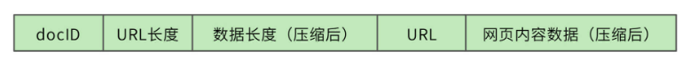

# 搜索引擎设计：信息搜索怎么避免大海捞针

我们准备开发一个针对全网内容的搜索引擎，产品名称为“Bingoo”。

Bingoo的主要技术挑战包括：

1. 针对爬虫获取的海量数据，如何高效地进行数据管理；
2. 当用户输入搜索词的时候，如何快速查找包含搜索词的网页内容；
3. 如何对搜索结果的网页内容进行排序，使排在搜索结果列表前面的网页，正好是用户期望看到的内容。

### **12.1 概要设计**
一个完整的搜索引擎包括分布式爬虫、索引构造器、网页排名算法、搜索器等组成部分，Bingoo的系统架构如下。

分布式爬虫通过存储服务器将爬取的网页存储到分布式文件集群HDFS，为了提高存储效率，网页将被压缩后存储。存储的时候，网页一个文件挨着一个文件地连续存储，存储格式如下。

每个网页被分配得到一个8字节长整型docID，docID之后用2个字节记录网页的URL的长度，之后4个字节记录压缩后网页内容数据的长度，所有存储的网页的头14个字节都是同样的格式。之后存储URL字符串和压缩后的网页内容数据。读取文件的时候，先读14个字节的头信息，根据头信息中记录的URL长度和数据长度，再读取对应长度的URL和网页内容数据。

搜索引擎能够快速查找的核心就是利用索引，根据用户的查询内容查找匹配的索引，根据索引列表构建结果页面。索引的构造主要通过索引构造器完成，索引构造器读取HDFS中的网页内容，解压缩后提取网页中的单词，构建一个“docID->单词列表”的正排索引。然后，索引构造器再根据这个正排索引构建一个“单词->docID列表”的倒排索引，“docID列表”就是包含了这个单词的所有网页列表。利用这个倒排索引，搜索器可以快速获得用户搜索词对应的所有网页。

网页中所有的单词构成了一个词典，实际上，词典就是一个Hash表，key就是单词，value就是倒排索引的网页列表。虽然互联网页的内容非常庞大，但是使用到的单词其实是非常有限的。根据Google的报告，256M内存可以存放1400万个单词，这差不多就是英文单词的全部了。

在构建索引的过程中，因为要不断修改索引列表，还要进行排序，所以，有很多操作是需要进行加锁同步完成的。对于海量的互联网页的计算，这样的索引构建速度太慢了。因此我们设计了64个索引桶，根据docID取模，将不同网页分配到不同的桶中，在每个桶中分别进行索引构建，通过并行计算来加快索引处理速度。

索引构造器在读取网页内容、构造索引的时候，还会调用URL提取器，将网页中包含的URL提取出来，构建一个链接关系表。链接关系表的格式是“docID->docID”，前一个docID是当前网页的docID，后一个docID是当前网页中包含的URL对应的docID。一个网页中会包含很多个URL，也就是会构建出很多个这样的链接关系。后面会利用这个链接关系表，使用PageRank排名算法对所有网页进行打分排名，当索引器得到查找的网页列表时，利用PageRank值进行排名，最终呈现给用户，保证用户最先看到的网页是最接近用户期望的结果页面。

### **12.2 详细设计**
一个运行良好的搜索引擎的核心技术就是索引和排名，所以我们将分别说明这两种技术要点。

#### **12.2.1 索引**
索引构造器从HDFS读取网页内容后，解析每个页面，提取网页里的每个单词。如果是英文，那么每个单词都用空格分隔，比较容易；如果是中文，需要使用中文分词器才能提取到每个单词，比如“高并发架构”，使用中文分词器得到的就是“高并发”、“架构”两个词。

首先，索引构造器将所有的网页都读取完，构建出所有的“docID->单词列表”正排索引。

然后遍历所有的正排索引，再按照“单词→docID列表”的方式组织起来，就是倒排索引了。

我们这个例子中只有两个单词、7个网页。事实上，Bingoo数以千亿的网页就是这样通过倒排索引组织起来的，网页数量虽然庞大，但是单词数却是比较有限的。所以，整个倒排索引的大小相比于网页数量要小得多。Bingoo将每个单词对应的网页列表存储在硬盘中，而单词则存储在内存的Hash表，也就是词典中，词典示例：

对于部分热门的单词，整个网页列表也可以存储在内存中，相当于缓存。在词典中，每个单词记录下硬盘或者内存中的网页列表地址，这样只要搜索单词，就可以快速得到对应的网页地址列表。Bingoo根据列表中的网页编号docID，展示对应的网页信息摘要，就完成了海量数据的快速检索。

如果用户的搜索词正好是一个单词，比如“高并发”，那么直接查找词典，得到网页列表就完成查找了。但是如果用户输入的是一个句话，那么搜索器就需要将这句话拆分成几个单词，然后分别查找倒排索引。这样的话，得到的就是几个网页列表，还需要对这几个网页列表求交集，才能得到最终的结果列表。

比如，用户输入“高并发架构”进行搜索，那么搜索器就会拆分成两个词：“高并发”、“架构”，得到两个倒排索引：

高并发->2,3,5,7

架构->1,2,4

需要对这两个倒排索引求交集，也就是同时包含“高并发”和“架构”的网页才是符合搜索要求的结果，最终的交集结果应该是只有一篇网页，即docID为2的满足要求。

列表求交集最简单的实现就是双层for循环，但是这种算法的时间复杂度是O(n^2)，我们的网页列表长度（n）可能有千万级甚至更高，这样的计算效率太低。

一个改进的算法是**拉链法**，我们将网页列表先按照docID的编号进行排序，得到的就是这样两个有序链表：

同时遍历两个链表，如果其中一个链表当前指向的元素小于另一个链表当前指向的元素，那么这个链表就继续向前遍历；如果两个链表当前指向的元素相同，该元素就是交集元素，记录在结果列表中；依此继续向前遍历，直到其中一个链表指向自己的尾部nil。

拉链法的时间复杂度是O(2n)，远优于双层循环。但是对于千万级的数据而言，还是太慢。我们还可以采用**数据分片**的方式进行并行计算，以实现性能优化。

比如，我们的docID分布在[0, 1万亿)区间，而每个倒排索引链表平均包含1千万个docID。我们把所有的docID按照1千亿进行数据分片，就会得到10个区间[0, 1千亿)[1千亿，2千亿)……[9千亿，1万亿)。每个倒排索引链表大致均匀分布在这10个区间，我们就可以依照这10个区间范围，将每个要遍历的链表切分为10片，每片大约包含1百万个docID。两个链表只在自己对应的分片内求交集即可，因此我们可以启动10个线程对10个分片进行并行计算，速度可提高10倍。

事实上，两个1千万长度的链表求交集，最终的结果可能不过几万，也就是说，大部分的比较都是不相等的。比如下面的例子。

第一个链表遍历到自己的最后一个元素，才和第二个链表的第一个元素相同。那么第一个链表能不能跳过前面那些元素呢？很自然，我们想到可以用**跳表**来实现，如下图。

**跳表实际上是在链表上构建多级索引**，在索引上遍历可以跳过底层的部分数据，我们可以利用这个特性实现链表的跳跃式比较，加快计算速度。使用跳表的交集计算时间复杂度大约是O(log(n))。

此外，虽然搜索引擎利用倒排索引已经能很快得到搜索结果了，但搜索引擎应用还会使用缓存对搜索进行加速，将整个搜索词对应的搜索结果直接放入缓存，以减少倒排索引的访问压力，以及不必要的集合计算。

#### **12.2.2 PageRank排名算法**
Bingoo使用PageRank算法进行网页结果排名，以保证搜索结果更符合用户期待。

PageRank算法会根据网页的链接关系给网页打分。如果一个网页A包含另一个网页B的超链接，那么就认为A网页给B网页投了一票。一个网页得到的投票越多，说明自己越重要；越重要的网页给自己投票，自己也越重要。

PageRank算法就是计算每个网页的PageRank值，最终的搜索结果也是以网页的PageRank值排序，展示给用户。事实证明，这种排名方法非常有效，PageRank值更高的网页，确实更满足用户的搜索期望。

以下面四个网页A、B、C、D举例，带箭头的线条表示链接。

B网页包含了A、D两个页面的超链接，相当于B网页给A、D每个页面投了一票，如果初始的时候，所有页面都是1分，那么经过这次投票后，B给了A和D每个页面1/2分（B包含了A、D两个超链接，所以每个投票值1/2分），自己从C页面得到1/3分（C包含了A、B、D三个页面的超链接，每个投票值1/3分）。

而A页面则从B、C、D分别得到1/2，1/3，1分。用公式表示就是

smallPR（A）=fracPR（B）2+fracPR（C）3+fracPR（D）1𝑠𝑚𝑎𝑙𝑙𝑃𝑅（𝐴）=𝑓𝑟𝑎𝑐𝑃𝑅（𝐵）2+𝑓𝑟𝑎𝑐𝑃𝑅（𝐶）3+𝑓𝑟𝑎𝑐𝑃𝑅（𝐷）1

等号左边是经过一次投票后，A页面的PageRank分值；等号右边每一项的分子是包含A页面超链接的页面的PageRank分值，分母是该页面包含的超链接数目。

这样经过一次计算后，每个页面的PageRank分值就会重新分配，重复同样的算法过程，经过几次计算后，根据每个页面PageRank分值进行排序，就得到一个页面重要程度的排名表。根据这个排名表，将用户搜索出来的网页结果排序，排在前面的通常也正是用户期待的结果。

但是这个算法还有个问题，如果某个页面只包含指向自己的超链接，其他页面不断给它送分，而自己一分不出，随着计算执行次数越多，它的分值也就越高，这显然是不合理的。这种情况就像下图所示的，A页面只包含指向自己的超链接。

解决方案是，设想浏览一个页面的时候，有一定概率不是点击超链接，而是在地址栏输入一个URL访问其他页面，表示在公式上，就是

smallPR（A）=alpha(fracPR（B）2+fracPR（C）3+fracPR（D）1)+frac（1−alpha）4𝑠𝑚𝑎𝑙𝑙𝑃𝑅（𝐴）=𝑎𝑙𝑝ℎ𝑎(𝑓𝑟𝑎𝑐𝑃𝑅（𝐵）2+𝑓𝑟𝑎𝑐𝑃𝑅（𝐶）3+𝑓𝑟𝑎𝑐𝑃𝑅（𝐷）1)+𝑓𝑟𝑎𝑐（1−𝑎𝑙𝑝ℎ𝑎）4

上面small（1−alpha）𝑠𝑚𝑎𝑙𝑙（1−𝑎𝑙𝑝ℎ𝑎）就是跳转到其他任何页面的概率，通常取经验值0.15(即smallalpha𝑠𝑚𝑎𝑙𝑙𝑎𝑙𝑝ℎ𝑎 为0.85)，因为有一定概率输入的URL是自己的，所以加上上面公式最后一项，其中分母4表示所有网页的总数。

那么对于N个网页，任何一个页面smallPi𝑠𝑚𝑎𝑙𝑙𝑃𝑖的PageRank计算公式如下：

smallPageRank（Pi）=alphasumPjinM(Pi)fracPageRank(Pj)L(Pj)+frac1−alphaN𝑠𝑚𝑎𝑙𝑙𝑃𝑎𝑔𝑒𝑅𝑎𝑛𝑘（𝑃𝑖）=𝑎𝑙𝑝ℎ𝑎𝑠𝑢𝑚𝑃𝑗𝑖𝑛𝑀(𝑃𝑖)𝑓𝑟𝑎𝑐𝑃𝑎𝑔𝑒𝑅𝑎𝑛𝑘(𝑃𝑗)𝐿(𝑃𝑗)+𝑓𝑟𝑎𝑐1−𝑎𝑙𝑝ℎ𝑎𝑁

公式中，smallPjinM(Pi)𝑠𝑚𝑎𝑙𝑙𝑃𝑗𝑖𝑛𝑀(𝑃𝑖) 表示所有包含有smallPi𝑠𝑚𝑎𝑙𝑙𝑃𝑖超链接的smallPj𝑠𝑚𝑎𝑙𝑙𝑃𝑗，smallL(Pj)𝑠𝑚𝑎𝑙𝑙𝐿(𝑃𝑗)表示smallPj𝑠𝑚𝑎𝑙𝑙𝑃𝑗页面包含的超链接数，N表示所有的网页总和。由于Bingoo要对全世界的网页进行排名，所以这里的N是一个万亿级的数字。

计算开始的时候，将所有页面的PageRank值设为1，带入上面公式计算，每个页面都得到一个新的PageRank值。再把这些新的PageRank值带入上面的公式，继续得到更新的PageRank值，如此迭代计算，直到所有页面的PageRank值几乎不再有大的变化才停止。

> 更新: 2024-08-14 21:32:07  
> 原文: <https://www.yuque.com/tulingzhouyu/db22bv/swd3eq7yo68qwugs>