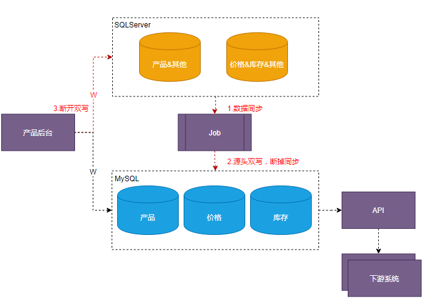
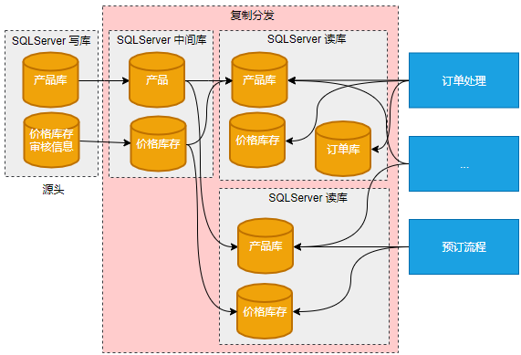
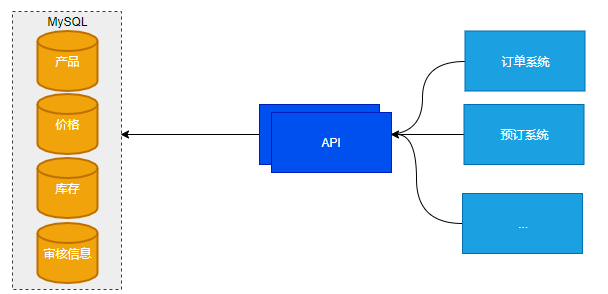
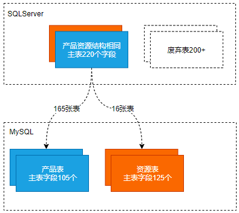
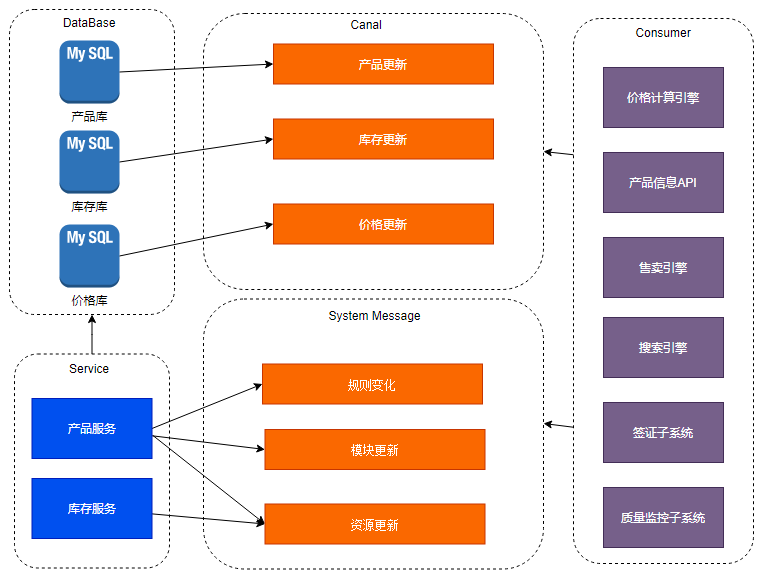
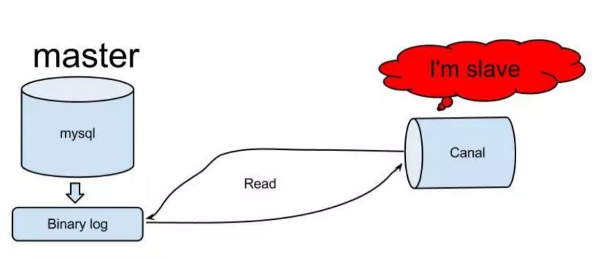
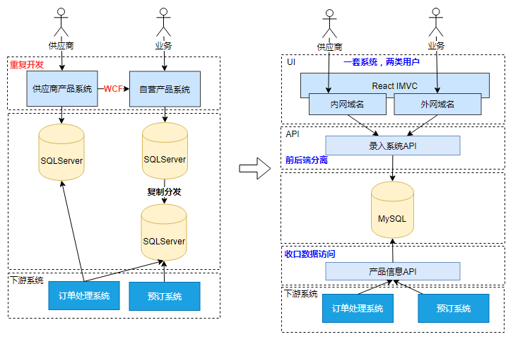
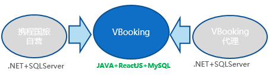
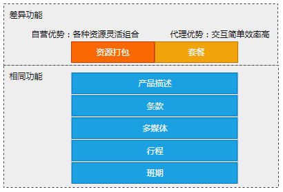
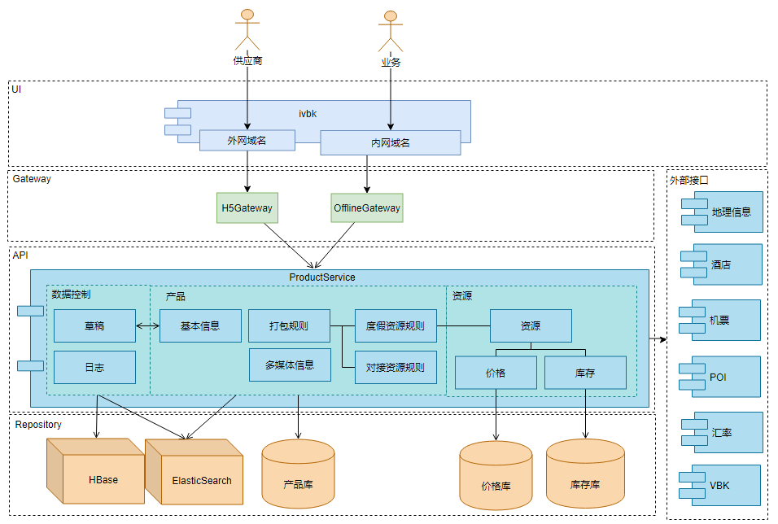

# 携程亿级高并发架构改造实践

**本次分享内容**

1. 业务背景描述
2. 存储重构(SQLServer 转到 MySQL、核心和非核心隔离、消息替代轮询)
3. 架构升级(系统合并、前后端分离)
4. 总结

# **一、前言**
本次分享将介绍在业务持续发展环境中，复杂系统的改造过程以及实施的一些经验，希望能给面对同样问题的同学提供一些借鉴思路。

## **1.1 背景**
度假产品系统，作为携程度假部门自营业务人员与供应商的上货平台，为旅游产品的预订以及订单处理流程提供产品信息的数据支持。作为业务系统的底层数据，有如下特点：

1）业务复杂度高

到 2020 年，系统经历了 8 年的业务逻辑积累，支持多种产品形态，包括：跟团游，自由行，周边游，签证，以及当地向导等，30 多种产品和资源类型，包括：保险，火车票，一日游，接送机等等。还与交通和住宿部门对接，支持多种大交通资源的匹配规则，包括机票，酒店，火车票等。

2）系统架构陈旧

改造前，系统架构基于. NET 平台开发，使用 SQLServser 数据库。随着时间和业务逻辑的积累，系统中存在大量陈旧的代码逻辑，数据库中也有很多废弃的表和字段，使用 SQLServer 的复制分发功能实现读写分离，不同系统之间依赖数据同步，这些陈旧的架构导致系统扩展性差，数据实时性低。

## **1.2 问题**
业务复杂度高和系统架构的落后，带来的问题是系统问题多，开发效率低。

1）复制分发延迟，影响产品售卖

数据库 800 多张表，包括核心表和非核心表，划分不清晰相互影响。非核心业务往往存在大量的数据更新和读取，影响数据库性能，从而影响核心业务。表的结构设计不合理，不同领域的数据结构划分不清晰混在相同的数据表中，产品主表有 200 多个字段，其中包括很多废弃的字段。SQLServser 的复制分发在写库大量数据更新时，分发库存在延迟影响正常业务。

2）开发效率低，问题频发

自营与供应商使用两套独立的产品系统，而预订和订单处理流程只使用一套数据，数据通过臃肿的 WCF 架构同步，存在数据不同步的风险。系统重复开发，浪费研发资源。后台站点直接读写 DB，多模块写入点分散。这些架构的复杂度带来涉及人员多，排障流程长等问题，效率低下。

## **1.3 措施**
针对系统现状，通过对系统重构，解决复制分发延迟问题，降低系统整体复杂度，避免重复开发，提高开发效率。

系统的改造是伴随着业务需求压力并持续优化改造的过程，重点有两方面：

1）存储重构

数据库从 SQLServser 迁移到 MySQL，包括消除数据库的复制分发，重新按领域模型拆分表，将核心数据与非核心数据隔离，通过消息系统替代轮询数据等。

2）架构升级

减少重复建设，去掉臃肿的数据同步过程，将分离的两套系统合并。从. NET 站点转变为前后端分离的系统架构。

# **二、存储重构**
## **2.1 SQLServer 转到 MySQL**
数据库从 SQLServer 向 MYSQL 迁移，主要有三个难点：

1）数据源切换，写入点分散，改造成本高，周期长。

首先是成本高，写入点分散的问题。产品系统的应用有多个，同一个模块的数据在不同的功能中都有修改的场景，漏改会引发数据不一致问题。

由于产品系统作为度假整体系统的一部分并且作为基础数据的支持，改造过程有上下游的依赖，大量的应用直接读取 DB，数据读取点多。如果逐个表逐个字段迁移再与相关依赖系统协调切换数据源，整个改造周期会非常长。

2）下游切换，依赖多，逻辑复杂。在大量下游系统直接依赖数据的情况下，每个下游系统都有各自的业务逻辑，使用的数据字段和方法各有不同，逻辑分散在各处。

3）数据一致性。基础数据的数据源切换，一旦发生问题，对业务影响大。

为了解决这些难点，我们把数据的迁移分成三个阶段，如下图所示：

数据库迁移的三个步骤

1）建立数据同步机制，提供 API 规范数据访问，下游快速切换到 MySQL 数据源。

这一步的目的是避免按表分步切换拉长改造周期。首先是需要提供产品数据查询统一的 API 给下游系统，API 中直接读取 MySQL 的数据，在数据切换时保证数据的完整性，在 MySQL 中建立数据，通过数据同步机制保证的一致性。这样下游系统不需要逐个字段或逐个表进行迁移，可以基于功能模块对接 API。

2）数据源双写，逐步断开数据同步。

这个步骤是逐步对原来功能模块写数据的场景进行改造，在新老 DB 共存上下游逐步切换的场景中，保证业务的稳定性。在写原 SQLServser 数据的同时，将数据再对 MySQL 数据库写一份，以便于下一个阶段彻底解除对 SQLServser 数据的依赖。

数据表有三类：

第一类是业务需求功能改动相关表，这类表随着业务需求中涉及到的改动点，把依赖的数据表整理出来重新开发功能。

第二类是没有新需求功能的相关表，这类表需要研发人员主动梳理并作为技术改造的日常任务进行切换，经常伴随着业务需求的压力以及需要协调各方资源推进完成改造。

第三类是其他系统表，这类表由于历史原因保存到产品系统中，需要梳理出来并且由各系统安排迁移。

这个阶段有两个经验：

第一是通过监控把控风险。由于系统的历史债，写入点分散，开发人员也并不能完全知道所有的写入点，如果漏掉某一个写入点对业务的影响都非常大。解决这个问题是建立数据的监控机制，数据双写的同时对源数据进行监控，如果发现 SQLServer 与 MySQL 相同主键数据不一致时进行报警。

第二是数据补偿机制，我们开发了数据补偿工具，当发生数据不一致时，以 SQLServer 数据为准向 MySQL 进行数据补偿。监控到数据不一致问题，立即补偿数据，恢复同步，再把漏改的点梳理清楚。

3）断开双写，完成切换

在双写过程中，下游系统消除了对 SQLServer 数据库的直接访问，产品系统作为数据的源头，通过 DBTrace 工具排查对原有表的读写是否都已经解除，在都解除的情况下断开 SQLServser 的数据写入，完成切换。

存储重构的过程以转 MySQL 作为改造的主线推进，改造过程中也进行了其他多方面的改造，后面逐个介绍。

## **2.2 消除复制分发**
改进前通过 SQLServser 的复制分发技术实现读写分离，SQLServser 的两个源头数据库通过复制分发中间库，分发到 14 个目标库中，800 多个源头表，3800 多条复制分发链路，部门内外 247 个应用直接访问数据库。

复制分发改造前 

初期，梳理出所有依赖的系统以及相关 SQL 语句，涉及到几乎所有度假子系统，针对各个系统对于原始数据的需求与转 MySQL 的过程同步进行，迁移数据并提供替代直接访问 DB 的 API，下游系统接入 API 切换数据源。改造后的依赖如下图。

复制分发改造后

去除复制分发的过程对转 MySQL 整体进度提供了很大的推进作用，以依赖应用数和分发链路数作为跟进目标，每周跟进解耦进度，对于分发表中没有读取的表逐步下线。分发表下线的进度同时也是转 MySQL 过程中下游依赖解耦的进度。这个改造持续了一年半的时间改造完成。

改进后的数据链路，DB 内聚成应用的存储层，不再允许跨业务的直接访问 DB，保障了数据安全性，提供全新的 API 从 MySQL 获取数据以及 Redis 缓存机制提高了性能和可用性。

## **2.3 产品 & 资源结构拆分**
产品与资源是不同的数据模型，而在数据库的早期设计中是混合在一起的，存储在相同的一套表中，带来的问题是：

1）冗余字段多，逻辑交错重叠，下游数据使用方在使用数据的时候需要处理不同的字段和多个逻辑分支，逻辑复杂，容易出错。

2）由于主表的字段多，一次查询 220 个字段，存在数据库的 IO 问题。

在转 MySQL 的过程中，将两类模型拆分，各自保存独立的字段。两套表根据数据量做了不同的分表策略，API 也分别提供不同的接口给下游系统。

产品和资源数据结构拆分 

## **2.4 核心 & 非核心隔离**
改造前核心数据与非核心数据混在相同的 DB 中相互影响，而两类数据的特点不同，根据读写量，是否影响预订流程，是否需要部署 DR 等方面区分核心数据与非核心数据进行隔离。

核心数据库：

+ 读多写少
+ 影响主流程
+ 读写分离
+ 部署 DR

非核心数据库：

+ QPS 小，历史数据量大
+ 不影响主流程
+ 一主一从
+ 无 DR

> _DR （Disaster Recovery ）灾备，是一种关键的业务连续性计划（BCP）策略，用于确保在发生意外情况（如硬件故障、网络攻击、自然灾害等）时，关键业务数据和系统能够迅速恢复。通过对核心数据和非核心数据进行隔离，企业可以更有效地管理资源，优先保护最关键的资产，并根据不同数据的价值和重要性，制定差异化的备份和灾难恢复策略。这种方法不仅提高恢复效率，还能在成本控制方面实现优化。_
>

## **2.5 消息替代轮询**
SQLServser 作为数据存储时，下游系统很多业务场景需要监听数据的变化，旧的做法大部分都是轮询关注的表，通过时间戳获取增量数据同步到本业务的数据库或者进行业务处理，由于之前介绍的数据库本身的复制分发延迟问题以及受轮询周期的影响等因素，这个方案在数据实时性上表现较差。

解决这个问题的方案是在系统改造过程中建立消息机制。下游系统通过消费消息完成业务逻辑，这样的方式降低了系统间的耦合度，也提高了数据实时性。

产品消息系统

消息分为两类：

第一类是 Canal 消息，在数据发生变化时发送变更内容。

原理相对比较简单：

1）canal 模拟 mysql slave 的交互协议，伪装自己为 mysql slave，向 mysql master 发送 dump 协议；

2）mysql master 收到 dump 请求，开始推送 binary log 给 slave（也就是 canal）；

3）canal 解析 binary log 对象（原始为 byte 流），Canal 的原理可以参考文章：[https://www.jianshu.com/p/87944efe1005](https://www.jianshu.com/p/87944efe1005)。

第二类是系统消息。这类消息是在产品信息发生变化的时候，由功能触发推送对应内容的消息。

这两类消息结合，Canal 消息的使用已经满足了大部分的功能场景，但是缺点是消息的数量是基于数据变化的，产品信息的一次变化可能更新几十张表，成百上千条数据。而系统消息也不是每个功能都需要发送，在特定关键信息发生变化的时候发送对应的信息给下游系统消费来弥补 Canal 消息量太大产生的问题。

# **三、架构升级**
除了存储重构系统，最大的问题还是历史架构的技术债，自营产品系统面对携程业务人员基于内网使用，功能和权限更大，而代理业务通过外网访问，功能更少而交互更加方便快捷，通过 WCF 同步数据，在提供给后续预订以及订单处理流程时底层数据结构相同。

架构臃肿复杂，数据实时性差，问题频发，功能重复开发。以上的弊端需要对系统重新规划，在系统重构中有两个思路：

1）将分离的系统合并，避免重复开发，减少数据同步带来的实时性问题。

2）新的架构前后端分离，前端交互分别设计，存储层 API 结构统一。

系统合并前后对比

## **3.1 系统合并**

系统合并 

这两套系统操作方式和功能上都有差异，系统功能复杂改造过程影响面广，合并过程是将系统按照独立可拆解的功能和数据模型分解，拆分为可独立切换的模块，每个月发布一个版本，分成六个版本分别切换。

新老系统进行灰度切换，每周逐步开放新系统流量收集问题迭代改进。

功能上 “取长补短 “，两个系统在功能设计上有各自的优点，比如自营系统强在功能的灵活性，而代理系统的交互简单操作效率更高，功能的设计重新审视各功能以及权限划分对于用户统一考虑，通过权限隔离不同用户的可操作范围。

底层架构 “求同存异”，“同“是指系统的底层数据结构和领域模型相同，对下游的 API 相同。“异” 则是对于前端系统对于不同的交互和展现方式可以不同。

模块划分 

## **3.2 前后端分离**
改进前，系统是 ASP.NET 后台站点直接访问数据库，相同的功能重复开发，系统限制规则不统一，两类用户相互投诉。

前端使用 ReactJS 技术，内外网分别部署，通过权限隔离用户。后端使用基于 Java 开发的 API。底层存储包括 MySQL 关系型数据库。系统数据变化时通过 ElasticSearch 建立索引，Hbase 保存日志内容。通过统一的 Service 与外部 API 对接。

系统逻辑架构

# **四、总结**
业务系统的技术改造是一个持续的过程，需要作为开发人员的日常工作主动推进，开发人员需要具备发现技术债的敏锐性以及改进系统的决心，同时还要能控制好业务需求与技术改造工作的安排。这里总结三点： 

1）控制风险

在系统改进的过程中，对于复杂和影响范围广的业务场景，风险的控制十分重要。发布前需要制定好灰度切换方案以及问题的处理预案，按照什么步骤切换，每次多少流量，出现问题后如何回退，开关按照什么粒度制定等等。

2）尊重用户

新系统的上线，重构功能时要充分考虑原系统功能，考虑重新设计的功能是否符合用户的使用习惯，是否给用户使用效率带来正向影响。删减功能的时候需要充分了解原功能解决的问题以及新的功能是否能满足，尽量提供 “回到旧版” 功能。并在旧版中埋点以关注是否旧的系统功能仍有用户在使用，思考 “为什么” 和如何解决。

3）新的问题

重构系统中使用新方案和技术的同时，也会遇到新的问题。比如数据库的分表带来的是范围查询变得复杂，之前用一个 SQL 语句就能完成现在需要按照分表逐个遍历，性能上是无法接受的。这就要使用其他的方案来解决问题，比如使用 ElasitcSearch 将过滤的字段建立索引。

最后介绍一下这些改进后的效果，两类用户都获得了之前无法使用的部分新功能，系统可用性和稳定性得到提升，避免了重复开发，沟通成本更低效率也更高，系统数据实时性更高，以前频发的数据不同步等问题得到了彻底的解决。

> 更新: 2024-07-15 22:21:20  
> 原文: <https://www.yuque.com/tulingzhouyu/db22bv/mf3m6dug2ombuyqe>