# 携程门票秒杀系统优化实践

**分享内容**

1. 业务场景
2. 业务激增对系统架构的考验
3. 系统架构的优化路径，读热点、写入性能瓶颈、流量精细化控制等问题解决方案
4. 确保系统高可用性与持续性的治理措施
5. 总结

### 一、业务背景
后疫情时代旅游行业快速复苏，各类营销秒杀活动变得越发频繁，面对亿级流量的冲击，系统架构面临挑战。研发团队需要保障大流量下的功能稳定性，为国内外用户提供流畅的预订体验，因此需要对核心的预订交易系统进行应用架构升级，从而确保系统在高并发情况下仍能稳定高效运行。

本次分享将介绍在应对流量高峰、突破系统瓶颈、强化系统稳定性等方面的应对策略与优化效果。

### 二、秒杀活动案例分析
回顾大家曾经参与过的秒杀或大促活动，如双十一、618、12306 节假日抢票、演唱会抢票时，会有相似的感受：

1. **紧张刺激**：活动通常定时开售，期待与紧张并存。
2. **系统压力**：在高峰期，系统容易出现卡顿、宕机或提示 “太火爆” 或需要排队等待，让人倍感焦虑。
3. **结果未知**：尽管全力以赴，但结果往往不尽如人意，有时抢到了票无法支付或者可能被退单。

这些活动在预订交易系统中也会呈现相似的特征：

1. **大流量、高并发**：大流量、高并发、强事务性，对系统性能提出严峻挑战。
2. **时间敏感性**：准时开售，用户争抢热点资源，系统需要确保实时、准确地响应。
3. **履约保障**：从订前到订后，系统需要确保履约的顺利进行，避免用户因系统问题而遭受损失。

与传统电商相比，携程门票交易系统具有两大特点：

1. **强一致性**：用户预订后保证出票且尽可能快速确认，确保每一笔交易都能履约。
2. **多维度和跨商品组合限购**：限购规则复杂多变，例如多维度和跨商品组合限购，保障每位用户有公平购票的机会，避免囤票行为。

接下来回顾历史上有过的携程门票大型秒杀 / 活动案例。

1. 2020 年 8 月 8 日~ 9 月 1 日：“惠游湖北” 活动，携程独家承办，首次面对日常流量 45 倍 (数十万 QPS) 峰值的流量挑战，虽然刚开始系统出现不稳定的情况，但最终还是成功应对。
2. 2021 年 9 月 14 日：北京环球影城开业开售活动，携程门票在与其他友商的同期竞争中，成为唯一稳定出票且销量最高的交易平台。
3. 2023 年 9 月 15 日：武汉动物园开园，在供应商系统出现异常、友商页面卡顿有大量退单的情况下，携程门票预订依然能保持顺畅下单。
4. 2024 年 4 月 10 日：IU（李知恩）全球演唱会门票在 Ctrip.com 和 Trip.com 国际站同时秒杀，携程门票再次表现稳定，预订过程丝滑流畅，10 秒内售罄。

以下是部分历史秒杀活动峰值流量与日常峰值流量的对比数据：

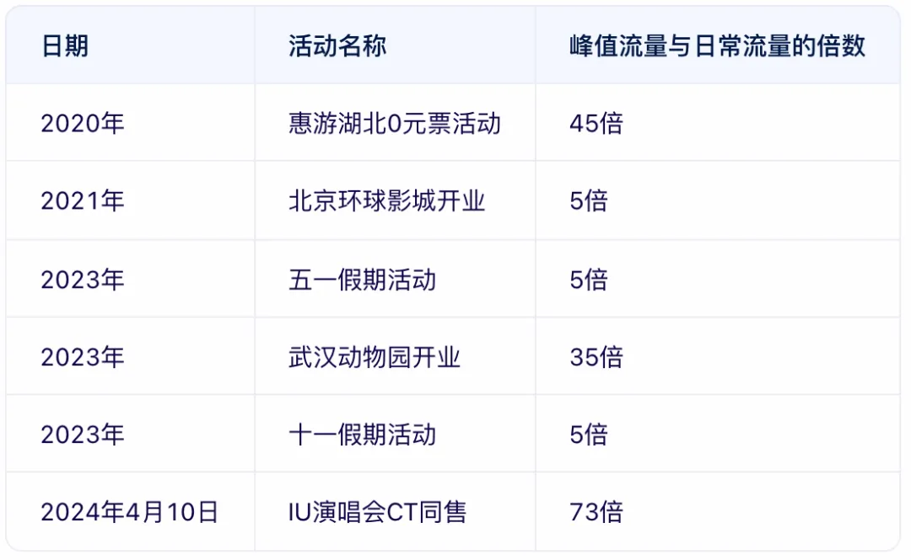

数据显示出活动的流量激增通常远超系统日常处理的极限，如果没有针对预订交易系统进行优化，用户可能会遇到各种问题，例如：

1. **页面打开慢、卡顿、宕机**：直接影响用户购物体验，系统会出现 Redis 或 DB 超负载，供应商接口不稳定等情况。
2. **付款后不能确认 / 退款**：付款后，无法及时确认订单状态或进行退款操作，系统出现库存超卖 / 少卖等情况。

要避免出现上述情况，就要求系统具备高度的可扩展性和灵活性，同时在架构、缓存、数据库、流量控制等多方面进行全面优化。接下来我们通过具体场景来分析系统遇到的问题和应对策略，了解系统架构设计与演进过程。

### 三、系统架构设计与演进
整体而言，预订交易系统的目标是：稳、准、快。

+ 稳：确保系统稳定可靠，保障售卖流程无间断。
+ 准：实现数据一致性，确保履约准确无误。
+ 快：提供流畅的预订体验，实现快速确认。

在大流量高并发场景下，要达到这些目标就可以进行有针对性的改造升级，接下来展开阐述。

#### 3.1 系统稳定性挑战与应对策略
当系统遇到洪峰流量时，容易出现页面打开慢、卡顿等问题，主要原因有以下几点：

1. Redis 超负载与缓存热点。
2. 数据库超负载。
3. 供应商系统不稳定。

接下来针对这 3 个常见问题，阐述相应的应对策略。

**问题一：Redis 超负载与缓存热点**

当 Redis 面临负载问题时，可以使用水平扩容这种常规手段让流量分摊到更多实例。然而扩容虽能降低大多数实例的 CPU 使用率，但在处理特定热点数据时，各实例的 CPU 使用率仍然可能出现不均衡的情况，即缓存热点问题；此外还会存在缓存大 Key 问题。

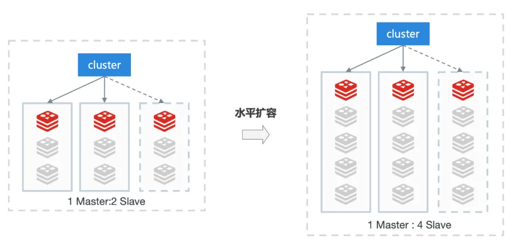

**1) 缓存热点问题**

如下图所示，node-1 节点存在 2 个热点访问，请求量远高于其他节点。缓存热点会导致实例负载不均衡，从而严重影响响应速度。

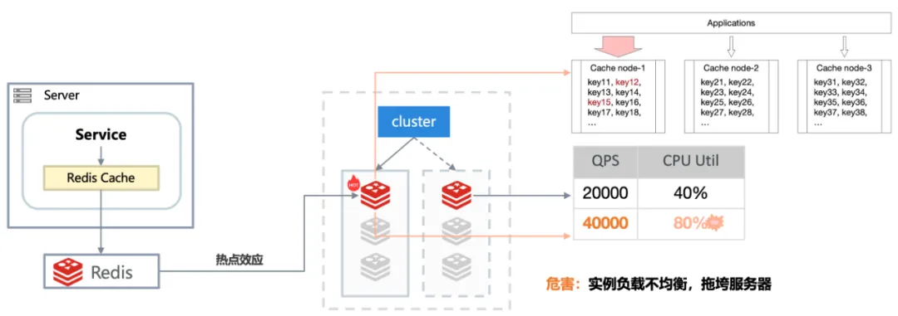

**缓存热点应对方案：热点识别自动构建多级缓存**

将单位时间内高频访问的 Key，识别出来。例如：同一个 Key，1 秒内单机访问 10 次。

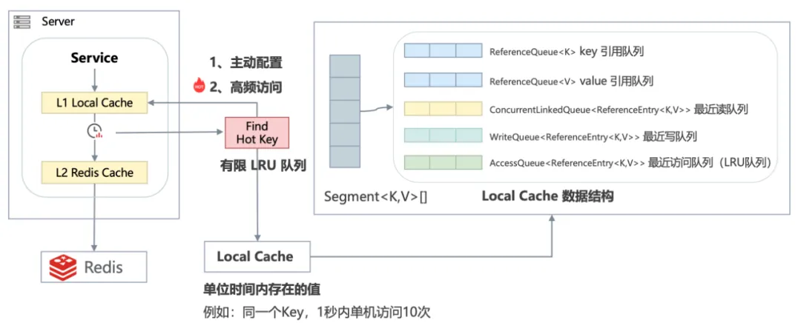

如上图所示，自动发现 Hot keys 或将指定的 Key 加入到本地缓存。

秒杀时：短暂的本地缓存可以减少 Redis 单实例热点，对数据的一致性不会有较大影响。

**优化效果**：开启多级缓存后，同一个缓存 key 访问性能明显提升，对应 Redis 访问量也明显降低（如下图所示）。

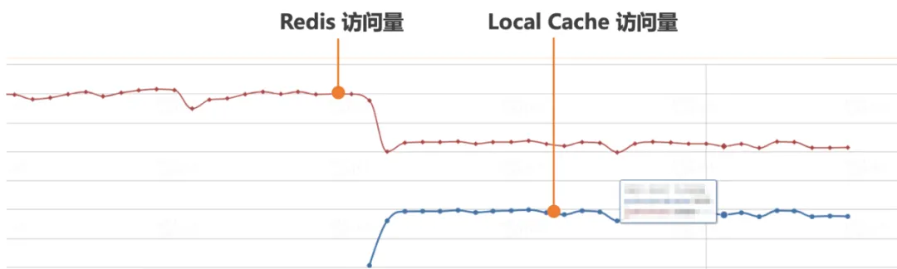

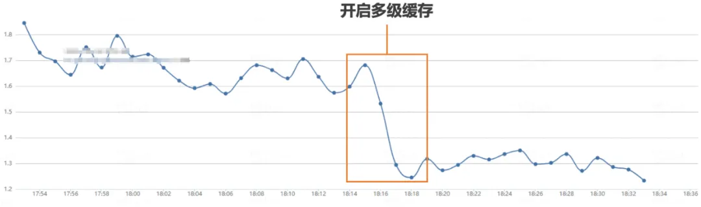

**2) 缓存大 Key 问题**

缓存大 key 的危害主要包括：阻塞请求、内存占用大、阻塞网络等。不仅会降低 Redis 的性能，还可能影响整个系统的稳定性（如下图所示）。

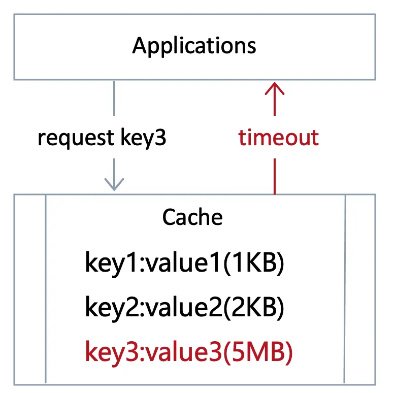 

通过 memtier-benchmark 工具在生产环境下压测：200KB 以上比 10KB 以内的性能慢 3 倍，吞吐能力也下降 76%（如下图所示）。

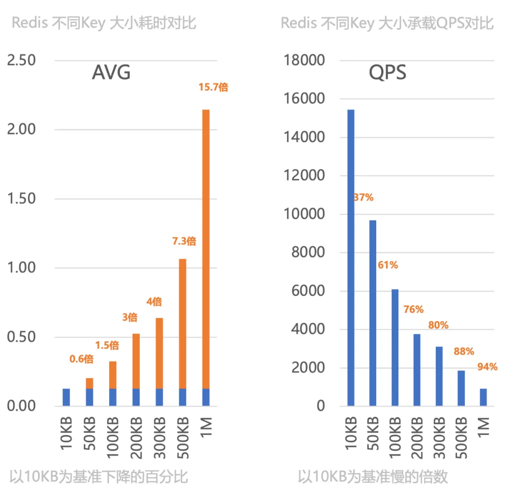

**缓存大 Key 应对方案：**

a）**精简缓存对象**：去除缓存中的冗余字段。

b）**压缩缓存对象**：采用压缩比更高的压缩方式，缩小缓存对象。

c）**拆分大 Key**：若精简和压缩后还是过大，根据业务逻辑，将大 Key 拆分成多个小 Key。(注意拆分后 IO 次数会增加，高负载下性能不一定会变好，需要根据压测结果来评估最终性能)

d）**长期治理**：建立长期治理机制，定期扫描 Redis 中的大 Key，每周跟进，将隐患在日常治理中消除。

**优化效果**：在大 Key 优化后，Redis 查询性能有较为明显的提升（如下图所示，缓存查询耗时从 300μs 优化至 100μs）。

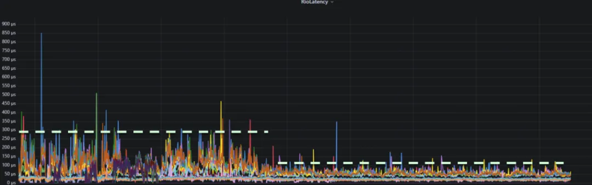

**问题二：数据库超负载**

系统中商品信息的变更往往伴随着缓存失效的问题，尤其在高并发和秒杀场景下，大量请求可能直接穿透缓存层，对数据库造成巨大压力，甚至引发性能故障。

**缓存更新策略优化：应对商品变更导致的数据库压力**

**1) 常见的缓存架构设计问题**

监听器收到消息后删除相应的缓存 Key。这种方式在一般情况下是有效的，但在高并发和大流量场景下，它存在几个突出的问题：

a) **缓存击穿**：由于缓存的 Key 被立即删除，大量请求在缓存未更新之前会直接访问数据库，导致数据库压力骤增。

b) **消息处理延迟**：在高并发场景下，消息处理可能产生延迟，导致缓存更新不及时，进一步加剧数据库压力。

**2) 缓存更新策略的优化**

为了应对这些挑战，采取了一系列优化措施，主要包括：

a) **缓存覆盖更新策略**：替代直接删除缓存 Key 的做法，采用了缓存覆盖更新策略。当商品信息发生变更时，系统不再删除缓存 Key，而是直接更新该 Key 对应的缓存值。避免了流量穿透到底层数据库。

b) **消息聚合**：针对商品变化消息量过大的问题，引入了消息聚合机制。将商品多次变化消息在一段时间窗口内合并成一个，减少消息处理的频率。

c) **异步更新缓存**：为了进一步降低对数据库的实时压力，采用了异步更新缓存的策略。当商品信息发生变更时，系统不会立即更新缓存，而是将更新任务放入一个异步队列中，由后台线程异步处理。

**缓存更新策略变化如下图所示：**

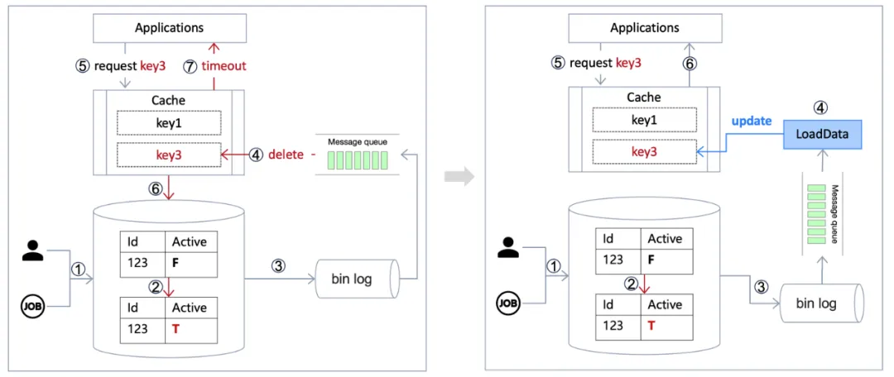

**问题三：供应商系统不稳定**

供应商系统因大流量导致响应缓慢或被限流，影响整体系统的稳定性。

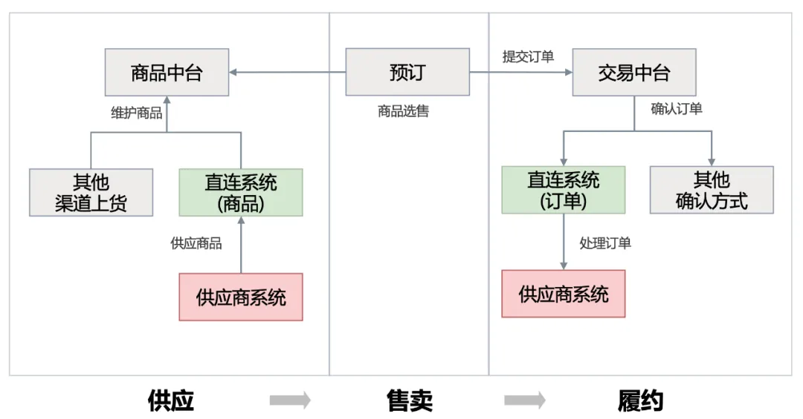

**应对供应商系统不稳定性的技术策略优化**

当供应商系统面临大流量冲击时，往往会出现响应缓慢甚至被限流的情况，这直接影响了我们自身系统的稳定性和用户体验。

**供应商订单对接问题**

当与供应商进行订单对接时，可能会遇到以下问题：

a）**被供应商限流**：在高并发场景下，供应商系统可能会对我们限流。这会导致我们的订单提交受阻，影响业务流转。

b）**供应商系统不稳定**：由于各种原因，供应商系统可能会出现不稳定的情况，导致订单处理延迟或失败。

**为了缓解上述问题，我们采取以下技术策略：**

1）**削峰填谷 / 缓冲池**：利用消息队列作为订单提交的缓冲池，将订单信息先写入队列，再由后台服务异步处理。这样可以将订单提交的高峰流量削平，减少对供应商系统的瞬时压力。

2）**禁售策略**

• **自动禁售**：建立对供应商系统的健康度监控机制，实时监测其响应速度、错误率等指标。一旦发现供应商系统出现不稳定或限流的情况，及时触发禁售策略。

• **定期重试**：对于因供应商系统问题而失败的订单，设定了一个重试机制，定期尝试重新提交。同时，根据供应商系统的恢复情况，动态调整重试的频率和次数。

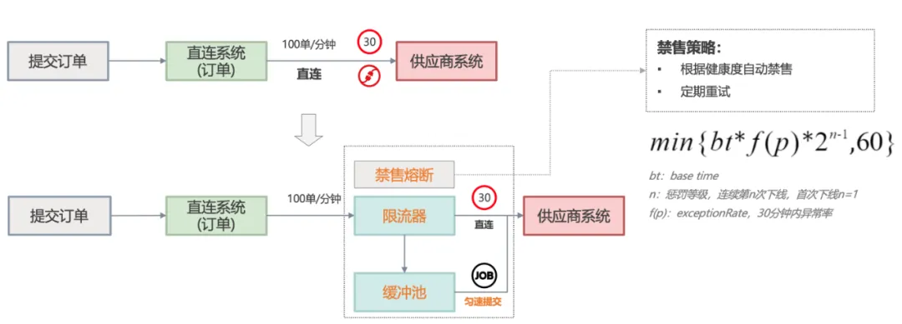

**优化效果**：通过实施上述技术和策略优化，可以有效确保供应商系统能力不影响下单吞吐量 (如下图所示)。

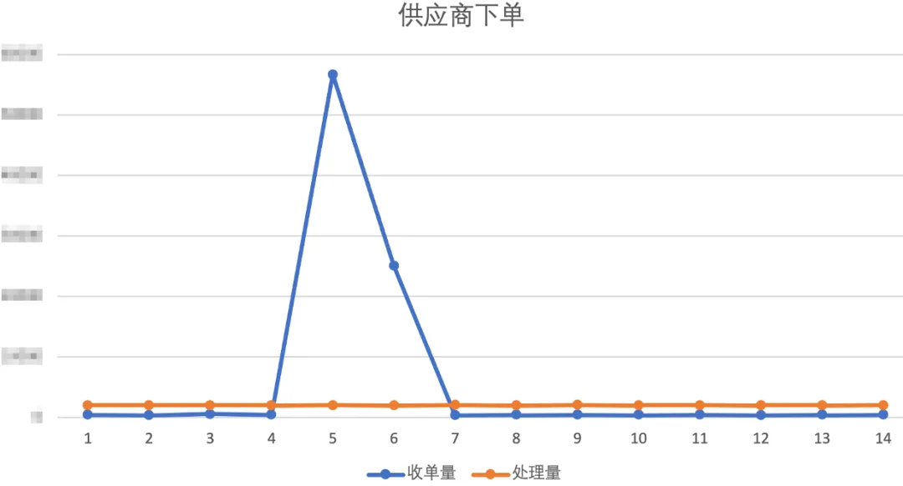

上述的优化措施落地后能够提升系统的稳定性，然而鉴于流量的不确定性，**即使流量超过系统负载能力，系统也要正常运行**，因此仍然需要有相应的流量控制策略。

**流量控制策略优化：确保秒杀活动稳定运行**

如下图所示，不同页面对应的流量和系统 (承载能力) 是不同的，需要控制好每个过程的流量，确保整体系统的稳定性。

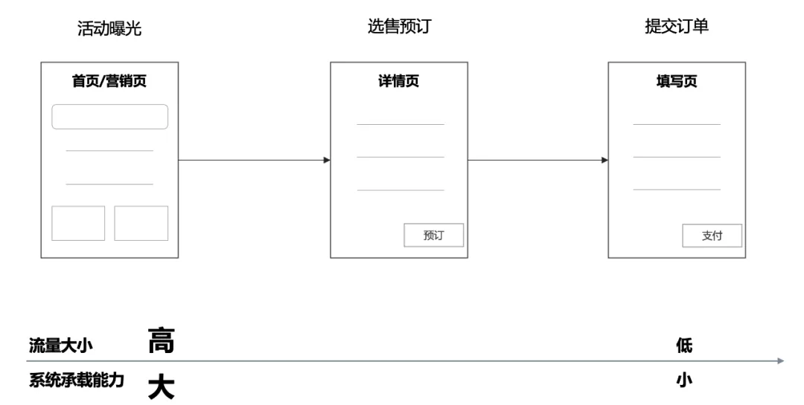 

以 70 万人购买 5000 张票的秒杀活动为例，可采取以下限流策略：

**1) SOA 限流：接口与应用级限流**

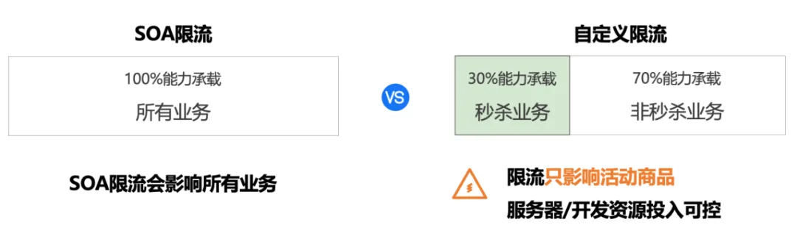 

通过服务治理框架对服务接口进行限流（SOA 限流），在秒杀 / 活动等场景会影响到其他商品的正常售卖。对此可针对秒杀活动的特殊需求，设计自定义的限流策略，如按秒杀商品限流、页面级限流等，细化商品维度的流量控制。

**2) 自定义限流：商品级限流**

a）针对单个秒杀商品设置独立的限流阈值，即使某个商品超负载，也不会影响整体系统的可用性。

b）同时，对于未知的秒杀突增流量，也可以支持热点商品自动限流，与 Redis 热 Key 发现类似，自动识别热点访问的商品，并添加到商品级限流中，从而确保整体系统的稳定运行。

如下图所示，我们采用了商品维度的自定义限流策略，该策略将 1 秒内的请求流量划分为 10 个独立的 100 毫秒 (可配置) 滑动窗口。每个窗口都会平分一部分流量，以确保下游服务的并发量得到有效控制。这种方法不仅降低了下游服务的压力，也为用户提供更加均衡的流量分配。

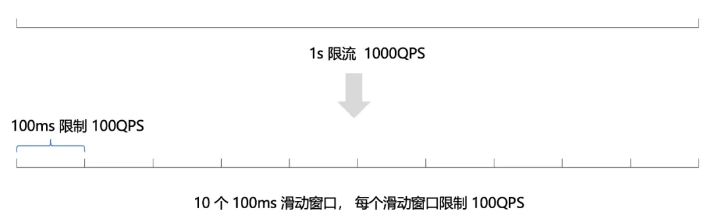

结合商品级限流能力，控制进入每一个页面的流量，形成多层次的限流防护体系，根据秒杀库存预估售卖时长，控制进入到每一个页面的流量比例，这样也能够大幅减少服务器资源投入。

**优化效果**：自定义限流可控制进入每一个页面的流量，超负载也不影响整体的可用性，服务器资源的投入也可控。

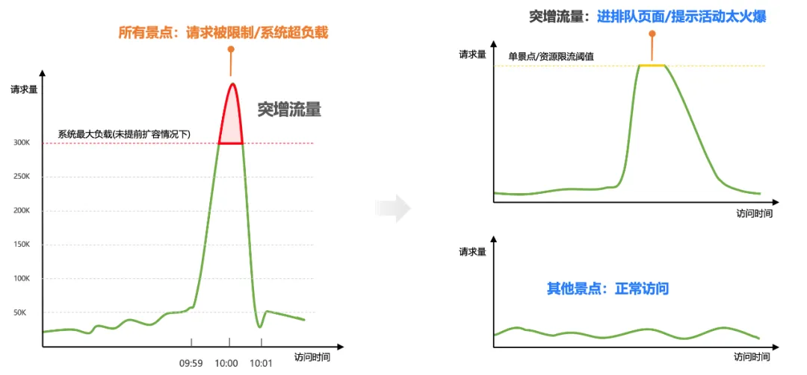

本部分阐述了系统稳定性的挑战及优化，包括 Redis 超负载与缓存热点、数据库超负载、供应商系统不稳定等。通过热点识别自动构建多级缓存、缓存覆盖更新策略、削峰填谷 / 缓冲池、自定义限流等多种技术策略，使得系统稳定性问题得到有效解决。

#### 3.2 写数据一致性挑战与应对策略
下单过程中的库存扣减的精确执行，这种数据一致性的实现效果会直接影响订单是否能够成功履约，而传统关系型数据库的并发更新存在显著瓶颈，因此需要专项优化。

**扣减库存问题**：性能瓶颈 – MySQL 热点行扣减库存（行级锁）。

**技术策略**：扣减库存异步化，异步扣库存主要分 3 步（见下图）：

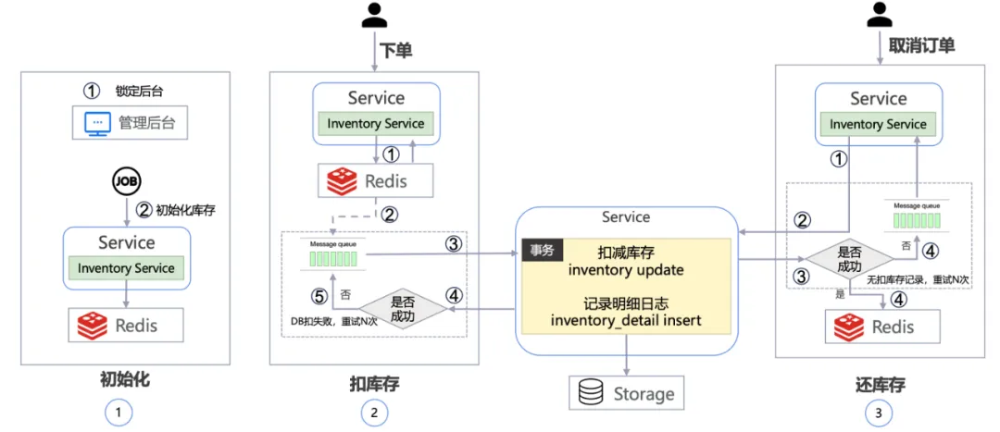

1）初始化：秒杀商品设置好活动场次，将秒杀库存同步至 Redis。

2）扣库存：活动开始时，先从 Redis 扣减库存，在通过消息通知异步扣减 DB 库存，削除 DB 更新同一行的峰值。

3）还库存：如果有退订，先判断 DB 中是否有扣减记录，如果有，则先退 DB 再退 Redis；如果没有，重试多次。

扣还库存过程中也会存在超时等未知情况，此处细节过多不再展开。按照业务 “可少买不超卖” 的原则，即使在这个过程中数据可能存在短暂的延时，但能够确保最终一致性。

**优化效果**：库存扣减异步化，消除行级锁瓶颈。现在系统能够轻松支撑数十万单 / 分钟交易流量。

#### 3.3 实现高可用的可持续性
系统是不断演进的，如何保持并持续优化系统能力就成为新的课题。因此日常架构健康度持续治理、以及大型活动和节假日保障体系是实现高可用 “可持续性” 的关键。

**3.3.1 架构健康度治理**

基于架构健康度实现系统质量的量化管理，实现研发生命周期各个环节的跟踪和优化，如下图所示可细分为三部分：

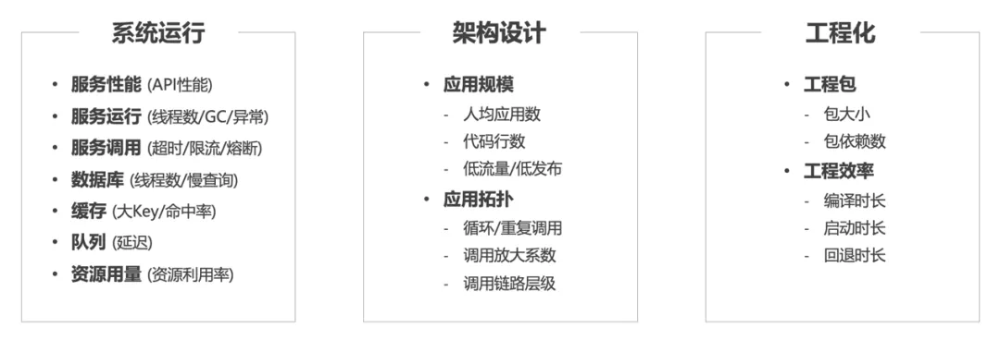

a) 系统运行健康度：通过系统各个维度运行时的健康状态和问题来反映系统质量。

b) 架构设计健康度：服务数量、调用关系的复杂度、循环依赖、调用层级过深等因素都会影响系统的稳定性和性能。

c) 工程化健康度：基于应用的工程质量和效率状态，反应出开发的工程化水平。

**3.3.2 大型活动和节假日保障体系**

无论大型活动还是节假日，都需要提前准备好应急预案，做好压测，提前保证系统的高可用。

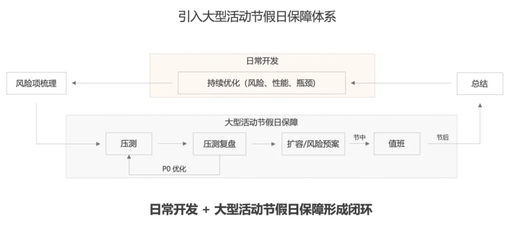

### 四、总结
携程门票的预订交易系统在承接秒杀活动中面临的挑战与应对策略。重点解决了读热点、写瓶颈、强事务、流量控制等诸多细节问题，同时通过日常的架构健康度治理和制定专项的保障计划，持续对系统进行优化，确保系统在高负载下依然能够稳定运行，实现系统的持续高可用。

> 更新: 2024-07-15 22:21:20  
> 原文: <https://www.yuque.com/tulingzhouyu/db22bv/ueoqalzzkrubyb4b>