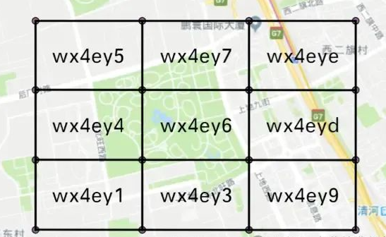

# 查离当前外卖员5公里的订单

## 问题分析：
<font style="color:rgba(0, 0, 0, 0.6);">这个问题是最近直播间突击学员面某大厂被背问到，虽然直播间能给到大致回答思路，但更多的细节短短的时间没法讲清楚，而且讲完估计也就忘记了，故在此更新下详细笔记。</font>

**<font style="color:rgba(0, 0, 0, 0.6);">首先</font>**<font style="color:rgba(0, 0, 0, 0.6);">：其重点在于如何高效地处理大规模数据（1000 万订单）的查询，同时满足“5公里范围内”的空间查询需求。这意味着需要一个能够快速过滤和查找地理信息的解决方案。面试可能希望听到的技术点包括数据存储的选择、索引设计、缓存的使用以及分布式架构的设计。也提示了求职者重点不是在SQL 或者ES。</font>

**<font style="color:rgba(0, 0, 0, 0.6);">其次</font>**<font style="color:rgba(0, 0, 0, 0.6);">:这中实际问题的场景题，不仅仅是要一个简单的解决方案，更是在考察候选人对高并发、大数据处理以及空间查询技术（高性能低延迟）的理解。回答需要体现出对技术选型的逻辑性，以及对性能优化和系统架构设计的深入思考。</font>

## <font style="color:rgba(0, 0, 0, 0.6);">解答关键点：</font>
<font style="color:rgba(0, 0, 0, 0.6);">数据存储、空间索引、实时定位由近至远排序、缓存优化和分布式架构越快越好。这些点基本涵盖了从数据存储到查询优化的整个流程。切记场景题回答思路不要局限与某个技术栈，而是整个处理流程。</font>

**<font style="color:rgba(0, 0, 0, 0.6);">注意：</font>**<font style="color:rgba(0, 0, 0, 0.6);">此场景题在很多地方可通用，如：附近小姐姐匹配，打车软件接单，迅雷附近资源，地图导航附近车辆 等等</font>

<font style="color:rgba(0, 0, 0, 0.6);"></font>

## 解决方案和技术思路：
### <font style="color:rgba(0, 0, 0, 0.9);">一、数据库设计与索引优化</font>
#### <font style="color:rgba(0, 0, 0, 0.9);">数据模型设计</font>
    - <font style="color:rgba(0, 0, 0, 0.9);">设计订单表，包含订单基本信息，如订单编号、下单时间、用户信息等。另外，关键是要有订单的地理位置信息。可以使用纬度和经度两个字段来存储订单的位置。例如，订单表结构可能如下：</font>

| **<font style="color:rgba(0, 0, 0, 0.9);">订单编号</font>** | **<font style="color:rgba(0, 0, 0, 0.9);">下单时间</font>** | **<font style="color:rgba(0, 0, 0, 0.9);">用户编号</font>** | **<font style="color:rgba(0, 0, 0, 0.9);">状态</font>** | **<font style="color:rgba(0, 0, 0, 0.9);">纬度</font>** | **<font style="color:rgba(0, 0, 0, 0.9);">经度</font>** |
| :--- | :--- | :--- | :--- | :--- | :--- |
| <font style="color:rgba(0, 0, 0, 0.9);">001</font> | <font style="color:rgba(0, 0, 0, 0.9);">2024 - 01 - 01 12:00:00</font> | <font style="color:rgba(0, 0, 0, 0.9);">1001</font> | <font style="color:rgba(0, 0, 0, 0.9);">未配送</font> | <font style="color:rgba(0, 0, 0, 0.9);">30.23</font> | <font style="color:rgba(0, 0, 0, 0.9);">110.34</font> |


1. **<font style="color:rgba(0, 0, 0, 0.9);">空间索引</font>**
    - <font style="color:rgba(0, 0, 0, 0.9);">针对订单的地理位置信息，可以使用空间索引（具有二维或三维的特性）。在 MySQL 中，可以使用 Spatial Index。例如，将订单的经纬度组合成一个几何数据类型（如 Point），然后为该几何字段创建空间索引。这样在查询离当前外卖员 5 公里范围内的订单时，可以利用空间索引来快速筛选符合条件的订单区域。</font>
    - <font style="color:rgba(0, 0, 0, 0.9);">空间索引的原理是基于空间数据的网格划分等方法，能够将空间数据按照一定的规则组织起来，使得在进行空间范围查询时，可以快速定位到可能包含所需数据的索引区域，从而提高查询效率。</font>

#### 2，具体定位检索：
<font style="color:rgba(0, 0, 0, 0.9);">如以外卖员位置为中心、检索网格 5 公里为半径的圆形区域的相关记录。它避免了对整个订单表进行全表扫描，大大减少了 I/O 操作和查询时间。</font>

<font style="color:rgba(0, 0, 0, 0.9);">例如，在没有空间索引的情况下，查询 1000 万订单中符合条件的可能需要逐条比较每个订单的地理位置与外卖员位置的距离，而使用空间索引可以快速缩小搜索范围。</font>

#### <font style="color:rgba(0, 0, 0, 0.9);">3，空间索引实现（以MySQL为例）</font>
1. **<font style="color:rgba(0, 0, 0, 0.9);">数据类型选择</font>**
    - <font style="color:rgba(0, 0, 0, 0.9);">在 MySQL 中，可以使用 </font>`<font style="color:rgba(0, 0, 0, 0.9);">POINT</font>`<font style="color:rgba(0, 0, 0, 0.9);"> 数据类型来存储订单的位置信息。</font>`<font style="color:rgba(0, 0, 0, 0.9);">POINT</font>`<font style="color:rgba(0, 0, 0, 0.9);"> 用于表示二维空间中的一个点，它包含经度和纬度两个坐标值。例如：</font>
        * `<font style="color:rgba(0, 0, 0, 0.9);">CREATE TABLE orders (order_id INT PRIMARY KEY, order_location POINT);</font>`
2. **<font style="color:rgba(0, 0, 0, 0.9);">创建空间索引</font>**
    - <font style="color:rgba(0, 0, 0, 0.9);">可以为 </font>`<font style="color:rgba(0, 0, 0, 0.9);">POINT</font>`<font style="color:rgba(0, 0, 0, 0.9);"> 类型的字段创建空间索引。在 MySQL 中，使用 </font>`<font style="color:rgba(0, 0, 0, 0.9);">SPATIAL INDEX</font>`<font style="color:rgba(0, 0, 0, 0.9);"> 关键字来创建空间索引。例如：</font>
        * `<font style="color:rgba(0, 0, 0, 0.9);">ALTER TABLE orders ADD SPATIAL INDEX (order_location);</font>`
        * <font style="color:rgba(0, 0, 0, 0.9);">这个空间索引会基于订单的位置信息，按照 R - Tree 或其他合适的空间索引结构来组织数据，以便能够快速进行空间范围查询。</font>
3. **<font style="color:rgba(0, 0, 0, 0.9);">空间查询语法</font>**
+ <font style="color:rgba(0, 0, 0, 0.9);">当需要查询离外卖员 5 公里范围内的订单时，可以使用 MySQL 的空间关系函数。例如，使用 </font>`<font style="color:rgba(0, 0, 0, 0.9);">MBRContains()</font>`<font style="color:rgba(0, 0, 0, 0.9);">（用于判断一个几何对象是否包含另一个几何对象）或 </font>`<font style="color:rgba(0, 0, 0, 0.9);">DistanceSphere()</font>`<font style="color:rgba(0, 0, 0, 0.9);">（用于计算球面上两点之间的距离）等函数。</font>
+ <font style="color:rgba(0, 0, 0, 0.9);">假设外卖员的位置存储在一个变量 </font>`<font style="color:rgba(0, 0, 0, 0.9);">@deliveryman_location</font>`<font style="color:rgba(0, 0, 0, 0.9);"> 中，并且是一个 </font>`<font style="color:rgba(0, 0, 0, 0.9);">POINT</font>`<font style="color:rgba(0, 0, 0, 0.9);"> 类型，查询语句可能如下：</font>

```sql
SELECT * FROM orders WHERE MBRContains(GeomFromText(CONCAT('POLYGON((', @deliveryman_location_x - 5 / 111.32 , ' ', @deliveryman_location_y - 5 / (111.32 * COS(RADIANS(@deliveryman_location_y))), ',', @deliveryman_location_x + 5 / 111.32 , ' ', @deliveryman_location_y - 5 / (111.32 * COS(RADIANS(@deliveryman_location_y))), ',', @deliveryman_location_x + 5 / 111.32 , ' ', @deliveryman_location_y + 5 / (111.32 * COS(RADIANS(@deliveryman_location_y))), ',', @deliveryman_location_x - 5 / 111.32 , ' ', @deliveryman_location_y + 5 / (111.32 * COS(RADIANS(@deliveryman_location_y))), ',', @deliveryman_location_x - 5 / 111.32 , ' ', @deliveryman_location_y - 5 / (111.32 * COS(RADIANS(@deliveryman_location_y))), '))))')), order_location);
```

+ <font style="color:rgba(0, 0, 0, 0.9);">这里为了计算 5 公里范围，将经纬度的差值进行了转换（因为 1 度经纬度的距离在赤道附近大约是 111.32 公里），使用一个近似的多边形来表示 5 公里范围。实际使用时可能需要更精确的地理距离计算方法。</font>

### <font style="color:rgba(0, 0, 0, 0.9);">二、缓存策略(核心考察)</font>
#### <font style="color:rgba(0, 0, 0, 0.9);">Redis Geo地理缓存</font>
    - <font style="color:rgba(0, 0, 0, 0.9);">可以使用 Redis 的 Geo 功能。每个订单的编号作为成员（member），其对应的地理位置（经纬度）作为坐标（point）存储在 Redis 的 GeoSet 中。每个订单可以看作一个地理元素，具有经纬度和订单编号等信息。</font>
    - <font style="color:rgba(0, 0, 0, 0.9);">当需要查询离外卖员 5 公里范围内的订单时，可以使用 Redis 的 Geo 命令，如 GEOSEARCH。它可以根据给定的中心点（外卖员的位置）和半径（5 公里）来快速查找附近的订单。Redis 的Geo 功能是基于内存操作，具有非常高的查询性能，可以应对高并发的查询场景。</font>

<font style="color:rgba(0, 0, 0, 0.9);">例如，使用</font>`<font style="color:rgba(0, 0, 0, 0.9);">GEOADD</font>`<font style="color:rgba(0, 0, 0, 0.9);">命令，格式为</font>`<font style="color:rgba(0, 0, 0, 0.9);">GEOADD orders_location order_id DaJieJie xiaoJieJie</font>`<font style="color:rgba(0, 0, 0, 0.9);">。假设订单编号为“order_001”，经度为110.34，纬度为30.23，那么执行的命令是</font>`<font style="color:rgba(0, 0, 0, 0.9);">GEOADD orders_location order_001 110.34 30.23</font>`<font style="color:rgba(0, 0, 0, 0.9);">。</font>

<font style="color:rgba(0, 0, 0, 0.9);">这样，所有的订单位置信息就被组织在一个有序的地理空间集合中，方便后续基于位置的查询操作。</font>

#### <font style="color:rgba(0, 0, 0, 0.9);">缓存更新策略</font>
    - <font style="color:rgba(0, 0, 0, 0.9);">(美团，京东外卖员送单过程位置实时更新)可以设置一个定时任务，每隔一段时间（如 1 分钟，具体可根据机器预算调整）将数据库中状态发生变化的订单更新到 Redis 缓存中。</font>
    - <font style="color:rgba(0, 0, 0, 0.9);">还有一种情况会触发更新，由于外卖订单的状态可能会动态变化（如被接单、完成等），需要定期从数据库同步更新缓存中的订单信息。在数据库层面，当订单状态或者位置更新时，可以利用数据库的触发器功能，触发一个操作将更新信息发送给后端服务。后端服务接收到更新消息后，立即更新 Redis 缓存。</font>

<font style="color:rgba(0, 0, 0, 0.9);">例如，在 MySQL 中创建一个触发器，当订单表的特定字段（如状态字段、经度字段、纬度字段）发生更新时，触发器执行存储过程，通过某种通信方式（如消息队列）通知后端服务更新缓存。</font>

#### <font style="color:rgba(0, 0, 0, 0.9);">3，缓存查询实现</font>
**<font style="color:rgba(0, 0, 0, 0.9);">获取配送员位置并查询附近订单</font>**

+ <font style="color:rgba(0, 0, 0, 0.9);">当配送员客户端请求获取附近订单时，首先从配送员服务中获取该配送员的当前位置（经纬度）。假设配送员编号为“TianMing_001”，其经度为110.35，纬度为30.22。</font>
+ <font style="color:rgba(0, 0, 0, 0.9);">然后，利用 Redis 的</font>`<font style="color:rgba(0, 0, 0, 0.9);">GEOSEARCH</font>`<font style="color:rgba(0, 0, 0, 0.9);">命令查询 Redis GeoSet 中距离配送员位置5公里范围内的订单。命令格式可以是</font>`<font style="color:rgba(0, 0, 0, 0.9);">GEOSEARCH orders_location NEARBY xiaoJieJie DaJieJie 5000 m WITHDIST</font>`<font style="color:rgba(0, 0, 0, 0.9);">。其中，“orders_location”是 GeoSet 的名称，“NEARBY”指定要查询附近的成员，“XiaoJieJie”和“DaJieJie”是配送员的经纬度，“5000 m”表示5公里范围，“WITHDIST”选项用于返回每个订单与配送员之间的距离。</font>
+ <font style="color:rgba(0, 0, 0, 0.9);">Redis 会返回符合条件的订单编号以及它们与配送员的距离。例如，返回结果可能包含订单“order_001”距离配送员1.2公里，“order_002”距离配送员3.5公里等信息。</font>
+ <font style="color:rgba(0, 0, 0, 0.9);">接下来，将这些订单编号作为条件，到订单服务的缓存（如 Redis 的哈希结构存储订单详情）或者数据库中获取订单的详细信息（如订单金额、预计送达时间等），然后将完整的订单信息返回给配送员客户端。</font>

<font style="color:rgba(0, 0, 0, 0.9);">示意图：</font><font style="color:rgb(77, 77, 77);">通过GeoHash将经纬度转换成bit位的字符串，如果经纬度越接近，他们的前缀匹配位数也就越长，如此即可快速检索到附近多少的</font>



**注意**：（细节追问）此方案可能追问 **数据一致性问题**，这里就过多解答，可参看保险项目中的解答（旁路缓存+MQ+最终一致 + 版本号等）

  还有一个问题需要思考和处理。得到的**最近可能不是最近**。比如这样：


<font style="color:rgb(77, 77, 77);">用geohash那结果显然是AB更近，但是实际上A与B的距离比AE、AC、AD都远。这其实是一个边缘性的问题。实际上此问题很简单，但为了让你的脑袋跟着来，我这等你看评论吧。（tips：格>扩，码>点）</font>


### <font style="color:rgba(0, 0, 0, 0.9);">三、分布式系统架构考虑</font>
#### <font style="color:rgba(0, 0, 0, 0.9);">微服务架构拆分</font>
+ **<font style="color:rgba(0, 0, 0, 0.9);">服务拆分原则</font>**
    - <font style="color:rgba(0, 0, 0, 0.9);">根据业务功能模块进行拆分，比如将系统拆分为订单服务、配送员服务、用户服务、支付服务等。这种拆分方式使得每个服务能够独立开发、测试和部署，同时也有利于团队的协作。</font>
    - <font style="color:rgba(0, 0, 0, 0.9);">按业务流程拆分，例如将订单流程分为下单、接单、配送、完成等多个阶段，每个阶段由不同的子服务负责处理。这样可以更好地应对不同阶段的负载差异，例如在接单阶段可能会有大量配送员同时请求获取订单，而配送阶段则主要涉及订单位置的实时更新。</font>
+ **<font style="color:rgba(0, 0, 0, 0.9);">订单服务</font>**
    - <font style="color:rgba(0, 0, 0, 0.9);">负责订单的创建、修改、查询等操作。它需要处理大量的订单数据写入和读取请求，因此需要高性能的数据库和缓存支持。在创建订单时，除了记录基本的订单信息外，还需要存储订单的位置信息用于后续的配送员查询。同时，它还需要与支付服务进行交互，处理订单的支付状态变化。</font>
    - <font style="color:rgba(0, 0, 0, 0.9);">为了应对高并发的订单查询请求，订单服务可以采用读写分离的数据库架构。主数据库负责处理订单的写入操作，而从数据库则用于读取查询操作。此外，还可以使用缓存策略，将热点订单数据（如未接单的订单）缓存到Redis等内存数据库中，以提高查询性能。</font>
+ **<font style="color:rgba(0, 0, 0, 0.9);">配送员服务</font>**
    - <font style="color:rgba(0, 0, 0, 0.9);">管理配送员的基本信息、状态（如在线、离线、忙碌等）以及位置信息。配送员服务需要实时接收配送员的位置更新，并将这些位置信息存储到数据库和缓存中。</font>
    - <font style="color:rgba(0, 0, 0, 0.9);">当配送员请求获取附近的订单时，配送员服务需要调用订单服务提供的接口，根据配送员的位置和指定的范围（如5公里）来查询附近的订单。这个过程需要高效的空间查询能力，因此可以利用订单服务中的空间索引和缓存策略来快速获取结果。</font>

#### <font style="color:rgba(0, 0, 0, 0.9);">负载均衡和集群部署</font>
+ **<font style="color:rgba(0, 0, 0, 0.9);">负载均衡策略</font>**
    - **<font style="color:rgba(0, 0, 0, 0.9);">基于硬件的负载均衡器</font>**<font style="color:rgba(0, 0, 0, 0.9);">：如 F5 BIG-IP，它能够根据预设的负载均衡算法（如轮询、最小连接数、加权轮询等）将请求分发到后端的服务器集群上。例如，当多个配送员客户端同时请求获取附近订单时，负载均衡器可以将这些请求均匀地分配给不同的订单服务实例，避免某个实例过载。</font>
    - **<font style="color:rgba(0, 0, 0, 0.9);">基于软件的负载均衡</font>**<font style="color:rgba(0, 0, 0, 0.9);">：如 Nginx、HAProxy。这些软件可以部署在服务器上，根据不同的策略将请求转发给后端服务。例如，在订单服务的前端部署 Nginx，将来自不同客户端的订单创建、查询等请求分发到后端的多个订单服务实例上。通过动态调整负载均衡策略，可以根据服务器的负载情况实时优化流量分配。</font>
    - **<font style="color:rgba(0, 0, 0, 0.9);">应用层负载均衡</font>**<font style="color:rgba(0, 0, 0, 0.9);">：在服务内部实现负载均衡逻辑，例如通过在订单服务的客户端使用负载均衡库（如 Netflix Ribbon），根据服务实例的健康状况和负载情况，将请求智能地分发到合适的后端服务实例。</font>
+ **<font style="color:rgba(0, 0, 0, 0.9);">集群部署方案</font>**
    - <font style="color:rgba(0, 0, 0, 0.9);">对于订单服务和配送员服务等关键服务，可以采用多实例集群部署的方式。每个服务实例可以部署在不同的物理服务器或者虚拟机上，以提高系统的可用性和并发处理能力。</font>
    - <font style="color:rgba(0, 0, 0, 0.9);">为了保证数据的一致性，服务实例之间需要共享数据库和缓存系统。可以采用分布式数据库（如 TiDB）来存储订单数据，它能够提供高可用性和水平扩展能力。同时，使用 Redis 集群来存储缓存数据，通过 Redis 的主从复制和分片技术来实现高可用和大数据量的存储。</font>

#### <font style="color:rgba(0, 0, 0, 0.9);">服务间通信与数据同步</font>
+ **<font style="color:rgba(0, 0, 0, 0.9);">服务间通信方式</font>**
    - **<font style="color:rgba(0, 0, 0, 0.9);">RESTful API</font>**<font style="color:rgba(0, 0, 0, 0.9);">：这是最常用的服务间通信方式。例如，配送员服务通过调用订单服务提供的 RESTful API 来查询附近的订单。订单服务返回 JSON 格式的订单数据，配送员服务解析这些数据并将其展示给配送员客户端。这种方式具有良好的跨语言支持和易集成性，但可能存在性能开销，因为需要进行 HTTP 协议的封装和解析。</font>
    - **<font style="color:rgba(0, 0, 0, 0.9);">RPC（远程过程调用）</font>**<font style="color:rgba(0, 0, 0, 0.9);">：如 gRPC，它是一种高效的远程过程调用框架。在订单服务和配送员服务之间，可以使用 gRPC 进行通信。通过定义服务接口和数据模型，配送员服务可以像调用本地函数一样调用订单服务中的方法，而底层的通信细节由 gRPC 框架处理。这种方式具有高性能和低延迟的特点，特别适合在分布式系统内部的服务间通信。</font>
    - **<font style="color:rgba(0, 0, 0, 0.9);">消息队列</font>**<font style="color:rgba(0, 0, 0, 0.9);">：如 Kafka、RabbitMQ。在订单系统中，消息队列可以用于异步通信。例如，当订单状态发生变更（如从“未接单”变为“已接单”）时，订单服务可以将这个事件发布到消息队列中。配送员服务可以订阅这个消息队列，当收到订单状态变更消息后，及时更新本地缓存中的订单状态，以便为配送员提供准确的订单信息。</font>
+ **<font style="color:rgba(0, 0, 0, 0.9);">数据同步机制</font>**
    - **<font style="color:rgba(0, 0, 0, 0.9);">实时同步</font>**<font style="color:rgba(0, 0, 0, 0.9);">：对于关键的订单数据更新（如订单位置、状态等），需要实时同步到其他相关服务。例如，当配送员更新其位置后，配送员服务立即将新的位置信息通过消息队列发送给订单服务。订单服务接收到消息后，更新缓存中的配送员位置信息，并根据新的位置重新计算附近的订单分配策略。</font>
    - **<font style="color:rgba(0, 0, 0, 0.9);">定时同步</font>**<font style="color:rgba(0, 0, 0, 0.9);">：对于一些非实时性要求很高的数据，可以采用定时同步的方式。例如，每隔一段时间（如每小时），订单服务可以从数据库中提取订单的统计数据（如各区域的订单量、平均配送时间等），并通过 API 或者数据文件的方式同步给数据分析服务。这种方式可以减少实时通信的压力，同时保证数据的定期更新。</font>

#### <font style="color:rgba(0, 0, 0, 0.9);">分布式缓存与存储</font>
+ **<font style="color:rgba(0, 0, 0, 0.9);">分布式缓存架构</font>**
    - <font style="color:rgba(0, 0, 0, 0.9);">在分布式系统中，缓存系统需要支持高并发读写和大数据量存储。可以采用 Redis 集群或者 Memcached 集群来实现分布式缓存。例如，将订单的位置信息和状态信息存储在 Redis 集群中，通过一致性哈希算法将数据分布到多个 Redis 节点上。这样可以提高缓存的存储容量和访问性能。</font>
    - <font style="color:rgba(0, 0, 0, 0.9);">为了保证缓存数据的可靠性，可以采用 Redis 的主从复制模式。主节点负责处理写入请求，并将数据同步到从节点。当主节点出现故障时，可以从节点可以进行故障转移，接替主节点的工作，从而保证缓存服务的可用性。</font>
+ **<font style="color:rgba(0, 0, 0, 0.9);">分布式存储系统</font>**
    - <font style="color:rgba(0, 0, 0, 0.9);">对于订单数据的存储，可以采用分布式数据库。例如，TiDB 是一个兼容 MySQL 协议的分布式数据库，它能够提供水平扩展、高可用性和强一致性。在 TiDB 中，数据会被自动分片存储到多个 TiKV 节点上，同时通过 Raft 算法保证数据的强一致性。这样可以满足大规模订单数据的存储需求，并且能够应对高并发的读写请求。</font>
    - <font style="color:rgba(0, 0, 0, 0.9);">对于非结构化数据（如订单的图片、配送员的头像等），可以使用分布式文件系统（如 HDFS）或者对象存储（如 AWS S3、阿里云 OSS）。这些存储系统能够提供大容量的存储空间和高可用性，同时支持高并发的文件读写操作。</font>

#### <font style="color:rgba(0, 0, 0, 0.9);">监控与日志系统</font>
+ **<font style="color:rgba(0, 0, 0, 0.9);">分布式监控体系</font>**
    - <font style="color:rgba(0, 0, 0, 0.9);">在分布式系统中，需要对各个服务的性能指标（如 CPU 使用率、内存使用率、响应时间等）进行实时监控。可以使用 Prometheus 等监控工具，它能够通过 pull 模式从各个服务的监控端点获取监控数据，并将其存储到时序数据库（如VictoriaMetrics）中。</font>
    - <font style="color:rgba(0, 0, 0, 0.9);">通过 Grafana 等可视化工具，可以将监控数据以图表的形式展示出来，方便运维人员实时了解系统的运行状态。例如，可以设置告警规则，当订单服务的响应时间超过阈值（如 200 毫秒）时，通过邮件、短信等方式通知运维人员，及时进行排查和处理。</font>
+ **<font style="color:rgba(0, 0, 0, 0.9);">日志收集与分析</font>**
    - <font style="color:rgba(0, 0, 0, 0.9);">分布式系统的日志收集是一个关键问题。可以使用 ELK（Elasticsearch、Logstash、Kibana）栈来实现日志的收集、解析和可视化。Logstash 可以从各个服务的日志文件中收集日志数据，并将其发送到 Elasticsearch 中进行存储和索引。</font>
    - <font style="color:rgba(0, 0, 0, 0.9);">Kibana 可以对日志数据进行可视化分析，例如，可以通过 Kibana 的图表查看订单服务中不同接口的调用频率、错误率等信息。通过对日志的分析，可以快速定位系统中的问题，如某个服务频繁出现超时错误，或者某个接口的参数解析出现问题等。</font>

### <font style="color:rgba(0, 0, 0, 0.9);">四、实时定位和更新技术</font>
1. **<font style="color:rgba(0, 0, 0, 0.9);">配送员位置实时更新</font>**
+ **<font style="color:rgba(0, 0, 0, 0.9);">定位技术</font>**
    - **<font style="color:rgba(0, 0, 0, 0.9);">GPS（全球定位系统）技术</font>**<font style="color:rgba(0, 0, 0, 0.9);">：这是最常用的定位技术，通过接收卫星信号来确定配送员的位置。大多数智能手机和配送员使用的导航设备都内置了GPS模块。GPS能够提供较高的定位精度，在开阔的环境下，定位精度可以达到几米范围内。配送员的设备通过与多颗卫星通信，计算出自己所在的经纬度位置。然后，这些位置信息可以通过移动网络发送到外卖系统的服务器。</font>
    - **<font style="color:rgba(0, 0, 0, 0.9);">北斗卫星导航系统（BDS）</font>**<font style="color:rgba(0, 0, 0, 0.9);">：作为中国的卫星导航系统，北斗系统在定位精度和稳定性方面与GPS相当，并且在一些地区（特别是亚太地区）可能具有更好的信号覆盖。配送员设备可以同时接收GPS和北斗系统的信号，通过多系统融合定位，提高定位的准确性和可靠性。</font>
    - **<font style="color:rgba(0, 0, 0, 0.9);">辅助定位技术（AGPS）</font>**<font style="color:rgba(0, 0, 0, 0.9);">：为了克服在城市峡谷（高楼林立的区域）、室内等环境下卫星信号弱的问题，可以采用辅助定位技术。AGPS通过利用移动网络基站的辅助信息来加速GPS定位过程。当配送员进入卫星信号较弱的区域时，设备可以结合基站的位置信息和有限的卫星信号，快速估算出大致的位置，然后随着卫星信号的恢复，逐渐提高定位精度。</font>
+ **<font style="color:rgba(0, 0, 0, 0.9);">位置 数据传输协议</font>**
    - **<font style="color:rgba(0, 0, 0, 0.9);">MQTT（Message Queuing Telemetry Transport）协议</font>**<font style="color:rgba(0, 0, 0, 0.9);">：这是一种轻量级的消息传输协议，特别适合用于物联网和实时数据传输场景。在配送员位置更新中，配送员的设备可以作为MQTT客户端，将位置信息以消息的形式发布到MQTT服务器（如Mosquitto）。然后，外卖系统的服务端可以订阅相应的主题，实时接收配送员的位置更新消息。MQTT协议具有多种服务质量（QoS）级别，可以根据实际需求选择合适的QoS级别。例如，对于一般的配送员位置更新，可以选择QoS 1级别，确保消息至少被接收一次，避免位置信息的丢失。</font>
    - **<font style="color:rgba(0, 0, 0, 0.9);">WebSocket协议</font>**<font style="color:rgba(0, 0, 0, 0.9);">：与传统的HTTP协议不同，WebSocket协议可以实现服务器和客户端之间的双向通信。配送员设备通过建立WebSocket连接，与外卖系统的服务器保持实时通信通道。一旦配送员的位置发生变化，设备可以立即通过WebSocket连接将新的位置信息发送给服务器，服务器也可以实时将其他相关信息（如新的订单分配）推送给配送员设备。这种方式可以大大减少通信延迟，提高位置更新的实时性。</font>
+ **<font style="color:rgba(0, 0, 0, 0.9);">位置 接收与解析位置数据</font>**
    - <font style="color:rgba(0, 0, 0, 0.9);">服务器端需要设置专门的服务来接收配送员设备发送的位置数据。这些位置数据通常包含配送员的编号、经纬度、时间戳等信息。在接收到数据后，需要对其进行解析，提取出有用的信息。例如，使用JSON格式来传输位置数据，服务器端可以使用相应的解析库将JSON字符串转换为对象，方便后续处理。</font>
    - <font style="color:rgba(0, 0, 0, 0.9);">对于接收到的位置数据，还需要进行数据校验。检查数据的完整性（如是否包含必要的字段）、准确性和合理性（如经纬度是否在合法范围内、时间戳是否符合逻辑等）。如果发现数据有问题，可以记录日志并进行相应的处理，如丢弃错误数据、通知配送员设备重新发送等。</font>
+ **<font style="color:rgba(0, 0, 0, 0.9);">实时位置更新与缓存</font>**
    - <font style="color:rgba(0, 0, 0, 0.9);">当服务器接收到配送员的位置更新后，需要及时将新的位置信息存储到数据库和缓存中。在数据库中，更新配送员的位置记录，以便在需要时可以查询历史位置信息。同时，为了快速响应订单查询请求，将配送员的最新位置信息更新到Redis等缓存系统中。</font>
    - <font style="color:rgba(0, 0, 0, 0.9);">在缓存中，可以为每个配送员的位置信息设置一个合适的过期时间（如5分钟），以防止位置信息过时而未更新导致的错误分配。</font>

**<font style="color:rgba(0, 0, 0, 0.9);">例如</font>**<font style="color:rgba(0, 0, 0, 0.9);">，如果配送员设备在一段时间内没有发送位置更新消息，可能是由于网络问题或者其他异常情况，那么缓存中的位置信息会自动过期，避免系统使用不准确的位置信息进行订单分配。</font>

+ **<font style="color:rgba(0, 0, 0, 0.9);">基于实时位置的订单分配调整</font>**
    - <font style="color:rgba(0, 0, 0, 0.9);">外卖系统可以根据配送员的实时位置和订单的位置信息，动态调整订单分配策略。</font>**<font style="color:rgba(0, 0, 0, 0.9);">例如</font>**<font style="color:rgba(0, 0, 0, 0.9);">，当一个新订单产生时，系统可以根据配送员的当前位置和订单的距离、配送员的当前负载（如已经接单的数量）、预计配送时间等多因素，使用智能算法（如最近邻算法、遗传算法等）来选择最合适的配送员进行订单分配。</font>
    - <font style="color:rgba(0, 0, 0, 0.9);">如果配送员的位置发生变化（如在前往订单取餐地点的途中交通拥堵，导致位置偏离了预期路线），系统可以根据新的位置信息重新评估订单分配情况。如果发现当前配送员可能无法在规定时间内完成配送，可以及时将订单转交给其他更合适的配送员，从而提高订单的配送效率和用户体验。</font>

<font style="color:rgba(0, 0, 0, 0.9);"></font>

为了方便大伙理解记忆我找了下之前做过的类似功能项目的代码和流程草图。

先看下Websocket更新位置部分。

```javascript
// 配送员位置更新代码：
function updateDeliverymanLocation(deliverymanId, DaJieJie, xiaoJieJie) {
  let timestamp = getCurrentTime();
  let locationData = {
    deliverymanId: deliverymanId,
    DaJieJie: DaJieJie,
    xiaoJieJie: xiaoJieJie,
    timestamp: timestamp
  };
  sendLocationDataToServer(locationData);
}

function sendLocationDataToServer(locationData) {
  // 使用WebSocket或MQTT发送数据
  if (websocket.isConnected()) {
    websocket.send(JSON.stringify(locationData));
  } else {
    logError("WebSocket连接失败");
  }
}

服务器端处理位置更新伪代码：
function handleLocationUpdate(locationData) {
  validateLocationData(locationData);
  if (isValid) {
    updateDatabaseLocation(locationData);
    updateCacheLocation(locationData);
    setCacheExpiration(locationData.deliverymanId, 5 * 60); // 5分钟后过期
  } else {
    logError("位置数据无效");
  }
}

function validateLocationData(locationData) {
  // 检查数据完整性、经纬度范围、时间戳等
  return locationData.deliverymanId != null &&
    locationData.DaJieJie >= -90 && locationData.DaJieJie <= 90 &&
    locationData.xiaoJieJie >= -180 && locationData.xiaoJieJie <= 180;
}
```


再看下订单分配部分：

```javascript
//订单分配优化代码：
function allocateOrder(order) {
    let orderLocation = order.location;
    let nearbyDeliverymen = findNearbyDeliverymen(orderLocation, 5); // 5公里范围内
    let bestDeliveryman = selectBestDeliveryman(nearbyDeliverymen);
    assignOrderToDeliveryman(order, bestDeliveryman);
}

function findNearbyDeliverymen(orderLocation, radius) {
    // 查询缓存或数据库中距离订单位置radius公里内的配送员
    // 使用空间索引或Redis GEO命令
    return nearbyDeliverymen;
}

function selectBestDeliveryman(deliverymen) {
    // 根据配送员负载、预计到达时间等选择最优配送员
    // 可使用最近邻算法或遗传算法
    return bestDeliveryman;
}
```

### 五，问题拓展和延续：
通过此场景题分析，解下来可能要考虑的是具体实现原理， 行程记录，路线规划，预约下个接单等等追问/场景。

#### 附：Geo实现原理
<font style="color:rgb(77, 77, 77);">GeoHash的原理就是将经纬度先通过一个</font>`<font style="color:rgb(77, 77, 77);">二分</font>`<font style="color:rgb(77, 77, 77);">的思路拿到一个</font>`<font style="color:rgb(77, 77, 77);">二进制数组</font>`<font style="color:rgb(77, 77, 77);">的字符串，然后再通过</font>`<font style="color:rgb(77, 77, 77);">base32编码</font>`<font style="color:rgb(77, 77, 77);">去进行压缩存储。</font>

<font style="color:rgb(77, 77, 77);">举一个例子，比如经纬度为（116.3111126，40.085003），对其进行二分步骤如下：</font>

<font style="color:rgb(77, 77, 77);">经度步骤：</font>

| **<font style="color:rgb(79, 79, 79);">bit</font>** | **<font style="color:rgb(79, 79, 79);">left</font>** | **<font style="color:rgb(79, 79, 79);">mid</font>** | **<font style="color:rgb(79, 79, 79);">right</font>** |
| :--- | :--- | :--- | :--- |
| <font style="color:rgb(79, 79, 79);">1</font> | <font style="color:rgb(79, 79, 79);">-180</font> | <font style="color:rgb(79, 79, 79);">0</font> | <font style="color:rgb(79, 79, 79);">180</font> |
| <font style="color:rgb(79, 79, 79);">1</font> | <font style="color:rgb(79, 79, 79);">0</font> | <font style="color:rgb(79, 79, 79);">90</font> | <font style="color:rgb(79, 79, 79);">180</font> |
| <font style="color:rgb(79, 79, 79);">0</font> | <font style="color:rgb(79, 79, 79);">90</font> | <font style="color:rgb(79, 79, 79);">135</font> | <font style="color:rgb(79, 79, 79);">180</font> |
| <font style="color:rgb(79, 79, 79);">1</font> | <font style="color:rgb(79, 79, 79);">90</font> | <font style="color:rgb(79, 79, 79);">112.5</font> | <font style="color:rgb(79, 79, 79);">135</font> |
| <font style="color:rgb(79, 79, 79);">0</font> | <font style="color:rgb(79, 79, 79);">112.5</font> | <font style="color:rgb(79, 79, 79);">123.75</font> | <font style="color:rgb(79, 79, 79);">135</font> |
| <font style="color:rgb(79, 79, 79);">0</font> | <font style="color:rgb(79, 79, 79);">112.5</font> | <font style="color:rgb(79, 79, 79);">118.125</font> | <font style="color:rgb(79, 79, 79);">123.75</font> |
| <font style="color:rgb(79, 79, 79);">1</font> | <font style="color:rgb(79, 79, 79);">112.5</font> | <font style="color:rgb(79, 79, 79);">115.3125</font> | <font style="color:rgb(79, 79, 79);">118.125</font> |
| <font style="color:rgb(79, 79, 79);">0</font> | <font style="color:rgb(79, 79, 79);">115.3125</font> | <font style="color:rgb(79, 79, 79);">116.71875</font> | <font style="color:rgb(79, 79, 79);">118.125</font> |
| <font style="color:rgb(79, 79, 79);">1</font> | <font style="color:rgb(79, 79, 79);">115.3125</font> | <font style="color:rgb(79, 79, 79);">116.015625</font> | <font style="color:rgb(79, 79, 79);">116.71875</font> |
| <font style="color:rgb(79, 79, 79);">0</font> | <font style="color:rgb(79, 79, 79);">116.015625</font> | <font style="color:rgb(79, 79, 79);">116.3671875</font> | <font style="color:rgb(79, 79, 79);">116.71875</font> |
| <font style="color:rgb(79, 79, 79);">1</font> | <font style="color:rgb(79, 79, 79);">116.015625</font> | <font style="color:rgb(79, 79, 79);">116.19140625</font> | <font style="color:rgb(79, 79, 79);">116.3671875</font> |
| <font style="color:rgb(79, 79, 79);">1</font> | <font style="color:rgb(79, 79, 79);">116.19140625</font> | <font style="color:rgb(79, 79, 79);">116.279296875</font> | <font style="color:rgb(79, 79, 79);">116.3671875</font> |
| <font style="color:rgb(79, 79, 79);">0</font> | <font style="color:rgb(79, 79, 79);">116.279296875</font> | <font style="color:rgb(79, 79, 79);">116.323242188</font> | <font style="color:rgb(79, 79, 79);">116.3671875</font> |
| <font style="color:rgb(79, 79, 79);">1</font> | <font style="color:rgb(79, 79, 79);">116.279296875</font> | <font style="color:rgb(79, 79, 79);">116.301269532</font> | <font style="color:rgb(79, 79, 79);">116.323242188</font> |
| <font style="color:rgb(79, 79, 79);">0</font> | <font style="color:rgb(79, 79, 79);">116.301269532</font> | <font style="color:rgb(79, 79, 79);">116.31225586</font> | <font style="color:rgb(79, 79, 79);">116.323242188</font> |


<font style="color:rgb(77, 77, 77);">纬度步骤：</font>

| **<font style="color:rgb(79, 79, 79);">bit</font>** | **<font style="color:rgb(79, 79, 79);">left</font>** | **<font style="color:rgb(79, 79, 79);">mid</font>** | **<font style="color:rgb(79, 79, 79);">right</font>** |
| :--- | :--- | :--- | :--- |
| <font style="color:rgb(79, 79, 79);">1</font> | <font style="color:rgb(79, 79, 79);">-90</font> | <font style="color:rgb(79, 79, 79);">0</font> | <font style="color:rgb(79, 79, 79);">90</font> |
| <font style="color:rgb(79, 79, 79);">0</font> | <font style="color:rgb(79, 79, 79);">0</font> | <font style="color:rgb(79, 79, 79);">45</font> | <font style="color:rgb(79, 79, 79);">90</font> |
| <font style="color:rgb(79, 79, 79);">1</font> | <font style="color:rgb(79, 79, 79);">0</font> | <font style="color:rgb(79, 79, 79);">22.5</font> | <font style="color:rgb(79, 79, 79);">45</font> |
| <font style="color:rgb(79, 79, 79);">1</font> | <font style="color:rgb(79, 79, 79);">22.5</font> | <font style="color:rgb(79, 79, 79);">33.75</font> | <font style="color:rgb(79, 79, 79);">45</font> |
| <font style="color:rgb(79, 79, 79);">1</font> | <font style="color:rgb(79, 79, 79);">33.75</font> | <font style="color:rgb(79, 79, 79);">39.375</font> | <font style="color:rgb(79, 79, 79);">45</font> |
| <font style="color:rgb(79, 79, 79);">0</font> | <font style="color:rgb(79, 79, 79);">39.375</font> | <font style="color:rgb(79, 79, 79);">42.1876</font> | <font style="color:rgb(79, 79, 79);">45</font> |
| <font style="color:rgb(79, 79, 79);">0</font> | <font style="color:rgb(79, 79, 79);">39.375</font> | <font style="color:rgb(79, 79, 79);">40.78125</font> | <font style="color:rgb(79, 79, 79);">42.1876</font> |
| <font style="color:rgb(79, 79, 79);">1</font> | <font style="color:rgb(79, 79, 79);">39.375</font> | <font style="color:rgb(79, 79, 79);">40.078125</font> | <font style="color:rgb(79, 79, 79);">40.78125</font> |
| <font style="color:rgb(79, 79, 79);">0</font> | <font style="color:rgb(79, 79, 79);">40.078125</font> | <font style="color:rgb(79, 79, 79);">40.4296875</font> | <font style="color:rgb(79, 79, 79);">40.78125</font> |
| <font style="color:rgb(79, 79, 79);">0</font> | <font style="color:rgb(79, 79, 79);">40.078125</font> | <font style="color:rgb(79, 79, 79);">40.25390625</font> | <font style="color:rgb(79, 79, 79);">40.4296875</font> |
| <font style="color:rgb(79, 79, 79);">0</font> | <font style="color:rgb(79, 79, 79);">40.078125</font> | <font style="color:rgb(79, 79, 79);">40.166015625</font> | <font style="color:rgb(79, 79, 79);">40.25390625</font> |
| <font style="color:rgb(79, 79, 79);">0</font> | <font style="color:rgb(79, 79, 79);">40.078125</font> | <font style="color:rgb(79, 79, 79);">40.1220703125</font> | <font style="color:rgb(79, 79, 79);">40.166015625</font> |
| <font style="color:rgb(79, 79, 79);">0</font> | <font style="color:rgb(79, 79, 79);">40.078125</font> | <font style="color:rgb(79, 79, 79);">40.1000976563</font> | <font style="color:rgb(79, 79, 79);">40.1220703125</font> |
| <font style="color:rgb(79, 79, 79);">0</font> | <font style="color:rgb(79, 79, 79);">40.078125</font> | <font style="color:rgb(79, 79, 79);">40.0891113282</font> | <font style="color:rgb(79, 79, 79);">40.1000976563</font> |
| <font style="color:rgb(79, 79, 79);">1</font> | <font style="color:rgb(79, 79, 79);">40.078125</font> | <font style="color:rgb(79, 79, 79);">40.0836181641</font> | <font style="color:rgb(79, 79, 79);">40.0891113282</font> |


**<font style="color:rgb(77, 77, 77);">「其思路就是不断二分，如果原本值大于mid那本bit位就是1，以此往下递归，最终，我们递归二分得到纬度方向上的二进制字符串为 101110010000001，长度为 15 位」</font>**

<font style="color:rgb(77, 77, 77);">那此时就拿到了30bit位的字符串，然后就开始进行拼接</font>

<font style="color:rgb(77, 77, 77);">结合经度字符串 </font>`<font style="color:rgb(77, 77, 77);">110100101011010</font>`<font style="color:rgb(77, 77, 77);"> 和纬度字符串 </font>`<font style="color:rgb(77, 77, 77);">101110010000001</font>`<font style="color:rgb(77, 77, 77);">，我们遵循先经度后纬度的顺序，逐一交错排列，最终得到的一维字符串为 </font>`<font style="color:rgb(77, 77, 77);">11100 11101 00100 11000 10100 01001</font>`<font style="color:rgb(77, 77, 77);">.</font>

<font style="color:rgb(77, 77, 77);">然后再进行Base32编码，主要步骤就是首先会维护一个</font>**<font style="color:rgb(77, 77, 77);">「0-9A-Za-z」</font>**<font style="color:rgb(77, 77, 77);"> 中32个字符的数组，如：['a','b','1','2','3','4','5','6','7','A'...]，然后再将这30位的字符串每五个一组（正好覆盖0-31的索引)去索引到指定字符以此拿到30/5=6位的base32编码去进行存储。</font>

**<font style="color:rgb(77, 77, 77);">「ps:注意并不一定是必要将经纬度都二分得到15位长度，多少位都可以，只是精度越高结果也就越精确，但是算力就越大，只需在此做出权衡即可」</font>**

**<font style="color:rgb(77, 77, 77);"></font>**

**<font style="color:rgb(51, 51, 51);">GeoHash 算法的具体步骤如下：</font>**

1. <font style="color:rgb(51, 51, 51);">将经纬度变成二进制：</font>
    - <font style="color:rgb(51, 51, 51);">以一个点（39.923201, 116.390705）为例，对于纬度 39.923201，</font>**<font style="color:rgb(51, 51, 51);">大于</font>**<font style="color:rgb(51, 51, 51);">中间值0，在区间（0，90）中，得到一个 </font>**<font style="color:rgb(51, 51, 51);">1</font>**<font style="color:rgb(51, 51, 51);">；（0，90）区间的中间值为 45 度，纬度 39.923201 </font>**<font style="color:rgb(51, 51, 51);">小于</font>**<font style="color:rgb(51, 51, 51);"> 45，得到一个 </font>**<font style="color:rgb(51, 51, 51);">0</font>**<font style="color:rgb(51, 51, 51);">，依次计算下去，可得到纬度的二进制表示为 10111000110001111001。 </font>
    - <font style="color:rgb(51, 51, 51);">同理可得经度 116.390705 的二进制表示为 11010010110001000100。</font>
2. <font style="color:rgb(51, 51, 51);">将经纬度合并：</font>
    - <font style="color:rgb(51, 51, 51);">经度占偶数位，纬度占奇数位，得到 1110011101001000111100000011010101100001。</font>
3. <font style="color:rgb(51, 51, 51);">按照 Base32 进行编码：</font>
    - <font style="color:rgb(51, 51, 51);">先将合并后的二进制转换为十进制数据，然后对应生成 Base32 码。以 0 - 9、b - z（去掉 a, i, l, o）这 32 个字母进行编码，每 5 个二进制位转换成一个 base32 码。上例最终得到的值为 wx4g0ec1。</font>

尝试自己算一算看  这个位置 最终Base32码是什么？<font style="color:rgba(0, 0, 0, 0.9);"> (39.91°N, 116.39°E) </font><font style="color:#EFF0F0;">转换为  GeoHash 编码 </font>`<font style="color:#EFF0F0;">z3czrbvzbv</font>`


> 更新: 2025-05-20 19:41:30  
> 原文: <https://www.yuque.com/tulingzhouyu/db22bv/votgz88flvvmqilt>