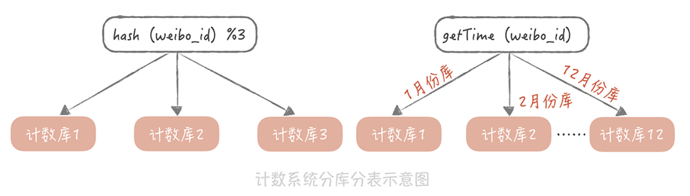
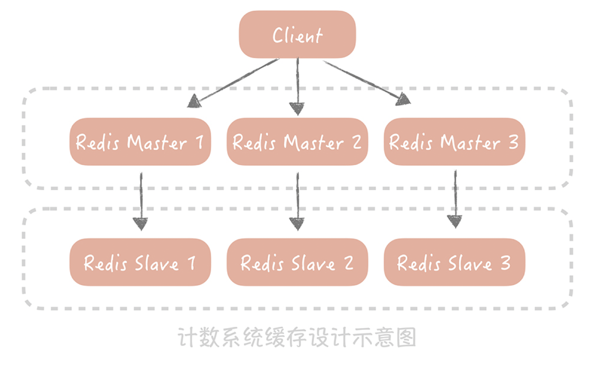
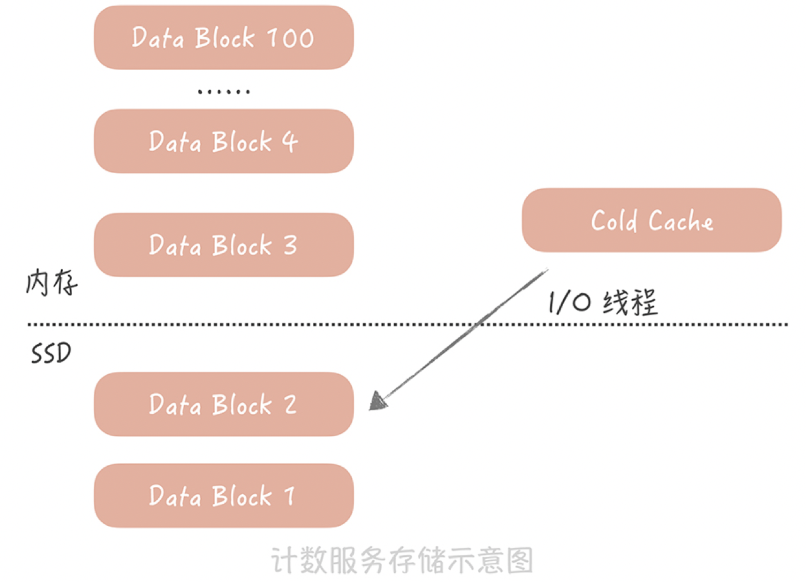

# 海量数据的计数器要如何设计

:::info
<font style="color:rgb(51, 51, 51);">刷微博、点赞热搜，如果有抽奖活动，再转发一波，其实就是微博场景下的计数数据，细说起来，它主要有几类：</font>

+ <font style="color:rgb(51, 51, 51);">微博的评论数、点赞数、转发数、浏览数、表态数等等；</font>
+ <font style="color:rgb(51, 51, 51);">用户的粉丝数、关注数、发布微博数、私信数等等。</font>

:::


<font style="color:rgb(51, 51, 51);">微博维度的计数代表了这条微博受欢迎的程度，用户维度的数据（尤其是粉丝数），代表了这个用户的影响力，因此大家会普遍看重这些计数信息。并且在很多场景下都需要查询计数数据（比如首页信息流页面、个人主页面），计数数据访问量巨大，所以需要设计计数系统维护它。</font>

<font style="color:rgb(51, 51, 51);">但在设计计数系统时，不少人会出现性能不高、存储成本很大的问题，比如，把计数与微博数据存储在一起，这样每次更新计数的时候都需要锁住这一行记录，降低了写入的并发。</font>

## <font style="color:rgb(255, 0, 0);">计数在业务上的特点</font>
+ <font style="color:rgb(51, 51, 51);">数据量巨大。微博系统中微博条目的数量早已经超过了千亿级别，仅仅计算微博的转发、评论、点赞、浏览等核心计数，其数据量级就已经在几千亿的级别。更何况微博条目的数量还在不断高速地增长，并且随着微博业务越来越复杂，微博维度的计数种类也可能会持续扩展（比如说增加了表态数），因此，仅仅是微博维度上的计数量级就已经过了万亿级别。除此之外，微博的用户量级已经超过了10亿，用户维度的计数量级相比微博维度来说虽然相差很大，但是也达到了百亿级别。那么如何存储这些过万亿级别的数字，对我们来说就是一大挑战。</font>
+ <font style="color:rgb(51, 51, 51);">访问量大，对于性能的要求高。微博的日活用户超过2亿，月活用户接近5亿，核心服务（比如首页信息流）访问量级到达每秒几十万次，计数系统的访问量级也超过了每秒百万级别，而且在性能方面，它要求要毫秒级别返回结果。</font>
+ <font style="color:rgb(51, 51, 51);">最后，对于可用性、数字的准确性要求高。一般来讲，用户对于计数数字是非常敏感的，比如你直播了好几个月，才涨了1000个粉，突然有一天粉丝数少了几百个，那么你是不是会琢磨哪里出现问题，或者打电话投诉直播平台？</font>

## <font style="color:rgb(255, 0, 0);">支撑高并发的计数系统要如何设计</font>
<font style="color:rgb(51, 51, 51);">刚开始设计计数系统的时候，假如要存储微博维度（微博的计数，转发数、赞数等等）的数据，可以这么设计表结构：以微博ID为主键，转发数、评论数、点赞数和浏览数分别为单独一列，这样在获取计数时用一个SQL语句就搞定了。</font>

<font style="color:rgb(0, 0, 0);background-color:rgb(245, 245, 245);">select repost_count, comment_count, praise_count, view_count from t_weibo_count where weibo_id = ?</font>

<font style="color:rgb(51, 51, 51);">后来，随着微博的不断壮大，之前的计数系统面临了很多的问题和挑战。</font><font style="color:rgb(51, 51, 51);">  
</font><font style="color:rgb(51, 51, 51);">比如微博用户量和发布的微博量增加迅猛，计数存储数据量级也飞速增长，而MySQL数据库单表的存储量级达到几千万的时候，性能上就会有损耗。所以考虑使用分库分表的方式分散数据量，提升读取计数的性能。</font>

<font style="color:rgb(51, 51, 51);">用“weibo_id”作为分区键，在选择分库分表的方式时，考虑了下面两种：</font>

+ <font style="color:rgb(51, 51, 51);">一种方式是选择一种哈希算法对weibo_id计算哈希值，然后依据这个哈希值计算出需要存储到哪一个库哪一张表中，具体的方式你可以回顾一下第9讲数据库分库分表的内容；</font>
+ <font style="color:rgb(51, 51, 51);">另一种方式是按照weibo_id生成的时间来做分库分表，ID的生成最好带有业务意义的字段，比如生成ID的时间戳。所以在分库分表的时候，可以先依据发号器的算法反解出时间戳，然后按照时间戳来做分库分表，比如，一天一张表或者一个月一张表等等。</font>

<font style="color:rgb(51, 51, 51);"></font>



<font style="color:rgb(51, 51, 51);"></font>

<font style="color:rgb(51, 51, 51);"></font>

<font style="color:rgb(51, 51, 51);">与此同时，计数的访问量级也有质的飞越。在微博最初的版本中，首页信息流里面是不展示计数数据的，那么使用MySQL也可以承受当时读取计数的访问量。但是后来在首页信息流中也要展示转发、评论和点赞等计数数据了。而信息流的访问量巨大，仅仅靠数据库已经完全不能承担如此高的并发量了。于是考虑使用Redis来加速读请求，通过部署多个从节点来提升可用性和性能，并且通过Hash的方式对数据做分片，也基本上可以保证计数的读取性能。然而，这种数据库+缓存的方式有一个弊端：无法保证数据的一致性，比如，如果数据库写入成功而缓存更新失败，就会导致数据的不一致，影响计数的准确性。所以完全抛弃了MySQL，全面使用Redis来作为计数的存储组件。</font>



<font style="color:rgb(51, 51, 51);"></font>

<font style="color:rgb(51, 51, 51);"></font>

<font style="color:rgb(51, 51, 51);">除了考虑计数的读取性能之外，由于热门微博的计数变化频率相当高，也需要考虑如何提升计数的写入性能。比如，每次在转发一条微博的时候，都需要增加这条微博的转发数，那么如果明星发布结婚、离婚的微博，瞬时就可能会产生几万甚至几十万的转发。如果是你的话，要如何降低写压力呢？</font><font style="color:rgb(51, 51, 51);">  
</font><font style="color:rgb(51, 51, 51);">可能已经想到用消息队列来削峰填谷了，也就是说，我们在转发微博的时候向消息队列写入一条消息，然后在消息处理程序中给这条微博的转发计数加1。这里需要注意的一点， 可以通过批量处理消息的方式进一步减小Redis的写压力，比如像下面这样连续更改三次转发数（用SQL来表示来方便你理解）：</font>

```java
UPDATE t_weibo_count SET repost_count = repost_count + 1 WHERE weibo_id = 1; 
UPDATE t_weibo_count SET repost_count = repost_count + 1 WHERE weibo_id = 1;  
UPDATE  t_weibo_count SET repost_count = repost_count +1 WHERE weibo_id = 1;
```

<font style="color:rgb(51, 51, 51);">这个时候，可以把它们合并成一次更新：</font>

<font style="color:rgb(0, 0, 0);background-color:rgb(245, 245, 245);">UPDATE t_weibo_count SET repost_count = repost_count + 3 WHERE weibo_id = 1; </font>

## <font style="color:rgb(255, 0, 0);">如何降低计数系统的存储成本</font>
<font style="color:rgb(0, 0, 0);">Redis是使用内存来存储信息，相比于使用磁盘存储数据的MySQL来说，存储的成本不可同日而语，比如一台服务器磁盘可以挂载到2个T，但是内存可能只有128G，这样磁盘的存储空间就是内存的16倍。而Redis基于通用性的考虑，对于内存的使用比较粗放，存在大量的指针以及额外数据结构的开销，如果要存储一个KV类型的计数信息，Key是8字节Long类型的weibo_id，Value是4字节int类型的转发数，存储在Redis中之后会占用超过70个字节的空间，空间的浪费是巨大的。</font>

<font style="color:rgb(51, 51, 51);">对原生Redis做一些改造，采用新的数据结构和数据类型来存储计数数据。</font>

1. <font style="color:rgb(51, 51, 51);">一是原生的Redis在存储Key时是按照字符串类型来存储的，比如一个8字节的Long类型的数据，需要8（sdshdr数据结构长度）+ 19（8字节数字的长度）+1（’\0’）=28个字节，如果我们使用Long类型来存储就只需要8个字节，会节省20个字节的空间；</font>
2. <font style="color:rgb(51, 51, 51);">二是去除了原生Redis中多余的指针，如果要存储一个KV信息就只需要8（weibo_id）+4（转发数）=12个字节，相比之前有很大的改进。</font>

<font style="color:rgb(51, 51, 51);">同时使用一个大的数组来存储计数信息，存储的位置是基于weibo_id的哈希值来计算出来的，具体的算法像下面展示的这样：</font>


```java
插入时:
h1 = hash1(weibo_id) //根据微博ID计算Hash
h2 = hash2(weibo_id) //根据微博ID计算另一个Hash，用以解决前一个Hash算法带来的冲突
for s in 0,1000
   pos = (h1 + h2*s) % tsize //如果发生冲突，就多算几次Hash2
     if(isempty(pos) || isdelete(pos))
         t[ pos ] = item  //写入数组


查询时:
for s in 0,1000
   pos = (h1 + h2*s) % tsize  //依照插入数据时候的逻辑，计算出存储在数组中的位置
      if(!isempty(pos) && t[pos]==weibo_id)
         return t[pos]
return 0 


删除时:
insert(FFFF) //插入一个特殊的标
```


<font style="color:rgb(51, 51, 51);">微博的计数有转发数、评论数、浏览数、点赞数等等，如果每一个计数都需要存储weibo_id，那么总共就需要8（weibo_id）*4（4个微博ID）+4（转发数） + 4（评论数） + 4（点赞数） + 4（浏览数）= 48字节。可以把相同微博ID的计数存储在一起，这样就只需要记录一个微博ID，省掉了多余的三个微博ID的存储开销，存储空间就进一步减少了。</font>

<font style="color:rgb(51, 51, 51);">微博计数的数据具有明显的热点属性：越是最近的微博越是会被访问到，时间上久远的微博被访问的几率很小。所以为了尽量减少服务器的使用，我们考虑给计数服务增加SSD磁盘，然后将时间上比较久远的数据dump到磁盘上，内存中只保留最近的数据。当我们要读取冷数据的时候，使用单独的I/O线程异步地将冷数据从SSD磁盘中加载到一块儿单独的Cold Cache中。</font>

<font style="color:rgb(51, 51, 51);"></font>



<font style="color:rgb(51, 51, 51);"></font>

<font style="color:rgb(255, 0, 0);">总结：</font><font style="color:rgb(51, 51, 51);">  
</font><font style="color:rgb(51, 51, 51);">1、一开始用mysql进行计数，后来加入了主从架构，分库分表架构。  
</font><font style="color:rgb(51, 51, 51);">2、因为计数访问量太大了，加入了缓存，但是这个会造成相应的那个缓存和数据库数据不一致，如果要保证一性的话，就需要采用内存队列，对于同一个id的数量只能用单线程进行处理，这个会造成性能问题。  
</font><font style="color:rgb(51, 51, 51);">3、后来直接抛弃了mysql，直接用redis cluster来支持计数服务,因为redis通过rdb和aof来支持持久化，可以通过设置保证至少有一台从redis机器同步了数据，从redis来做相应的那个持久化操作达到数据不丢失，因为原生的redis数据结构会占用比较多的字节，这里直接进行改造，让redis的数据结构占用内存加少。  
</font><font style="color:rgb(51, 51, 51);">4、但是redis是全内存的，随着量越来越大肯定没法支持了，这里进行改造，引入ssd，支持把冷数据放到ssd中，热数据在内存中，当要访问冷数据时利用一个线程异步把冷数据加载到一个cold cache里面去。这个有很多开源的实现，如Pika，SSDB用ssd来替代内存存储冷数据。</font>


> 更新: 2024-08-27 15:07:03  
> 原文: <https://www.yuque.com/tulingzhouyu/db22bv/br561cfm11x25p0n>