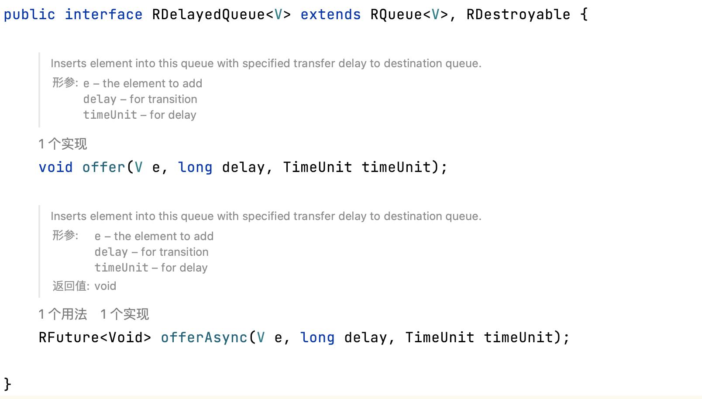

# 电商平台中订单未支付过期如何实现自动关单

:::info
<font style="color:rgb(34, 34, 34);">我们在电商平台购物时，下单之后会有一个付款倒计时，如果在规定的时间内未付款，订单就会自动关闭。</font>

<font style="color:rgb(34, 34, 34);">类似这样的场景还有很多，比如优惠劵到期失效，下单后自动发消息等。</font>

<font style="color:rgb(34, 34, 34);">今天我们来讨论一下，要实现诸如此类的功能，都有哪些技术方案，这些方案的优缺点是什么。需要说明的是，以下这些方案每一种都有其适用场景，并无绝对优劣之分。</font>

:::

### <font style="color:rgb(34, 34, 34);">1，定时任务</font>
<font style="color:rgb(34, 34, 34);">通过定时任务关闭订单，是一种成本很低，实现也很容易的方案。通过简单的几行代码，写一个定时任务，定期扫描数据库中的订单，如果时间过期，就将其状态更新为关闭即可。</font>


**<font style="color:rgb(34, 34, 34);">优点：实现容易，成本低，基本不依赖其他组件。</font>**

**<font style="color:rgb(34, 34, 34);">缺点：</font>**

1. **<font style="color:rgb(34, 34, 34);">时间可能不够精确</font>**<font style="color:rgb(34, 34, 34);">。由于定时任务扫描的间隔是固定的，所以可能造成一些订单已经过期了一段时间才被扫描到，订单关闭的时间比正常时间晚一些。</font>
2. **<font style="color:rgb(34, 34, 34);">增加了数据库的压力</font>**<font style="color:rgb(34, 34, 34);">。随着订单的数量越来越多，扫描的成本也会越来越大，执行时间也会被拉长，可能导致某些应该被关闭的订单迟迟没有被关闭。</font>

**<font style="color:rgb(34, 34, 34);">总结</font>**<font style="color:rgb(34, 34, 34);">：</font>**<font style="color:rgb(255, 94, 94);">采用定时任务的方案比较适合对时间要求不是很敏感，并且数据量不太多的业务场景。</font>**

### 
### <font style="color:rgb(34, 34, 34);">2，RocketMQ延迟消息</font>
<font style="color:rgb(34, 34, 34);">延迟消息，当消息写入到Broker后，不会立刻被消费者消费，需要等待指定的时长后才可被消费处理的消息，称为延时消息。</font>

<font style="color:rgb(34, 34, 34);">在订单创建之后，我们就可以把订单作为一条消息投递到rocketmq，并将延迟时间设置为30分钟，这样，30分钟后我们定义的consumer就可以消费到这条消息，然后检查用户是否支付了这个订单。</font>

<font style="color:rgb(34, 34, 34);">通过延迟消息，我们就可以将业务解耦，极大地简化我们的代码逻辑。</font>

**<font style="color:rgb(34, 34, 34);">优点：可以使代码逻辑清晰，系统之间完全解耦，只需关注生产及消费消息即可。另外其吞吐量极高，最多可以支撑万亿级的数据量。</font>**

**<font style="color:rgb(34, 34, 34);">缺点：相对来说mq是重量级的组件，引入mq之后，随之而来的消息丢失、幂等性问题等都加深了系统的复杂度。</font>**

**<font style="color:rgb(255, 94, 94);">总结：通过mq进行系统业务解耦，以及对系统性能削峰填谷已经是当前高性能系统的标配。</font>**

**<font style="color:rgb(255, 94, 94);"></font>**

### <font style="color:rgb(34, 34, 34);">3，RabbitMQ死信队列</font>
<font style="color:rgb(34, 34, 34);">除了RocketMQ的延迟队列，RabbitMQ的死信队列也可以实现消息延迟功能。</font>

<font style="color:rgb(34, 34, 34);">当RabbitMQ中的一条正常消息，因为过了存活时间（TTL过期）、队列长度超限、被消费者拒绝等原因无法被消费时，就会被当成一条死信消息，投递到死信队列。</font>

<font style="color:rgb(34, 34, 34);">基于这样的机制，我们可以给消息设置一个ttl，然后故意不消费消息，等消息过期就会进入死信队列，我们再消费死信队列即可。</font>

<font style="color:rgb(34, 34, 34);">通过这样的方式，就可以达到同RocketMQ延迟消息一样的效果。</font>

**<font style="color:rgb(34, 34, 34);">优点：同RocketMQ一样，RabbitMQ同样可以使业务解耦，基于其集群的扩展性，也可以实现高可用、高性能的目标</font>**<font style="color:rgb(34, 34, 34);">。</font>

**<font style="color:rgb(34, 34, 34);">缺点：死信队列本质还是一个队列，队列都是先进先出，如果队头的消息过期时间比较长，就会导致后面过期的消息无法得到及时消费，造成消息阻塞。</font>**

**<font style="color:rgb(255, 94, 94);">总结：除了增加系统复杂度之外，死信队列的阻塞问题也是需要我们重点关注的。</font>**

**<font style="color:rgb(255, 94, 94);"></font>**

### <font style="color:rgb(34, 34, 34);">4，redis过期监听</font>
<font style="color:rgb(34, 34, 34);">redis是一个高性能的KV数据库，除了用作缓存以外，其实还提供了过期监听的功能。</font>

<font style="color:rgb(34, 34, 34);">在redis.conf中，配置</font><font style="color:rgb(34, 34, 34);">notify-keyspace-events Ex即可开启此功能。</font>

<font style="color:rgb(34, 34, 34);">然后在代码中继承KeyspaceEventMessageListener，实现onMessage就可以监听过期的数据量。</font>

```shell
public abstract class KeyspaceEventMessageListener implements MessageListener,
        InitializingBean, DisposableBean {
    private static final Topic TOPIC_ALL_KEYEVENTS = new PatternTopic("__keyevent@*");

    //...省略部分代码
    public void init() {
        if (StringUtils.hasText(keyspaceNotificationsConfigParameter)) {
            RedisConnection connection =
                    listenerContainer.getConnectionFactory().getConnection();
            try {
                Properties config = connection.getConfig("notify-keyspace-events");
                if (!StringUtils.hasText(config.getProperty("notify-keyspace-events"))) {
                    connection.setConfig("notify-keyspace-events",
                            keyspaceNotificationsConfigParameter);
                }
            } finally {
                connection.close();
            }

        }
        doRegister(listenerContainer);
    }
    
    protected void doRegister(RedisMessageListenerContainer container) {
        listenerContainer.addMessageListener(this, TOPIC_ALL_KEYEVENTS);
    }

    //...省略部分代码
    @Override
    public void afterPropertiesSet() throws Exception {

        init();
    }
}
```

<font style="color:rgb(34, 34, 34);">通过源码，我们可以发现，其本质也是注册一个listener，利用redis的发布订阅，当key过期时，</font><font style="color:rgb(0, 0, 0);">发布过期消息（key）到Channel ：__keyevent@*__:expired中。</font>

<font style="color:rgb(34, 34, 34);">在实际的业务中，我们可以将订单的过期时间设置比如30分钟，然后放入到redis。30分钟之后，就可以消费这个key，然后做一些业务上的后置动作，比如检查用户是否支付。</font>

**<font style="color:rgb(34, 34, 34);">优点：</font>**<font style="color:rgb(34, 34, 34);">由于redis的高性能，所以我们</font>**<font style="color:rgb(34, 34, 34);">在设置key，或者消费key时，速度上是可以保证的。</font>**

**<font style="color:rgb(34, 34, 34);">缺点：由于redis的key过期策略原因，当一个key过期时，redis无法保证立刻将其删除，自然我们的监听事件也无法第一时间消费到这个key，所以会存在一定的延迟</font>**<font style="color:rgb(34, 34, 34);">。另外，在redis5.0之前，订阅发布中的消息并没有被持久化，自然也没有所谓的确认机制。所以一旦消费消息的过程中我们的客户端发生了宕机，这条消息就彻底丢失了。</font>

**<font style="color:rgb(255, 94, 94);">总结：redis的过期订阅相比于其他方案没有太大的优势</font>**<font style="color:rgb(34, 34, 34);">，在实际生产环境中，用得相对较少。</font>

<font style="color:rgb(34, 34, 34);"></font>

### <font style="color:rgb(34, 34, 34);">5，JDK延迟队列DelayQueue</font>


<font style="color:rgb(34, 34, 34);">DelayQueue是JDK提供的一个无界队列，我们可以看到，DelayQueue队列中的元素需要实现Delayed，它只提供了一个方法，就是获取过期时间。</font>


<font style="color:rgb(34, 34, 34);">用户的订单生成以后，设置过期时间比如30分钟，放入定义好的DelayQueue，然后创建一个线程，在线程中通过while(true)不断的从DelayQueue中获取过期的数据。</font>

**<font style="color:rgb(34, 34, 34);">优点：不依赖任何第三方组件，连数据库也不需要了，实现起来也方便。</font>**

**<font style="color:rgb(34, 34, 34);">缺点：</font>**

1. <font style="color:rgb(34, 34, 34);">因为DelayQueue是一个无界队列，如果放入的订单过多，会造成JVM OOM。</font>
2. <font style="color:rgb(34, 34, 34);">DelayQueue基于JVM内存，如果JVM重启了，那所有数据就丢失了。</font>

**<font style="color:rgb(34, 34, 34);">总结</font>**<font style="color:rgb(34, 34, 34);">：</font>**<font style="color:rgb(255, 94, 94);">DelayQueue适用于数据量较小，且丢失也不影响主业务的场景</font>**<font style="color:rgb(34, 34, 34);">，比如内部系统的一些非重要通知，就算丢失，也不会有太大影响。</font>

<font style="color:rgb(34, 34, 34);"></font>

### <font style="color:rgb(34, 34, 34);">6，Redisson分布式延迟队列RDelayedQueue</font>
<font style="color:rgb(34, 34, 34);">Redisson是一个基于redis实现的Java 驻内存数据网格，</font><font style="color:rgb(34, 34, 34);">它不仅提供了一系列的分布式的Java常用对象，还提供了许多分布式服务。</font>

<font style="color:rgb(34, 34, 34);">Redisson除了提供我们常用的分布式锁外，还提供了一个</font><font style="color:rgb(34, 34, 34);">分布式延迟队列RDelayedQueue，他是一种基于zset结构实现的延迟队列，其实现类是</font><font style="color:rgb(34, 34, 34);">RedissonDelayedQueue。</font>



**<font style="color:rgb(34, 34, 34);">优点：使用简单，并且其实现类中大量使用lua脚本保证其原子性，不会有并发重复问题。</font>**

**<font style="color:rgb(34, 34, 34);">缺点：需要依赖redis（如果这算一种缺点的话）。</font>**

**<font style="color:rgb(255, 94, 94);">总结：Redisson是redis官方推荐的JAVA客户端，提供了很多常用的功能，使用简单、高效，推荐大家尝试使用。</font>**

### <font style="color:rgb(34, 34, 34);">最后</font>
<font style="color:rgb(34, 34, 34);">本文介绍了常见的6种实现订单关闭的方案，不同的方案都有其适用的场景，各自的优缺点也不尽相同，大家可以根据自己的业务场景，选择合适的方案。</font>


> 更新: 2025-01-25 21:38:53  
> 原文: <https://www.yuque.com/tulingzhouyu/db22bv/xiyx85s3fkxqhd4y>