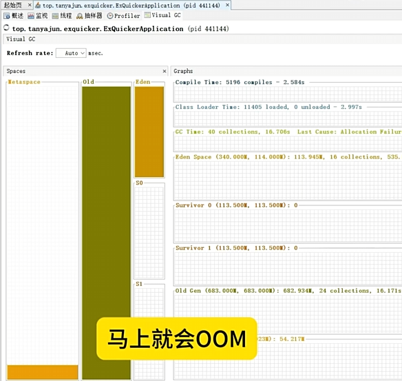

# 百万级数据导出 Excel怎么性能优化，避免OOM

在导出时，如果一次性导出百万数据是非常慢的， 甚至可能会OOM，所以需要注意内存占用情况，避免内存溢出。可以通过适当调整 JVM 内存参数和多线程分批导出来解决。具体实现步骤如下：


1、调整 JVM 内存参数：可以通过设置 JVM 内存参数 -Xms 和 -Xmx 来调整 JVM 内存大小。


2、使用多线程分批次导出：将数据分成多个批次导出，每次导出一部分数据，避免一次性导出过多数据导致内存溢出，可以显著提高导出效率。


如何使用 Java 多线程来导出 Excel 文件：

代码地址：[https://gitee.com/xscodeit/xushu_springboot_demos/tree/master/ex-quicker](https://gitee.com/xscodeit/xushu_springboot_demos/tree/master/ex-quicker)


1. 项目结构

在 Java 项目中，我们需要引入 Apache POI 库来操作 Excel 文件。首先，在 Maven 项目中，您需要在 pom.xml 文件中添加以下依赖：


```xml
<dependency>
  <groupId>org.apache.poi</groupId>
  <artifactId>poi</artifactId>
  <version>5.2.3</version>
</dependency>
<dependency>
  <groupId>org.apache.poi</groupId>
  <artifactId>poi-ooxml</artifactId>
  <version>5.2.3</version>
</dependency>
```

 

2. 设计类图

我们需要设计一个简单的类图来表示 Excel 导出模块的结构。以下是一个基本的类图：

 

在这个类图中，我们有三个主要类：ExcelExporter 用于处理 Excel 的导出逻辑，Data 是我们要导出的数据模型，ExportTask 是一个实现了 Runnable 接口的任务，用于多线程导出。


3. 编写代码

以下是实现这些类的代码示例：


3.1. Data 类

```java
public class Data {
    private String name;
    private int age;
    private String email;

    public Data(String name, int age, String email) {
        this.name = name;
        this.age = age;
        this.email = email;
    }

    // Getters and Setters
}
```

 

3.2. ExcelExporter 类

```java
import org.apache.poi.ss.usermodel.*;
import org.apache.poi.xssf.usermodel.XSSFWorkbook;
import java.io.FileOutputStream;
import java.io.IOException;
import java.util.List;

public class ExcelExporter {
    
    public void export(String filePath, List<Data> dataList) {
        Workbook workbook = new XSSFWorkbook();
        Sheet sheet = workbook.createSheet("Data");
        
        // 创建表头
        Row headerRow = sheet.createRow(0);
        headerRow.createCell(0).setCellValue("Name");
        headerRow.createCell(1).setCellValue("Age");
        headerRow.createCell(2).setCellValue("Email");
        
        // 填充数据
        int rowNum = 1;
        for (Data data : dataList) {
            Row row = sheet.createRow(rowNum++);
            row.createCell(0).setCellValue(data.getName());
            row.createCell(1).setCellValue(data.getAge());
            row.createCell(2).setCellValue(data.getEmail());
        }
        
        // 写入文件
        try (FileOutputStream fileOut = new FileOutputStream(filePath)) {
            workbook.write(fileOut);
        } catch (IOException e) {
            e.printStackTrace();
        } finally {
            try {
                workbook.close();
            } catch (IOException e) {
                e.printStackTrace();
            }
        }
    }
}
```

 

3.3. ExportTask 类

```java
import java.util.List;

public class ExportTask implements Runnable {
    private ExcelExporter exporter;
    private List<Data> dataBatch;
    private String filePath;

    public ExportTask(ExcelExporter exporter, List<Data> dataBatch, String filePath) {
        this.exporter = exporter;
        this.dataBatch = dataBatch;
        this.filePath = filePath;
    }

    @Override
    public void run() {
        exporter.export(filePath, dataBatch);
    }
}
```

1.

2.

 

4. 主程序

最后，我们需要一个主程序来启动多线程导出：

```java

import java.util.Arrays;
import java.util.List;
import java.util.concurrent.ExecutorService;
import java.util.concurrent.Executors;

public class Main {
    public static void main(String[] args) {
        List<Data> dataList = Arrays.asList(
                new Data("Alice", 30, "alice@example.com"),
                new Data("Bob", 25, "bob@example.com"),
                new Data("Charlie", 35, "charlie@example.com")
                // ... 其他数据
        );

        ExcelExporter exporter = new ExcelExporter();
        ExecutorService executorService = Executors.newFixedThreadPool(2); // 使用两个线程

        executorService.submit(new ExportTask(exporter, dataList, "output.xlsx"));
        executorService.shutdown();
    }
}
```

 

5. 总结

通过上述示例，我们实现了一个简单的多线程导出 Excel 文件的功能。使用多线程可以大幅提升性能，尤其是在处理大量数据时。希望本文对您理解 Java 多线程导出 Excel 的概念和实现方法有所帮助。

 


> 更新: 2025-01-08 22:10:30  
> 原文: <https://www.yuque.com/tulingzhouyu/db22bv/gogkqpk8r8gsl7rb>