# 石墨文档百万级长连接技术实践

**本次分享内容**

1. 网关1.0架构痛点
2. 网关2.0架构优化
3. 性能压测
4. 总结

# <font style="color:rgb(51, 51, 51);">1 引言</font>
<font style="color:rgb(51, 51, 51);">在石墨文档的部分业务中，例如文档分享、评论、幻灯片演示和文档表格跟随等场景，涉及到多客户端数据同步和服务端批量数据推送的需求，一般的 HTTP 协议无法满足服务端主动 Push 数据的场景，因此选择采用 WebSocket 方案进行业务开发。</font>

<font style="color:rgb(51, 51, 51);">随着石墨文档业务发展，目前日连接峰值已达百万量级，日益增长的用户连接数和不符合目前量级的架构设计导致了内存和 CPU 使用量急剧增长，因此我们考虑对网关进行重构。</font>

# <font style="color:rgb(51, 51, 51);">2 网关 1.0</font>
<font style="color:rgb(51, 51, 51);">网关 1.0 是使用 Node.js 基于 Socket.IO 进行修改开发的版本，很好的满足了当时用户量级下的业务场景需求。</font>

## <font style="color:rgb(51, 51, 51);">2.1 架构</font>
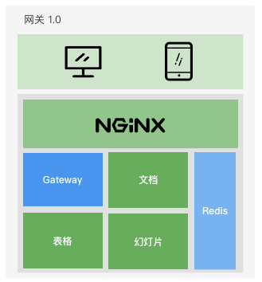

**<font style="color:rgb(51, 51, 51);">网关 1.0 版本架构设计图</font>**

<font style="color:rgb(51, 51, 51);">网关 1.0 客户端连接流程：</font>

1. <font style="color:rgb(51, 51, 51);">用户通过 NGINX 连接网关，该操作被业务服务感知；</font>
2. <font style="color:rgb(51, 51, 51);">业务服务感知到用户连接后，会进行相关用户数据查询，再将消息 Pub 到 Redis；</font>
3. <font style="color:rgb(51, 51, 51);">网关服务通过 Redis Sub 收到消息；</font>
4. <font style="color:rgb(51, 51, 51);">查询网关集群中的用户会话数据，向客户端进行消息推送。</font>

## <font style="color:rgb(51, 51, 51);">2.2 痛点</font>
<font style="color:rgb(51, 51, 51);">虽然 1.0 版本的网关在线上运行良好，但是不能很好的支持后续业务的扩展，并且有以下几个问题需要解决：</font>

+ <font style="color:#DF2A3F;">资源消耗</font><font style="color:rgb(51, 51, 51);">：Nginx 仅使用 TLS 解密，请求透传，产生了大量的资源浪费，同时之前的 Node 网关性能不好，消耗大量的 CPU、内存。</font>
+ <font style="color:#DF2A3F;">维护与观测</font><font style="color:rgb(51, 51, 51);">：未接入石墨的监控体系，无法和现有监控告警联通，维护上存在一定的困难；</font>
+ <font style="color:#DF2A3F;">业务耦合问题</font><font style="color:rgb(51, 51, 51);">：业务服务与网关功能被集成到了同一个服务中，无法针对业务部分性能损耗进行针对性水平扩容，为了解决性能问题，以及后续的模块扩展能力，都需要进行服务解耦。</font>

# <font style="color:rgb(51, 51, 51);">3 网关 2.0</font>
<font style="color:rgb(51, 51, 51);">网关 2.0 需要解决很多问题：石墨文档内部有很多组件：文档、表格、幻灯片和表单等等。在 1.0 版本中组件对网关的业务调用可以通过：Redis、Kafka 和 HTTP 接口，来源不可查，管控困难。</font>

<font style="color:rgb(51, 51, 51);">此外，从性能优化的角度考虑也需要对原有服务进行解耦合，将 1.0 版本网关拆分为网关功能部分和业务处理部分，网关功能部分为 WS-Gateway：集成用户鉴权、TLS 证书验证和 WebSocket 连接管理等；业务处理部分为 WS-API：组件服务直接与该服务进行 gRPC 通信。可针对具体的模块进行针对性扩容；服务重构加上 Nginx 移除，整体硬件消耗显著降低；服务整合到石墨监控体系。</font>

## <font style="color:rgb(51, 51, 51);">3.1 整体架构</font>
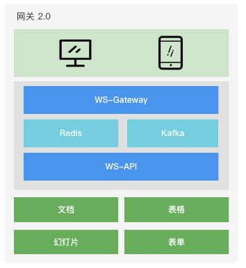

**<font style="color:rgb(51, 51, 51);">网关 2.0 版本架构设计图</font>**

<font style="color:rgb(51, 51, 51);">网关 2.0 客户端连接流程：</font>

1. <font style="color:rgb(51, 51, 51);">客户端与 WS-Gateway 服务通过握手流程建立 WebSocket 连接；</font>
2. <font style="color:rgb(51, 51, 51);">连接建立成功后，WS-Gateway 服务将会话进行节点存储，将连接信息映射关系缓存到 Redis 中，并通过 Kafka 向 WS-API 推送客户端上线消息；</font>
3. <font style="color:rgb(51, 51, 51);">WS-API 通过 Kafka 接收客户端上线消息及客户端上行消息；</font>
4. <font style="color:rgb(51, 51, 51);">WS-API 服务预处理及组装消息，包括从 Redis 获取消息推送的必要数据，并进行完成消息推送的过滤逻辑，然后 Pub 消息到 Kafka；</font>
5. <font style="color:rgb(51, 51, 51);">WS-Gateway 通过 Sub Kafka 来获取服务端需要返回的消息，逐个推送消息至客户端。</font>

## <font style="color:rgb(51, 51, 51);">3.2 握手流程</font>
<font style="color:rgb(51, 51, 51);">网络状态良好的情况下，完成如下图所示步骤 1 到步骤 6 之后，直接进入 WebSocket 流程；网络环境较差的情况下，WebSocket 的通信模式会退化成 HTTP 方式，客户端通过 POST 方式推送消息到服务端，再通过 GET 长轮询的方式从读取服务端返回数据。客户端初次请求服务端连接建立的握手流程：</font>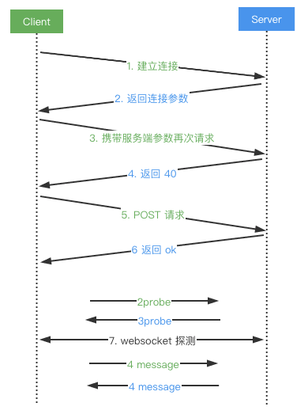

1. <font style="color:rgb(51, 51, 51);">Client 发送 GET 请求尝试建立连接；</font>
2. <font style="color:rgb(51, 51, 51);">Server 返回相关连接数据，sid 为本次连接产生的唯一 Socket ID，后续交互作为凭证；</font>

<font style="color:rgb(119, 119, 119);">{"sid":"xxx","upgrades":["websocket"],"pingInterval":xxx,"pingTimeout":xxx}</font>

1. <font style="color:rgb(51, 51, 51);">Client 携带步骤 2 中的 sid 参数再次请求；</font>
2. <font style="color:rgb(51, 51, 51);">Server 返回 40，表示请求接收成功；</font>
3. <font style="color:rgb(51, 51, 51);">Client 发送 POST 请求确认后期降级通路情况；</font>
4. <font style="color:rgb(51, 51, 51);">Server 返回 ok，此时第一阶段握手流程完成；</font>
5. <font style="color:rgb(51, 51, 51);">尝试发起 WebSocket 连接，首先进行 2probe 和 3probe 的请求响应，确认通信通道畅通后，即可进行正常的 WebSocket 通信。</font>

## <font style="color:rgb(51, 51, 51);">3.3 TLS 内存消耗优化</font>
<font style="color:rgb(51, 51, 51);">客户端与服务端连接建立采用的 wss 协议，在 1.0 版本中 TLS 证书挂载在 Nginx 上，HTTPS 握手过程由 Nginx 完成，为了降低 Nginx 的机器成本，在 2.0 版本中我们将证书挂载到服务上，通过分析服务内存，如下图所示，TLS 握手过程中消耗的内存占了总内存消耗的大概 30% 左右。</font>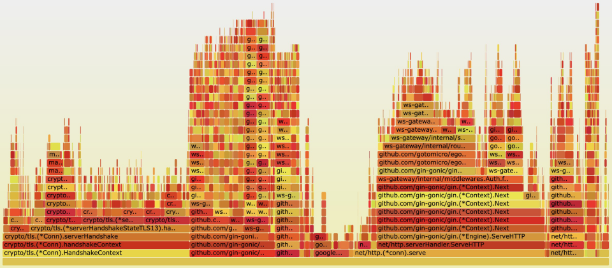

<font style="color:rgb(51, 51, 51);">这个部分的内存消耗无法避免，我们有两个选择：</font>

+ <font style="color:rgb(51, 51, 51);">采用七层负载均衡，在七层负载上进行 TLS 证书挂载，将 TLS 握手过程移交给性能更好的工具完成；</font>
+ <font style="color:rgb(51, 51, 51);">优化 Go 对 TLS 握手过程性能</font>

## <font style="color:rgb(51, 51, 51);">3.4 Socket ID 设计</font>
<font style="color:rgb(51, 51, 51);">对每次连接必须产生一个唯一码，如果出现重复会导致串号，消息混乱推送的问题。选择 SnowFlake 算法作为唯一码生成算法。</font>

<font style="color:rgb(51, 51, 51);">物理机场景中，对副本所在物理机进行固定编号，即可保证每个副本上的服务产生的 Socket ID 是唯一值。</font>

<font style="color:rgb(51, 51, 51);">K8S 场景中，这种方案不可行，于是采用注册下发的方式返回编号，WS-Gateway 所有副本启动后向数据库写入服务的启动信息，获取副本编号，以此作为参数作为 SnowFlake 算法的副本编号进行 Socket ID 生产，服务重启会继承之前已有的副本编号，有新版本下发时会根据自增 ID 下发新的副本编号。于此同时，Ws-Gateway 副本会向数据库写入心跳信息，以此作为网关服务本身的健康检查依据。</font>

## <font style="color:rgb(51, 51, 51);">3.5 集群会话管理方案：事件广播</font>
<font style="color:rgb(51, 51, 51);">客户端完成握手流程后，会话数据在当前网关节点内存存储，部分可序列化数据存储到 Redis，存储结构说明如下：</font>

| **<font style="color:rgb(51, 51, 51);">键</font>** | **<font style="color:rgb(51, 51, 51);">说明</font>** |
| :--- | :--- |
| <font style="color:rgb(51, 51, 51);">ws:user:clients:${uid}</font> | <font style="color:rgb(51, 51, 51);">存储用户和 WebSocket 连接的关系，采用有序集合方式存储</font> |
| <font style="color:rgb(51, 51, 51);">ws:guid:clients:${guid}</font> | <font style="color:rgb(51, 51, 51);">存储文件和 WebSocket 连接的关系，采用有序结合方式存储</font> |
| <font style="color:rgb(51, 51, 51);">ws:client:${socket.id}</font> | <font style="color:rgb(51, 51, 51);">存储当前 WebSocket 连接下的全部用户和文件关系数据，采用 Redis Hash 方式进行存储，对应 key 为 user 和 guid</font> |


<font style="color:rgb(51, 51, 51);">由客户端触发或组件服务触发的消息推送，通过 Redis 存储的数据结构，在 WS-API 服务查询到返回消息体的目标客户端的 Socket ID，再有 WS-Gateway 服务进行集群消费，如果 Socket ID 不在当前节点，则需要进行节点与会话关系的查询，找到客户端 Socket ID 实际对应的 WS-Gateway 节点，通常有以下两种方案：</font>

| **<font style="color:rgb(51, 51, 51);">   </font>** | **<font style="color:rgb(51, 51, 51);">优点</font>** | **<font style="color:rgb(51, 51, 51);">缺点</font>** |
| :--- | :--- | :--- |
| <font style="color:rgb(51, 51, 51);">事件广播</font> | <font style="color:rgb(51, 51, 51);">实现简单</font> | <font style="color:rgb(51, 51, 51);">消息广播数量会随着节点数量上升</font> |
| <font style="color:rgb(51, 51, 51);">注册中心</font> | <font style="color:rgb(51, 51, 51);">会话与节点映射关系清晰</font> | <font style="color:rgb(51, 51, 51);">注册中心强依赖，额外运维成本</font> |


<font style="color:rgb(51, 51, 51);">在确定使用事件广播方式进行网关节点间的消息传递后，进一步选择使用哪种具体的消息中间件，列举了三种待选的方案：</font>

| **<font style="color:rgb(51, 51, 51);">特性</font>** | **<font style="color:rgb(51, 51, 51);">Redis</font>** | **<font style="color:rgb(51, 51, 51);">Kafka</font>** | **<font style="color:rgb(51, 51, 51);">RocketMQ</font>** |
| :--- | :--- | :--- | :--- |
| <font style="color:rgb(51, 51, 51);">开发语言</font> | <font style="color:rgb(51, 51, 51);">C</font> | <font style="color:rgb(51, 51, 51);">Scala</font> | <font style="color:rgb(51, 51, 51);">Java</font> |
| <font style="color:rgb(51, 51, 51);">单机吞吐量</font> | <font style="color:rgb(51, 51, 51);">10w+</font> | <font style="color:rgb(51, 51, 51);">10w+</font> | <font style="color:rgb(51, 51, 51);">10w+</font> |
| <font style="color:rgb(51, 51, 51);">可用性</font> | <font style="color:rgb(51, 51, 51);">主从架构</font> | <font style="color:rgb(51, 51, 51);">分布式架构</font> | <font style="color:rgb(51, 51, 51);">分布式架构</font> |
| <font style="color:rgb(51, 51, 51);">特点</font> | <font style="color:rgb(51, 51, 51);">功能简单</font> | <font style="color:rgb(51, 51, 51);">吞吐量、可用性极高</font> | <font style="color:rgb(51, 51, 51);">功能丰富、定制化强，吞吐量、可用性高</font> |
| <font style="color:rgb(51, 51, 51);">功能特性</font> | <font style="color:rgb(51, 51, 51);">数据 10K 以内性能优异，功能简单，适用于简单业务场景</font> | <font style="color:rgb(51, 51, 51);">支持核心的 MQ 功能，不支持消息查询或消息回溯等功能</font> | <font style="color:rgb(51, 51, 51);">支持核心的 MQ 功能，扩展性强</font> |


<font style="color:rgb(51, 51, 51);">于是对 Redis 和其他 MQ 中间件进行 100w 次的入队和出队操作，在测试过程中发现在</font><font style="color:#DF2A3F;">数据小于 10K 时 Redis 性能表现十分优秀</font><font style="color:rgb(51, 51, 51);">，进一步结合实际情况：广播内容的数据量大小在 1K 左右，业务场景简单固定，并且要兼容历史业务逻辑，最后选择了 Redis 进行消息广播。</font>

<font style="color:rgb(51, 51, 51);">后续还可以将 WS-API 与 WS-Gateway 两两互联，使用 gRPC stream 双向流通信节省内网流量。</font>

## <font style="color:rgb(51, 51, 51);">3.6 心跳机制</font>
<font style="color:rgb(51, 51, 51);">会话在节点内存与 Redis 中存储后，客户端需要通过心跳上报持续更新会话时间戳，客户端按照服务端下发的周期进行心跳上报，上报时间戳首先在内存进行更新，然后再通过另外的周期进行 Redis 同步，避免大量客户端同时进行心跳上报对 Redis 产生压力。</font>

1. <font style="color:rgb(51, 51, 51);">客户端建立 WebSocket 连接成功后，服务端下发心跳上报参数；</font>
2. <font style="color:rgb(51, 51, 51);">客户端依据以上参数进行心跳包传输，服务端收到心跳后会更新会话时间戳；</font>
3. <font style="color:rgb(51, 51, 51);">客户端其他上行数据都会触发对应会话时间戳更新；</font>
4. <font style="color:rgb(51, 51, 51);">服务端定时清理超时会话，执行主动关闭流程；</font>
5. <font style="color:rgb(51, 51, 51);">通过 Redis 更新的时间戳数据进行 WebSocket 连接、用户和文件之间的关系进行清理。会话数据内存以及 Redis 缓存清理逻辑：</font>

```go
for {
    select {
        case <-t.C:
        var now = time.Now().Unix()
        var clients = make([]*Connection, 0)
        dispatcher.clients.Range(func(_, v interface{}) bool {
            client := v.(*Connection)
            lastTs := atomic.LoadInt64(&client.LastMessageTS)
            if now-lastTs > int64(expireTime) {
                clients = append(clients, client)
            } else {
                dispatcher.clearRedisMapping(client.Id, client.Uid, lastTs, clearTimeout)
            }
            return true
        })
        for _, cli := range clients {
            cli.WsClose()
        }
    }
}
```

<font style="color:rgb(51, 51, 51);">在已有的两级缓存刷新机制上，进一步通过动态心跳上报频率的方式降低心跳上报产生的服务端性能压力，默认场景中客户端对服务端进行间隔 1s 的心跳上报，假设目前单机承载了 50w 的连接数，当前的 QPS 为：</font><font style="color:rgb(51, 51, 51);background-color:rgb(243, 244, 244);">QPS1 = 500000/1</font>

<font style="color:rgb(51, 51, 51);">从服务端性能优化的角度考虑，实现心跳正常情况下的动态间隔，每 x 次正常心跳上报，心跳间隔增加 a，增加上限为 y，动态 QPS 最小值为：</font><font style="color:rgb(51, 51, 51);background-color:rgb(243, 244, 244);">QPS2=500000/y</font>

<font style="color:rgb(51, 51, 51);">极限情况下，心跳产生的 QPS 降低 y 倍。在单次心跳超时后服务端立刻将 a 值变为 1s 进行重试。采用以上策略，在保证连接质量的同时，降低心跳对服务端产生的性能损耗。</font>

## <font style="color:rgb(51, 51, 51);">3.7 自定义 Headers</font>
<font style="color:rgb(51, 51, 51);">使用 Kafka 自定义 Headers 的目的是避免网关层出现对消息体解码而带来的性能损耗，客户端 WebSocket 连接建立成功后，会进行一系列的业务操作，我们选择将 WS-Gateway 和 WS-API 之间的操作指令和必要的参数放到 Kafka 的 Headers 中，例如通过 X-XX-Operator 为广播，再读取 X-XX-Guid 文件编号，对该文件内的所有用户进行消息推送。</font>

| **<font style="color:rgb(51, 51, 51);">字段</font>** | **<font style="color:rgb(51, 51, 51);">说明</font>** | **<font style="color:rgb(51, 51, 51);">描述</font>** |
| :--- | :--- | :--- |
| <font style="color:rgb(51, 51, 51);">X-ID</font> | <font style="color:rgb(51, 51, 51);">WebSocket ID</font> | <font style="color:rgb(51, 51, 51);">连接 ID</font> |
| <font style="color:rgb(51, 51, 51);">X-Uid</font> | <font style="color:rgb(51, 51, 51);">用户 ID</font> | <font style="color:rgb(51, 51, 51);">用户 ID</font> |
| <font style="color:rgb(51, 51, 51);">X-Guid</font> | <font style="color:rgb(51, 51, 51);">文件 ID</font> | <font style="color:rgb(51, 51, 51);">文件 ID</font> |
| <font style="color:rgb(51, 51, 51);">X-Inner</font> | <font style="color:rgb(51, 51, 51);">网关内部操作指令</font> | <font style="color:rgb(51, 51, 51);">用户加入、用户退出</font> |
| <font style="color:rgb(51, 51, 51);">X-Event</font> | <font style="color:rgb(51, 51, 51);">网关事件</font> | <font style="color:rgb(51, 51, 51);">Connect/Message/Disconnect</font> |
| <font style="color:rgb(51, 51, 51);">X-Locale</font> | <font style="color:rgb(51, 51, 51);">语言类型设置</font> | <font style="color:rgb(51, 51, 51);">语言类型设置</font> |
| <font style="color:rgb(51, 51, 51);">X-Operator</font> | <font style="color:rgb(51, 51, 51);">api 层操作指令</font> | <font style="color:rgb(51, 51, 51);">单播、广播、网关内部操作</font> |
| <font style="color:rgb(51, 51, 51);">X-Auth-Type</font> | <font style="color:rgb(51, 51, 51);">用户鉴权类型</font> | <font style="color:rgb(51, 51, 51);">SDKV2、主站、微信、移动端、桌面</font> |
| <font style="color:rgb(51, 51, 51);">X-Client-Version</font> | <font style="color:rgb(51, 51, 51);">客户端版本</font> | <font style="color:rgb(51, 51, 51);">客户端版本</font> |
| <font style="color:rgb(51, 51, 51);">X-Server-Version</font> | <font style="color:rgb(51, 51, 51);">网关版本</font> | <font style="color:rgb(51, 51, 51);">服务端版本</font> |
| <font style="color:rgb(51, 51, 51);">X-Push-Client-ID</font> | <font style="color:rgb(51, 51, 51);">客户端 ID</font> | <font style="color:rgb(51, 51, 51);">客户端 ID</font> |
| <font style="color:rgb(51, 51, 51);">X-Trace-ID</font> | <font style="color:rgb(51, 51, 51);">链路 ID</font> | <font style="color:rgb(51, 51, 51);">链路 ID</font> |


<font style="color:rgb(51, 51, 51);">在 Kafka Headers 中写入了 trace id 和 时间戳，可以追中某条消息的完整消费链路以及各阶段的时间消耗。</font>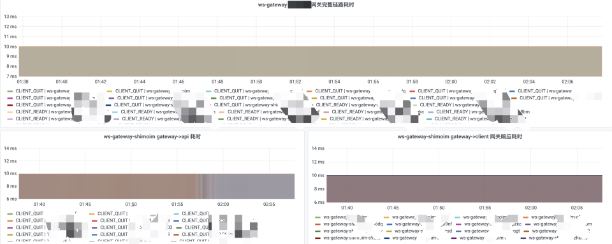

## <font style="color:rgb(51, 51, 51);">3.8 消息接收与发送</font>
```go
type Packet struct {
    ...
}

type Connect struct {
    *websocket.Con
    send chan Packet
}

func NewConnect(conn net.Conn) *Connect {
    c := &Connect{
        send: make(chan Packet, N),
    }
    go c.reader()
    go c.writer()
    return c
}
```

<font style="color:rgb(51, 51, 51);">客户端与服务端的消息交互第一版的写法类似以上写法，对 Demo 进行压测，发现每个 WebSocket 连接都会占用 3 个 goroutine，每个 goroutine 都需要内存栈，单机承载连十分有限，主要受制于大量的内存占用，而且大部分时间 c.writer() 是闲置状态，于是考虑，是否只启用 2 个 goroutine 来完成交互。</font>

> _Goroutine是Go语⾔中并发的执⾏单位。 Goroutine底层是使⽤协程(coroutine)实现， coroutine 是⼀种运⾏在⽤户态的⽤户线程（参考操作系统原理：内核态，⽤户态）它可以由语⾔和框架层调度。 Go在语⾔层⾯实现了调度器，同时对⽹络， IO库进⾏了封装处理，屏蔽了操作系统层⾯的复杂的细节，在语⾔层⾯提供统⼀的关键字⽀持。_
>

```go
type Packet struct {
    ...
}

type Connect struct {
    *websocket.Conn
    mux sync.RWMutex
}

func NewConnect(conn net.Conn) *Connect {
    c := &Connect{
        send: make(chan Packet, N),
    }
    go c.reader()
    return c
}

func (c *Connect) Write(data []byte) (err error) {
    c.mux.Lock()
    defer c.mux.Unlock()
    ...
    return nil
}
```

<font style="color:rgb(51, 51, 51);">保留 c.reader() 的 goroutine，如果使用轮询方式从缓冲区读取数据，可能会产生读取延迟或者锁的问题，c.writer() 操作调整为主动调用，不采用启动 goroutine 持续监听，降低内存消耗。</font>

<font style="color:rgb(51, 51, 51);">调研了 gev 和 gnet 等基于事件驱动的轻量级高性能网络库，实测发现在大量连接场景下可能产生的消息延迟的问题，所以没有在生产环境下使用。</font>

## <font style="color:rgb(51, 51, 51);">3.9 核心对象缓存</font>
<font style="color:rgb(51, 51, 51);">确定数据接收与发送逻辑后，网关部分的核心对象为 Connection 对象，围绕 Connection 进行了 run、read、write、close 等函数的开发。使用 sync.pool 来缓存该对象，减轻 GC 压力，创建连接时，通过对象资源池获取 Connection 对象，生命周期结束之后，重置 Connection 对象后 Put 回资源池。在实际编码中，建议封装 GetConn()、PutConn() 函数，收敛数据初始化、对象重置等操作。</font>

```go
var ConnectionPool = sync.Pool{
    New: func() interface{} {
        return &Connection{}
    },
}

func GetConn() *Connection {
    cli := ConnectionPool.Get().(*Connection)
    return cli
}

func PutConn(cli *Connection) {
    cli.Reset()
    ConnectionPool.Put(cli) // 放回连接池
}
```

## <font style="color:rgb(51, 51, 51);">3.10 数据传输过程优化</font>
<font style="color:rgb(51, 51, 51);">消息流转过程中，需要考虑消息体的传输效率优化，采用 MessagePack 对消息体进行序列化，压缩消息体大小。调整 MTU 值避免出现分包情况，定义 a 为探测包大小，通过如下指令，对目标服务 ip 进行 MTU 极限值探测。</font>

> _<font style="color:rgb(51, 51, 51);">MTU（Maximum Transmission Unit），最大传输单元，是指网络能够传输的最大数据包大小，以字节为单位。MTU的大小决定了发送端一次能够发送报文的最大字节数。如果MTU超过了接收端所能够承受的最大值，或者是超过了发送路径上途经的某台设备所能够承受的最大值，就会造成报文分片甚至丢弃，加重网络传输的负担。如果太小，那实际传送的数据量就会过小，影响传输效率。</font>_
>

```plain
ping -s {a} {ip}
```

<font style="color:rgb(51, 51, 51);">a = 1400 时，实际传输包大小为：1428。其中 28 由 8（ICMP 回显请求和回显应答报文格式）和 20（IP 首部）构成。</font>

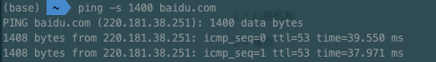

<font style="color:rgb(51, 51, 51);">如果 a 设置过大会导致应答超时，在实际环境包大小超过该值时会出现分包的情况。</font>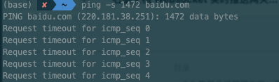

<font style="color:rgb(51, 51, 51);">在调试合适的 MTU 值的同时通过 MessagePack 对消息体进行序列号，进一步压缩数据包的大小，并减小 CPU 的消耗。</font>

## <font style="color:rgb(51, 51, 51);">3.11 基础设施支持</font>
<font style="color:rgb(51, 51, 51);">使用 EGO 框架（ </font>[https://github.com/gotomicro/ego](https://github.com/gotomicro/ego)<font style="color:rgb(51, 51, 51);"> ）进行服务开发：业务日志打印，异步日志输出，动态日志级别调整等功能，方便线上问题排查提升日志打印效率；微服务监控体系，CPU、P99、内存、goroutine 等监控。</font>

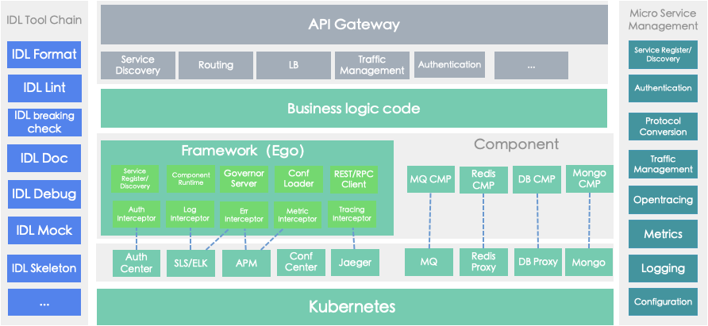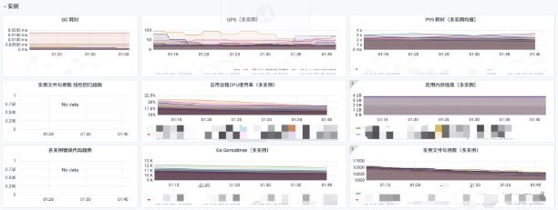

<font style="color:rgb(51, 51, 51);">客户端 Redis 监控：</font>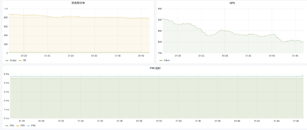

<font style="color:rgb(51, 51, 51);">客户端 Kafka 监控：</font>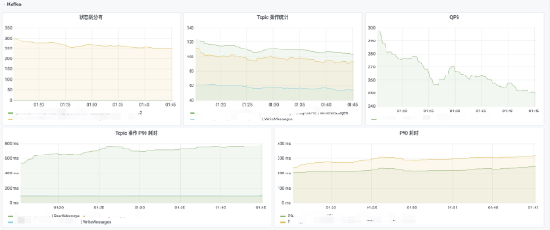

<font style="color:rgb(51, 51, 51);">自定义监控大盘：</font>

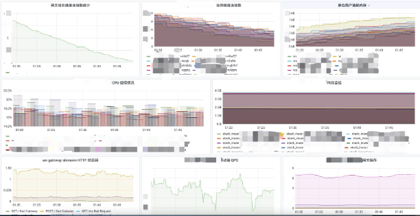

# <font style="color:rgb(51, 51, 51);">4 性能压测</font>
## <font style="color:rgb(51, 51, 51);">4.1 压测准备</font>
+ <font style="color:rgb(51, 51, 51);">选择一台配置为 16 核 32G 的虚拟机，作为服务机，目标承载 48w 连接;</font>
+ <font style="color:rgb(51, 51, 51);">选择八台配置为 4 核 8G 的虚拟机，作为客户机，每台客户机开放 6w 个端口。</font>

## <font style="color:rgb(51, 51, 51);">4.2 场景一</font>
<font style="color:rgb(51, 51, 51);">用户上线，50w 在线用户。</font>

| **<font style="color:rgb(51, 51, 51);">服务</font>** | **<font style="color:rgb(51, 51, 51);">CPU</font>** | **<font style="color:rgb(51, 51, 51);">Memory</font>** | **<font style="color:rgb(51, 51, 51);">数量</font>** | **<font style="color:rgb(51, 51, 51);">CPU%</font>** | **<font style="color:rgb(51, 51, 51);">Mem%</font>** |
| :--- | :--- | :--- | :--- | :--- | :--- |
| <font style="color:rgb(51, 51, 51);">WS-Gateway</font> | <font style="color:rgb(51, 51, 51);">16 核</font> | <font style="color:rgb(51, 51, 51);">32G</font> | <font style="color:rgb(51, 51, 51);">1 台</font> | <font style="color:rgb(51, 51, 51);">22.38%</font> | <font style="color:rgb(51, 51, 51);">70.59%</font> |


<font style="color:rgb(51, 51, 51);">单个 WS-Gateway 每秒建立连接数峰值为：1.6w 个 / s，每个用户占用内存：47K。</font>

## <font style="color:rgb(51, 51, 51);">4.3 场景二</font>
<font style="color:rgb(51, 51, 51);">测试时间 15 分钟，在线用户 50w，每 5s 推送一条所有用户，用户有回执。推送内容为：</font>

> <font style="color:rgb(0, 0, 0);">42["message",{"type":"xx","data":{"type":"xx","clients":[{"id":xx,"name":"xx","email":"xx@xx.xx","avatar":"ZgG5kEjCkT6mZla6.png","created_at":1623811084000,"name_pinyin":"","team_id":13,"team_role":"member","merged_into":0,"team_time":1623811084000,"mobile":"+xxxx","mobile_account":"","status":1,"has_password":true,"team":null,"membership":null,"is_seat":true,"team_role_enum":3,"register_time":1623811084000,"alias":"","type":"anoymous"}],"userCount":1,"from":"ws"}}]</font>
>

<font style="color:rgb(51, 51, 51);">测试经过 5 分钟后，服务异常重启，重启原因是内存使用量到超过限制。</font>

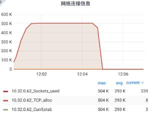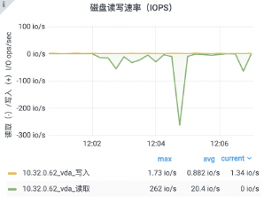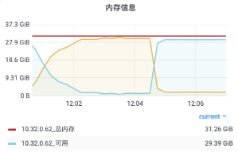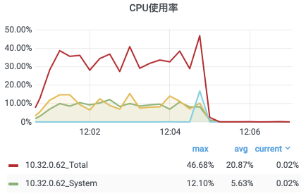

<font style="color:rgb(51, 51, 51);">分析内存超过限制的原因：</font>

<font style="color:rgb(51, 51, 51);">新增的广播代码用掉了 9.32% 的内存。</font>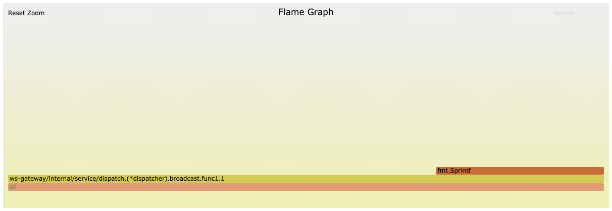

<font style="color:rgb(51, 51, 51);">接收用户回执消息的部分消耗了 10.38% 的内存。</font>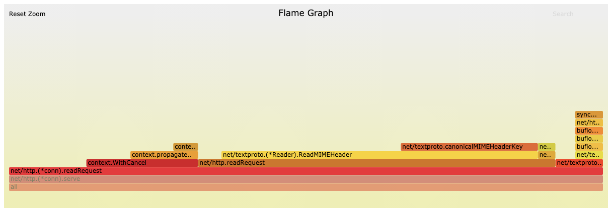

<font style="color:rgb(51, 51, 51);">进行测试规则调整，测试时间 15 分钟，在线用户 48w，每 5s 推送一条所有用户，用户有回执。</font>

<font style="color:rgb(51, 51, 51);">推送内容为：</font>

> 42["message",{"type":"xx","data":{"type":"xx","clients":[{"id":xx,"name":"xx","email":"xx@xx.xx","avatar":"ZgG5kEjCkT6mZla6.png","created_at":1623811084000,"name_pinyin":"","team_id":13,"team_role":"member","merged_into":0,"team_time":1623811084000,"mobile":"+xxxx","mobile_account":"","status":1,"has_password":true,"team":null,"membership":null,"is_seat":true,"team_role_enum":3,"register_time":1623811084000,"alias":"","type":"anoymous"}],"userCount":1,"from":"ws"}}]
>

| **<font style="color:rgb(51, 51, 51);">服务</font>** | **<font style="color:rgb(51, 51, 51);">CPU</font>** | **<font style="color:rgb(51, 51, 51);">Memory</font>** | **<font style="color:rgb(51, 51, 51);">数量</font>** | **<font style="color:rgb(51, 51, 51);">CPU%</font>** | **<font style="color:rgb(51, 51, 51);">Mem%</font>** |
| :--- | :--- | :--- | :--- | :--- | :--- |
| <font style="color:rgb(51, 51, 51);">WS-Gateway</font> | <font style="color:rgb(51, 51, 51);">16 核</font> | <font style="color:rgb(51, 51, 51);">32G</font> | <font style="color:rgb(51, 51, 51);">1 台</font> | <font style="color:rgb(51, 51, 51);">44%</font> | <font style="color:rgb(51, 51, 51);">91.75%</font> |


<font style="color:rgb(51, 51, 51);">连接数建立峰值：1w 个 / s，接收数据峰值：9.6w 条 / s，发送数据峰值 9.6w 条 / s。</font>

## <font style="color:rgb(51, 51, 51);">4.4 场景三</font>
<font style="color:rgb(51, 51, 51);">测试时间 15 分钟，在线用户 50w，每 5s 推送一条所有用户，用户无需回执。</font>

<font style="color:rgb(51, 51, 51);">推送内容为：</font>

> 42["message",{"type":"xx","data":{"type":"xx","clients":[{"id":xx,"name":"xx","email":"xx@xx.xx","avatar":"ZgG5kEjCkT6mZla6.png","created_at":1623811084000,"name_pinyin":"","team_id":13,"team_role":"member","merged_into":0,"team_time":1623811084000,"mobile":"+xxxx","mobile_account":"","status":1,"has_password":true,"team":null,"membership":null,"is_seat":true,"team_role_enum":3,"register_time":1623811084000,"alias":"","type":"anoymous"}],"userCount":1,"from":"ws"}}]
>

| **<font style="color:rgb(51, 51, 51);">服务</font>** | **<font style="color:rgb(51, 51, 51);">CPU</font>** | **<font style="color:rgb(51, 51, 51);">Memory</font>** | **<font style="color:rgb(51, 51, 51);">数量</font>** | **<font style="color:rgb(51, 51, 51);">CPU%</font>** | **<font style="color:rgb(51, 51, 51);">Mem%</font>** |
| :--- | :--- | :--- | :--- | :--- | :--- |
| <font style="color:rgb(51, 51, 51);">WS-Gateway</font> | <font style="color:rgb(51, 51, 51);">16 核</font> | <font style="color:rgb(51, 51, 51);">32G</font> | <font style="color:rgb(51, 51, 51);">1 台</font> | <font style="color:rgb(51, 51, 51);">30%</font> | <font style="color:rgb(51, 51, 51);">93%</font> |


<font style="color:rgb(51, 51, 51);">连接数建立峰值：1.1w 个 / s，发送数据峰值 10w 条 / s，出内存占用过高之外，其他没有异常情况。</font>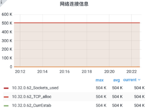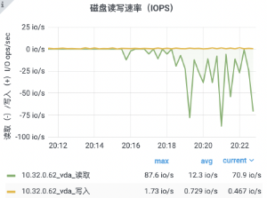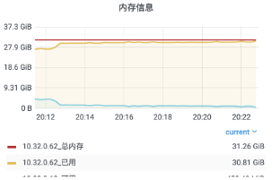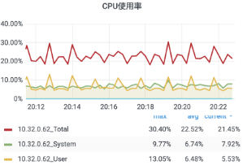

<font style="color:rgb(51, 51, 51);">内存消耗极高，分析火焰图，大部分消耗在定时 5s 进行广播的操作上。</font>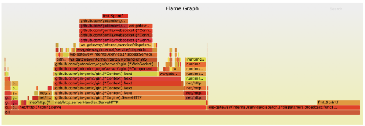

## <font style="color:rgb(51, 51, 51);">4.5 场景四</font>
<font style="color:rgb(51, 51, 51);">测试时间 15 分钟，在线用户 50w，每 5s 推送一条所有用户，用户有回执。每秒 4w 用户上下线。</font>

<font style="color:rgb(51, 51, 51);">推送内容为：</font>

> 42["message",{"type":"xx","data":{"type":"xx","clients":[{"id":xx,"name":"xx","email":"xx@xx.xx","avatar":"ZgG5kEjCkT6mZla6.png","created_at":1623811084000,"name_pinyin":"","team_id":13,"team_role":"member","merged_into":0,"team_time":1623811084000,"mobile":"+xxxx","mobile_account":"","status":1,"has_password":true,"team":null,"membership":null,"is_seat":true,"team_role_enum":3,"register_time":1623811084000,"alias":"","type":"anoymous"}],"userCount":1,"from":"ws"}}]
>

| **<font style="color:rgb(51, 51, 51);">服务</font>** | **<font style="color:rgb(51, 51, 51);">CPU</font>** | **<font style="color:rgb(51, 51, 51);">Memory</font>** | **<font style="color:rgb(51, 51, 51);">数量</font>** | **<font style="color:rgb(51, 51, 51);">CPU%</font>** | **<font style="color:rgb(51, 51, 51);">Mem%</font>** |
| :--- | :--- | :--- | :--- | :--- | :--- |
| <font style="color:rgb(51, 51, 51);">WS-Gateway</font> | <font style="color:rgb(51, 51, 51);">16 核</font> | <font style="color:rgb(51, 51, 51);">32G</font> | <font style="color:rgb(51, 51, 51);">1 台</font> | <font style="color:rgb(51, 51, 51);">46.96%</font> | <font style="color:rgb(51, 51, 51);">65.6%</font> |


<font style="color:rgb(51, 51, 51);">连接数建立峰值：18570 个 / s，接收数据峰值：329949 条 / s，发送数据峰值 393542 条 / s，未出现异常情况。</font>

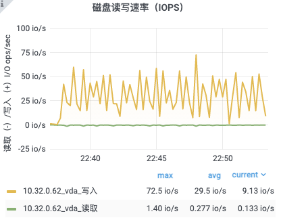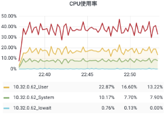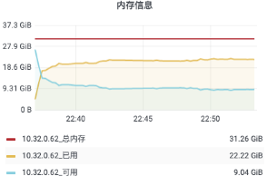

## <font style="color:rgb(51, 51, 51);">4.6 压测总结</font>
<font style="color:rgb(51, 51, 51);">在 16C 32G 内存的硬件条件下，单机 50w 连接数，进行以上包括用户上下线、消息回执等四个场景的压测，内存和 CPU 消耗都符合预期，并且在较长时间的压测下，服务也很稳定。满足目前量级下的资源节约要求，可在此基础上继续完善功能开发。</font>

# <font style="color:rgb(51, 51, 51);">5 总结</font>
<font style="color:rgb(51, 51, 51);">面临日益增加的用户量，网关服务的重构是势在必行，本次重构主要是：</font>

+ <font style="color:rgb(51, 51, 51);">对网关服务与业务服务的解耦，移除对 Nginx 的依赖，让整体架构更加清晰。</font>
+ <font style="color:rgb(51, 51, 51);">从用户建立连接到底层业务推送消息的整体流程分析，对其中这些流程进行了具体的优化。以下各个方面让 2.0 版本的网关有了更少的资源消耗，更低的单位用户内存损耗、更加完善的监控报警体系，让网关服务本身更加可靠：</font>
+ <font style="color:rgb(51, 51, 51);">可降级的握手流程；</font>
+ <font style="color:rgb(51, 51, 51);">Socket ID 生产；</font>
+ <font style="color:rgb(51, 51, 51);">客户端心跳处理过程的优化；</font>
+ <font style="color:rgb(51, 51, 51);">自定义 Headers 避免了消息解码，强化了链路追踪与监控；</font>
+ <font style="color:rgb(51, 51, 51);">消息的接收与发送代码结构设计上的优化；</font>
+ <font style="color:rgb(51, 51, 51);">对象资源池的使用，使用缓存降低 GC 频率；</font>
+ <font style="color:rgb(51, 51, 51);">消息体的序列化压缩；</font>
+ <font style="color:rgb(51, 51, 51);">接入服务观测基础设施，保证服务稳定性。</font>
+ <font style="color:rgb(51, 51, 51);">在保证网关服务性能过关的同时，更进一步的是收敛底层组件服务对网关业务调用的方式，从以前的 HTTP、Redis、Kafka 等方式，统一为 gRPC 调用，保证了来源可查可控，为后续业务接入打下了更好的基础。</font>

# <font style="color:rgb(51, 51, 51);"></font>


> 更新: 2024-07-15 22:21:20  
> 原文: <https://www.yuque.com/tulingzhouyu/db22bv/upiq8ypgl2ch1hay>