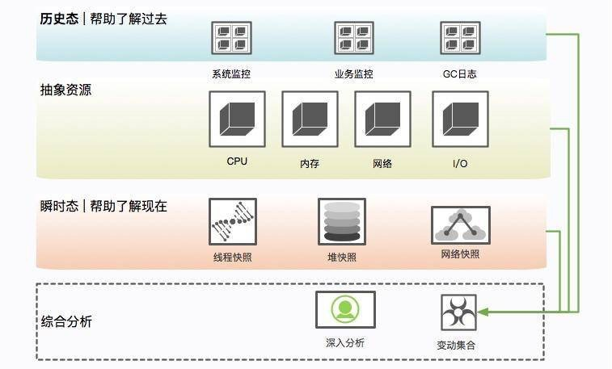

# 线上问题如何快速排查

**示例代码**

[附件: troubleshoot-demo.zip](./attachments/kKRNBPfuhjwDNzEk/troubleshoot-demo.zip)

jdk版本：17.0.8

linux版本：CentOS-7.4.1708

****

**本次分享内容**

1. 硬件问题排查

2. 多线程并发问题排查

3. 内存溢出问题排查

4. CPU飙高问题排查

****

# 硬件问题排查
如果一个实例发生了问题，根据情况选择，要不要着急去重启。如果出现的CPU、内存飙高或者日志里出现了 OOM异常

第一步是隔离，第二步是保留现场，第三步才是问题排查。

**隔离**

就是把你的这台机器从请求列表里摘除，比如把 nginx 相关的权重设成零。

****

**现场保留**

****

**瞬时态和历史态**

查看比如 CPU、系统内存等，通过历史状态可以体现一个趋势性问题，而这些信息的获取一般依靠监控系统的协作。



**保留信息**

1. 系统当前网络连接

```shell
ss -antp >/opt/data/dump/ss.dump 2>&1
```

使用 ss 命令而不是 netstat 的原因，是因为 netstat 在网络连接非常多的情况下，执行非常缓慢。

后续的处理，可通过查看各种网络连接状态的梳理，来排查 TIMEWAIT 或者 CLOSEWAIT，或者其他连接过高的问题，非常有用。

2. 网络状态统计

```shell
netstat -s >/opt/data/dump/netstat-s.dump 2>&1
```

它能够按照各个协议进行统计输出，对把握当时整个网络状态，有非常大的作用。

```bash
sar -n DEV 1 2 >/opt/data/dump/sar-traffic.dump 2>&1
```

在一些速度非常高的模块上，比如 Redis、Kafka，就经常发生跑满网卡的情况。表现形式就是网络通信非常缓慢。

3. 进程资源

```shell
ss -antp >/opt/data/dump/ss.dump 2>&1
```

通过查看进程，能看到打开了哪些文件，可以以进程的维度来查看整个资源的使用情况，包括每条网络连接、每个打开的文件句柄。同时，也可以很容易的看到连接到了哪些服务器、使用了哪些资源。这个命令在资源非常多的情况下，输出稍慢，请耐心等待。

4. CPU 资源

```shell
mpstat >/opt/data/dump/mpstat.dump 2>&1 
vmstat 1 3 >/opt/data/dump/vmstat.dump 2>&1 
sar -p >/opt/data/dump/sar-cpu.dump 2>&1 
uptime >/opt/data/dump/uptime.dump 2>&1
```

主要用于输出当前系统的 CPU 和负载，便于事后排查。

5. I/O 资源

```shell
iostat -x >/opt/data/dump/iostat.dump 2>&1
```

一般，以计算为主的服务节点，I/O 资源会比较正常，但有时也会发生问题，比如日志输出过多，或者磁盘问题等。此命令可以输出每块磁盘的基本性能信息，用来排查 I/O 问题。

6. 内存问题

```shell
free -h >/opt/data/dump/free.dump 2>&1
```

free 命令能够大体展现操作系统的内存概况，这是故障排查中一个非常重要的点，比如 SWAP 影响了 GC，SLAB区挤占了 JVM 的内存。

7. 其他全局

```shell
ps -ef >/opt/data/dump/ps.dump 2>&1 
dmesg >/opt/data/dump/dmesg.dump 2>&1 
sysctl -a >/opt/data/dump/sysctl.dump 2>&1
```

dmesg 是许多静悄悄死掉的服务留下的最后一点线索。当然，ps 作为执行频率最高的一个命令，由于内核的配置参数，会对系统和 JVM 产生影响，所以我们也输出了一份。

8. 进程快照，最后的遗言（jinfo）

```shell
nohup java -jar -Xms256m -Xmx512m /opt/data/dump/troubleshoot-0.0.1-SNAPSHOT.jar >/opt/data/dump/troubleshoot.log 2>& 1 &
export PID=4627
jinfo $PID >/opt/data/dump/jinfo.dump 2>&1
```

此命令将输出 Java 的基本进程信息，包括环境变量和参数配置，可以查看是否因为一些错误的配置造成了 JVM 问题

9. dump 堆信息

```shell
jstat -gcutil $PID >/opt/data/dump/jstat-gcutil.dump 2>&1
jstat -gccapacity $PID >/opt/data/dump/jstat-gccapacity.dump 2>&1
```

jstat 将输出当前的 gc 信息。一般，基本能大体看出一个端倪，如果不能，可将借助 jmap 来进行分析。

10. 堆信息，排查内存泄漏的现象

稍微提一下 jmap 命令，它在 9 版本里被干掉了，取而代之的是 jhsdb，你可以像下面的命令一样使用。

```shell
jhsdb jmap --pid $PID > /opt/data/dump/jmap.dump 2>&1
jhsdb jmap --heap --pid $PID >/opt/data/dump/jmap-heap.dump 2>&1
jhsdb jmap --histo --pid $PID >/opt/data/dump/jmap-histo.dump 2>&1
jhsdb jmap --dump:format=b,file=/opt/data/dump/heap.bin --pid $PID > /dev/null 2>&1
jhsdb jmap --binaryheap --pid $PID >/opt/data/dump/heap.bin --dumpfile /opt/data/dump/heap.hprof2>&1

```

jmap 将会得到当前 Java 进程的 dump 信息。如上所示，其实最有用的就是第 4 个命令，但是前面三个能够让你初步对系统概况进行大体判断。因为，第 4 个命令产生的文件，一般都非常的大。而且，需要下载下来，导入 MAT 这样的工具进行深入分析，才能获取结果。这是分析内存泄漏一个必经的过程。

一般内存溢出，表现形式就是 Old 区的占用持续上升，即使经过了多轮 GC 也没有明显改善。比如ThreadLocal里面的GC Roots，内存泄漏的根本就是，这些对象并没有切断和 GC Roots 的关系，可通过一些工具，能够看到它们的联系。

11. JVM 执行栈

```shell
jstack $PID >/opt/data/dump/jstack.dump 2>&1
```

jstack 将会获取当时的执行栈。一般会多次取值，我们这里取一次即可。这些信息非常有用，能够还原 Java 进程中的线程情况。

```shell
top -Hp $PID -b -n 1 -c >/opt/data/dump/top-$PID.dump 2>&1
```

为了能够得到更加精细的信息，我们使用 top 命令，来获取进程中所有线程的 CPU 信息，这样，就可以看到资源到底耗费在什么地方了。

# 多线程并发问题排查
有些数据需要使用 HttpClient 来获取进行补全。提供数据的服务提供商有的响应时间可能会很长，也有可能会造成服务整体的阻塞。

接口 A 通过 HttpClient 访问服务 2，响应 100ms 后返回；接口 B 访问服务 3，耗时 2 秒。HttpClient 本身是有一个最大连接数限制的，如果服务 3 迟迟不返回，就会造成 HttpClient 的连接数达到上限，概括来讲，就是同一服务，由于一个耗时非常长的接口，进而引起了整体的服务不可用

这个时候，通过 jstack 打印栈信息，会发现大多数竟然阻塞在了接口 A 上，而不是耗时更长的接口 B，这个现象起初十分具有迷惑性，不过经过分析后，我们猜想其实是因为接口 A 的速度比较快，在问题发生点进入了更多的请求，它们全部都阻塞住的同时被打印出来了。

为了验证这个问题，我搭建了一个demo 工程，模拟了两个使用同一个 HttpClient 的接口。fast 接口用来访问百度，很快就能返回；slow 接口访问谷歌，由于众所周知的原因，会阻塞直到超时，大约 10 s。 利用ab对两个接口进行压测，同时使用 jstack 工具 dump 堆栈。首先使用 jps 命令找到进程号，然后把结果重定向到文件（可以参考 10271.jstack 文件）。

过滤一下 nio 关键字，可以查看 tomcat 相关的线程，足足有 200 个，这和 Spring Boot 默认的 maxThreads 个数不谋而合。更要命的是，有大多数线程，都处于 BLOCKED 状态，说明线程等待资源超时。通过grep fast  jstack.dump | wc -l 分析，确实200个中有150个都是blocked的fast的进程。

问题找到了，解决方式就顺利成章了。 

1、fast和slow争抢连接资源，通过线程池限流或者熔断处理

2、有时候slow的线程也不是一直slow，所以就得加入监控 

3、使用带countdownLaunch对线程的执行顺序逻辑进行控制

# 内存溢出问题排查
有一次线上遇到故障，重新启动后，使用 jstat 命令，发现 Old 区一直在增长。我使用 jmap 命令，导出了一份线上堆栈，然后使用 MAT 进行分析，通过对 GC Roots 的分析，发现了一个非常大的 HashMap 对象，这个原本是其他同事做缓存用的，但是做了一个无界缓存，没有设置超时时间或者 LRU 策略，在使用上又没有重写 key类对象的hashcode和equals方法，对象无法取出也直接造成了堆内存占用一直上升，后来，将这个缓存改成 guava 的 Cache，并设置了弱引用，故障就消失了。

关于文件处理器的应用，在读取或者写入一些文件之后，由于发生了一些异常，close 方法又没有放在 finally块里面，造成了文件句柄的泄漏。由于文件处理十分频繁，产生了严重的内存泄漏问题。

内存溢出是一个结果，而内存泄漏是一个原因。内存溢出的原因有内存空间不足、配置错误等因素。一些错误的编程方式，不再被使用的对象、没有被回收、没有及时切断与 GC Roots 的联系，这就是内存泄漏。

举个例子，有团队使用了 HashMap 做缓存，但是并没有设置超时时间或者 LRU 策略，造成了放入 Map 对象的数据越来越多，而产生了内存泄漏。

再来看一个经常发生的内存泄漏的例子，也是由于 HashMap 产生的。代码如下，由于没有重写 Key 类的 hash- Code 和 equals 方法，造成了放入 HashMap 的所有对象都无法被取出来，它们和外界失联了。所以下面的代码结果是 null。

```java
package com.example.troubleshoot;
import java.util.HashMap;
import java.util.Map;
//leak example
public class HashMapLeakDemo {
    public static class Key {
        String title;
        public Key(String title) {
            this.title = title;
        }
    }

    public static void main(String[] args) {
        Map<Key, Integer> map = new HashMap<>();
        map.put(new Key("1"), 1);
        map.put(new Key("2"), 2);
        map.put(new Key("3"), 2);
        Integer integer = map.get(new Key("2"));
        System.out.println(integer);
    }
}
```

即使提供了 equals 方法和 hashCode 方法，也要非常小心，尽量避免使用自定义的对象作为 Key。

再看一个例子，关于文件处理器的应用，在读取或者写入一些文件之后，由于发生了一些异常，close 方法又没有放在 finally 块里面，造成了文件句柄的泄漏。由于文件处理十分频繁，产生了严重的内存泄漏问题。

# CPU飙高问题排查
我们有个线上应用，单节点在运行一段时间后，CPU 的使用会飙升，一旦飙升，一般怀疑某个业务逻辑的计算量太大，或者是触发了死循环（比如著名的 HashMap 高并发引起的死循环），但排查到最后其实是 GC 的问题。

1. 使用 top 命令，查找到使用 CPU 最多的某个进程，记录它的 pid。使用 Shift + P 快捷键可以按 CPU 的使用率进行排序。

```bash
top
```

2. 再次使用 top 命令，加 -H 参数，查看某个进程中使用 CPU 最多的某个线程，记录线程的 ID。

```bash
export pid=4627
top -Hp $pid
```

3. 使用 printf 函数，将十进制的 tid 转化成十六进制。

```bash
export tid=4661
printf %x $tid
```

4. 使用 jstack 命令，查看 Java 进程的线程栈。

```bash
jstack $pid >/opt/data/dump/$pid.log
```

5. 使用 less 命令查看生成的文件，并查找刚才转化的十六进制 tid，找到发生问题的线程上下文。

```bash
less $pid.log
```

我们在 jstack 日志搜关键字DEAD，以及中找到了 CPU 使用最多的几个线程id。

可以看到问题发生的根源，是我们的堆已经满了，但是又没有发生 OOM，于是 GC 进程就一直在那里回收，回收的效果又非常一般，造成 CPU 升高应用假死。接下来的具体问题排查，就需要把内存 dump 一份下来，使用 MAT等工具分析具体原因了。


> 更新: 2024-07-15 22:21:20  
> 原文: <https://www.yuque.com/tulingzhouyu/db22bv/mogs7xbkzigtwzef>