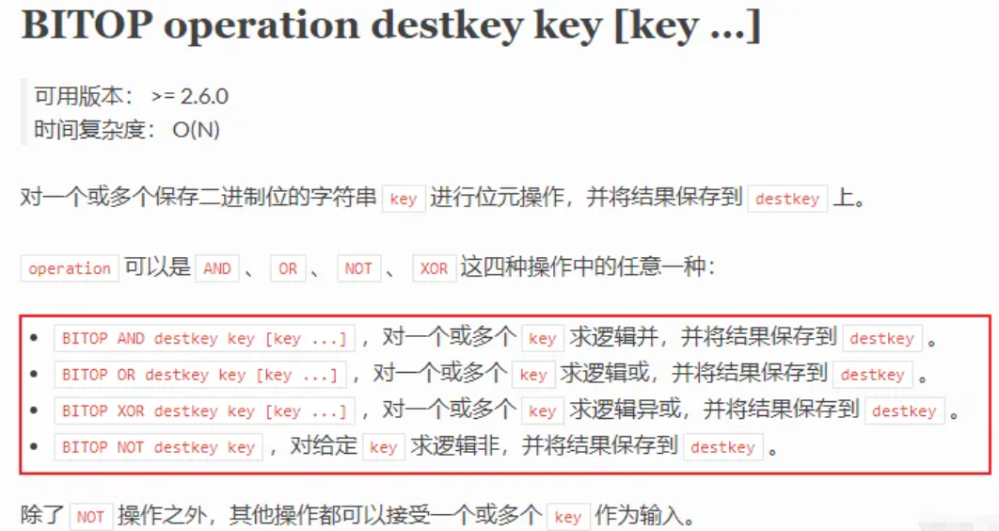

# 给你一亿个Redis keys，如何高效统计

:::info
<font style="color:rgb(23, 35, 63);">不知你大规模的用过</font><font style="color:rgb(18, 139, 78);background-color:rgb(231, 243, 237) !important;">Redis</font><font style="color:rgb(23, 35, 63);">吗？还是仅仅作为缓存的工具了？在Redis中使用最多的就是集合了，举个例子，如下场景：</font>

1. <font style="color:rgb(51, 51, 51);">签到系统中，一天对应一系列的用户签到记录。</font>
2. <font style="color:rgb(51, 51, 51);">电商系统中，一个商品对应一系列的评论。</font>
3. <font style="color:rgb(51, 51, 51);">交友系统中，某个用户的一系列的好友。</font>

<font style="color:rgb(23, 35, 63);">Redis中集合的特点无非是一个</font><font style="color:rgb(18, 139, 78);background-color:rgb(231, 243, 237) !important;">Key</font><font style="color:rgb(23, 35, 63);">对应一系列的数据， 但是数据的作用往往是为了统计的，比如：</font>

1. <font style="color:rgb(51, 51, 51);">交友系统中，需要统计每天的新增好友，以及双方的共同好友。</font>
2. <font style="color:rgb(51, 51, 51);">电商系统中，需要统计评论列表中的最新评论。</font>
3. <font style="color:rgb(51, 51, 51);">签到系统中，需要统计连续一个月的签到的用户数量。</font>

<font style="color:rgb(23, 35, 63);">大型互联网应用中，数据量是巨大的，少说百万，千万，甚至是一个亿，比如电商巨头淘宝，交友巨头微信、微博；办公巨头钉钉等，哪一个的用户不是上亿？</font>

**<font style="color:rgb(23, 35, 63);">只有针对不同场景，选择合适的集合，统计才能更方便。</font>**

:::

## <font style="color:rgb(34, 34, 34);">聚合统计</font>
<font style="color:rgb(18, 139, 78);background-color:rgb(231, 243, 237) !important;">聚合统计</font><font style="color:rgb(23, 35, 63);">指的是多个元素聚合的结果，比如统计多个集合的</font>**<font style="color:rgb(23, 35, 63);">交集</font>**<font style="color:rgb(23, 35, 63);">、</font>**<font style="color:rgb(23, 35, 63);">并集</font>**<font style="color:rgb(23, 35, 63);">、</font>**<font style="color:rgb(23, 35, 63);">差集</font>**

**<font style="color:rgb(23, 35, 63);">在你需要对多个集合做聚合统计的时候，Set集合是个不错的选择，除了其中无重复的数据外，Redis还提供了对应的API</font>**

### <font style="color:rgb(34, 34, 34);">交集</font>
<font style="color:rgb(23, 35, 63);">在上述的例子中交友系统中统计双方的共同好友正是聚合统计中的</font><font style="color:rgb(18, 139, 78);background-color:rgb(231, 243, 237) !important;">交集</font><font style="color:rgb(23, 35, 63);">。</font>

<font style="color:rgb(23, 35, 63);">在</font><font style="color:rgb(18, 139, 78);background-color:rgb(231, 243, 237) !important;">Redis</font><font style="color:rgb(23, 35, 63);">中可以</font><font style="color:rgb(18, 139, 78);background-color:rgb(231, 243, 237) !important;">userid</font><font style="color:rgb(23, 35, 63);">作为</font><font style="color:rgb(18, 139, 78);background-color:rgb(231, 243, 237) !important;">key</font><font style="color:rgb(23, 35, 63);">，好友的</font><font style="color:rgb(18, 139, 78);background-color:rgb(231, 243, 237) !important;">userid</font><font style="color:rgb(23, 35, 63);">作为</font><font style="color:rgb(18, 139, 78);background-color:rgb(231, 243, 237) !important;">value</font><font style="color:rgb(23, 35, 63);">，如下图：</font>


<font style="color:rgb(23, 35, 63);">统计两个用户的共同好友只需要两个</font><font style="color:rgb(18, 139, 78);background-color:rgb(231, 243, 237) !important;">Set</font><font style="color:rgb(23, 35, 63);">集合的交集，命令如下；</font>

```plain
SINTERSTORE userid:new userid:20002 userid:20003
```

<font style="color:rgb(23, 35, 63);">上述命令运行完成后，</font><font style="color:rgb(18, 139, 78);background-color:rgb(231, 243, 237) !important;">userid:new</font><font style="color:rgb(23, 35, 63);">这个key中存储的将是</font><font style="color:rgb(18, 139, 78);background-color:rgb(231, 243, 237) !important;">userid:20002</font><font style="color:rgb(23, 35, 63);">、</font><font style="color:rgb(18, 139, 78);background-color:rgb(231, 243, 237) !important;">userid:20003</font><font style="color:rgb(23, 35, 63);">两个集合的交集。</font>

### <font style="color:rgb(34, 34, 34);">差集</font>
<font style="color:rgb(23, 35, 63);">举个例子：假设交友系统中需要统计每日新增的好友，此时就需要对临近两天的好友集合取差集了，比如</font><font style="color:rgb(18, 139, 78);background-color:rgb(231, 243, 237) !important;">2020/11/1</font><font style="color:rgb(23, 35, 63);">日的好友是</font><font style="color:rgb(18, 139, 78);background-color:rgb(231, 243, 237) !important;">set1</font><font style="color:rgb(23, 35, 63);">，</font><font style="color:rgb(18, 139, 78);background-color:rgb(231, 243, 237) !important;">2020/11/2</font><font style="color:rgb(23, 35, 63);">日的好友是</font><font style="color:rgb(18, 139, 78);background-color:rgb(231, 243, 237) !important;">set2</font><font style="color:rgb(23, 35, 63);">，此时只需要对</font><font style="color:rgb(18, 139, 78);background-color:rgb(231, 243, 237) !important;">set1</font><font style="color:rgb(23, 35, 63);">和</font><font style="color:rgb(18, 139, 78);background-color:rgb(231, 243, 237) !important;">set2</font><font style="color:rgb(23, 35, 63);">做差集。</font>

<font style="color:rgb(23, 35, 63);">此时的结构应该如何设计呢？如下图：</font>


<font style="color:rgb(18, 139, 78);background-color:rgb(231, 243, 237) !important;">userid:20201101</font><font style="color:rgb(23, 35, 63);">这个</font><font style="color:rgb(18, 139, 78);background-color:rgb(231, 243, 237) !important;">key</font><font style="color:rgb(23, 35, 63);">记录了</font><font style="color:rgb(18, 139, 78);background-color:rgb(231, 243, 237) !important;">userid</font><font style="color:rgb(23, 35, 63);">用户的</font><font style="color:rgb(18, 139, 78);background-color:rgb(231, 243, 237) !important;">2020/11/1</font><font style="color:rgb(23, 35, 63);">日的好友集合。</font>

<font style="color:rgb(23, 35, 63);">差集很简单，只需要执行</font><font style="color:rgb(18, 139, 78);background-color:rgb(231, 243, 237) !important;">SDIFFSTORE</font><font style="color:rgb(23, 35, 63);">命令，如下：</font>

```plain
SDIFFSTORE  user:new  userid:20201102 userid:20201101  
```

<font style="color:rgb(23, 35, 63);">执行完毕，此时的</font><font style="color:rgb(18, 139, 78);background-color:rgb(231, 243, 237) !important;">user:new</font><font style="color:rgb(23, 35, 63);">这集合将是</font><font style="color:rgb(18, 139, 78);background-color:rgb(231, 243, 237) !important;">2020/11/2</font><font style="color:rgb(23, 35, 63);">日新增的好友。</font>

**<font style="color:rgb(23, 35, 63);">这里还有一个更贴切的例子，微博上有个可能认识的人功能，可以使用差集，即是你朋友的好友减去你们共同的好友即是可能认识的人。</font>**

### <font style="color:rgb(34, 34, 34);">并集</font>
<font style="color:rgb(23, 35, 63);">还是差集的那个例子，假设需要统计</font><font style="color:rgb(18, 139, 78);background-color:rgb(231, 243, 237) !important;">2020/11/01</font><font style="color:rgb(23, 35, 63);">和</font><font style="color:rgb(18, 139, 78);background-color:rgb(231, 243, 237) !important;">2020/11/2</font><font style="color:rgb(23, 35, 63);">总共新增的好友，此时只需要对这两日新增好友的集合做一个并集。命令如下：</font>

```plain
SUNIONSTORE  userid:new userid:20201102 userid:20201101
```

<font style="color:rgb(23, 35, 63);">此时新的集合</font><font style="color:rgb(18, 139, 78);background-color:rgb(231, 243, 237) !important;">userid:new</font><font style="color:rgb(23, 35, 63);">则是两日新增的好友。</font>

### <font style="color:rgb(34, 34, 34);">总结</font>
<font style="color:rgb(18, 139, 78);background-color:rgb(231, 243, 237) !important;">Set</font><font style="color:rgb(23, 35, 63);">集合的交差并的计算复杂度很高，如果数据量很大的情况下，可能会造成Redis的阻塞。</font>

<font style="color:rgb(23, 35, 63);">那么如何规避阻塞呢？建议如下：</font>

1. <font style="color:rgb(51, 51, 51);">在</font><font style="color:rgb(18, 139, 78);background-color:rgb(231, 243, 237) !important;">Redis</font><font style="color:rgb(51, 51, 51);">集群中选一个从库专门负责聚合统计，这样就不会阻塞主库和其他的从库了</font>
2. <font style="color:rgb(51, 51, 51);">将数据交给客户端，由客户端进行聚合统计。</font>

## <font style="color:rgb(34, 34, 34);">排序统计</font>
<font style="color:rgb(23, 35, 63);">在一些电商网站中可以看到商品的评论总是最新的在上面，这个是怎么做的呢？</font>

<font style="color:rgb(23, 35, 63);">最新评论列表包含了所有的评论，这就要</font>**<font style="color:rgb(23, 35, 63);">集合对元素进行保序存储</font>**<font style="color:rgb(23, 35, 63);">了。也就是说集合中的元素必须按序存储，称之为有序集合。</font>

<font style="color:rgb(18, 139, 78);background-color:rgb(231, 243, 237) !important;">Redis</font><font style="color:rgb(23, 35, 63);">中的四种集合中</font><font style="color:rgb(18, 139, 78);background-color:rgb(231, 243, 237) !important;">List</font><font style="color:rgb(23, 35, 63);">和</font><font style="color:rgb(18, 139, 78);background-color:rgb(231, 243, 237) !important;">Sorted Set</font><font style="color:rgb(23, 35, 63);">属于有序集合。</font>

<font style="color:rgb(23, 35, 63);">但是</font><font style="color:rgb(18, 139, 78);background-color:rgb(231, 243, 237) !important;">List</font><font style="color:rgb(23, 35, 63);">和</font><font style="color:rgb(18, 139, 78);background-color:rgb(231, 243, 237) !important;">Sorted Set</font><font style="color:rgb(23, 35, 63);">有何区别呢？到底使用哪一种呢？</font>

**<font style="color:rgb(23, 35, 63);">List是按照元素进入顺序进行排序，而Sorted Set可以根据元素权重来排序。</font>**<font style="color:rgb(23, 35, 63);"> </font><font style="color:rgb(23, 35, 63);">比如可以根据元素插入集合的时间确定权值，先插入的元素权重小，后插入的元素权重大。</font>

<font style="color:rgb(23, 35, 63);">针对这一例子中，显然这两种都是能够满足要求的，List中分页查询命令</font><font style="color:rgb(18, 139, 78);background-color:rgb(231, 243, 237) !important;">LRANGE</font><font style="color:rgb(18, 139, 78);background-color:rgb(231, 243, 237) !important;"> </font><font style="color:rgb(23, 35, 63);">和</font><font style="color:rgb(18, 139, 78);background-color:rgb(231, 243, 237) !important;">Sorted Set</font><font style="color:rgb(23, 35, 63);">分页查询命令</font><font style="color:rgb(18, 139, 78);background-color:rgb(231, 243, 237) !important;">ZRANGEBYSCORE</font><font style="color:rgb(23, 35, 63);">。</font>

<font style="color:rgb(23, 35, 63);">但是就灵活性来说，List肯定不适合，List只能根据先后插入的顺序排序，但是大多数的场景中可能并不只是按照时间先后排序，可能还会按照一些特定的条件，此时</font><font style="color:rgb(18, 139, 78);background-color:rgb(231, 243, 237) !important;">Sorted Set</font><font style="color:rgb(23, 35, 63);">就很合适了，只需要根据独有的算法生成相应的权重即可。</font>

## <font style="color:rgb(34, 34, 34);">二值状态统计</font>
**<font style="color:rgb(23, 35, 63);">二值状态指的是取值0或者1两种</font>**<font style="color:rgb(23, 35, 63);">；在签到打卡的场景中，只需要记录签到（1）和未签到（0）两种状态，这就是典型的二值状态统计。</font>

<font style="color:rgb(23, 35, 63);">二值状态的统计可以使用</font><font style="color:rgb(18, 139, 78);background-color:rgb(231, 243, 237) !important;">Redis</font><font style="color:rgb(23, 35, 63);">的扩展数据类型</font><font style="color:rgb(18, 139, 78);background-color:rgb(231, 243, 237) !important;">Bitmap</font><font style="color:rgb(23, 35, 63);">，底层使用</font><font style="color:rgb(18, 139, 78);background-color:rgb(231, 243, 237) !important;">String</font><font style="color:rgb(23, 35, 63);">类型实现，可以把它看成是一个</font><font style="color:rgb(18, 139, 78);background-color:rgb(231, 243, 237) !important;">bit</font><font style="color:rgb(23, 35, 63);">数组。关于详细内容后续介绍.........</font>

<font style="color:rgb(23, 35, 63);">在签到统计中，</font><font style="color:rgb(18, 139, 78);background-color:rgb(231, 243, 237) !important;">0</font><font style="color:rgb(23, 35, 63);">和</font><font style="color:rgb(18, 139, 78);background-color:rgb(231, 243, 237) !important;">1</font><font style="color:rgb(23, 35, 63);">只占了一个</font><font style="color:rgb(18, 139, 78);background-color:rgb(231, 243, 237) !important;">bit</font><font style="color:rgb(23, 35, 63);">，即使一年的签到数据才365个</font><font style="color:rgb(18, 139, 78);background-color:rgb(231, 243, 237) !important;">bit</font><font style="color:rgb(23, 35, 63);">位。大大减少了存储空间。</font>

<font style="color:rgb(23, 35, 63);">Bitmap 提供了</font><font style="color:rgb(18, 139, 78);background-color:rgb(231, 243, 237) !important;">GETBIT/SETBIT</font><font style="color:rgb(23, 35, 63);"> </font><font style="color:rgb(23, 35, 63);">操作，使用一个偏移值</font><font style="color:rgb(23, 35, 63);"> </font><font style="color:rgb(18, 139, 78);background-color:rgb(231, 243, 237) !important;">offset</font><font style="color:rgb(23, 35, 63);"> </font><font style="color:rgb(23, 35, 63);">对 bit 数组的某一个 bit 位进行读和写。不过，需要注意的是，Bitmap 的偏移量是从 0 开始算的，也就是说</font><font style="color:rgb(23, 35, 63);"> </font><font style="color:rgb(18, 139, 78);background-color:rgb(231, 243, 237) !important;">offset</font><font style="color:rgb(23, 35, 63);"> </font><font style="color:rgb(23, 35, 63);">的最小值是 0。当使用</font><font style="color:rgb(23, 35, 63);"> </font><font style="color:rgb(18, 139, 78);background-color:rgb(231, 243, 237) !important;">SETBIT</font><font style="color:rgb(23, 35, 63);"> </font><font style="color:rgb(23, 35, 63);">对一个 bit 位进行写操作时，这个 bit 位会被设置为 1。Bitmap 还提供了</font><font style="color:rgb(23, 35, 63);"> </font><font style="color:rgb(18, 139, 78);background-color:rgb(231, 243, 237) !important;">BITCOUNT</font><font style="color:rgb(23, 35, 63);"> </font><font style="color:rgb(23, 35, 63);">操作，用来统计这个 bit 数组中所有</font><font style="color:rgb(18, 139, 78);background-color:rgb(231, 243, 237) !important;">1</font><font style="color:rgb(23, 35, 63);">的个数。</font>

<font style="color:rgb(23, 35, 63);">键值如何设计呢？key可以是</font><font style="color:rgb(18, 139, 78);background-color:rgb(231, 243, 237) !important;">userid:yyyyMM</font><font style="color:rgb(23, 35, 63);">，即是唯一id加上月份。假设员工id为</font><font style="color:rgb(18, 139, 78);background-color:rgb(231, 243, 237) !important;">10001</font><font style="color:rgb(23, 35, 63);">，需要统计</font><font style="color:rgb(18, 139, 78);background-color:rgb(231, 243, 237) !important;">2020/11</font><font style="color:rgb(23, 35, 63);">月份的签到打卡记录。</font>

<font style="color:rgb(23, 35, 63);">第一步，执行命令设置值，假设11月2号打卡了，命令如下：</font>

```plain
SETBIT userid:10001:202011 1 1 
```

<font style="color:rgb(23, 35, 63);">BitMap是从下标0开始，因此2号则是下标为1，值设置为1则表示成功打卡了。</font>

<font style="color:rgb(23, 35, 63);">第二步，检查该用户11月2号是否打卡了，命令如下：</font>

```plain
GETBIT userid:10001:202011 1 
```

<font style="color:rgb(23, 35, 63);">第三步，统计11月的打卡次数，命令如下：</font>

```plain
BITCOUNT userid:10001:202011
```

**<font style="color:rgb(23, 35, 63);">那么问题来了，需要统计你这个签到系统中连续20天的签到打卡的用户的总数，如何处理呢？假设用户一个亿。</font>**

<font style="color:rgb(23, 35, 63);">比如需要统计</font><font style="color:rgb(18, 139, 78);background-color:rgb(231, 243, 237) !important;">2020/11/01</font><font style="color:rgb(23, 35, 63);">到</font><font style="color:rgb(18, 139, 78);background-color:rgb(231, 243, 237) !important;">2020/11/20</font><font style="color:rgb(23, 35, 63);">天中连续打卡的人数，如何统计呢？</font>

<font style="color:rgb(18, 139, 78);background-color:rgb(231, 243, 237) !important;">Bitmap</font><font style="color:rgb(23, 35, 63);">中还支持同时对多个BitMap按位做</font><font style="color:rgb(18, 139, 78);background-color:rgb(231, 243, 237) !important;">与</font><font style="color:rgb(23, 35, 63);">、</font><font style="color:rgb(18, 139, 78);background-color:rgb(231, 243, 237) !important;">或</font><font style="color:rgb(23, 35, 63);">、</font><font style="color:rgb(18, 139, 78);background-color:rgb(231, 243, 237) !important;">异或</font><font style="color:rgb(23, 35, 63);">操作，命令如下图：</font>



<font style="color:rgb(23, 35, 63);">思路来了，我们可以将每天的日期作为一个</font><font style="color:rgb(18, 139, 78);background-color:rgb(231, 243, 237) !important;">key</font><font style="color:rgb(23, 35, 63);">，对应的</font><font style="color:rgb(18, 139, 78);background-color:rgb(231, 243, 237) !important;">BitMap</font><font style="color:rgb(23, 35, 63);">存储一亿个用户当天的打卡情况。如下图：</font>


<font style="color:rgb(23, 35, 63);">此时我们只需要对</font><font style="color:rgb(18, 139, 78);background-color:rgb(231, 243, 237) !important;">2020/11/1</font><font style="color:rgb(23, 35, 63);">到</font><font style="color:rgb(18, 139, 78);background-color:rgb(231, 243, 237) !important;">2020/11/20</font><font style="color:rgb(23, 35, 63);">号的</font><font style="color:rgb(18, 139, 78);background-color:rgb(231, 243, 237) !important;">Bitmap</font><font style="color:rgb(23, 35, 63);">做按位</font><font style="color:rgb(18, 139, 78);background-color:rgb(231, 243, 237) !important;">与</font><font style="color:rgb(23, 35, 63);">操作，最终得到的一个</font><font style="color:rgb(18, 139, 78);background-color:rgb(231, 243, 237) !important;">Bitmap</font><font style="color:rgb(23, 35, 63);">中每个bit位置对应的值则代表连续20天打卡的情况，只有连续20天全部打卡，所在的bit位的值才为1。如下图：</font>


<font style="color:rgb(23, 35, 63);">最终可以使用</font><font style="color:rgb(18, 139, 78);background-color:rgb(231, 243, 237) !important;">BITCOUNT</font><font style="color:rgb(23, 35, 63);">命令进行统计。</font>

<font style="color:rgb(23, 35, 63);">可以尝试计算下内存开销，每天使用 1 个 1 亿位的 Bitmap，大约占</font><font style="color:rgb(23, 35, 63);"> </font><font style="color:rgb(18, 139, 78);background-color:rgb(231, 243, 237) !important;">12MB</font><font style="color:rgb(23, 35, 63);"> </font><font style="color:rgb(23, 35, 63);">的内存（</font><font style="color:rgb(18, 139, 78);background-color:rgb(231, 243, 237) !important;">10^8/8/1024/1024</font><font style="color:rgb(23, 35, 63);">），20 天的 Bitmap 的内存开销约为</font><font style="color:rgb(23, 35, 63);"> </font><font style="color:rgb(18, 139, 78);background-color:rgb(231, 243, 237) !important;">240MB</font><font style="color:rgb(23, 35, 63);">，内存压力不算太大。不过，在实际应用时，最好对</font><font style="color:rgb(23, 35, 63);"> </font><font style="color:rgb(18, 139, 78);background-color:rgb(231, 243, 237) !important;">Bitmap</font><font style="color:rgb(23, 35, 63);"> </font><font style="color:rgb(23, 35, 63);">设置过期时间，让 Redis 自动删除不再需要的签到记录，以节省内存开销。</font>

**<font style="color:rgb(23, 35, 63);">如果涉及到二值状态，比如用户是否存在，签到打卡，商品是否存在等情况可以使用Bitmap，可以有效的节省内存空间。</font>**

**<font style="color:rgb(23, 35, 63);"></font>**

### <font style="color:rgb(23, 35, 63);">测试用例代码</font>
```java

@SpringJUnitConfig(classes ={RedissonAutoConfiguration.class, RedisConfig.class} )
public class TestRedisBitMap {

    public static final String USER_SIGN_KEY = "sign:";

    @Autowired
    RedisTemplate redisTemplate;


    // 打卡、登录  计入
    @Test
    public void sign() {
        // 1.获取当前登录用户
        //Long userId = UserHolder.getUser().getId();
        Long userId =999L;  //暂时写死
        // 2.获取日期 使用hutool的日期时间工具-DateUtil
        Date date = DateUtil.date();
        // 3.拼接key
        String keySuffix = DateUtil.format(date, ":yyyyMM");
        // sign:999:202408
        String key = USER_SIGN_KEY + userId + keySuffix;
        // 记录本月当日前10天打卡
        for (int i=0;i<10;i++) {
            // 4.获取今天是本月的第几天
            int dayOfMonth = DateUtil.dayOfMonth(date) - i;
            // 5.写入Redis SETBIT key offset 1
            redisTemplate.opsForValue().setBit(key, dayOfMonth - 1, true);
        }
    }

    @Test
    public void signCount() {
        // Long userId = UserHolder.getUser().getId();
        Long userId =999L;  //暂时写死
        // 2.获取日期 使用hutool的日期时间工具-DateUtil
        Date date = DateUtil.date();
        // 3.拼接key
        String keySuffix = DateUtil.format(date, ":yyyyMM");
        String key = USER_SIGN_KEY + userId + keySuffix;
        // 4.获取今天是本月的第几天
        int dayOfMonth =  DateUtil.dayOfMonth(date);
        // 5.获取本月截止今天为止的所有的签到记录，返回的是一个十进制的数字 BITFIELD sign:999:202408 GET u18 0
        List<Long> result = redisTemplate.opsForValue().bitField(
                key,
                BitFieldSubCommands.create()
                        .get(BitFieldSubCommands.BitFieldType.unsigned(dayOfMonth)).valueAt(0)
        );
        // 15号
        // 000001111111111    1023
        System.out.println(result);
        if (result == null || result.isEmpty()) {
            // 没有任何签到结果
            System.out.println("未签到");
        }
        //num为0，直接返回0
        Long num = result.get(0);
        if (num == null || num == 0) {
            System.out.println("未签到");
        }
        // 6.循环遍历
        int count = 0;
        /*
         * 7 = 0111  & 0001  = 0001 ==1
         * 7 >>> 1 = 3  =0011 & 0001  = 0001 ==1
         * 3 >>> 1 = 1  =0001 & 0001  = 0001 ==1
         * 1 >>> 1 = 0  =0 & 0001  = 0 !=1
         * */
        while (true) {
            // 6.1.让这个数字与1做与运算，得到数字的最后一个bit位  // 判断这个bit位是否为0
            if ((num & 1) == 0) {
                // 如果为0，说明未签到，结束
                break;
            }else {
                // 如果不为0，说明已签到，计数器+1
                count++;
            }
            // 把数字右移一位，抛弃最后一个bit位，继续下一个bit位
            num >>>= 1;
        }
        System.out.println("连续签到天数："+count);
    }
}
```

## <font style="color:rgb(34, 34, 34);">基数统计</font>
<font style="color:rgb(23, 35, 63);">基数统计指统计一个集合中不重复元素的个数。</font>

<font style="color:rgb(23, 35, 63);">举个栗子：电商网站中通常需要统计每个网页的</font>**<font style="color:rgb(18, 139, 78);background-color:rgb(231, 243, 237) !important;">UV</font>**<font style="color:rgb(18, 139, 78);background-color:rgb(231, 243, 237) !important;">（</font><font style="color:rgba(0, 0, 0, 0.9);">基于访问者的唯一标识（如 IP 地址、Cookie 或设备 ID）来统计的用户访问量 对应  PV页面浏览量，指用户在统计周期内浏览的页面总数</font><font style="color:rgb(18, 139, 78);background-color:rgb(231, 243, 237) !important;">）</font><font style="color:rgb(23, 35, 63);">来确定权重，网页的UV肯定是需要去重的，在Redis类型中</font><font style="color:rgb(18, 139, 78);background-color:rgb(231, 243, 237) !important;">Set</font><font style="color:rgb(23, 35, 63);">支持去重，第一时间肯定想到的是Set。</font>

<font style="color:rgb(23, 35, 63);">但是这里有一个问题，</font><font style="color:rgb(18, 139, 78);background-color:rgb(231, 243, 237) !important;">Set</font><font style="color:rgb(23, 35, 63);">底层使用的是哈希表和整数数组，如果一个网页的UV达到千万级别的话（一个电商网站中何止一个页面），那么对于内存的消耗极大。</font>

**<font style="color:rgb(23, 35, 63);">Redis提供了一个扩展类型HyperLogLog用于基数统计，计算2^64个元素大概只需要12KB的内存空间</font>**

<font style="color:rgb(23, 35, 63);">是不是很心动？但是</font><font style="color:rgb(18, 139, 78);background-color:rgb(231, 243, 237) !important;">HyperLogLog</font><font style="color:rgb(23, 35, 63);">是</font>**<font style="color:rgb(23, 35, 63);">存在误差</font>**<font style="color:rgb(23, 35, 63);">的，大概是在</font><font style="color:rgb(18, 139, 78);background-color:rgb(231, 243, 237) !important;">0.81%</font><font style="color:rgb(23, 35, 63);">，如果需要精准的统计，还是需要使用</font><font style="color:rgb(18, 139, 78);background-color:rgb(231, 243, 237) !important;">Set</font><font style="color:rgb(23, 35, 63);">。对于这种网页的UV来说，足够了。</font>

<font style="color:rgb(23, 35, 63);">在统计网页UV的时候，只需要将用户的唯一id存入HyperLogLog中，如下：</font>

```plain
PFADD p1_uv:2024-08-28  10001 10002 10003 10004
```

<font style="color:rgb(23, 35, 63);">如果存在重复的元素，将会自动去重。</font>

<font style="color:rgb(23, 35, 63);">统计也很简单，使用</font><font style="color:rgb(18, 139, 78);background-color:rgb(231, 243, 237) !important;">PFCOUNT</font><font style="color:rgb(23, 35, 63);">命令，如下：</font>

```plain
PFCOUNT p1_uv:2024-08-28 
```

## <font style="color:rgb(34, 34, 34);">总结</font>
<font style="color:rgb(23, 35, 63);">本文介绍了统计的几种类型以及应该用什么集合存储，为了方便理解，作者将支持情况和优缺点汇总了一张表格，如下图：</font>


<font style="color:rgb(18, 139, 78);background-color:rgb(231, 243, 237) !important;">Set</font><font style="color:rgb(23, 35, 63);">和</font><font style="color:rgb(18, 139, 78);background-color:rgb(231, 243, 237) !important;">Sorted Set</font><font style="color:rgb(23, 35, 63);">支持交集、并集的聚合运算，但是</font><font style="color:rgb(18, 139, 78);background-color:rgb(231, 243, 237) !important;">Sorted Set</font><font style="color:rgb(23, 35, 63);">不支差集运算。</font>

<font style="color:rgb(18, 139, 78);background-color:rgb(231, 243, 237) !important;">Bitmap</font><font style="color:rgb(23, 35, 63);">也能对多个Bitmap做与、异或、或的聚合运算。</font>

<font style="color:rgb(18, 139, 78);background-color:rgb(231, 243, 237) !important;">List</font><font style="color:rgb(23, 35, 63);">和</font><font style="color:rgb(18, 139, 78);background-color:rgb(231, 243, 237) !important;">SortedSet</font><font style="color:rgb(23, 35, 63);">都支持排序统计，但是List是根据元素先后插入顺序排序，Sorted Set支持权重，相对于List排序来说更加灵活。</font>

<font style="color:rgb(23, 35, 63);">对于二值状态统计，判断某个元素是否存在等场景，建议使用</font><font style="color:rgb(18, 139, 78);background-color:rgb(231, 243, 237) !important;">Bitmap</font><font style="color:rgb(23, 35, 63);">，节省的内存空间。</font>

<font style="color:rgb(23, 35, 63);">对于基数统计，在大数据量、不要求精准的情况建议使用</font><font style="color:rgb(18, 139, 78);background-color:rgb(231, 243, 237) !important;">HyperLogLog</font><font style="color:rgb(23, 35, 63);">，节省内存空间；对于精准的基数统计，最好还是使用</font><font style="color:rgb(18, 139, 78);background-color:rgb(231, 243, 237) !important;">Set</font><font style="color:rgb(23, 35, 63);">集合。</font>


> 更新: 2025-04-13 19:19:17  
> 原文: <https://www.yuque.com/tulingzhouyu/db22bv/ry5xx6vqzph8ymrp>