# 美团即时物流架构落地实践

**本次分享内容**

1. 项目背景
2. 分布式系统实践(单IDC、多IDC、SET化)
3. 智能物流核心技术沉淀
4. 未来的挑战

### 背景
美团外卖已经发展了多年，即时物流探索也经历了3年多的时间，业务从零孵化到初具规模，在整个过程中积累了一些分布式高并发系统的建设经验。最主要的收获包括两点：

1. 即时物流业务**对故障和高延迟的容忍度极低**，在业务复杂度提升的同时也要求系统具备分布式、可扩展、可容灾的能力。即时物流系统阶段性的逐步实施分布式系统的架构升级，最终解决了系统宕机的风险。
2. 围绕**成本、效率、体验**核心三要素，即时物流体系大量结合AI技术，从定价、ETA、调度、运力规划、运力干预、补贴、核算、语音交互、LBS挖掘、业务运维、指标监控等方面，业务突破结合架构升级，达到促规模、保体验、降成本的效果。

_注：ETA（Estimated Time of Arrival，表示预计送达时间）_

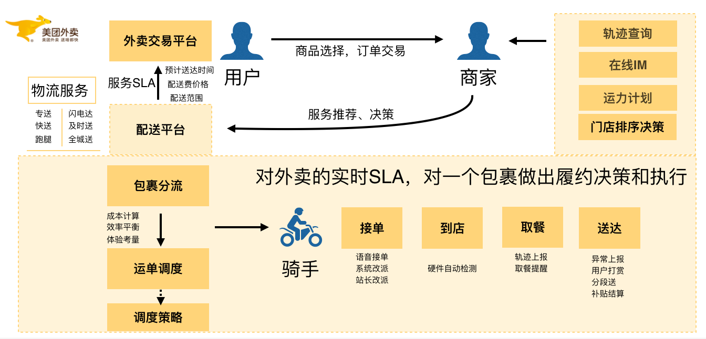

主要介绍在美团即时物流分布式系统架构逐层演变的进展中，遇到的技术障碍和挑战：

+ 本次订单、骑手规模大，供需匹配过程的**超大规模计算**问题。
+ 遇到节假日或者恶劣天气，订单聚集效应，**流量高峰是平常的十几倍**。
+ 物流履约是线上连接线下的关键环节，故障容忍度极低，不能宕机，不能丢单，**可用性要求极高**。
+ 数据**实时性、准确性要求高**，对延迟、异常非常敏感。

### 美团即时物流架构
美团即时物流配送平台主要围绕三件事展开：

一是面向用户提供履约的SLA，包括计算送达时间ETA、配送费定价等；

二是在多目标（成本、效率、体验）优化的背景下，匹配最合适的骑手；

三是提供骑手完整履约过程中的辅助决策，包括智能语音、路径推荐、到店提醒等。

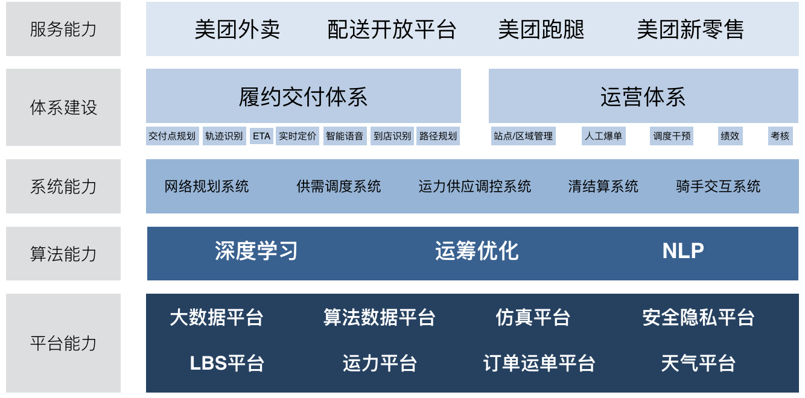

在一系列服务背后，是美团强大的技术体系的支持，并由此沉淀出的配送业务架构体系，基于架构构建的平台、算法、系统和服务。庞大的物流系统背后离不开分布式系统架构的支撑，而且这个架构更要保证高可用和高并发。

分布式架构，是相对于集中式架构而言的一种架构体系。分布式架构适用CAP理论（Consistency 一致性，Availability 可用性，Partition Tolerance 分区容忍性）。在分布式架构中，一个服务部署在多个对等节点中，节点之间通过网络进行通信，多个节点共同组成服务集群来提供高可用、一致性的服务。

早期，美团按照业务领域划分成多个**垂直服务架构**；随着业务的发展，从可用性的角度考虑做了**分层服务架构**。后来，业务发展越发复杂，从运维、质量等多个角度考量后，逐步演进到**微服务架构**。这里主要遵循了两个原则：不宜过早的进入到微服务架构的设计中，**好的架构是演进出来的不是提前设计出来的**。

### 分布式系统实践
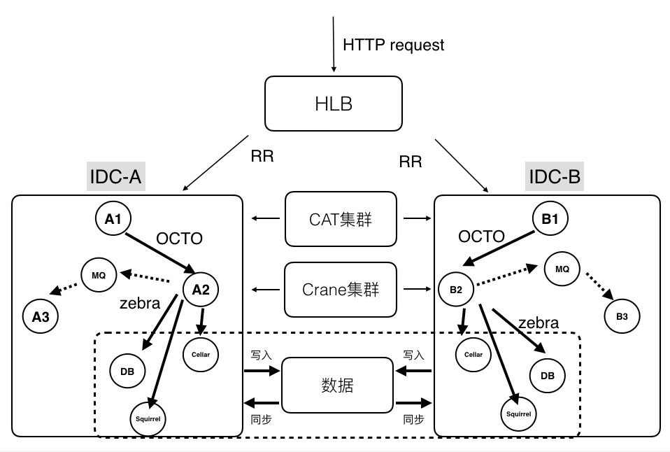

上图是比较典型的美团技术体系下的分布式系统结构：依托了美团公共组件和服务，完成了分区扩容、容灾和监控的能力。前端流量会通过HLB来分发和负载均衡；在分区内，服务与服务会通过OCTO进行通信，提供服务注册、自动发现、负载均衡、容错、灰度发布等等服务。当然也可以通过消息队列进行通信，例如Kafka、RabbitMQ。在存储层使用Zebra来访问分布式数据库进行读写操作。利用CAT（美团开源的分布式监控系统）进行分布式业务及系统日志的采集、上报和监控。分布式缓存使用Squirrel+Cellar的组合。分布式任务调度则是通过Crane。

_**名词解释：**_

_**OCTO**__ 是 octopus(章鱼) 的缩写。是美团公司级基础设施，为公司所有业务提供统一的高性能服务通信框架，使业务具备良好的服务运营能力，轻松实现服务注册、服务自动发现、负载均衡、容错、灰度发布、数据可视化、监控告警等功能，提升服务开放效率、可用性及服务运维效率。_

_**HLB**__ 是 Hardware Load Balance 的缩写。 所有HTTP请求/应答流量都会穿过这个系统，类似amazon elb。_

_**Zebra**__（斑马）是美团基础架构团队开发的一个Java数据库访问中间件，是在c3p0基础上包装的美团内部使用的动态数据源，包括读写分离、分库分表、SQL流控等非常强的功能。它和MHA配合，成为了MySQL数据库高可用的重要一环。_

_**Squirrel+Celler**__:美团在Redis Cluster和阿里的开源项目Tair基础上，分别自研开发了Squirrel和Celler两款KV存储系统。Squirrel全内存、高吞吐和低延迟，适合业务的数据量小，对延迟敏感，建议用 Squirrel ；Celler持久化、大容量、数据高可靠，适合数据量大，对延迟不是特别敏感，成本更低的Cellar 。_

__

在实践过程还要解决几个问题，比较典型的是集群的扩展性，**有状态的集群可扩展性相对较差**，无法快速扩容机器，无法缓解流量压力。同时，也会出现节点热点的问题，包括资源不均匀、CPU使用不均匀等等。

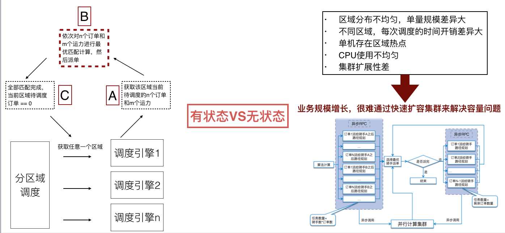

首先，配送后台技术团队通过架构升级，将有状态节点变成无状态节点，通过并行计算的能力，让小的业务节点去分担计算压力，以此实现快速扩容。

第二是要解决一致性的问题，对于**既要写DB也要写缓存**的场景，业务写缓存无法保障数据一致性，美团内部主要通过Databus来解决，Databus是一个高可用、低延时、高并发、保证数据一致性的数据库变更实时传输系统。通过Databus上游可以监控业务Binlog变更，通过管道将变更信息传递给ES和其他DB，或者是其他KV系统，利用Databus的高可用特性来保证数据最终是可以同步到其他系统中。

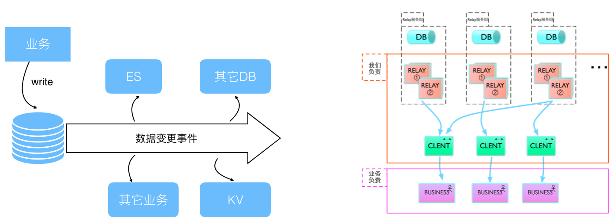

第三是我们一直在花精力解决的事情，就是**保障集群高可用**

主要从三个方面来入手

1. 事前较多的是做全链路压测评，估峰值容量；周期性的集群健康性检查；随机故障演练（服务、机器、组件）。
2. 事中做异常报警（性能、业务指标、可用性）；快速的故障定位（单机故障、集群故障、IDC故障、组件异常、服务异常）；故障前后的系统变更收集。
3. 事后重点做系统回滚；扩容、限流、熔断、降级；核武器兜底。

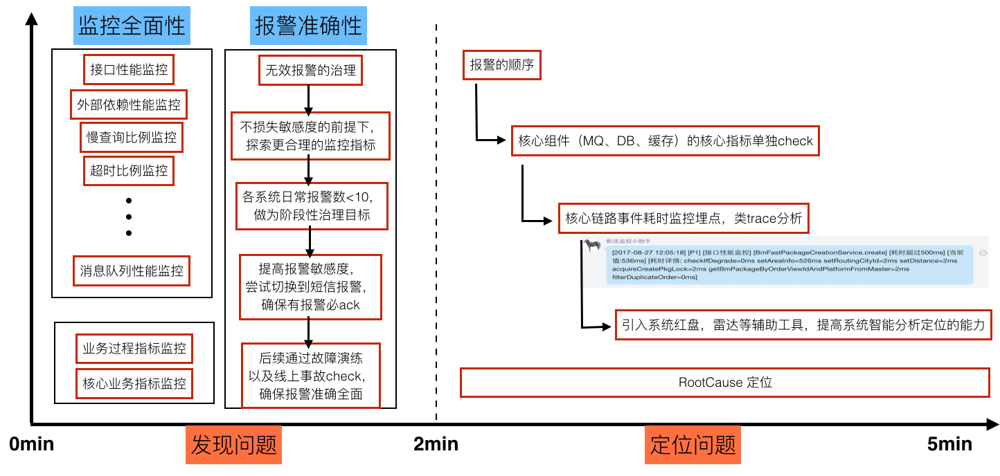

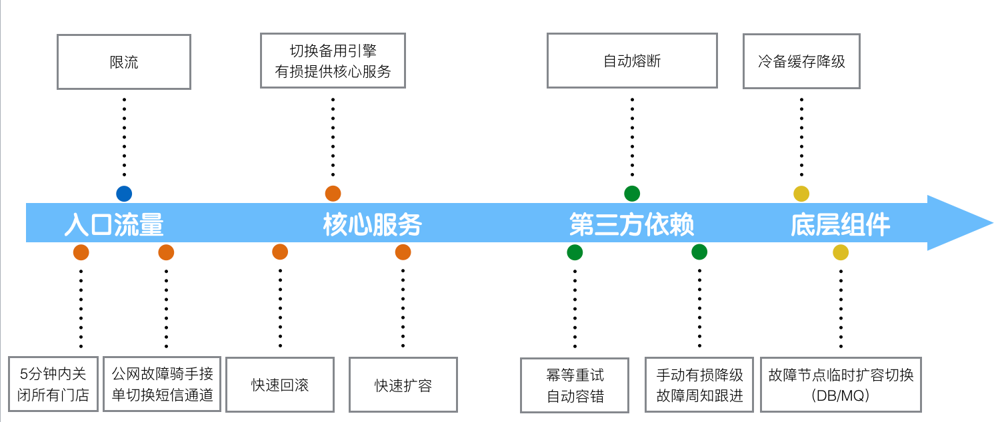

#### 单IDC的快速部署&容灾
单IDC故障之后，入口服务做到**故障识别，自动流量切换**；单IDC的快速扩容，数据提前同步，服务提前部署，Ready之后打开入口流量；要求所有做数据同步、流量分发的服务，都具备自动故障检测、故障服务自动摘除；按照IDC为单位扩缩容的能力。

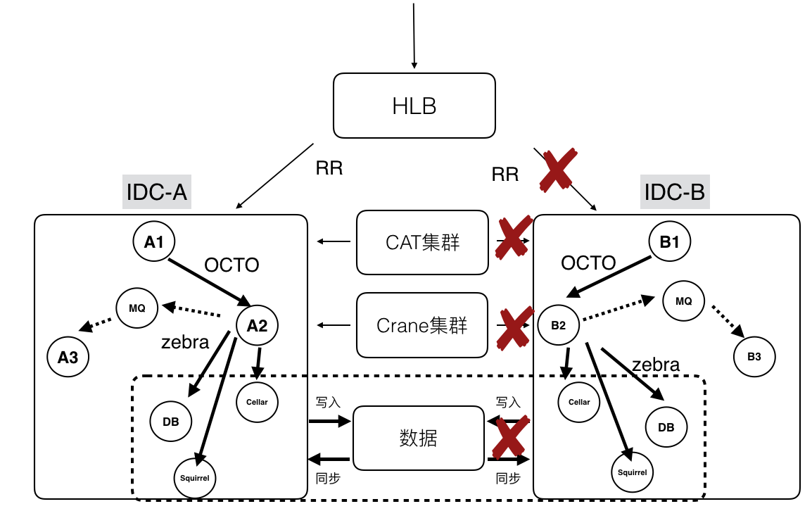

#### 多中心尝试
美团IDC以分区为单位，存在资源满排，分区无法扩容。美团的方案是**多个IDC组成虚拟中心**，以中心为分区的单位；服务无差别的部署在中心内；中心容量不够，直接增加新的IDC来扩容容量。

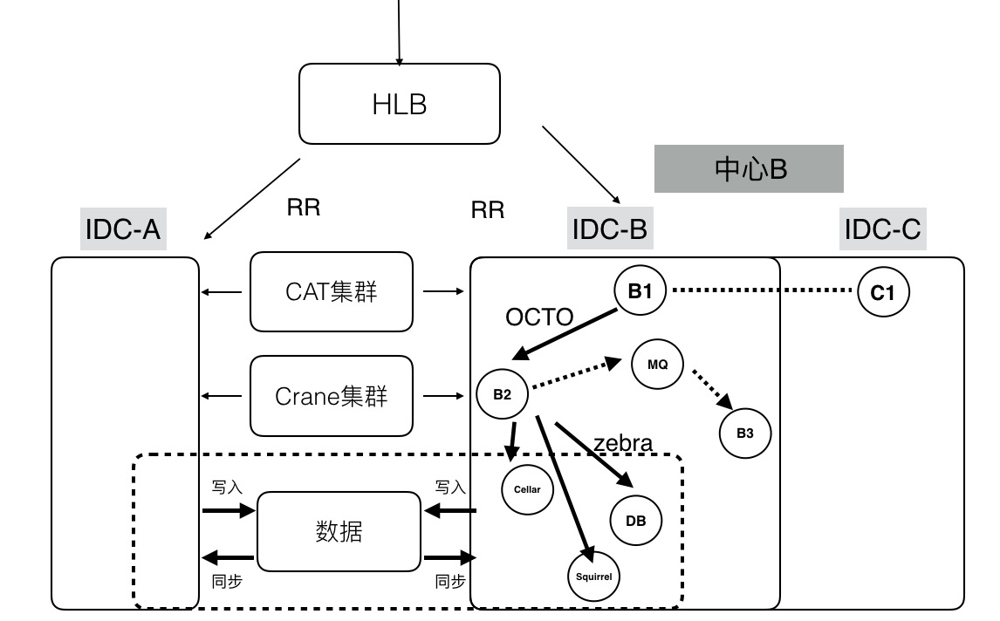

#### 单元化尝试
相比多中心来说，单元化是进行分区容灾和扩容的更优方案。关于流量路由，美团主要是根据业务特点，**采用区域或城市进行路由**。数据同步上，异地会出现延迟状况。SET容灾上要保证同本地或异地SET出现问题时，可以快速把SET切换到其他SET上来承担流量。

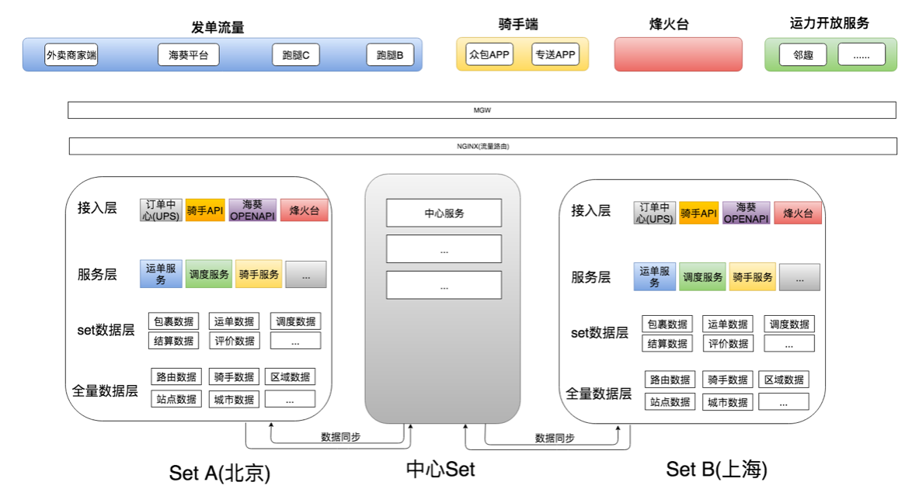

### 智能物流的核心技术能力和平台沉淀
机器学习平台，是一站式线下到线上的模型训练和算法应用平台。之所以构建这个平台，目的是要**解决算法应用场景多，重复造轮子的矛盾问题**，以及线上、线下数据质量不一致。如果流程不明确不连贯，会出现迭代效率低，特征、模型的应用上线部署出现数据质量等障碍问题。

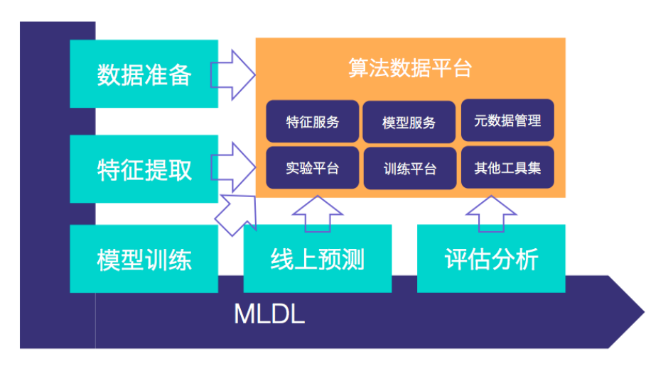

JARVIS是一个以稳定性保障为目标的智能化业务运维AIOps平台。主要用于**处理系统故障时报警源很多，会有大量的重复报警，有效信息很容易被淹没**等各种问题。此外，过往小规模分布式集群的运维故障主要靠人和经验来分析和定位，效率低下，处理速度慢，每次故障处理得到的预期不稳定，在有效性和及时性方面无法保证。所以需要AIOps平台来解决这些问题。

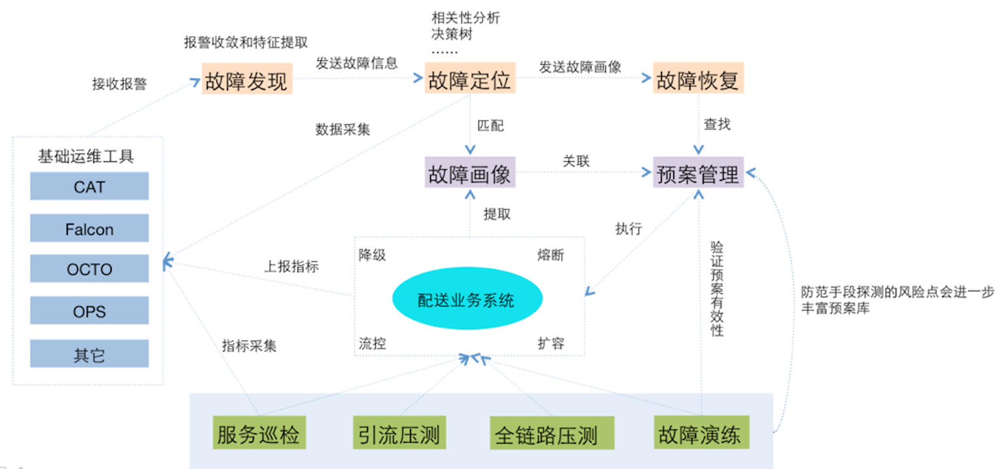

### 未来的挑战
经过复盘和Review之后，我们发现未来的挑战很大，微服务不再“微”了，业务复杂度提升之后，服务就会变得膨胀。其次，网状结构的服务集群，任何轻微的延迟，都可能导致的网络放大效应。另外复杂的服务拓扑，如何做到故障的快速定位和处理，这也是AIOps需要重点解决的难题。最后，就是单元化之后，从集群为单位的运维到以单元为单位的运维，业给美团业务部署能力带来很大的挑战。

> 更新: 2024-07-15 22:21:20  
> 原文: <https://www.yuque.com/tulingzhouyu/db22bv/ro609sf10f8igu6l>